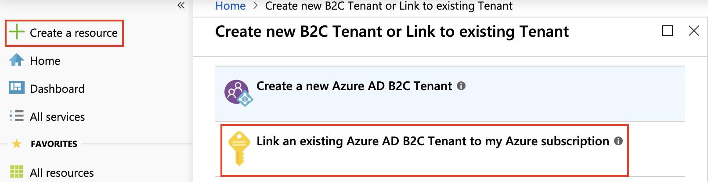
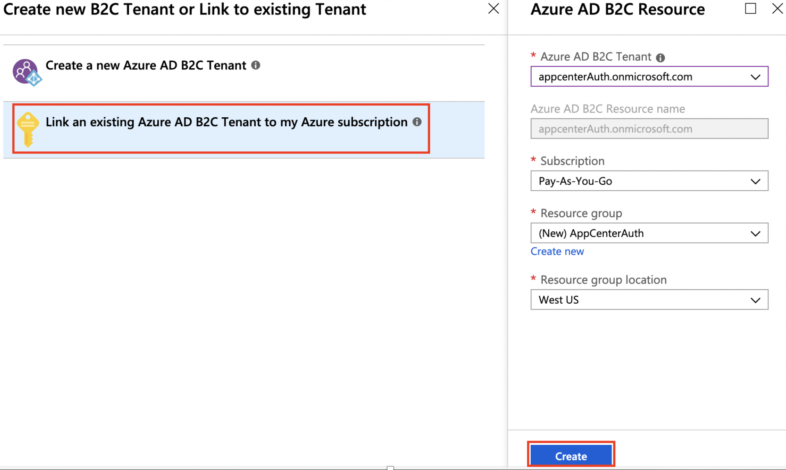
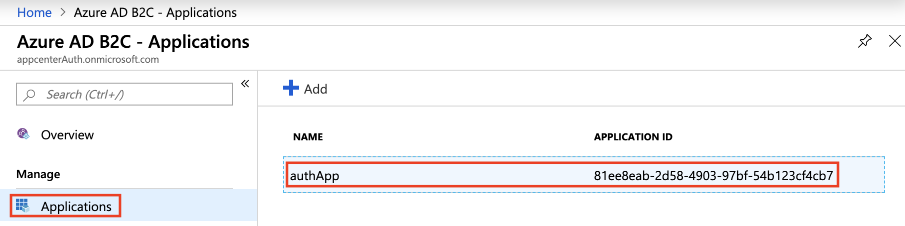

# Auth FAQ

**I don’t see my Azure AD B2C tenant under my subscription in the Auth set up wizard.  Why doesn't it appear?**

You must first [create an Azure AD B2C tenant](https://docs.microsoft.com/azure/active-directory-b2c/tutorial-create-tenant) that you would like to link a subscription to. 

Once you have done that, make sure that your Azure AD B2C tenant is linked to your subscription chosen in Step 1 of the Auth wizard. 

To link your Azure AD B2C tenant to your subscription:
1. Sign in to the [Azure portal](https://portal.azure.com/).
2. Make sure that you are using the directory that contains your Azure subscription. You can do this by clicking the *Directory + subscription filter* (book binder icon) in top row and choosing the directory.

3. In the top left-hand corner, click *+ Create a resource*
4. Type "B2C" in the search bar, click on *Azure Active Directory B2C* and hit *Enter*.
5. Click the blue *Create* button, and the *Link an existing Azure AD B2C tenant to my Azure subscription* row.

6. In the dropboxes, select the following:
  - The **Azure AD B2C tenant** that you have just created.
  - The **subscription** that you'd like to attach the Azure AD B2C tenant to.
  - A **resource group** that you'd like to contain the Azure AD B2C tenant in.
    - A resource group is a container that holds Azure resources, such as Azure AD B2C.
    - You can **create a new resource group** if you do not have an existing one.
  - Enter the **resource group location** where you'd like your data to reside.
  - Click **Create**

7. Done! You have linked your Azure AD B2C tenant to an Azure subscription. 

**I see the following error `MSALErrorDescriptionKey=Authentication response received without expected accessToken, MSALInternalErrorCodeKey=-50000, MSALCorrelationIDKey=xxx`. What should I do?**

If you see the above error, it's likely that you haven't added the required scopes to your registered application. 

1. Sign in to the [Azure portal](https://portal.azure.com/).
2. Make sure that you are using the directory that contains your Azure subscription. You can do this by clicking the *Directory + subscription filter* (Book binder icon) in top row and choosing the directory. 

3. In the top row, type **B2C** in the search bar and select **Azure AD B2C** under **Services**.      

4. In the column second from the left, select **Applications**, and click on your registered application. 

5. In the column second from the left, select **API access**. Click **Add**. A side panel titled **API access** appears. 
6. In the **Select API** dropdown, select the name of your application. For example, "authApp".
7. In the **Select Scopes** dropdown, make sure the **Access this app on behalf of the signed-in user (user_impersonation)** scope is checked. It should already be checked by default.
  
7. Click **Ok**.

**Is the sign-in screen invoked by the App Center Auth SDK opening a webview on iOS or Android? Is it a regular webview or a Chrome tab activity?**

The App Center Auth SDK sign-in screen is a [Chrome Custom Tab](https://developer.chrome.com/multidevice/android/customtabs).
