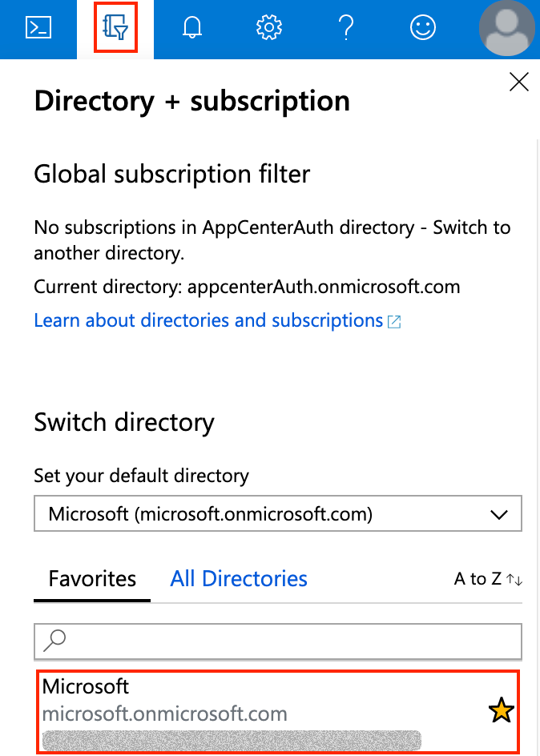
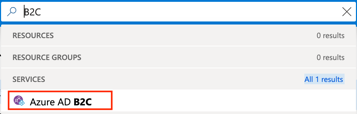
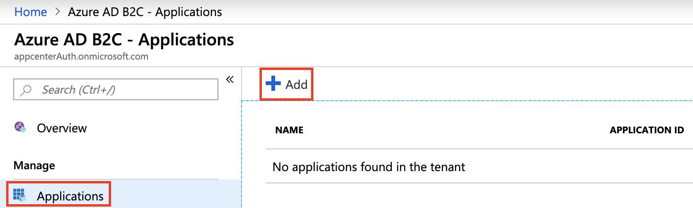
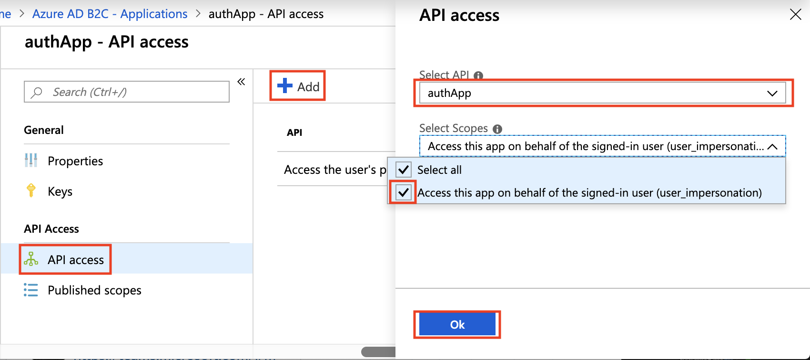
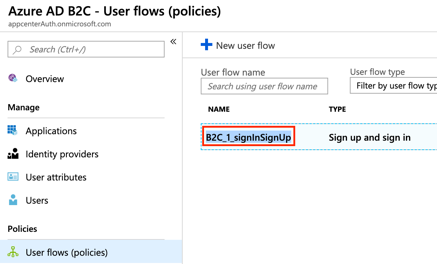
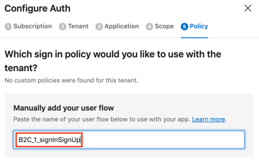
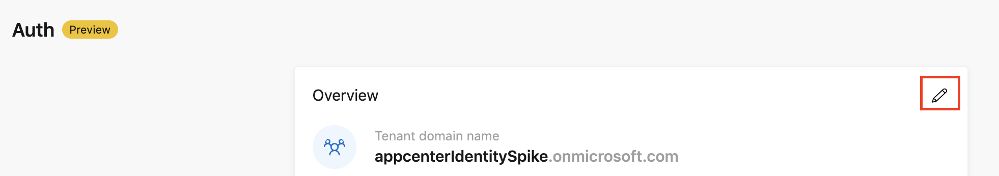
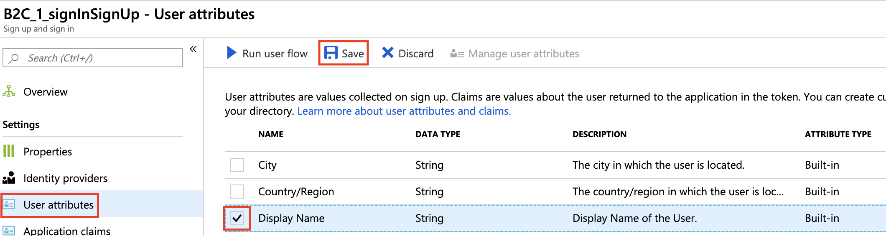

# Getting Started with App Center Auth Service

This guide shows you how to set up the App Center Auth service by connecting an Azure subscription, [Azure Active Directory B2C](https://azure.microsoft.com/services/active-directory-b2c/) tenant, and adding the App Center Auth SDK. 

## Prerequisites:

### Overview
To get started, you must have an existing:
  - [Azure subscription](https://azure.microsoft.com/free/)
  - [Azure AD B2C tenant](https://docs.microsoft.com/azure/active-directory-b2c/tutorial-create-tenant)
  - [App Center account](https://appcenter.ms) and [application](https://docs.microsoft.com/appcenter/dashboard/creating-and-managing-apps#creating-an-app)

You must be granted the following Azure AD B2C roles in order to connect an Azure AD B2C tenant in App Center:
  - Application Administrator
  - B2C IEF Keyset Administrator
  - B2C IEF Policy Administrator
  - B2C User Flow Administrator
  - B2C User Flow Attribute Administrator
  - External Identity Provider Administrator
  - Global Administrator
  - Global Reader
  - User Administrator

Learn more about Azure AD B2C [role definitions](https://docs.microsoft.com/azure/active-directory/users-groups-roles/directory-assign-admin-roles#available-roles).

### Register the application and grant the application permissions on Azure AD B2C

1. Sign in to the Azure portal at https://portal.azure.com.
2. Make sure that you are using the directory that contains your Azure AD B2C tenant by clicking the **Directory + subscription filter** (Book binder icon) in top row and choosing the directory.  

3. In the top row, type **B2C** in the search bar and select **Azure AD B2C** under **Services**.

4. In the column second from the left, click **Applications** and **Add**.

5. Enter the **name** for your application. For example, "authApp".
6. Under **Web App / Web API**, toggle **Yes**. For:
   - **Allow implicit flow**: toggle **Yes**.
   - **Reply URL**: choose an endpoint where Azure AD B2C should return any tokens that your application requests. For example, you can configure it to listen locally at `https://localhost:500`. If you do not know the port number, you can also enter a placeholder value and change it later. For now, set it to `https://jwt.ms`, which displays the token contents for inspection.
   - **App ID URI**: enter a resource identifier to identify your web API. Although it says in the UI that it is optional, please fill this in as we will need this App ID URI to configure scopes. You should see `https://{domain-name}/` and a text field to enter your resource identifier. For now, you can fill in `api`. A full example is  `https://appcenterAuth.onmicrosoft.com/api`, where `appcenterAuth.onmicrosoft.com` is my `{domain-name}`. 
7. Under **Native client**, toggle **Yes**. 
   - For **Custom Redirect URI**, enter `msal{appSecret}://auth`. For example, `msalf4333101-2a0e-4b30-9dca-225d6e374809://auth`, where `f4333101-2a0e-4b30-9dca-225d6e374809` is the App Center app secret of the app you'd like to connect with Auth. Follow the documentation on [how to find the App Center app secret](https://docs.microsoft.com/appcenter/dashboard/faq).
8. Click **Create**. Excellent! You've registered your mobile application with Azure AD B2C.
9. Click on the application. For example, "authApp". 
10. In the column second from left, select **API access**. 
11. Click **Add**.
12. A side panel titled **API access** appears. 
    - In the **Select API** dropdown, select the name of your application. For example, "authApp".
    - In the **Select Scopes** dropdown, make sure the **Access this app on behalf of the signed-in user (user_impersonation)** scope is checked. It should already be checked by default.
  
13. Click **Ok**.

Super! Your mobile application is now registered to call the protected web API set in step 6. When a user authenticates with your application, the application obtains an authorization grant from Azure AD B2C to access the protected web API.

### Set up the redirect URI on your Identity Provider

If you are using third-party identity providers (e.g. Google) in your policies, then you need to add the redirect URI in the third-party identity provider portal.

Follow the documentation on how to do so for:
  - [Amazon](https://docs.microsoft.com/azure/active-directory-b2c/active-directory-b2c-setup-amzn-app)
  - [Azure AD](https://docs.microsoft.com/azure/active-directory-b2c/active-directory-b2c-setup-oidc-azure-active-directory)
  - [Microsoft](https://docs.microsoft.com/azure/active-directory-b2c/active-directory-b2c-setup-msa-app)
  - [Facebook](https://docs.microsoft.com/azure/active-directory-b2c/active-directory-b2c-setup-fb-app)
  - [GitHub](https://docs.microsoft.com/azure/active-directory-b2c/active-directory-b2c-setup-github-app)
  - [Google](https://docs.microsoft.com/azure/active-directory-b2c/active-directory-b2c-setup-goog-app#create-a-google-application)
  - [LinkedIn](https://docs.microsoft.com/azure/active-directory-b2c/active-directory-b2c-setup-li-app)
  - [OpenID Connect](https://docs.microsoft.com/azure/active-directory-b2c/active-directory-b2c-setup-oidc-idp)
  - [Twitter](https://docs.microsoft.com/azure/active-directory-b2c/active-directory-b2c-setup-twitter-app)

## Configure the App Center Auth service

1. Sign in to your App Center account at https://appcenter.ms. 
2. Create a new application project (what we call an **App** in App Center) or open an existing App project. 
   - If you already have an existing application, using the project navigator on the left side of the page, select the user account, or an organization where the application project is defined, then select the application from the list that appears.
3. In the left hand project navigator, select **Auth**.
4. Click **Connect your Azure Subscription**.
5. Under **Subscription**, choose the Azure subscription that is linked to the Azure AD B2C tenant you'd like to connect with. Click **Next**.
   - If your subscription does not appear, click **Add subscription** and choose the Azure subscription. 
6. Select the Azure AD B2C tenant, and click **Next**.
   - If you do not have an Azure AD B2C tenant, you will see the **Create a new Azure AD B2C tenant** link. Click the link and follow the steps to [create an Azure AD B2C tenant](https://docs.microsoft.com/azure/active-directory-b2c/tutorial-create-tenant).
7. Select your application registered in the Azure AD B2C tenant, and click **Next**. 
   - Make sure that you have [registered the application](#register-the-application-and-grant-the-application-permissions-on-azure-ad-b2c).
8. Select the scopes (or permissions) you'd like to use for the application, and click **Next**. 
   - The displayed list shows all the scopes of all the applications in the Azure AD B2C tenant displayed as `scope name` and `application name`. If you do not see the scopes, follow the steps to [configure](https://docs.microsoft.com/azure/active-directory-b2c/add-web-application#configure-scopes) and [assign](https://docs.microsoft.com/azure/active-directory-b2c/add-web-application#grant-permissions) scopes for the application.
   - Make sure that you have completed steps 9-13 of the [previous section](#register-the-application-and-grant-the-application-permissions-on-azure-ad-b2c).
9. Choose the sign-in policy you'd like to use for this application. You can either choose from the list of **custom policies** or enter the name of the sign-in **user flow** in the text box.
   - <a name="copy-user-flow"/> To get the name of a user flow:
     - In a separate window, sign in to the [Azure portal](https://portal.azure.com).
        - Make sure that you are using the directory that contains your Azure AD B2C tenant by clicking the **Directory + subscription filter** (Book binder icon) in top row and choosing the directory.  
      
     - In the top row, type **B2C** in the search bar and select **Azure AD B2C** under Services.      
     
     - In the column second from the left, select **User flows (policies)**, and under **name**, copy the name of the sign-in user flow you'd like to use.  
     
     - Navigate back to App Center, and paste this name in the text box under the section **Manually add your user flow**.  
     
10. Click **Done**. You will be prompted to allow App Center Auth to show the details of the Azure AD B2C tenant to your App Center collaborators. Click **Grant access**.

Nicely done! You have successfully set up App Center Auth in the portal. You should now see the **Getting Started** page. The next step is to [add the App Center Auth SDK](#configure-your-application-for-auth) to the app.

## Configure your application for Auth

After [configuring App Center Auth in the portal](#configure-the-app-center-auth-service), the next step is to add the App Center Auth SDK to your application. The exact procedure depends on your target platform. For additional information, refer to the App Center Auth SDK platform documentation:

  - [Android Auth SDK documentation](~/sdk/auth/android.md)
  - [iOS Auth SDK documentation](~/sdk/auth/ios.md)
  - [Xamarin Auth SDK documentation](~/sdk/auth/xamarin.md)

Once you have integrated the SDK, refresh the **Getting Started** page on the Auth service and you will see the [**Auth Overview**](#auth-overview-page) page.

Congratulations, you have successfully configured App Center Auth 🎉! 

You can test to make sure App Center Auth is working by running the application in Android Studio or Xcode.

## Auth Overview page

After [configuring App Center Auth in the portal](#configure-the-app-center-auth-service) and [adding the App Center Auth SDK](#configure-your-application-for-auth), you will see the **Auth Overview** page. 

The Overview page:
  - Details key information about the Azure AD B2C tenant, such as:
     - **Tenant domain name**: the name of your Azure AD B2C tenant
     - **Application ID**: Azure AD B2C's unique identifier for the registered application
     - **Scope**: URL for the scope (or permissions) that you have chosen for the application
     - **User experience**: the name of the policy or user journey that you have selected
  - Enables you to:
    - [Edit your scope and/or policy](#edit-the-scope-andor-policy) to be used with the application
    - [Edit the Azure AD B2C tenant](#edit-the-azure-ad-b2c-tenant-in-azure) in the Azure portal
    - [Disconnect the Azure AD B2C tenant](#disconnect-the-azure-ad-b2c-tenant)

### Edit the scope and/or policy

You can modify the scope and/or policy that you've selected in the set up wizard:
1. On the **Overview** page, click the **pencil icon** at the top right of the **Overview** card.

2. Select which scope and/or sign-in policy to use with your application.
   - Follow the [instructions to get the sign-in user flow](#copy-user-flow).
3. Click **Publish**.

### Edit the Azure AD B2C tenant in Azure

To edit the Azure AD B2C tenant in Azure, click the **Edit in Azure** button on the top right of the page. This will take you to the **Overview** page of the connected Azure AD B2C tenant.

To view the connected Azure AD B2C tenant, you need to be either a **Global Administrator** or a **User Administrator** of the Azure AD B2C tenant. Learn more about Azure AD B2C [role definitions](https://docs.microsoft.com/azure/active-directory/users-groups-roles/directory-assign-admin-roles#available-roles).

### Disconnect the Azure AD B2C tenant

To disconnect the Azure AD B2C tenant from the application: 

1. Click the **triple vertical dots** on the top right of the page.
2. Select **Disconnect tenant**.
3. Click **Disconnect**.
  > [!NOTE]
  > Disconnecting the Azure AD B2C tenant from your application will not delete any data from Azure AD B2C; the tenant remains on the Azure portal. Disconnecting the tenant unlinks the tenant from the App Center application.

Awesome! You have disconnected your Azure AD B2C tenant from the App Center application.

## Use App Center Auth with Push

You can use the signed-in user's identity in App Center Auth to [send push notifications to user](https://docs.microsoft.com/appcenter/push/push-to-user#setting-user-identity-using-app-center-auth).

1. Sign in to the [Azure portal](https://portal.azure.com).
2. Make sure that you are using the directory that contains your Azure AD B2C tenant by clicking the **Directory + subscription filter** (Book binder icon) in top row and choosing the directory.  

3. In the top row, type **B2C** in the search bar and select **Azure AD B2C** under Services.

4. In the column second from the left, select **User flows (policies)**, and click the **user flow** row.

5. In the column second from the left, select **User attributes**, check the box of the row titled **Display Name**. At the top row of the **User attributes** card, click **Save**.

6. Follow the documentation to [push to user](https://docs.microsoft.com/appcenter/push/push-to-user#sending-notifications-to-users).

This ensures that when you are searching for a user in the Push wizard by the user's first name, last name, or email address, the display name is presented; otherwise it will show up as "unknown".
