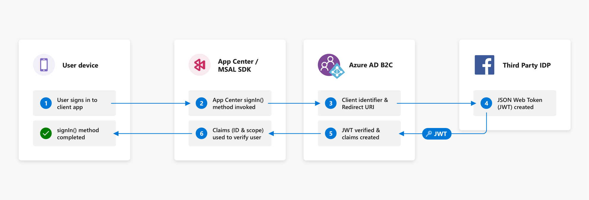

# App Center Auth

App Center Auth is a cloud-based identity management service that enables developers to authenticate users and manage user identities.

App Center Auth also integrates with other parts of App Center, enabling developers to leverage user identity to [view user data](~/data/index.md) in other services and even [send push notifications to users](~/push/push-to-user.md#app-center-auth-set-identity) instead of individual devices. Whether you are an app developer building a collaboration app for users inside your organization or the next social networking platform, you will need a way to authenticate users and manage user identities.

Auth is currently in preview, but is fully supported. Our preview supports native iOS, Android, Xamarin and React Native. Setting up the Auth preview requires an existing Azure subscription and [Azure Active Directory B2C](https://azure.microsoft.com/services/active-directory-b2c/) tenant. 

App Center Auth brings the magic of a seamless and easy portal and SDK set up experience. It only takes 5 steps to connect your existing Azure AD B2C tenant and a few lines of code to integrate the App Center Auth SDK. It is also currently one of the two ways to use the signed-in user's identity with other App Center services like Data and Push, the other being setting the signed-in user's identity via the SDK.

## How Auth works

App Center Auth is powered by [Azure Active Directory B2C](https://azure.microsoft.com/services/active-directory-b2c/) (Azure AD B2C). We chose Azure AD B2C because it is an enterprise-grade, highly available, and secure global service that handles and scales to billions of authentications per day. Using Azure AD B2C, you can easily customize and control how users securely interact with your mobile applications at scale. If you'd like to learn more about how Azure AD B2C works, please refer to the section on [Understanding Azure AD B2C](~/auth/understanding-azure-ad-b2c.md).

The App Center Auth SDK wraps the [Microsoft Authentication Library (MSAL)](https://docs.microsoft.com/azure/active-directory/develop/msal-overview), which is a platform that gives your application the ability to access identities in Azure AD B2C. Azure AD B2C implements a form of the [OpenID Connect and OAuth 2.0 protocols](https://docs.microsoft.com/azure/active-directory-b2c/active-directory-b2c-reference-protocols). 

To get started with App Center Auth, you need to integrate the App Center Auth SDK and have set up App Center Auth to connect an existing Azure AD B2C tenant in the portal. These steps are described in the [Auth Getting Started section](~/auth/getting-started.md).

### Sign In

The `signIn()` method enables the user to sign in. Azure AD B2C passes the **Application ID** and **Redirect URI** (the unique identifier that redirects the OAuth 2.0 responses back to your app) to the third-party identity provider. Once the user grants the mobile application permission to access the resource in the third-party identity provider, it returns a bearer token represented as a JSON web token (JWT). A bearer token is a lightweight security token that grants the "bearer" (i.e. your app) access to a protected resource. Azure AD B2C then verifies the JWT and creates [claims](https://docs.microsoft.com/azure/active-directory-b2c/active-directory-b2c-reference-tokens#claims). 

These claims include properties such as: 

- ID used to identify the signed-in user:
  - The `account_id` App Center uses to identify the signed-in user across App Center.  
- [Scopes](https://docs.microsoft.com/azure/active-directory/develop/v2-permissions-and-consent#scopes-and-permissions) or permissions granted to the resource for the JWT
  - Scopes, such as `read`, `write`, and `delete`, are a way to manage permissions to protected resources.

The `signIn()` method returns an `AccountId` that you can use to identify the signed-in user to use with the Data and Push services. You can also get the JWTs: `AccessToken` and `IdToken` to view user profile information such as the display name or the email address that the user used when signing in. For additional information, refer to the App Center Auth SDK platform documentation:

  - [Android Auth SDK documentation](~/sdk/auth/android.md)
  - [iOS Auth SDK documentation](~/sdk/auth/ios.md)
  - [React Native Auth SDK documentation](~/sdk/auth/react-native.md)
  - [Xamarin Auth SDK documentation](~/sdk/auth/xamarin.md)

### Sign Out

To sign out the user and clear all associated authentication tokens, call the `signOut()` method. Learn more about the sign out method in the [Android Auth SDK documentation](https://docs.microsoft.com/appcenter/sdk/auth/android#sign-out), [iOS Auth SDK documentation](https://docs.microsoft.com/appcenter/sdk/auth/ios#sign-out) and [Xamarin Auth SDK documentation](https://docs.microsoft.com/appcenter/sdk/auth/xamarin#sign-out).

Learn more about the [Azure AD B2C authorization code flow](https://docs.microsoft.com/azure/active-directory-b2c/active-directory-b2c-reference-oauth-code).

## Limitations

Using App Center Auth has the following limitations in preview:

- We require an existing Azure subscription and the following Azure AD B2C entities:
  - [Tenant](https://docs.microsoft.com/azure/active-directory-b2c/tutorial-create-tenant)
  - [Application](https://docs.microsoft.com/azure/active-directory-b2c/tutorial-register-applications)
  - [Scope](https://docs.microsoft.com/azure/active-directory-b2c/add-web-application#configure-scopes)
  - [User flow](https://docs.microsoft.com/azure/active-directory-b2c/tutorial-create-user-flows) or [Custom policy](https://docs.microsoft.com/azure/active-directory-b2c/active-directory-b2c-overview-custom)
- You have to register both [mobile](https://docs.microsoft.com/azure/active-directory-b2c/add-native-application) and [web](https://docs.microsoft.com/azure/active-directory-b2c/tutorial-register-applications#register-a-web-application) applications on Azure AD B2C.
- You can select one scope (or permission) to use with your application.
- You must use the **Sign up and sign in** [user flow](https://docs.microsoft.com/azure/active-directory-b2c/active-directory-b2c-reference-policies#user-flow-versions) or [custom policy](https://docs.microsoft.com/azure/active-directory-b2c/active-directory-b2c-overview-custom) that contains the sign-in identity task.
- You need to be signed in to App Center with a Microsoft account to connect an Azure AD B2C tenant in Auth.
- To configure Auth for the application, you must be the owner of the application for owner owned applications or be the admin of an org for org owned applications.

## Pricing

App Center Auth is a free service, but you pay for [Azure AD B2C authentications](https://azure.microsoft.com/pricing/details/active-directory-b2c/). The first 50,000 authentications per month are free. An authentication is defined as a token issued either in response to a sign-in request initiated by a user, or initiated by an application on behalf of a user (e.g. token refresh, where the refresh interval is configurable). It is free to store authenticated users in the Azure AD B2C tenant. If you turn on **Multi-Factor Authentication**, you will be charged at a flat fee of $0.03 per authentication.

## Getting Started

Getting started is easy! Follow these steps in the [Getting Started](./getting-started.md) documentation:

1. Connect an Azure subscriptipn
2. Connect an existing Azure AD B2C tenant
3. Configure the App Center Auth SDK
4. Run your app
