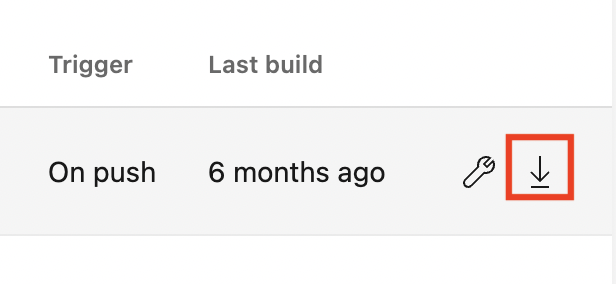
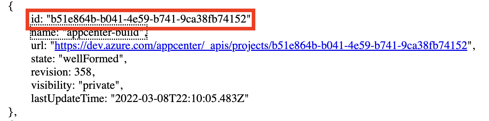
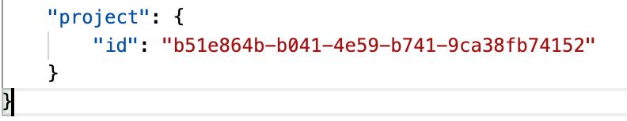
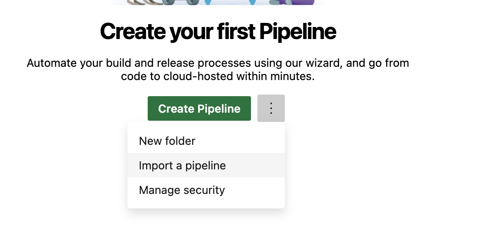
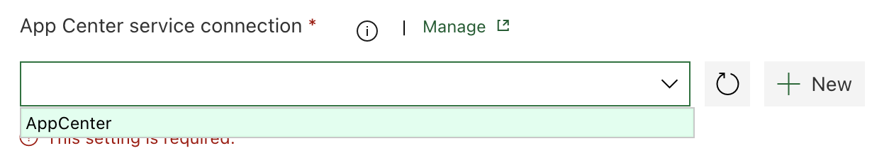
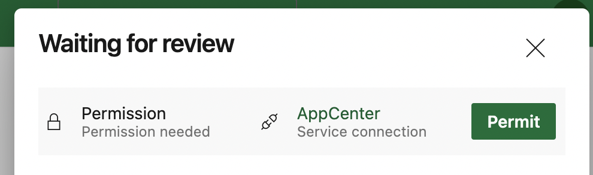

# Export App Center Build configuration to Azure Pipelines

[!INCLUDE [Retirement announcement for App Center](~/includes/retirement.md)]

## Overview
With App Center, you can export all of your App Center Build configurations to Azure Pipelines using the Build export feature. You can download JSON or YAML file and import it into Azure Pipelines.

While direct migration of App Center Build configurations to Azure Pipelines is the easiest option, it might not be well optimized for your particular application. Consider building Azure Pipelines from scratch for a more optimized experience ([Android](/azure/devops/pipelines/ecosystems/android), [Xcode](/azure/devops/pipelines/ecosystems/xcode), [Xamarin](/azure/devops/pipelines/ecosystems/xamarin))

## Prerequisites
You'll need an Azure DevOps project where you'll import a Build configuration. You can create a new project or use an existing one.
* [Create Azure DevOps account](/azure/devops/user-guide/sign-up-invite-teammates)
* [Create Azure DevOps organization](/azure/devops/organizations/accounts/create-organization)
* [Create Azure DevOps project](/azure/devops/organizations/projects/create-project)

## (Optional) Add Service Connection for App Center Tasks
If you have App Center Test or App Center Distribute integrated into your Build configuration, you'll need to create a Service Connection
1. Navigate to Azure DevOps Project Settings -> Pipelines -> Service connections
2. Select 'New Service connection'
3. Search for 'Visual Studio App Center' -> Next
4. [Create API token](~/api-docs/index.md), give the connection a name and Save it

## Export using the JSON file
### Export JSON file from the App Center Build page. 
1. Navigate to the [App Center portal](https://appcenter.ms)
2. Choose your application
3. Go to the Build section, choose your branch, and select export

4. Select 'Download' and choose 'Download JSON'

### Change the Project ID in JSON file
Get your Azure DevOps project's ID
1. Navigate to the URL below and copy your project's ID
```bash
https://dev.azure.com/{organization}/_apis/projects?api-version=6.0
```

2. Paste your project ID into the `project` parameter in the JSON file



### Create Azure Pipeline
1. Navigate to Azure DevOps -> Pipelines -> Import a Pipeline and choose downloaded JSON file

2. In `Pipeline` section, choose `Hosted (Azure Pipelines)` under the `Agent Pool` parameter
3. Choose the latest macOS [Microsoft-hosted agent](/azure/devops/pipelines/agents/hosted) under the `Agent Specification` parameter
4. In `Get Sources` section, add a [connection](/azure/devops/pipelines/repos) to your application's repository

### (Optional) Upload signing files and update passwords
If you use code signing in your App Center Build configurations, you'll need to upload respective files to the Azure Pipelines using [Secure file](/azure/devops/pipelines/library/secure-files) feature. Additionally, you need to update password [variables](/azure/devops/pipelines/process/variables?tabs=classic%2Cbatch#set-variables-in-pipeline) stored in pipelines

#### Android
1. Upload a keystore file to your Azure DevOps project
2. Update `keystorePassword`, `keyAlias`, `keyPassword`, and `keystoreFilename` variables

#### iOS/macOS
1. Upload provisioning profiles and certificates to your Azure DevOps project 
2. Update `P12Password`, `P12Filename`, and `MobileProvisionFilename` variables

#### Windows (UWP)
1. Upload a certificate to your Azure DevOps project
2. Update `packageCertificatePassword`, `packageCertificateFileName`, and `packageCertificateBase64String`

### (Optional) Add Service Connection to App Center related tasks
If you have App Center Distribute or App Center Test integrated, you'll need to modify the respective tasks
1. Navigate to Azure DevOps -> Pipelines
2. Select your imported pipelines and select Edit
3. Find App Center tasks and choose previously created service connection in  `App Center service connection' parameter


## Export using the YAML file
### Export YAML file from the App Center Build page. 
1. Navigate to the [App Center portal](https://appcenter.ms)
2. Choose your application
3. Go to the Build section, choose your branch, and select export

4. Select 'Download' and choose 'Download YAML'

### Configure your repository to work with Azure Pipelines
1. Commit downloaded `azure-pipelines.yml` file to your application's repository
2. Navigate to Azure DevOps -> Pipelines -> Create Pipeline
3. Choose where your code is located
4. Review your pipeline and select `Run`

More information regarding the YAML pipeline creation process can be found [here](/azure/devops/pipelines/get-started/pipelines-get-started#define-pipelines-using-yaml-syntax).

### (Optional) Upload signing files and update passwords
If you use code signing in your App Center Build configurations, you'll need to upload respective files to the Azure Pipelines using [Secure file](/azure/devops/pipelines/library/secure-files) feature. Additionally, you need to update password [variables](/azure/devops/pipelines/process/variables?tabs=classic%2Cbatch#set-variables-in-pipeline) stored in pipelines

#### Android
1. Upload a keystore file to your Azure DevOps project
2. Create `keystorePassword`, `keyAlias`, `keyPassword`, and `keystoreFilename` [secret variables](/azure/devops/pipelines/library/secure-files#consume-a-secure-file-in-a-pipeline) in Azure Pipelines
3. Update the YAML file with the created secret variables
```YAML
...
  keystorePassword: $(keystorePassword)
  keyAlias: $(keyAlias)
  keyPassword: $(keyPassword)
  keystoreFilename: $(keystoreFilename)
...
```

#### iOS/macOS
1. Upload provisioning profiles and certificates to your Azure DevOps project 
2. Create `P12Password`, `P12Filename`, and `MobileProvisionFilename` [secret variables](/azure/devops/pipelines/library/secure-files#consume-a-secure-file-in-a-pipeline) in Azure Pipelines
3. Update the YAML file with the created secret variables
```YAML
...
  P12Password: $(P12Password)
  P12Filename: $(P12Filename)
  MobileProvisionFilename: $(MobileProvisionFilename)
...
```

#### Windows (UWP)
1. Upload a certificate to your Azure DevOps project
2. Create `packageCertificatePassword`, `packageCertificateFileName`, and `packageCertificateBase64String` [secret variables](/azure/devops/pipelines/library/secure-files#consume-a-secure-file-in-a-pipeline) in Azure Pipelines
3. Update the YAML file with the created secret variables
```YAML
...
  packageCertificatePassword: $(packageCertificatePassword)
  packageCertificateBase64String: $(packageCertificateFileName)
  packageCertificateFileName: $(packageCertificateBase64String)
...
```

### (Optional) Authorize newly created pipeline to use App Center service connection
If you have App Center Distribute or Test integrated, you'll need to authorize pipelines to use the service connection.
1. Open the currently running job, you'll see a message regarding permissions
2. Select on the running job and `Permit` access to the service connection

