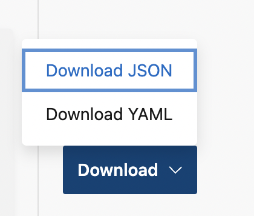
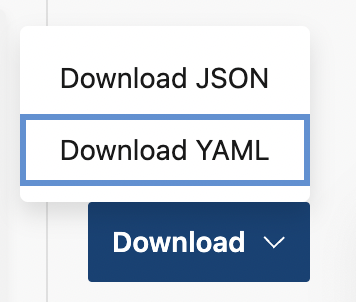

# Exporti App Center Build configuration to Azure Pipelines

## Overview
With App Center, you can export all of your App Center Build configurations to Azure Pipelines using the Build export feature. You can download JSON or YAML file and import it into Azure Pipelines.

## Prerequisites
You will need an Azure DevOps project where you will import a Build configuration. You can create new project or use an existing one.
* [Create Azure DevOps account](https://docs.microsoft.com/en-us/azure/devops/user-guide/sign-up-invite-teammates)
* [Create Azure DevOps organization](https://docs.microsoft.com/en-us/azure/devops/organizations/accounts/create-organization)
* [Create Azure DevOps project](https://docs.microsoft.com/en-us/azure/devops/organizations/projects/create-project)

## TODO (Optional) Upload a 'secret' file
Add secret files

## (Optional) Add Service Connection for App Center Tasks
If you have [App Center Test](https://docs.microsoft.com/en-us/appcenter/build/build-test-integration) or [App Center Distribute](https://docs.microsoft.com/en-us/appcenter/build/build-to-store) integrated into your Build configuration, you will need to create a [Service Connection](https://docs.microsoft.com/en-us/azure/devops/pipelines/library/service-endpoints) in your Azure DevOps project
1. Navigate to Azure DevOps Project Settings -> Pipelines -> Service connections
2. Click 'New Service connection'
3. Search for 'Visual Studio App Center' -> Next
4. [Create API token](https://docs.microsoft.com/en-us/appcenter/api-docs/), give connection a name and Save

ADD REPO CONNECTION STEP

## Export using JSON file
### Export JSON file from the App Center Build page. 
1. Navigate to the [App Center portal](appcenter.ms)
2. Choose your application
3. Go to the Build section, choose your branch, and click export

4. Click 'Download' and choose 'Download JSON'


### Change the Project ID in JSON file
Get your Azure DevOps project's ID
1. Navigate to the URL below and copy your project's ID
```bash
https://dev.azure.com/{organization}/_apis/projects?api-version=6.0
```

2. Paste your project ID into `project` parameter in JSON file


### Create Azure Pipeline
1. Navigate to Azure DevOps -> Pipelines -> Import a Pipeline and choose downloaded JSON file

2. In `Pipeline` section, choose `Hosted (Azure Pipelines)` under the `Agent Pool` parameter
3. Choose the latest macOS [Microsoft-hosted agent](https://docs.microsoft.com/en-us/azure/devops/pipelines/agents/hosted) under the `Agent Specification` parameter
4. In `Get Sources` section add a [connection](https://docs.microsoft.com/en-us/azure/devops/pipelines/repos) to your application's repository

### (Optional) Add Service Connection to App Center related tasks
If you have App Center Distribute or App Center Test integrated into your Build pipeline, you will need to modify the respective tasks in Azure Pipelines.
1. Navigate to Azure DevOps -> Pipelines
2. Select your imported pipelines and click Edit
3. Find App Center tasks and choose previouse created service connection in  `App Center service connection' parameter


## Export using YAML file
### Export YAML file from the App Center Build page. 
1. Navigate to the [App Center portal](appcenter.ms)
2. Choose your application
3. Go to the Build section, choose your branch, and click export

4. Click 'Download' and choose 'Download YAML'


### Configure your repository to work with Azure Pipelines
1. Commit downloaded `azure-pipelines.yml` file to your application's repository
2. Navigate to Azure DevOps -> Pipelines -> Create Pipeline
3. Choose where your code is located
4. Review your pipeline and click `Run`

More information regarding YAML pipeline creation process can be found [here](https://docs.microsoft.com/en-us/azure/devops/pipelines/get-started/pipelines-get-started?view=azure-devops#define-pipelines-using-yaml-syntax).

### (Optional) Authorize newly created pipeline to use App Center service connection
If you have App Center Distribute or App Center Test integrated into your Build pipeline, you will need to authorize pipelines to use service connection created previously.
1. Open the current running job, you will see a message regarding permissions
2. Click on the running job and `Permit` access to the service connection


iOS
Provisioning profile (if signing is used)
Android
UWP