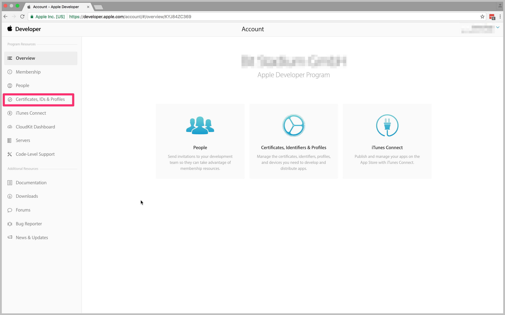
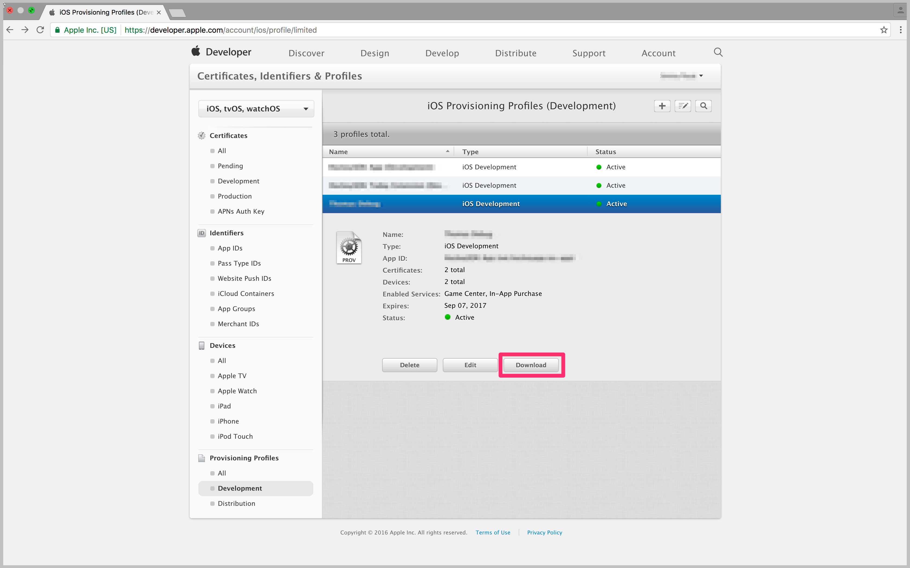
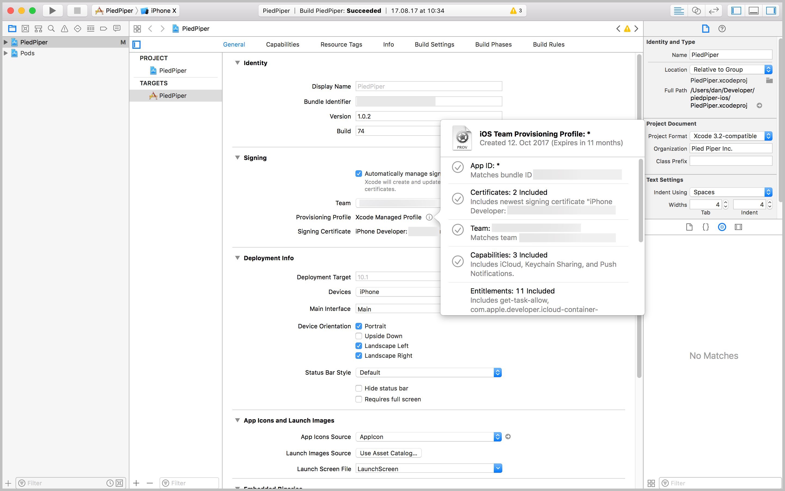
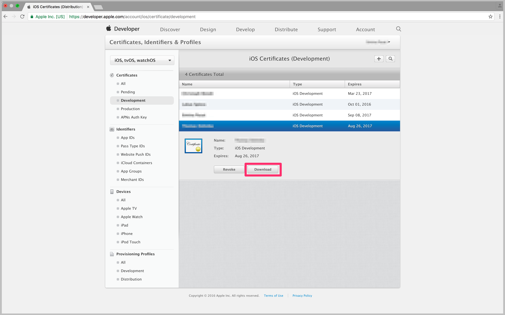

# Code signing for iOS
iOS apps must be signed to run on real devices. In App Center, this process requires uploading valid signing files generated using [Apple's code signing process](https://developer.apple.com/support/code-signing/). You must be able to successfully sign a valid app package locally before attempting to in App Center. 

## Signing files
> [!WARNING]
> App Center doesn't support signing files with special characters or symbols in the name. For example, accented characters like `Ç`, `Ã` or symbols like `/`.

### Certificates (.p12)
- **Apple Development:** Used to enable certain app services during development and testing.
- **Apple Distribution:** For submission to the App Store, Ad Hoc or Enterprise distribution.

### Provisioning Profiles (.mobileprovision)
- **Apple App Development:** Install development apps on developer test devices.
- **Ad Hoc:** Install an app on a limited number of registered devices.
- **App Store:** Required for submitting your app to the Apple App Store.
- **In-House:** for In-House app distribution (the profile is only available via the Apple Enterprise program).

### Code signing for app and watchOS extensions
Upload an additional provisioning profile for each app extension in your app. Provisioning profiles must be of the same type.

### Uploading Signing Files
> [!IMPORTANT]
> Make sure the signing assets you upload are those you intend to sign the app with. The bundle identifier and team ID in your app will be overwritten by the signing assets. 

To sign your iOS builds, upload a provisioning profile (.mobileprovision) and your certificate (.p12 file) when [configuring the build](~/build/ios/first-build.md), along with the password you've set for the certificate. These files can be found in the [Apple Developer Center](https://developer.apple.com/account/), under Certificates, IDs & Profiles.

## Finding provisioning profiles 
### Option 1 - Getting a provisioning profile (.mobileprovision) from Apple Developer Center
1. On the **Certificates, IDs & Profiles** page, click on **Provisioning Profiles**.
2. Pick the provisioning profile for signing your app in App Center and download it. Make sure to select the right type of profile (development or distribution).
   
3. After saving the provisioning profile locally (in a .mobileprovision file), you can upload it to App Center when [configuring a branch](~/build/ios/first-build.md).

### Option 2 - Getting a provisioning profile (.mobileprovision) automatically generated by Xcode
> [!NOTE] 
> When **Automatically manage signing** is enabled in the target of your project, it's possible to upload the developer provisioning profile generated by Xcode instead of one from the Apple Developer Portal.

1. Enable the automatic signing option in Xcode. Refer to [setting up Xcode to automatically manage your provisioning profiles](https://developer.apple.com/library/content/qa/qa1814/_index.html)
   
2. Push the project's changes into your repository.
3. Get the generated provisioning profile from `~/Library/MobileDevice/Provisioning Profiles/`
4. Upload the new provisioning profile Xcode has generated to App Center when [configuring a branch](~/build/ios/first-build.md).

## Getting a certificate from Apple Developer Center (.p12)
1. On the **Certificates, IDs & Profile** page, click on **Certificates**.
2. Select the certificate for signing your app in App Center and download it. Make sure to select the right type of certificate (development or production) and that the provisioning profile you've previously selected contains this certificate. Also, you need to have the private key for the certificate installed on your Mac - it won't be included if you only download the certificate from the Apple Developer Center.
   
3. Download the certificate and open it on your Mac.
4. Head to the "Keychain Access" app on your Mac, locate the certificate you've downloaded, and select "My Certificates" on the left.
5. Find the right certificate and expand it to see the corresponding private key.
6. Select the certificate and private key, then right-click for the context menu on the items and choose "Export 2 items…".
   
7. Pick a location on disk to save the file as a `.p12` – it's recommended to use a strong password for the file.
8. After exporting the provisioning profile locally, you can upload it to App Center when [configuring a branch](~/build/ios/first-build.md).

[apple-certificates]: images/apple-developer-certificates-blurred-outlier.png
[download-provisioning-profile]: images/provisioning-profile-blurred-outlier.png
[export-certificate]: images/ios-keychain-certificates-outlier-spaced.png
[download-certificate]: images/certificate-blurred-outlier.png
[xcode-provisioning-name]: images/xcode-8-provisioning-profile-name-outlier.jpg
