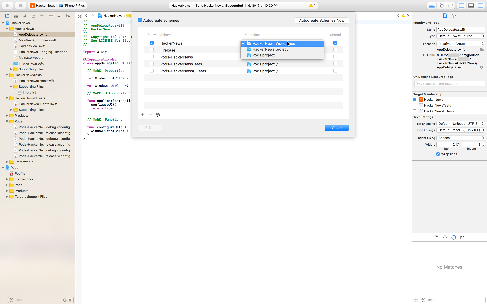

# Building Objective-C or Swift apps for iOS

[!INCLUDE [Retirement announcement for App Center](../../includes/retirement.md)]


To build your first native iOS app, you must take the following actions:

1. Connect to your repository service account (GitHub, Bitbucket, VSTS, Azure DevOps)
2. Select a repository and a branch where your app lives
3. Configure the build's project or workspace, and the scheme you want to build

> [!NOTE]
> To run the app on a real device, the build must be code signed with a valid provisioning profile and a certificate.

## 1. Linking your repository
If you haven't previously connected to your repository service account, you must authorize the connection. Once your account is connected, select the repository where your iOS project is located. App Center requires that your account has Admin and Pull permission to set up a build for a repository.

## 2. Selecting a branch
After selecting a repository, select the branch you want to build. By default, all the active branches will be listed. 

## 3. Setting up your first build
Configure your iOS project before your first build.

### 3.1 Project/workspace and scheme
For a build configuration, an Xcode project or an Xcode workspace, and a shared scheme are required. App Center automatically detects the projects, workspaces, and shared schemes (as long as the schemes are in the correct folder) in your branch. Select the project or the workspace you want to build and the corresponding scheme.

If no scheme is found, make sure the scheme you want is shared and its container is the project or workspace you've selected. You should also confirm those changes are checked into the branch you're configuring.

Keep in mind that you can't export an `.xcscheme` file and place it anywhere in the project. It must be in the `xcshareddata/xcschemes/` folder. Make sure that this path isn't in your `.gitignore` file.



### 3.2. Xcode version
Select the Xcode version to run the build on.

### 3.3. Build triggers
By default, a new build is triggered every time a developer pushes to a configured branch. This process is referred to as "Continuous Integration". If you prefer to trigger a new build manually, you can change this setting in the build configuration.

### 3.4. Increment build number
When enabled, the `CFBundleVersion` in the `Info.plist` of your app automatically increments for each build. The change happens pre-build and won't be committed to your repository.

> [!NOTE]
> To make the Increment build number work, please name the `.plist file` as `*Info.plist` such as `Production-Info.plist`.

### 3.5. Tests
If the selected scheme has a test action with a test target selected, you can configure the tests to run as part of each build. App Center can currently run XCTest unit tests.

### 3.6. Code signing
Building an iOS app for real devices requires signing it with valid credentials. To sign builds in App Center, enable code signing in the configuration pane and upload [a provisioning profile (`.mobileprovision`) and a valid certificate (`.p12`)](~/build/ios/code-signing.md), along with the password for the certificate. 

The settings in your Xcode project must be compatible with the files you're uploading. You can read more about code signing in the [official Apple Developer documentation](https://developer.apple.com/support/code-signing/).

Apps with [app or watchOS extensions](https://developer.apple.com/library/archive/documentation/General/Conceptual/ExtensibilityPG/index.html) require an additional provisioning profile per extension to be signed.

### 3.7. Launch your successful build on a real device
Use your newly produced `.ipa` file to test if your app starts on a real device. Launching on a real device will add approximately 10 more minutes to the total build time. Read more about [how to configure launch tests](~/build/build-test-integration.md).

### 3.8. CocoaPods
App Center scans the selected branch and if it finds a Podfile, it will automatically do a `pod install` step at the beginning of every build. This step will ensure that all dependencies are installed. 

> [!WARNING]
> If the repository already contains a */Pods* folder, App Center assumes you've checked in the pods in your repository and will no longer perform `pod install`. If you remove or modify the */Pods* folder, you might have to resave the Build configuration manually using `Save` or `Save and Build` for the update to take effect.

### 3.9. Distribute to a distribution group
You can configure each successful build from a branch to be distributed to a previously created distribution group. You can add a new distribution group from within the Distribute section. There's always a default distribution group called "Collaborators" that includes all the users who have access to the app.

Once you save the configuration, a new build will be kicked off automatically.

## 4. Build results
After a build is triggered, it can be in the following states:

* **queued** -  the build is queued waiting for resources to be freed up.
* **building** - the build is running the predefined tasks.
* **succeeded** - the build is completed and it succeeded.
* **failed** - the build completed but it failed. You can troubleshoot what went wrong by [inspecting the build logs](~/build/troubleshooting/build-failed.md#isolating-and-interpreting-error-messages).
* **canceled** - the build was canceled by a user action or it timed out

### 4.1. Build logs
For a completed build (succeeded or failed), download the logs to understand more about how the build went. App Center provides an archive with the following files:

```NA
|-- 1_build.txt (this is the general build log)
|-- build (this folder contains a separate log file for each build step)
    |-- <build-step-1> (e.g. 2_Get Sources.txt)
    |-- <build-step-2> (e.g. 3_Pod install.txt)
    |--
    |-- <build-step-n> (e.g. n_Post Job Cleanup.txt)
```

The build step-specific logs (located in the `build/` directory of the archive) are helpful for troubleshooting and understanding in what step and why the build failed.

### 4.2. The app (.ipa)
The `.ipa` file is an iOS device application archive file that contains the iOS app.

* Unsigned builds won't produce an `.ipa` file. The artifact of an unsigned build is the `.xcarchive` file that can be used to generate an `.ipa` file with the Xcode Archives organizer.
* If the build is signed correctly, the `.ipa` file can be installed on a real device corresponding to the provisioning profile used when signing. More details about code signing and distribution with App Center can be found in [App Center's iOS code signing documentation](~/build/ios/code-signing.md).
* If the build hasn't been signed, the `.ipa` file can be signed by the developer (for example, locally using codesign) or used for other purposes (for example, upload to Test service for UI testing on real devices or run in the simulator).

### 4.3. The symbols file (.dsym)
The `.dsym` files contain the debug symbols for the app.

* If you've previously integrated the App Center SDK in your app with the crash reporting module enabled, the crash reporting service requires this `.dsym` file for a build to display human readable (symbolicated) crash reports.
* If you've previously integrated another SDK for crash reporting purposes in your app (for example, HockeyApp SDK), the corresponding service requires the `.dsym` file to display human readable crash reports.

Keep in mind that the `.dsym` files don't change upon code signing the `.ipa`. If you decide to code sign the build later, the `.dsym` generated before code signing is still valid.

[xcode-share-scheme]: images/xcode-share-scheme.png "Marking a scheme as shared in Xcode"

## Supported versions and requirements
[Build machine Xcode version details](~/build/software.md) are updated each time a new version of Xcode is added. We keep an eye on the latest versions released by Apple and include them as soon as possible on the VMs used to run the builds.
