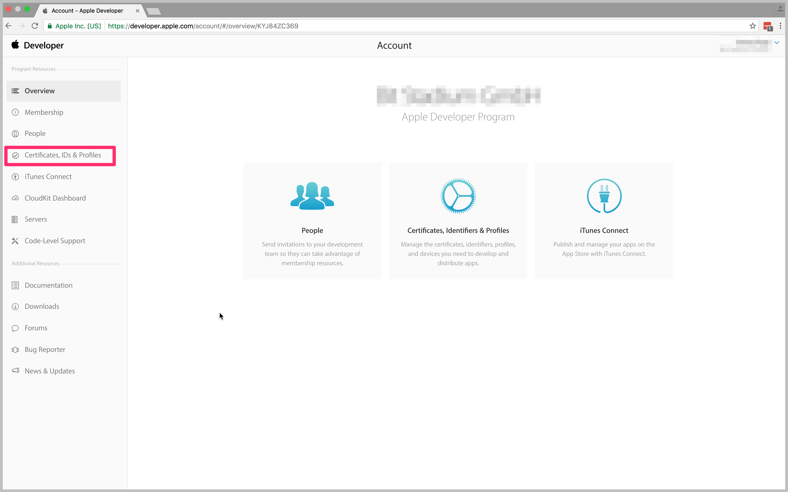
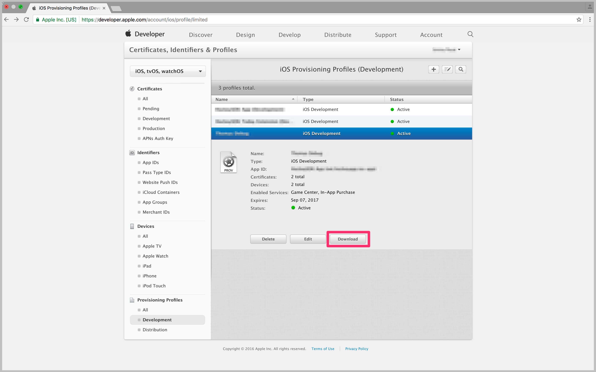
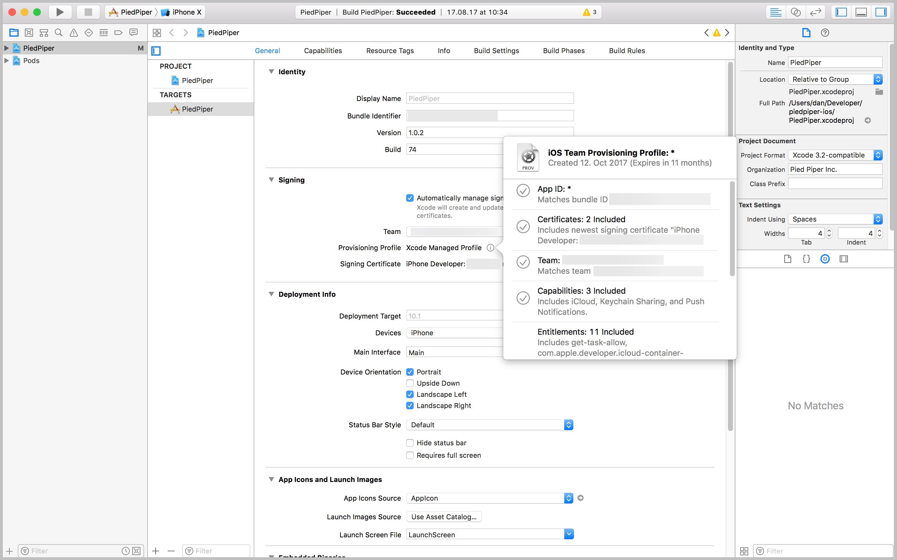
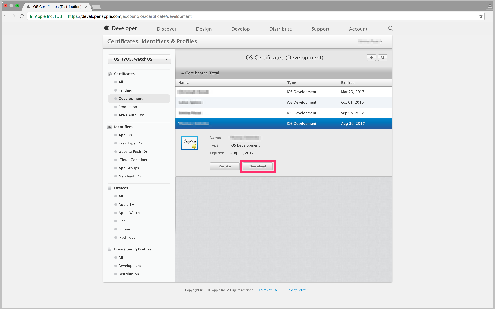

# Where do I get the code signing files I need

To sign your iOS builds, upload a provisioning profile (.mobileprovision) and your certificate (.p12 file) when [configuring the build](~/build/ios/first-build.md), along with the password you have set for the certificate. These files can be found in the [Apple Developer Center](https://developer.apple.com/account/), under Certificates, IDs & Profiles.

## Getting a provisioning profile from Apple Developer Center
### Getting a provisioning profile manually from Apple Developer Center
1. On the **Certificates, IDs & Profiles** page, click on **Provisioning Profiles**.
2. Select the provisioning profile you are planning to use for signing your app within App Center and download it. Make sure to select the right type of profile (development or distribution).
   
3. After saving the provisioning profile locally (in a .mobileprovision file), you can upload it to App Center when [configuring a branch](~/build/ios/first-build.md).

### Getting a provisioning profile automatically generated by Xcode
1. Enable the automatic signing option in Xcode. Refer to [setting up Xcode to automatically manage your provisioning profiles](https://developer.apple.com/library/content/qa/qa1814/_index.html)
   
2. Push the project's changes into your repository.
3. Get the generated provisioning profile from `~/Library/MobileDevice/Provisioning Profiles/`
4. Upload the new provisioning profile Xcode has generated to App Center when [configuring a branch](~/build/ios/first-build.md).

## Getting a certificate from Apple Developer Center
1. On the **Certificates, IDs & Profile** page, click on **Certificates**.
2. Select the certificate you are planning to use for signing your app in App Center and download it. Make sure to select the right type of certificate (development or production) and that the provisioning profile you've previously selected contains this certificate. Also, you need to have the private key for the certificate installed on your Mac - it will not be included if you only download the certificate from the Apple Developer Center.
   
3. Download the certificate and open it on your Mac.
4. Head to the "Keychain Access" app on your Mac and locate the certificate you have downloaded: For this, select the "My Certificates" section on the left.
5. Find the right certificate and expand it to see the corresponding private key.
6. Make sure both the certificate and the private key are selected, then right click for the context menu on the items and click "Export 2 items…".
   
7. Select a location on disk to save the file as a .p12 – it is recommended that you choose a strong password for the file.
8. After exporting the provisioning profile locally, you can upload it to App Center when [configuring a branch](~/build/ios/first-build.md).

[apple-certificates]: images/apple-developer-certificates-blurred-outlier.png
[download-provisioning-profile]: images/provisioning-profile-blurred-outlier.png
[export-certificate]: images/ios-keychain-certificates-outlier-spaced.png
[download-certificate]: images/certificate-blurred-outlier.png
[xcode-provisioning-name]: images/xcode-8-provisioning-profile-name-outlier.jpg
