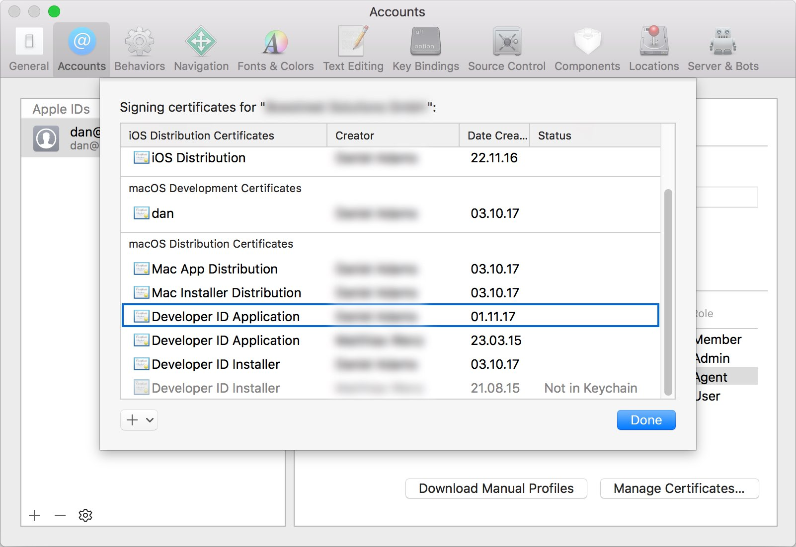
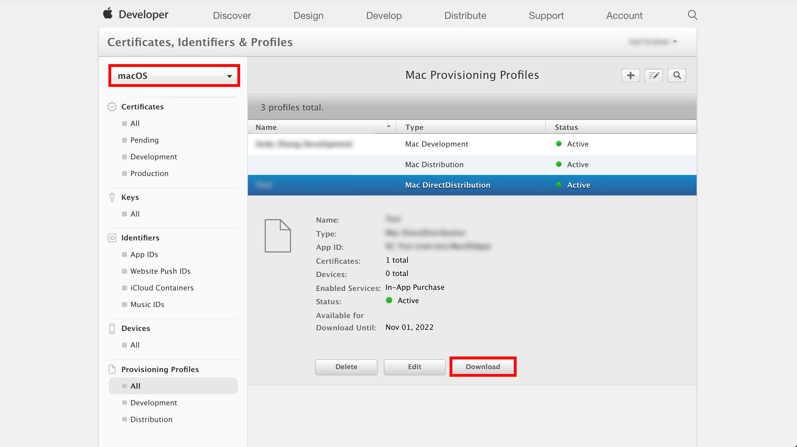

# Code signing for macOS
An app must be signed to pass the [macOS Gatekeeper](https://support.apple.com/en-us/HT202491) and to submit an app to the App Store. Sign a build by uploading your provisioning profile (.provisionprofile) and certificate (.p12) when [configuring the build](index.md). On macOS, provisioning profiles are optional depending on whether your project is using sandboxing or not. Once you've saved a provisioning profile and the matching certificate to a build configuration of a branch, App Center will sign your app with the provided assets regardless of the settings of your project. When you provide a certificate only, it must match the project settings, otherwise it will fail.

Learn more about where to [find the provisioning profiles and certificates](#uploading-code-signing-files) that are required for signing. When **Automatically manage signing** is enabled in the target of your project, it's possible to upload the developer provisioning profile generated by Xcode instead of one from the Apple Developer Portal.

> [!IMPORTANT]
> Please make sure that the signing assets you upload are really the ones you intend to sign the app with. The bundle identifier and team ID in your app will be overwritten by the settings in the signing assets.

## Signing files
### Certificates (.p12)
- **Mac Development:** Used to enable certain app services during development and testing.
- **Mac App Distribution:** Used to sign a Mac app before submitting it to the Mac App Store.
- **Developer ID Application:** Used to sign a Mac app before distributing it outside the Mac App Store.

### Provisioning Profiles (.provisionprofile)
Provisioning profiles are optional, sandboxed apps require:
- **Mac App Development:** Install development apps on test devices.
- **Mac App Store:** Submitting to the Mac App Store.
- **Developer ID:** Use Apple services with your Developer ID signed applications.

### Support
The following signing methods are currently not supported:
- Mac App Development signing does not work with manual signing and a provisioning profile. Signing an app with a Mac App Development provisioning profile requires that the UUID of the device that the app built on is provisioned in the selected profile. All of our builds run on one of our Virtual Machines chosen during runtime. Since the physical UUID of Virtual Machines changes, it's not possible to support signing with a Mac Developer certificate and provisioning profile.

- Signing for the Mac App Store isn't supported since it requires that you upload two certificates.

### Uploading code signing files
> [!IMPORTANT]
> Make sure the signing assets you upload are those you intend to sign the app with. The bundle identifier and team ID in your app will be overwritten by the signing assets.

To sign your Mac builds, upload the provisioning profile `.provisionprofile` and certificate file `.p12` when [configuring the build](~/build/macos/index.md), along with the password you have set for the certificate. Your certificate can be exported from Xcode, and your provisioning profile can be downloaded from the [Apple Developer Center](https://developer.apple.com/account/), under **Certificates, IDs & Profiles**.

### Uploading your certificate
Your certificate can be found in your Keychain. Or, you can export it from Xcode:

1. In Xcode, click on "Xcode" in the menubar, "Preferences", then "Accounts"
2. Select the Apple ID on the left and then the team that contains your certificate on the right
3. Click on "Manage Certificates..."
   
4. Right-click the certificate you're looking for, click "Export Certificate", choose a destination and enter a password.
5. Go to the build configuration of the branch you want to sign in App Center. 
6. Upload the certificate you exported and provide the correct password.

### (Optional) Download the provisioning profile
The provisioning profiles can be found from the [Apple Developer Center](https://developer.apple.com/account/), under Certificates, IDs & Profiles. Make sure you've switched to the "macOS" section in the top-left corner. Once you've downloaded your provisioning profile, you can upload it to App Center in the build configuration.

3. After saving the provisioning profile locally, you can upload it to App Center when [configuring a branch](~/build/macos/index.md).

[xcode-certificate-export]: images/xcode-certificate-export.jpg
[download-provisioning-profile]: images/provisioning-profile-blurred.png
