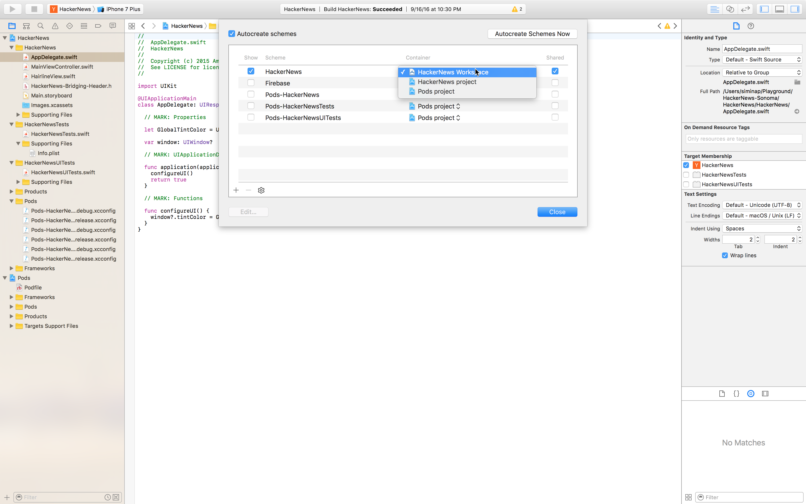

# Building Objective-C or Swift apps for macOS
To start building your first Mac app, do these steps:

1. Connect to your repository service account (GitHub, Bitbucket, VSTS, Azure DevOps).
2. Select a repository and a branch where your app lives.
3. Configure the build's project or workspace, and the scheme you want to build.

> [!NOTE]
> For the app to be distributed, the build needs to be code signed with a certificate. A provisioning profile is optional.  Additionally, build for Mac Installers is currently not supported.

## 1. Linking your repository
You must connect to your repository service account. Once your account is connected, select the repository where your Mac project is located. To set up a build for a repository, you need admin and pull permission for it.

## 2. Selecting a branch
After selecting a repository, select the branch you want to build. By default, all the active branches will be listed.

## 3. Setting up your first build
Before your first build, the Mac project needs to be configured.

### 3.1. Project/workspace and scheme
For a build configuration, an Xcode project or an Xcode workspace and a shared scheme are required. App Center automatically detects the projects, workspaces, and shared schemes in your branch. Select the project or workspace you want to build and the corresponding scheme.

If no scheme can be found, confirm the scheme you want to build with is shared, and the container for the scheme is either the project or the workspace you've selected. Also make sure these changes are checked into the branch you're setting up the build for.



### 3.2. Xcode version
Select the Xcode version to run the build on.

### 3.3. Build triggers
By default, a new build is triggered every time a developer pushes to a configured branch. This is referred to as "Continuous Integration". If you prefer to trigger a new build manually, you can change this setting in the build configuration.

### 3.4. Increment build number
When enabled, the `CFBundleVersion` in the Info.plist of your app automatically increments for each build. The change happens pre-build and won't be committed to your repository.

### 3.5. Tests
If the selected scheme has a test action with a test target selected, you can configure the tests to run as part of each build. App Center can currently run XCTest unit tests. App Center doesn't support launch tests for Mac builds.

### 3.6. Code signing
A successful build will produce a `.app` file. To install the build on a device, it needs to be signed certificate. To sign the builds produced from a branch, enable code signing in the configuration pane and upload [a valid certificate (.p12)](~/build/macos/code-signing.md#uploading-code-signing-files), along with the password for the certificate. The settings in your Xcode project need to be compatible with the files you're uploading. A provisioning profile is optional for code signing.

Currently, App Center only supports these signing configurations:

- Manual signing using the Development export method with a development certificate only
- Manual signing using the Developer ID export method
- Automatic signing using the Development export method

You can read more about code signing in [App Center's macOS code signing guide](~/build/macos/code-signing.md) and in the [official Apple Developer guide](https://developer.apple.com/support/code-signing/).

### 3.7. CocoaPods
App Center scans the selected branch and if it finds a Podfile, it will automatically do a `pod install` step at the beginning of every build. This ensures that all dependencies are installed.

If the repository already contains a */Pods* folder, App Center assumes you've checked in the pods in your repository and will no longer run `pod install`.

### 3.8. Distribute to a distribution group
You can configure each successfully signed build from a branch to be distributed to a previously created distribution group. You can add a new distribution group from within the Distribute section. There's always a default distribution group called "Collaborators" that includes all the users who have access to the app.

Once you save the configuration, a new build will be kicked off automatically.

## 4. Build results
After a build is triggered, it can be in the following states:

- **queued** -  the build is queued, waiting for resources to be free.
- **building** - the build is running the predefined tasks.
- **succeeded** - the build completed successfully.
- **failed** - the build found failures that prevented it from completing. You can troubleshoot the build by [downloading and inspecting the build logs](~/build/troubleshooting/build-failed.md#isolating-and-interpreting-error-messages).
- **canceled** - the build was canceled by a user action or it timed out.

### 4.1. Build logs
For a completed build (succeeded or failed), download the logs to understand more about how the build went. App Center provides an archive with the following files:

```NA
|-- 1_build.txt (this is the general build log)
|-- build (this folder contains a separate log file for each build step)
    |-- <build-step-1> (e.g. 2_Get Sources.txt)
    |-- <build-step-2> (e.g. 3_Pod install.txt)
    |--
    |-- <build-step-n> (e.g. n_Post Job Cleanup.txt)
```

The build step-specific logs (located in the `build` directory of the archive) are helpful for troubleshooting and understanding in what step and why the build failed.

### 4.2. The app (.app)
The `.app` file is a Mac application archive file, which contains the Mac app.

- If the build is signed correctly, the `.app` file can be installed on a device corresponding to the provisioning profile used when signing. More details about code signing and distribution with App Center can be found in [App Center's macOS code signing documentation](~/build/macos/code-signing.md).
- If the build hasn't been signed, the `.app` file can be signed by the developer. For example, using codesign.

### 4.3. The symbols file (.dsym)
The `.dsym` files contain the debug symbols for the app.

- If you've added the App Center SDK in your app with the crash reporting module enabled, the crash reporting service requires this `.dsym` file for a build to display human-readable (symbolicated) crash reports.
- If you've added another SDK for crash reporting in your app, like the HockeyApp SDK, the service requires the `.dsym` file to display human-readable crash reports.

The `.dsym` files don't change when code signing the `.app`. If you decide to code sign the build later, the `.dsym` generated before code signing is still valid.

[xcode-share-scheme]: images/xcode-share-scheme.png "Marking a scheme as shared in Xcode"

## Build internals
To build your project, we use `xcodebuild`, a command-line tool that allows you to build, query, analyze, test, and archive your Xcode projects and workspaces.

## Supported versions and requirements
[Build machine version details](~/build/software.md) are updated each time a new version of macOS is added. We include the latest versions released by Apple as soon as possible on our build VMs.
