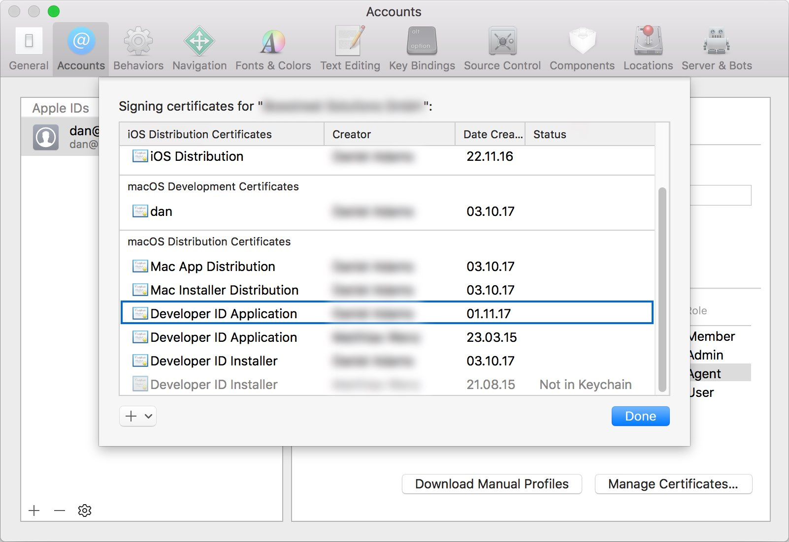

# Uploading code signing files
To sign your Mac builds, upload your provisioning profile `.provisionprofile` and certificate file `.p12` when [configuring the build](~/build/macos/index.md), along with the password you have set for the certificate. Your certificate can be exported from Xcode, and your provisioning profile can be downloaded from the [Apple Developer Center](https://developer.apple.com/account/), under **Certificates, IDs & Profiles**.

## Uploading your certificate
Your certificate can be found in your Keychain. Or, you can export it from Xcode:

1. In Xcode, click on "Xcode" in the menubar, "Preferences", then "Accounts"
2. Select the Apple ID on the left and then the team that contains your certificate on the right
3. Click on "Manage Certificates..."
   
4. Right-click the certificate you're looking for, click "Export Certificate", choose a destination and enter a password.
5. Go to the build configuration of the branch you want to sign in App Center. 
6. Upload the certificate you exported and provide the correct password.

## (Optional) Download the provisioning profile
The provisioning profiles can be found from the [Apple Developer Center](https://developer.apple.com/account/), under Certificates, IDs & Profiles. Make sure you've switched to the "macOS" section in the top-left corner. Once you've downloaded your provisioning profile, you can upload it to App Center in the build configuration.

3. After saving the provisioning profile locally, you can upload it to App Center when [configuring a branch](~/build/macos/index.md).

[xcode-certificate-export]: images/xcode-certificate-export.jpg
[download-provisioning-profile]: images/provisioning-profile-blurred.png
