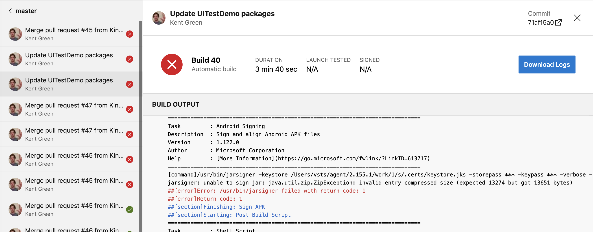

# Failed builds

[!INCLUDE [Retirement announcement for App Center](~/includes/retirement.md)]

There are various reasons why your build could have failed that might be unique to your project. Usually an efficient way to diagnose build failures is comparing them to a working build. This process can minimize variables and identify relevant conditions for your scenario. 

## If building works locally but not in App Center
Usually this problem is because of uncommitted files, different tooling, or unrestored dependencies. To check, you can do a full git clone of your project into a new folder. Then compile with the same configuration as App Center for comparison. 

1. Open your terminal or command-line prompt then type in: `mkdir appcenter-test`
2. Then change directories: `cd appcenter-test`
3. Clone your repository with: `git clone -b <branch> <remote_repo>`
4. Launch the freshly cloned project in your local IDE or command line. 
5. Try comparing [the build command executed in App Center](~/build/troubleshooting/build-command.md) to the command executed locally. 
6. Compare the versions of the tools you're using locally with our [Cloud Build Machines](~/build/software.md)

### Files with modified filenames or locations are ignored
Builds might ignore a key file that was recently moved or renamed. Try selecting **Save** or **Save & Build** in the build configuration. Either option reindexes your repository tree and updates the build definition.

Known causes are moving or renaming [build scripts](~/build/custom/scripts/index.md) & [nuget.config files](/nuget/reference/nuget-config-file).

## Comparing different builds in App Center
### Tracking changes in your build settings
You can record your branch configuration by calling this API method: https://openapi.appcenter.ms/#/build/branchConfigurations_get

The API doesn't directly allow recording past configurations. However, you can run this command with a [custom build script](/appcenter/build/custom/scripts/) so that your builds automatically record the current configuration when they execute. 

#### Tracking changes in App Center Cloud Build Machines
Like your build settings, you can check the current tooling by reviewing this document: [Cloud Build Machines](~/build/software.md). 

However, you can record which of those tools are available for a particular build by running this command in a build script:
> eval cat $HOME/systeminfo.md 

### Some branches work while others fail
Try checking for differences in the build settings or committed code between branches. Also, if the build starts failing consistently after a certain commit on the same branch, it's worth checking what changes were made in the failing commit.

### Builds fail intermittently
A build can fail without any change in source code or build settings. For example:
- Different versions of packages restored
- External services not responding
- Individual tasks in the build timing out
- and so on

Try checking if the error for the build is consistent when the failures occur. 

## Isolating and interpreting error messages
### Automatic error highlighting
App Center Build automatically attempts to highlight common error messages or useful output to make it more visible. Often clues can be found in the primary error, the logging before, or the logging afterwards. This app is signed by both the project settings & build configuration. So the Android jarsigner logs an error:



```console
jarsigner: unable to sign jar: java.util.zip.ZipException: invalid entry compressed size (expected 13274 but got 13651 bytes)
##[error]Error: /usr/bin/jarsigner failed with return code: 1
##[error]Return code: 1
```

### Digging deeper
If you don't find relevant error messages, then the next step is to download the build logs, which you can do from the main build page. Open the folder named `logs_n > Build` and you'll see a list of separate log files listed in numerical order. For example:

- 1_Intialize job.txt
- 2_Checkout.txt
- 3_Tag build.txt
- and so on 

Logs are numbered based on the major phases of your build. Most build failures cause phases to be skipped & the associated log to be omitted:

- (Steps 1-9)...
- 10_Pre Build Script.txt
- 11_Build Xamarin.Android project.txt
- 12_Sign APK.txt
- 15_Post Build Script.txt
- 20_Post-job Checkout.txt
- 21_Finalize Job.txt

Phase 13 was skipped first, so phase 12 is a good starting point. Later phases were skipped too, but they're less likely to be relevant.

## Identifying Correlated Commits
In the Build UI, you can view the commit message and hash applicable to your current build. You can use this feature to trace and correlate build outcomes to changes in your source code. 

You can view commit messages & hashes by going to 
**Appcenter.ms -> [Organization-Name] -> [App-Name] -> Build -> [Branch-Name] -> [Build-Number]**

Prototype URL: https://appcenter.ms/orgs/[ORG-NAME]/apps/[APP-NAME]/build/branches/[BRANCH-NAME]/builds/[BUILD-NUMBER] 


At the top of the information for the build, you'll see the name and abbreviated hash of the commit. In the screenshot:
- Bump Xamarin.UITest from 3.0.5 to 3.0.6
- Commit 328ff115

Clicking on the abbreviated hash opens the linked repository on the same commit: https://github.com/microsoft/appcenter-Xamarin.UITest-Demo/commit/328ff115cb67280f7bdc70074ff605c8962470e4

## Next Steps
Here are a few options for researching your issue further:
- [Other Build troubleshooting docs](~/build/troubleshooting/index.md)
- [StackOverflow (App Center)](https://stackoverflow.com/questions/tagged/visual-studio-app-center)
- [Development platform documentation](~/build/troubleshooting/index.md#framework-specific-resources).

## Contacting Support
Log into https://appcenter.ms/apps and click the chat icon in the lower right corner of the screen. For best results, it's a good idea to open the ticket with:

- A summary of your observations
- Details and citations of your research on the issue
- URLs to failing builds, including essential info like the app name & build ID
- URLs to passing builds to compare to the failures (if applicable)
