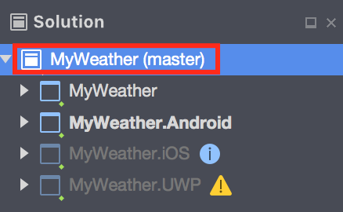
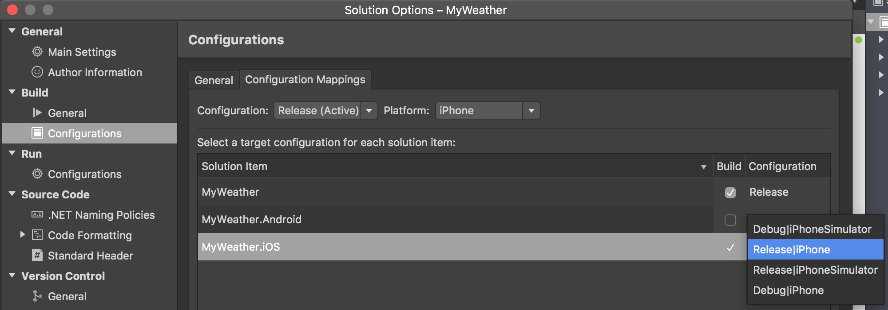

# Configuration mappings
Xamarin Solutions can be configured to build certain projects and ignore others using custom build configurations. These configurations can minimize possible errors and reduce the build time for your code. 

This guide explains how to configure a custom build in Visual Studio for Windows or macOS. To configure Xamarin projects in Azure DevOps, refer to the [Xamarin Azure DevOps guide](https://www.visualstudio.com/ru-ru/docs/build/apps/mobile/xamarin) 

## Modifying Solution Configuration Mappings
Where to change the **Configuration Mapping** depends on the IDE you use. 

### [Visual Studio for Windows](#tab/vswin/)
1. In Solution Explorer, right-click the solution, and open the **Configuration manager**.

2. Select the solution configuration and platform.

3. Choose the active solution configuration, platform, respective project configurations, and **Build/Deploy** options. Note that the **Deploy** option has no effect when building in App Center. 

You can read more about configuration mappings in the [Visual Studio official documentation](https://docs.microsoft.com/visualstudio/extensibility/internals/configuration-options-overview).

### [Visual Studio for Mac](#tab/vsmac/)
1. Double-click on your solution in the **Solution Explorer**

2. In your solution options, go to **Build > Configurations > Configuration Mappings**.

3. Choose the active solution configuration, platform, respective project configurations, and **Build/Deploy** options. Unlinke in Windows, there's no **Deploy** option.

There's additional information in the [Visual Studio for Mac configuration guide](https://docs.microsoft.com/visualstudio/mac/create-and-edit-configurations#creating-a-solution-build-configuration).

## Project Configurations
Some project options can be set differently for each project configuration. When you switch between different configurations, you may see different outputs at build time. For example, when you use a *Debug* configuration, by default the output will include debugging symbols. Debugging symbols increase file sizes and shouldn't be used for publishing in stores.

The project configuration consists of two parts: the configuration name and the platform specification. For example, a Xamarin.iOS configuration can appear as *Release | iPhone* or *Debug | iPhoneSimulator*. If you use Xamarin.Forms for cross-platform development your PCL project can have just *Release* and *Debug* configurations without platform specification since it is there by default.

## Solution Configurations
Solution configurations direct the behavior for your Run/Build command in IDE and also the way App Center builds your application when the **.sln** file is specified for the source. Your solution can have a different set of interdependent projects and the configurations for it can differ from those you have in each project. To arrange those different configuration options under one solution configuration and to opt in or out various projects building you can [change a Configuration Mappings](#changing-a-solution-configuration-mappings). You may want to skip building of Android and UWP projects here, since it is enabled by default when you create your solution or add the new projects.
