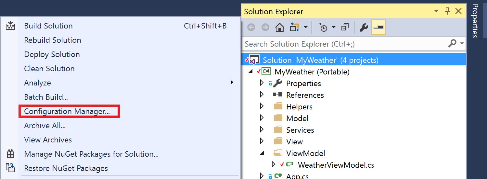
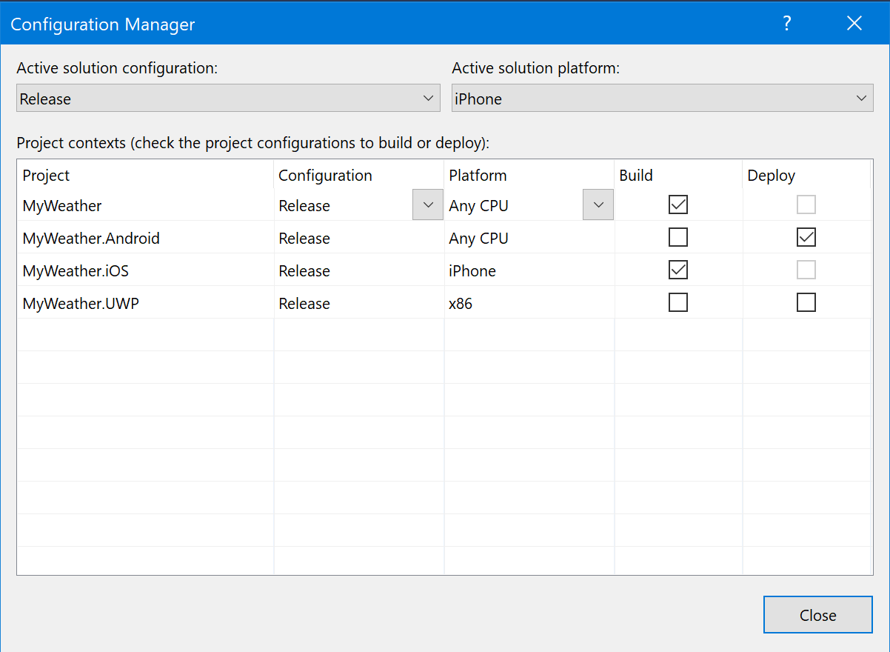
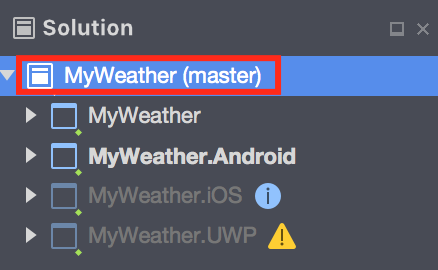

# Configuration mappings

[!INCLUDE [Retirement announcement for App Center](../../includes/retirement.md)]

Xamarin Solutions can be configured to build certain projects and ignore others using custom build configurations. These configurations can minimize possible errors and reduce the build time for your code. 

This guide explains how to configure custom builds in Visual Studio for Windows or macOS. To configure Xamarin projects in Azure DevOps, refer to the [Xamarin Azure DevOps guide](/azure/devops/pipelines/ecosystems/xamarin)

## Modifying Solution Configuration Mappings
Where to change the **Configuration Mapping** depends on the IDE you use. 

### [Visual Studio for Windows](#tab/vswin/)
1. In Solution Explorer, right-click the solution, and open the **Configuration manager**.

2. Select the solution configuration and platform.

3. Choose the active solution configuration, platform, respective project configurations, and **Build/Deploy** options. The **Deploy** option has no effect when building in App Center. 

You can read more about configuration mappings in the [Visual Studio official documentation](/visualstudio/extensibility/internals/configuration-options-overview).

### [Visual Studio for Mac](#tab/vsmac/)
1. Double-click on your solution in the **Solution Explorer**

2. In your solution options, go to **Build > Configurations > Configuration Mappings**.

3. Choose the active solution configuration, platform, respective project configurations, and **Build/Deploy** options. Unlike in Windows, there's no **Deploy** option.

There's additional information in the [Visual Studio for Mac configuration guide](/visualstudio/mac/create-and-edit-configurations#creating-a-solution-build-configuration).

## Project Configurations
Some project options can be set differently for each project configuration. When you switch between different configurations, you may see different outputs at build time. For example, when you use a *Debug* configuration, by default the output will include debugging symbols. Debugging symbols increase file sizes and shouldn't be used for publishing in stores.

The project configuration consists of two parts: the configuration name and the platform specification. For example, a Xamarin.iOS configuration can appear as *Release | iPhone* or *Debug | iPhoneSimulator*. Xamarin.Forms PCL projects have *Release* and *Debug* configurations without platform specification by default.

## Solution Configurations
Solution configurations define behavior for your Run/Build command in the IDE, and App Center builds with the **.sln** file specified. Your solution can have a custom set of interdependent projects and configurations used for each project. 
