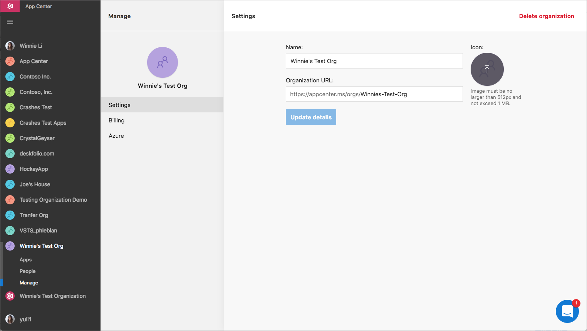

# Creating and managing organizations

We recommend creating an organization for any apps with multiple collaborators to better manage users and their permissions.

## Organization roles

There are two roles within an organization:

* **Admins** can manage organization settings (e.g. change name, change permissions). Admins additionally have a ['Manager' app permission](~/dashboard/creating-and-managing-apps.md) on all apps within the organization.

* **Collaborators** can create apps and participate in apps they belong to within organization.

## Creating an organization

To create an organization, log in and click the **Add new** dropdown and choose **Add new organization**.
> [!NOTE]
> When you create an organization, you automatically become an 'Admin'.

## Uploading an organization icon

You can customize your organization by uploading an org icon. 

1. On the left side navigation, select the organization
2. Select the **Manage** tab
3. On the right side of the screen, click the placeholder org icon
4. Select an image file no larger than 512px and does not exceed 1 MB

## Accessing organizations

All of your organizations are accessible in the left navigation.

## Adding users to an organization

There are two ways to add users to an organization:

**Directly to the organization:**
1. On the left side navigation, select the organization
2. Select **People**
3. Type the user's email address to add the user

This gives the user access to the organization as a collaborator. However, they will not see any of the apps listed in the organization unless they are explicitly invited to the app or if they are an admin of the organization.

**In-directly through an app:**
1. Select an app within an organization
2. On the left side havigation, select the **Settings** page
3. Select **People** 
4. Type the user's email address to add the user

Adding a user from outside the organization to an app automatically adds them to the organization. However, the user will only see the app(s) they were invited to.

## Changing users' organization roles
1. On the left side havigation, select the organization
2. Select **People** 
3. Select the user
4. Use the dropdown to re-assign the role

Only 'Admins' can change the role of collaborators and other admins. 

## Removing users from an organization

1. On the left side havigation, select the organization
2. Select **People**
3. Select the collaborator
4. Click **Remove from organization**

Removing a collaborator from an organization will remove the user from all apps within the organization.

## Leaving an organization

1. On the bottom left side, click on your avatar
2. Select **Account Settings**
3. Select **Organizations**
4. Click the **Leave** button by the orgnaization you would like to leave

> [!NOTE]
> If you are the sole 'Admin' of an organization, you cannot leave the organization. You can either promote another collaborator to 'Admin' or delete the entire organization.

## Deleting an organization

1. On the left side havigation, select the organization
2. Select **Manage**
3. On the upper right hand side, click the **Delete Organization** button

> [!NOTE]
> Only organization 'Admins' can delete organizations.

## Next steps

* [Create a team in your organization](~/dashboard/creating-and-managing-teams.md)
* [Connect to your repository (GitHub, Bitbucket, VSTS)](~/build/index.md)
* [Add App Center's SDK to your app](~/sdk/index.md)
