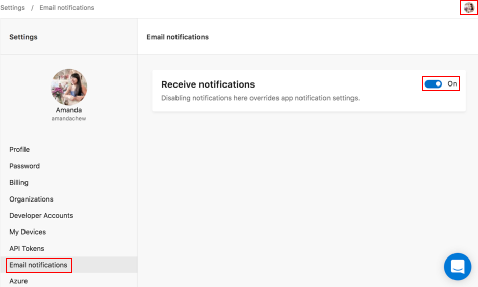
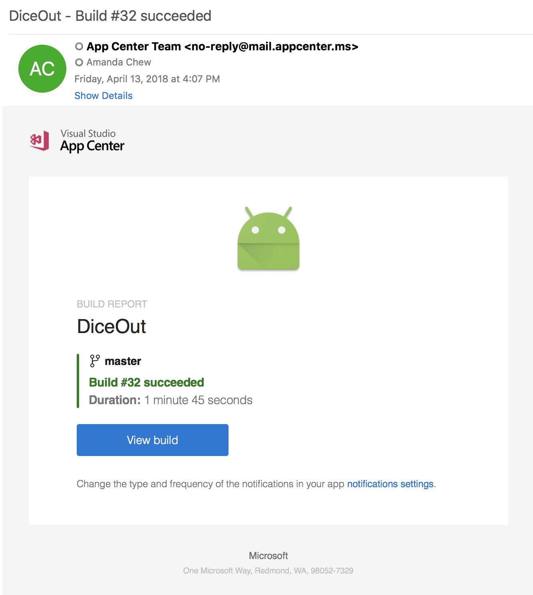

# App Center Email Notifications
## Overview

Many developers want to be automatically notified when key events happen in their apps, and not have to continually log in to a portal for information. Email and [webhooks](https://docs.microsoft.com/appcenter/dashboard/webhooks/) are important notification methods for that.

### Events

You can choose to have email notifications automatically sent for the following events:

- **Build:**
  - On build success:
    - **Always**: when your app builds successfully
    - **Only if previously failed**: when your app has successfully built after one or more failed builds
    - **Never**: you will not receive notifications for build success
  - On build failure:
    - **Always**: when your app fails to build
    - **Only if previously successful**: when your app has failed to build after one or more successful builds
    - **Never**: you will not receive notifications for build failure
    
- **Crashes:** when a crash group is created
  
- **Distribute:**
  - A new version is released:
    - **Immediately**: when a new version is released
    - **Daily**: a summary of all your releases for that day will be sent at approximately 0:00 UTC
    - **Never**: you will not receive notifications when a new version is released
  - Adding new devices to a release failed:
    - **Checked**: when adding new devices to a release failed
    - **Unchecked**: you will not receive notifications when adding new devices to a release fails
- **Test:** when a test run completes

### Email notification preferences

App Center sends email notifications at two levels:  
  - **App-level**: Turning email notifications on and off for an app sets your preference to receive emails at the app-level. Currently, users are only able to turn email notifications on and off for themselves, not for all collaborators of the app.
  - **User-level**: Disabling notifications at the user-level overrides app-level notification settings.

App Center sends notifications using the alias `no-reply@mail.appcenter.ms`.

## Getting Started

### User-level email notifications

1. Navigate to [https://appcenter.ms](https://appcenter.ms) and log in with your account information.

2. On the top right corner, click your user icon and select **Account Settings**.

3. In the middle panel, select **Email notifications** from the menu list.

4. In the row panel titled **Receive notifications**, click the **toggle button** to enable or disable email notifications for all your apps.

    

The default email notification settings at the user-level are toggled **On**.

### App-level email notifications

App-level email notifications send information for the specific app to the user.

1. Navigate to [https://appcenter.ms/apps](https://appcenter.ms/apps), and select the app you would like to configure email notifications for.

2. In the left panel, select **Settings** from the menu list.

3. In the row panel titled **Email notifications**, in the far right corner, click the **pencil icon** to edit your app-level email notification settings.

    

4. In the row titled **Receive notifications**, click the **toggle button** to enable or disable email notifications for the app. Select the **dropdown** for Build status notifications and the **checkbox** for Crashes, Distribute and Test notifications to decide what events will trigger an email.

The default email notification settings at the app-level are:
  - **On** for receiving email notifications
  - **Never** for Build
  - **Immediately** for Distribute new release
  - **Checked** for when Distribute fails to add new devices to a release
  - **Unchecked** for Crashes
  - **Checked** for Test events

You will receive automatic email notifications when your selected events happen. For example, here is what a Build success email notification looks like:

> [!NOTE]
> If your branch name contains alphanumeric characters other than `a-z`, `A-Z`, `0-9`, `-`, `+` and `/`, all email notifications will be successfully delivered. However, when you click on the **View Build** button in the email received, you might be directed to a non-existent page. This is due to the encodings for alphanumeric characters by some email services. We advise you to only use the supported characters in branch names. If this is a blocking issue for you, please contact us via support.
