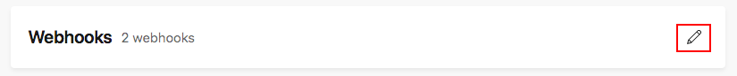
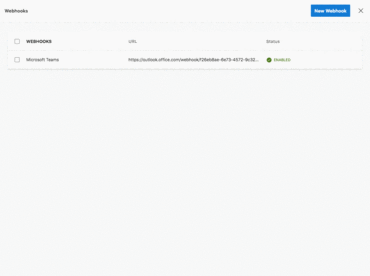
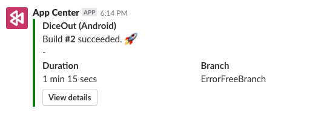

# App Center Webhooks
## Overview

Webhooks are a simple way to notify third party applications when a specified event has occurred. The main goal of webhooks is to communicate important information from App Center to users rather than having users come to the portal, or run API calls to be notified when certain events happen.

App Center's webhooks empower users to send automatic notifications to connected applications for the following events:

- Build: 
  - Build success:
    - **Always**: when your app builds successfully
    - **Only if previously failed**: when your app has successfully built after one or more failed builds
    - **Never**: you will not receive notifications for build success

  - Build failure:
    - **Always**: when your app fails to build
    - **Only if previously successful**: when your app has failed to build after one or more successful builds
    - **Never**: you will not receive notifications for build failure

- Crashes: when a crash group is created
- Distribute: when a new version is released

App Center will send an HTTP POST payload to the webhook's specified URL. Webhooks are configured at the app level under the **Settings** page of your specified app. Users must have have manager or developer permissions in the app to be able to create and configure the webhooks.

## Getting Started

1. Navigate to [App Center](https://appcenter.ms), and select the specific app you would like for webhooks integration.

2. In your app, in the far left hand panel, select **Settings**

3. In the row panel titled **Webhooks**, go to the right hand corner and click on the **pencil icon**. This will bring up the **Webhooks** panel.

    

4. <a name="step3"></a>In the top right hand corner, click the blue **New Webhook** button and enter: 

   - Webhook name
   - Webhook URL

     You can obtain the webhook URL from your integrated application's settings (for example, here are details on how to [obtain the webhook URL from Microsoft Teams](https://docs.microsoft.com/microsoftteams/office-365-custom-connectors#develop-custom-connectors) and how to [obtain the webhook URL from Slack](https://get.slack.help/hc/articles/115005265063-Incoming-WebHooks-for-Slack)). 

     Select the **dropdown** for Build status notifications and the **checkbox** for Crashes and Distribute notifications to decide what events will trigger the webhook alerts. 

     

5. Done! Your webhook is now created and enabled. You may create multiple webhooks by repeating [step 3](#step3).

6. Toggle to the extreme right hand of the webhook to **test, disable or delete** the webhook.  

   - **test** will send a test alert to your connected application.
   - **disable** keeps the webhook inactive but present in your dashboard.
   - **delete** will remove the webhook from your dashboard.

When these events happen, App Center notifications are posted into your integrated applications. For example, here is how a Build success notification looks like with a connected Slack application: 

   

An example of a webhook payload in JSON is:

```JSON
{"app_name":"myFirstApp","branch":"master","build_status":"Succeeded","build_id":"33","build_link":"https://appcenter.ms/users/{user-id}/apps/{app-name}/build/branches/master/builds/33","build_reason":"manual","finish_time":"2018-06-14T23:59:05.2542221Z","icon_link":"https://dl0tgz6ee3upo.cloudfront.net/production/apps/icons/000/590/821/original/0c9130028703e417a6a0df02c6b587f0.png","notification_settings_link":"https://appcenter.ms/users/{user-id}/apps/{app-name}/settings/notifications","os":"iOS","start_time":"2018-06-14T23:57:03.4379381Z","source_version":"55820a357ba26831f2eeb3be9973a4ef20618b73","sent_at":"2018-06-14T23:59:08.4897604Z"}

```
