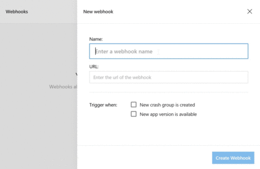

# App Center Webhooks
## Overview

Webhooks are a simple way to notify third party applications when a specified event has occurred.
App Center’s webhooks are useful in empowering users to send automatic notifications to connected applications when either:

- a crash group is created
- a version is released

The main goal of webhooks is to communicate important information from App Center to users rather than having users come to the portal to get this information. App Center will send an HTTP POST payload to the webhook's specified URL. Webhooks can be registered on your specific application under [App Center Apps](https://appcenter.ms/apps).

## Getting Started

1. Navigate to https://appcenter.ms/apps, and select the specific app you would like for webhooks integration.

1. In your app, select **Settings**, and click the **edit** button.

1. Select the **New Webhook** button and enter: 

    - Webhook name
    - Webhook url
    
    You can obtain the webhook url from the application's settings that you are integrating with (for example, Slack, Microsoft Teams. Here are details on how to [obtain the webhook URL from Microsoft Teams](https://docs.microsoft.com/microsoftteams/platform/concepts/connectors#setting-up-a-custom-incoming-webhook) and how to [obtain the webhook URL from Slack](https://get.slack.help/hc/articles/115005265063-Incoming-WebHooks-for-Slack)). 
    
    In App Center, click on the **checkbox** to decide what events will trigger the webhook alerts. Once these events happen, alerts from App Center will be posted into your integrated applications.
    
    

1. Done! Your webhook is now created and enabled. You may create multiple webhooks by repeating [step 3](#step3).

1. Toggle to the extreme right hand of the webhook to **test, disable or delete** the webhook.  

  - **test** will send a test alert to your connected application.
  - **disable** keeps the webhook inactive but present in your dashboard.
  - **delete** will remove the webhook from your dashboard.

