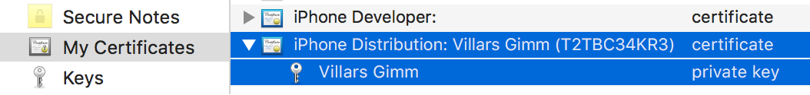

# Device registration and app re-signing

On this page you can read about the steps to take when distributing an iOS application to specific testers. Learn what device registration or provisioning and app re-signing are. When should you use it and how App Center helps you with it? There are also solutions to some common problems you may come across.

## App signing, re-signing, and device provisioning

Developers sign apps for security as required by Apple when distributing. The requirement is the same for distribution through Xcode, App Center, or the iTunes Store. Code signing is a precaution to make sure nobody has tampered with your app. You can read more in the [Apple documentation on app signing](https://developer.apple.com/library/content/documentation/IDEs/Conceptual/AppDistributionGuide/MaintainingCertificates/MaintainingCertificates.html#//apple_ref/doc/uid/TP40012582-CH31-SW2).

The following diagram displays the entire app re-signing flow in App Center. Let's go over these steps in more detail.

**Insert here diagram with alt text**

App re-signing only applies when you want to distribute an iOS app to specific test devices. In the diagram, you want to distribute an app release to the devices of Tester 1 and Tester 2. To do this, you sign your app with an *ad hoc* provisioning profile. This provisioning profile has a list of unique device identifiers (UDIDs). Only devices that are on that list are "provisioned," or  able to install the .ipa. App Center can detect whether a device is provisioned, because we know the UDID of the device when a tester visits the install.appcenter.ms portal. If we detect that the device that the tester is using is not on the list of provisioned devices for the .ipa they want to download, then we show the message "The developers are working on a version for your device."

Once you know which devices you want to use for testing, you must register them in your Apple developer account, add them to your provisioning profile, generate a new provisioning profile, download it and then build your app with this profile. When a new device appears, such as the device with UDID 3 in the diagram, you have to do these steps again. This can be inconvenient, as you don't want to have to change your continuous integration system or pester the developer to always keep adding new devices to the profile and releasing new builds. This is where re-signing comes in. It literally means taking an existing application build and signing it again (re-signing) with a different provisioning profile.

App Center helps you with this process and can also automate it. These are the manual and automatic steps shown in the diagram, provisioning the device with UDID 3. App Center helps you register tester device IDs into your Apple developer account, create a new provisioning profile, and re-sign the app with it all from within the App Center portal. App Center requires access to your Apple developer account for registering the devices.

To manually add devices to an existing release, you can use **Register devices** on the page for a distribution group. See [Device registration](#device-registration).

To automatically add devices, turn on [**Automatically manage devices**](groups.md#automatically-manage-devices) under the distribution group settings. You can also opt in to doing it when you distribute a new release. This option is in the **Devices** step in the wizard for distributing a new release.

App Center adds the new device to the list in the provisioning profile, and now that device can also install the app. These are the bottom steps in the diagram.

## Re-signing capabilities

Some things to note when you use re-signing in App Center:

- Automatically managing devices in groups works only for distributing to non-public and non-shared groups.
- If you're distributing to individual users, you have to register their devices manually and re-sign the app. You can add these emails to a group to use the tools mentioned in this article.
- If you add multiple groups to your release, you have to configure each group separately using **Automatically manage devices** under the group settings.
- Managing devices is only required for iOS apps signed with a developer or ad hoc profile.

## Prerequisites

Before you can use the device capabilities of App Center, you should:

1. Have the production certificate used for the original app signing.
2. Have the credentials to your Apple developer account which holds the [role of Account Holder, Admin, or App Manager](https://developer.apple.com/support/roles/).
3. Use **Manually manage signing** instead of **Automatically manage signing** when distributing the app from Xcode.

## Device registration

You can only register devices that your testers have added to their accounts. Registering a device means making it part of the list of devices that releases can distribute to. To register a device, select a distribution group with at least one device that isn't yet provisioned and navigate to the **Devices** tab. You'll see a device here with the status "unprovisioned" and a message at the top saying there are unprovisioned devices. Follow these steps to register the devices:

1. Select the **Register devices** button.
2. A dialog prompts for your username and password used in the [Apple Developer portal](https://developer.apple.com/).
3. Once you sign in with your Apple username and password, App Center adds the unprovisioned devices to both your Apple developer account and the releases provisioning profile.
4. Optionally you can upload a .p12 file to re-sign the app and distribute it to the newly added devices. Read more on [how to generate a .p12 file](#how-to-generate-a-p12-file).

You can instead decide to add devices now but make a distribution later. To do this, leave **Re-sign my app** unchecked and download the updated provisioning profile with the button on the review screen. You can also download the provisioning profile through Xcode or the Apple Developer portal.

## Distribute a new release

When you distribute a new release to a group that does not have automatic device management enabled, a **Devices** step is part of the wizard. The step checks if you have unprovisioned devices in the distribution group; if this happens, you can check the **Register devices and re-sign app** checkbox. App Center then performs three operations for you:

1. Register new device IDs in the Apple Developer portal.
2. Add the devices to the provisioning profile and download it.
3. Re-sign the uploaded binary so that all testers can install it.

The flow requires the username and password for the [Apple Developer portal](https://developer.apple.com/) and the certificate used to sign the app at build time. You provide the certificate as an exported .p12 file. Read more on [how to generate a .p12 file](#how-to-generate-a-p12-file). If you already have your Apple ID and certificate saved in App Center, you can choose it from the dropdown menus.

## Privacy concerns on username and password

When you add your Apple credentials and a signing certificate to App Center, we use a secure connection. App Center stores the information in an encrypted vault. It isn't possible for any user to download or retrieve sensitive information from the vault.

If you provide this set of credentials and a certificate, it is automatically available to app collaborators but only for that specific service. As an example, say developer X adds credentials and certificates to distribution group "Tester." Then when developer Y distributes a new release to the "Tester" group, X's username, password, and certificate are by default selected. App Center will use them for developer Y. App Center only uses your Apple ID during the transaction and it doesn't use it for anything else.

## Apple device registration limit

Each Apple developer account has a finite number of spots for devices per device type. Apple works with five device types: iPad, iPhone, iPod, Apple TV, and Apple Watch. Each of these has a limitation of 100 devices. Imagine you register six devices, all of which are iPhones. You then have 94 device IDs left for iPhones and still have 100 left for each of the four other device types. You can only unregister devices once per year to get those slots back.

## How to generate a .p12 file

You can store an Apple distribution certificate and private key in a Private Information Exchange (.p12) file. To do this, you need an Apple production certificate stored on your local machine. If you don't, then you won't have the private key.

1. Open the **Keychain Access** app on your Mac and select the **My Certificates** category on the left.
2. Find the right distribution certificate and expand it to see the corresponding private key.

    a. If the private key isn't there, you must either create a new certificate or perform these steps on the machine where you created the certificate.

3. Select either the certificate or the private key or both. Then right-click on the selected item(s) to get the context menu and select the action that starts with **Export**. 
4. Select a location on disk to save the file as a .p12. Choose a strong password for the file.

## How to remove certificates and Apple IDs from App Center

You can remove the certificates and Apple IDs from App Center in the developer accounts.

 1. Select **Account Settings** under your profile picture in the upper-right corner.
 2. Select **Developer accounts**.
 3. Remove the secret by using the three vertical dots on the right side of the table and then **Delete certificate**.
 4. Verify the name of the certificate and confirm your irreversible action by selecting **Delete** once more.

Read more about [managing your Apple ID and certificates](../dashboard/manage-apple-secrets.md).

## Manually register devices with Apple

If you're trying to distribute directly to users outside of App Center, you can follow the steps from the Apple Developer website on how to [distribute to registered devices](https://help.apple.com/xcode/mac/current/#/dev7ccaf4d3c). The steps describe how to manually add devices to your account and re-sign your app.

## Known errors

### Profile not found

When signing in to Apple through App Center, we check the provisioning profile(s) included in your application against those in your developer account. If any profile used in a binary isn't found in your Apple developer account, App Center can't re-sign your application. To resolve this, ensure that your Apple developer account contains all of the provisioning profiles used in your application. You can check application profiles in the **General** tab of your Xcode project properties, or the **[iOS Bundle Signing](https://docs.microsoft.com/xamarin/ios/deploy-test/app-distribution/ad-hoc-distribution#selecting-a-distribution-profile-in-a-xamarinios-project)** options in Visual Studio for Mac.

### Team not found

When signing in to Apple through App Center, the teams included in your applications are checked against those in your developer account. If any team used in the binary isn't found in your Apple developer account, App Center can't re-sign your application. To resolve this, ensure that your Apple developer account contains the team used in your application. You can check the applications team in the **General** tab of your Xcode project properties, or the **[iOS Bundle Signing](https://docs.microsoft.com/xamarin/ios/deploy-test/app-distribution/ad-hoc-distribution#selecting-a-distribution-profile-in-a-xamarinios-project)** options in Visual Studio for Mac.

### Updated license agreement

Apple periodically updates its license agreement. To keep using the Apple Developer portal, you must read and agree with the updated license.

 1. Sign in to the [Apple Developer portal](https://developer.apple.com/).
 2. Follow the instructions given to accept the license agreement.

App Center can't help with content in the license or the flow for the license agreement.

### Our tester didn't register their device ID

If a tester accidentally selected **I already registered it**, follow these steps to register a device manually:

 1. Go to [https://install.appcenter.ms/register-device](https://install.appcenter.ms/register-device) on your mobile device.
 2. Select **Register** and follow the on-screen instructions.
