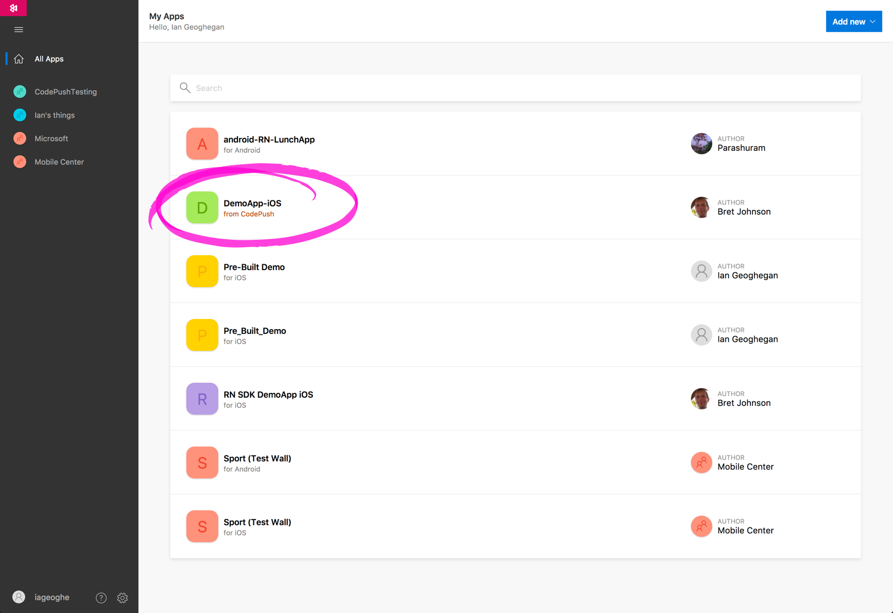
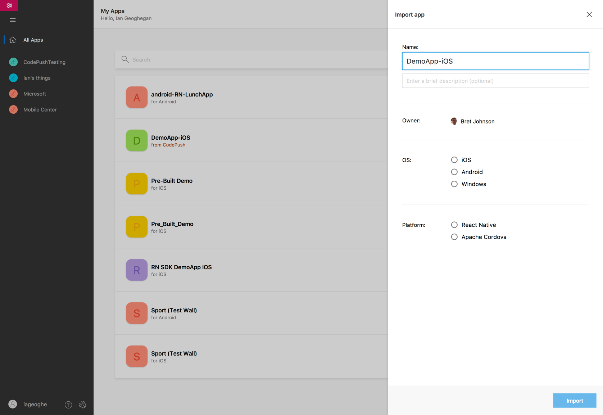
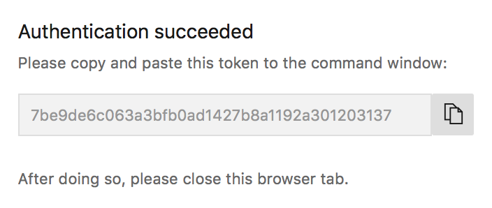
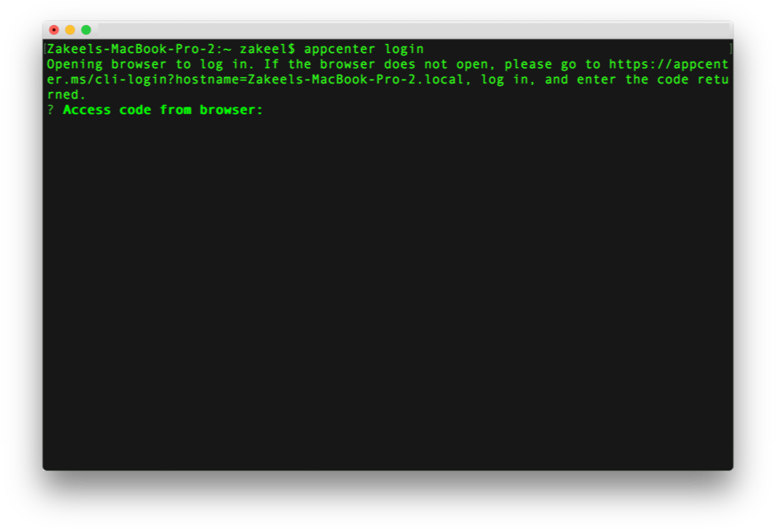
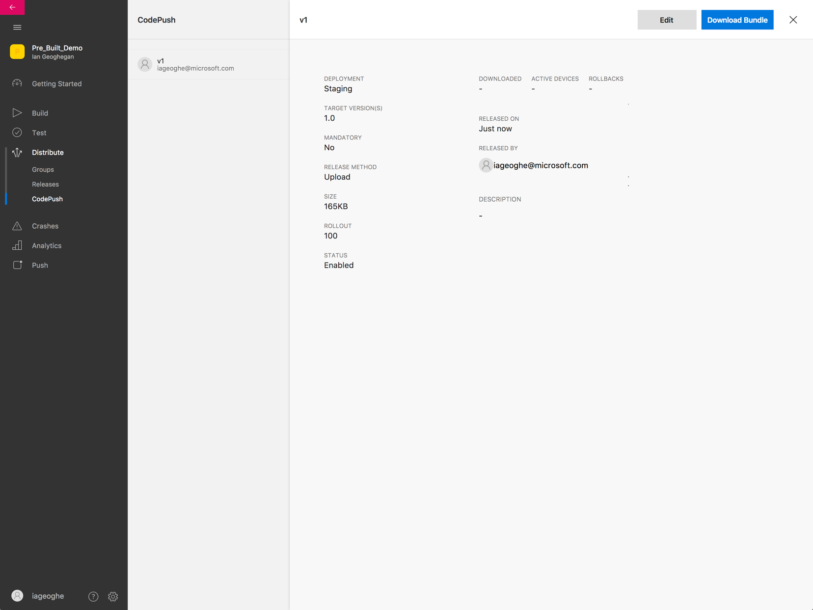
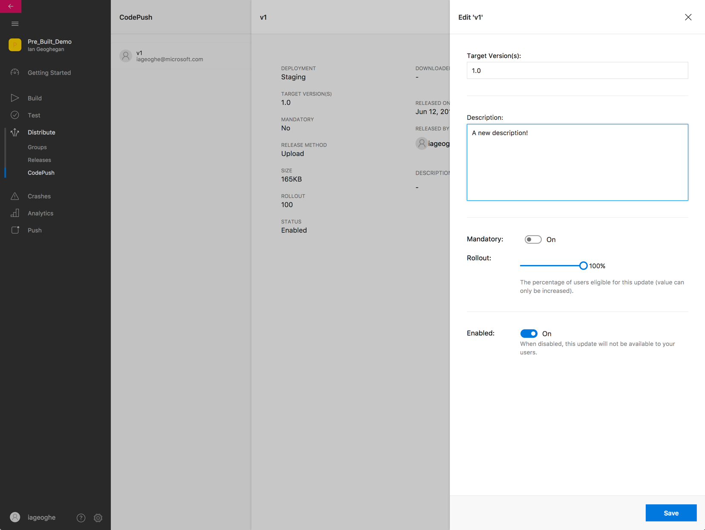
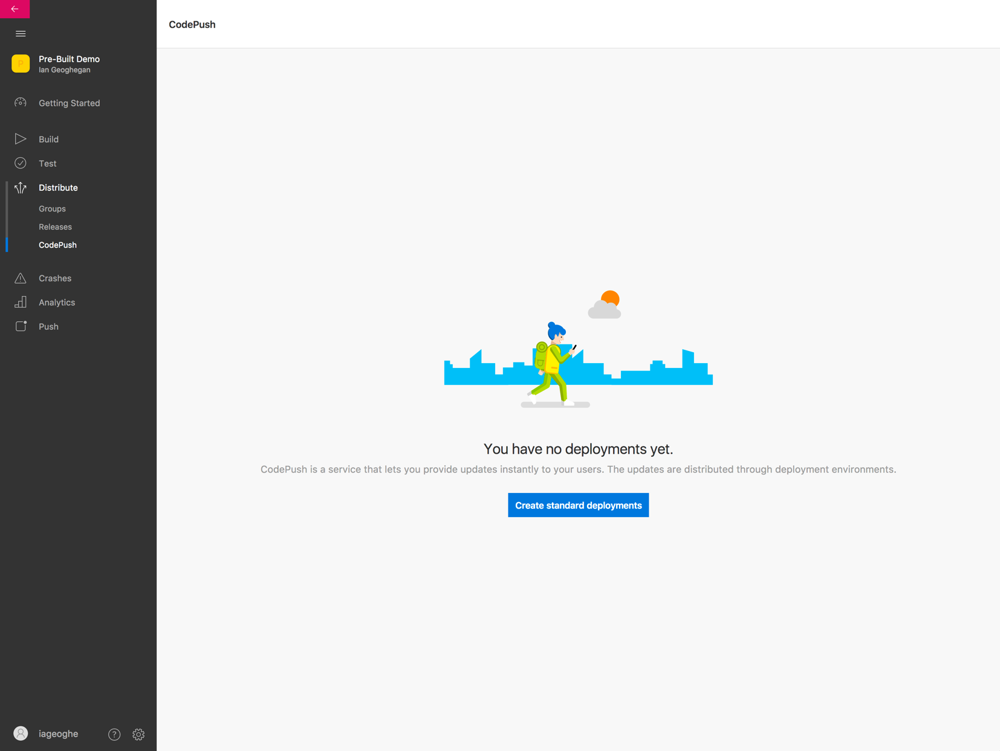
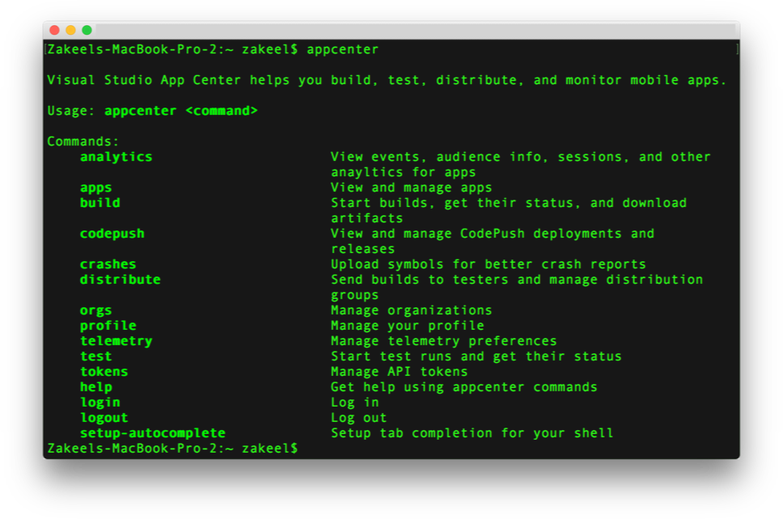

# Migration Guide

Visual Studio App Center (previously known as Visual Studio Mobile Center) is now the new home of CodePush. App Center is a development tool that includes a set of cloud services for building and managing mobile applications. App Center is the next generation of HockeyApp and Xamarin Test Cloud. Learn more about [App Center](https://docs.microsoft.com/appcenter).

The movement of CodePush into App Center is a step forward in improving the overall user experience and progression of CodePush.

Regardless, change is hard. Because of this, this guide was made to ensure that moving from CodePush to App Center is a seamless experience for you, so you can focus on development and not be impeded by the learning curve of navigating  a new product. Besides the use of a new CLI, we have tried to limit the amount of changes you have to make at the time of this announcement. You will not have to make any changes in your code until the release of the new SDK next year.

If you're a current CodePush user, your account has already been migrated for you. All of your CodePush data can be accessed by simply logging into [App Center](https://appcenter.ms). If not, that's okay too! You can get started by [creating an account](https://appcenter.ms).

## Getting Started

**1. Setting up your account**

Depending on the status of your account, the process is a little different:

* **Current CodePush users:** We've already migrated your account! No further action is required regarding account set up is required. You can access your account data by logging into [App Center](https://appcenter.ms).

* **New CodePush users:** Please create an account on [App Center](https://appcenter.ms).

  > [!NOTE]
  > If you had both a CodePush and App Center account that shared an email address, then no further action is required. These accounts will be merged upon logging in to App Center.

**2. Getting Set up in the App Center Portal**

Once you login, the first thing you will see is a list of all your applications. If you had a previous CodePush application, you should find it listed and annotated.



The back-end migration of CodePush into App Center was completed on June 2nd, 2017. If any of your apps were made before this, you will have to specify the OS and Platform of the app.



If you specify that your app is a Cordova application, you may notice that we don't yet support this platforms within the portal; if this is the case, please do not despair as you will still be able to use the App Center CLI and we are working on supporting additional platforms in the portal. App Center's mission is to provide quality support for as many  platforms as possible; we are working hard to make it so. Periodically check out [the App Center blog](https://blogs.msdn.microsoft.com/vsappcenter/) for news and updates and our [product roadmap](https://docs.microsoft.com/appcenter/general/roadmap).

If your imported app's platform is React Native or if you are starting a new React Native app from scratch, you should see an app overview panel that lets you manage your app and provides you with instruction on how to integrate other App Center SDKs. Your App Center app secret is what allows your app to send information to App Center, it is *not* the same as your CodePush deployment keys; the latter can be discovered by open a terminal window and executing:

```shell
appcenter codepush deployment list <ownerName>/<appName> --displayKeys
```

**3. Install the App Center CLI**

To start releasing updates to your end users, you must install the App Center CLI. To install it, open a terminal window or command prompt and execute the following command:

```shell
npm install -g appcenter-cli
```

Once installed, use the `appcenter` command, see below for the available commands.

To log in to your account use `appcenter login`. This command will open the App Center website and present you with an authentication token.



The token must be put into the CLI for authentication and to complete the login process.



After completing this, you are free to use CodePush functionality in your apps through the App Center CLI.

## Using CodePush in the App Center Portal

CodePush can be found within the Distribution section of the App Center portal. CodePush is only visible in App Center when using React Native and, in the near future, Cordova applications.

If your application has a history of releases for a given deployment, these releases will be visible. Switching between deployments is as simple as using the dropdown at the upper right-hand corner of the screen.



Clicking the "Edit" button will provide you with a panel for patching your release. Editing the items on this page would be equivalent to using `appcenter codepush patch`.



For now, developers using CodePush must distribute releases using the release commands in the App Center CLI, but we are looking into extending this functionality to the App Center dashboard as well. Please note that if you create your React Native app using the dashboard, you *first* will have to create default deployments using App Center.



Or you can use the following commands in the App Center CLI to create the recommended deployments prior to pushing a release:

```shell
appcenter codepush deployment add -a <ownerName>/<appName> Staging
appcenter codepush deployment add -a <ownerName>/<appName> Production
```

## The App Center CLI Experience



This section was constructed to enable you to see some of the most common CodePush commmands and how they have changed within the App Center CLI. 

> [!TIP]
> Most App Center CLI commands can be shortened by using `appcenter apps set-current <ownerName>/<appName>`. By setting an app as the current app you no longer have to use the -a flag to specify the app you're trying to perform the command on.

**Creating an App in the App Center CLI:**

```shell
appcenter apps create -d MyApp -o iOS -p React-Native
```

**Releasing an Update App Center CLI:**

```shell
appcenter codepush release-react MyApp 
```

**List App Deployments App Center CLI:**

```shell
appcenter codepush deployment list MyApp
```

**CLI Command Comparison:**


| CodePush                                   | App Center                               |
| ------------------------------------------ | ---------------------------------------- |
| `code-push app add MyApp ios react-native` | `appcenter apps create -d MyApp -o iOS -p React-Native` |
|  N/A                                       |   `appcenter apps set-current <ownerName>/MyApp`  |
|  N/A                                       |   `appcenter apps get-current`  |
| `code-push deployment add myApp <DeploymentName>` | if current app is set: `appcenter codepush deployment add <DeploymentName>`<br/>if not: `appcenter codepush deployment add -a <ownerName>/MyApp <DeploymentName>` |
| `code-push release-react MyApp ios`        | if current app is set: `appcenter codepush release-react`<br/>if not: `appcenter codepush release-react -a <ownerName>/MyApp`  |
| `code-push access-key list`                | `appcenter tokens list` |

## App Center CLI CodePush Cheat Sheet


| Command                              | Description                              |  Example               |
| ------------------------------------ | ---------------------------------------- | ---------------------- |
| **App Center**                       | |
| `appcenter help`                     | Get command or category help | `-` |
| `appcenter login`                    | Log the CLI into App Center | `-` |
| `appcenter logout`                   | Log the CLI out of App Center | `-` |
| `appcenter profile`                  | View and manage profile information | `-` |
| `appcenter tokens`                   | Manage API tokens | `appcenter tokens list` |
| `appcenter orgs`                     | Manage organizations | `appcenter orgs list` |
| **Apps**                             | |
| `appcenter apps create`              | Create a new app | `appcenter apps create -d MyApp -o Android -p React-Native` |
| `appcenter apps delete`              | Delete an app | `appcenter apps delete -a ownerName/MyApp` |
| `appcenter apps get-current`         | Get the application that's set as default for all CLI commands | `-` |
| `appcenter apps list`                | Get list of configured applications | `-` |
| `appcenter apps set-current`         | Set default application for all CLI commands | `appcenter apps set-current <ownerName>/MyApp` |
| **CodePush**                         | |
| `appcenter codepush deployment`      | View and manage your app deployments | `appcenter codepush deployment list` |
| `appcenter codepush help`            | Get CodePush specific command or category help | `-` |
| `appcenter codepush patch`           | Update the metadata for an existing release | `appcenter codepush patch -m` |
| `appcenter codepush promote`         | Promote the latest release from one app deployment to another | `appcenter codepush promote -s Staging -d Production` |
| `appcenter codepush release`         | Release an update to an app deployment |  `appcenter codepush release -a ownerName/MyApp` |
| `appcenter codepush release-cordova` | Release a Cordova update to an app deployment | `appcenter codepush release-cordova --description "mofified assets"` |
| `appcenter codepush release-react`   | Release a React Native update to an app deployment | `appcenter codepush release-react -x` |
| `appcenter codepush rollback`| Rollback the latest release for an app deployment | `appcenter codepush rollback Staging` |

## FAQ

**Q:** *Will the move impact my customers?*

**A:** No

**Q:** *What changes for CodePush?*

**A:** As of now, the only big change is the use of the App Center CLI and the structure of the commands. No changes in your code will be neccesarry until the release of the new SDK, which currently has no ETA. The CodePush team would like to extend our graditude for your help in making CodePush what it is today. None of this would be possible without such an amazing community.

**Q:** *Is using CodePush functionality still free?*

**A:** Yes.

**Q:** *Why the move?*

**A:** Moving to App Center means more support, more resources, and a home among Microsoft's first class services for mobile development.

**Q:** *Will I still be able to log on?*

**A:** Yes.

**Q:** *Can I continue to use the CLI?*

**A:** Yes, we are commited to maintain the CLI through September 2018. You are free to continue using the CLI, but all features besides release and viewing metrics will be disabled in Late March 2018. Finally, the CodePush CLI will be retired in Mid October 2018.

**Q:** *Will I need to create a new account for App Center if I already have one?*

**A:** If you used the same email for both accounts, you will be able to log into App Center using your original account. If not, one will be created for your CodePush app. If you would like to manage your apps from the same account you will need to create an organization in App Center, add your new account to it, and transfer your application to the organization.  

## Helpful Resources

* [CodePush Documentation](~/distribution/codepush/index.md)
* [App Center/CodePush Roadmap](~/general/roadmap.md)
* [App Center](https://appcenter.ms)
* [App Center Documentation](~/index.yml)
