# React Native Client SDK

This plugin provides client-side integration for the CodePush service, allowing you to easily add a dynamic update experience to your React Native app(s).

## How does it work?

React Native apps are composed of JavaScript files and any associated [images](https://facebook.github.io/react-native/docs/images.html#content), which are bundled together by the [packager](https://github.com/facebook/metro) and distributed as part of a platform-specific binary (an `.ipa` or `.apk` file). When the app is released, updating either the JavaScript code (for example making bug fixes, adding new features) or image assets, requires you to recompile and redistribute the entire binary, which includes any review time associated with the store(s) to which you are publishing.

The CodePush plugin helps get product improvements in front of your end users instantly, by keeping your JavaScript and images synchronized with updates you release to the CodePush server. This way, your app gets the benefits of an offline mobile experience, as well as the "web-like" agility of side-loading updates as soon as they are available.

In order to ensure that your end users always have a functioning version of your app, the CodePush plugin maintains a copy of the previous update, so that in the event that you accidentally push an update that includes a crash, it can automatically rollback. This way, you can rest assured that your newfound release agility won't result in users becoming blocked before you have a chance to [roll back](./cli.md#rolling-back-updates) on the server.

> [!NOTE]
> Any product changes which touch native code (e.g. modifying your **AppDelegate.m**/**MainActivity.java** file, adding a new plugin) cannot be distributed via CodePush, and therefore, must be updated via the appropriate store(s).*

## Supported React Native platforms

- iOS (7+)
- Android (4.1+)
- Windows (UWP)

We try our best to maintain backwards compatibility of our plugin with previous versions of React Native, but due to the nature of the platform, and the existence of breaking changes between releases, it is possible that you need to use a specific version of the CodePush plugin in order to support the exact version of React Native you are using. The following table outlines which CodePush plugin versions officially support the respective React Native versions:

| React Native version(s) | Supporting CodePush version(s)                       |
|-------------------------|------------------------------------------------------|
| <0.14                   | **Unsupported**                                      |
| v0.14                   | v1.3 *(introduced Android support)*                  |
| v0.15-v0.18             | v1.4-v1.6 *(introduced iOS asset support)*           |
| v0.19-v0.28             | v1.7-v1.17 *(introduced Android asset support)*      |
| v0.29-v0.30             | v1.13-v1.17 *(RN refactored native hosting code)*    |
| v0.31-v0.33             | v1.14.6-v1.17 *(RN refactored native hosting code)*  |
| v0.34-v0.35             | v1.15-v1.17 *(RN refactored native hosting code)*    |
| v0.36-v0.39             | v1.16-v1.17 *(RN refactored resume handler)*         |
| v0.40-v0.42             | v1.17 *(RN refactored iOS header files)*             |
| v0.43-v0.44             | v2.0+ *(RN refactored unmanage dependencies)*       |
| v0.45                   | v3.0+ *(RN refactored instance manager code)*        |
| v0.46                   | v4.0+ *(RN refactored js bundle loader code)*         |
| v0.46-v0.53             | v5.1+ *(RN removed unused registration of JS modules)*|
| v0.54-v0.55             | v5.3+ *(Android Gradle Plugin 3.x integration)*       |
| v0.56-v0.58             | v5.4+ *(RN upgraded versions for Android tools)*      |
| v0.59                   | v5.6+ *(RN refactored js bundle loader code)*         |
| v0.60-v0.61             | v5.7+ *(RN refactored js bundle loader code)*         |

We work hard to respond to new React Native releases, but they do occasionally break us. We will update this chart with each React Native release, so that users can check to see what our official support is.

### Supported Components

When using the React Native assets system (like using the `require("./foo.png")` syntax), the following list represents the set of core components (and props) that support having their referenced images updated via CodePush:

| Component                                       | Prop(s)                                  |
|-------------------------------------------------|------------------------------------------|
| `Image`                                         | `source`   |
| `MapView.Marker` <br />*(Requires [react-native-maps](https://github.com/lelandrichardson/react-native-maps) `>=O.3.2`)* | `image`                             |
| `ProgressViewIOS`                               | `progressImage`, `trackImage`            |
| `TabBarIOS.Item`                                | `icon`, `selectedIcon`                   |
| `ToolbarAndroid` <br />*(React Native 0.21.0+)* | `actions[].icon`, `logo`, `overflowIcon` |

The following list represents the set of components (and props) that don't currently support their assets being updated via CodePush, due to their dependency on static images (like using the `{ uri: "foo" }` syntax):

| Component   | Prop(s)                                                              |
|-------------|----------------------------------------------------------------------|
| `SliderIOS` | `maximumTrackImage`, `minimumTrackImage`, `thumbImage`, `trackImage` |
| `Video`     | `source`                                                             |

We'll update this list as new core components are released, which support referencing assets, to ensure users know what exactly they can expect to update using CodePush.

## Getting Started

Once you've followed the general-purpose ["getting started"](~/distribution/codepush/index.md) instructions for setting up your CodePush account, you can start CodePush-ifying your React Native app by running the following command from within your app's root directory:

```shell
npm install --save react-native-code-push
```

As with all other React Native plugins, the integration experience is different for iOS and Android, so perform the following setup steps depending on the platform(s) you target for your app. Note, if you are targeting both platforms it is recommended to create separate CodePush applications for each platform.

If you want to see how other projects have integrated with CodePush, you can check out the excellent [example apps](#example-apps--starters) provided by the community. Additionally, if you'd like to quickly familiarize yourself with CodePush + React Native, you can check out the awesome getting started videos produced by [Bilal Budhani](https://www.youtube.com/watch?v=uN0FRWk-YW8&feature=youtu.be) and/or [Deepak Sisodiya ](https://www.youtube.com/watch?v=f6I9y7V-Ibk).

> [!IMPORTANT]
> This guide assumes you have used the `react-native init` command to initialize your React Native project. As of March 2017, the command `create-react-native-app` can also be used to initialize a React Native project. If using this command, please run `npm run eject` in your project's home directory to get a project very similar to what `react-native init` would have created.*

## iOS Setup

Once you've acquired the CodePush plugin, you must integrate it into the Xcode project of your React Native app and configure it correctly.

### Plugin Installation (iOS)

In order to accommodate as many developer preferences as possible, the CodePush plugin supports iOS installation via three mechanisms:

1. [RNPM](#plugin-installation-ios---rnpm) - [React Native Package Manager](https://github.com/rnpm/rnpm) (RNPM) is an awesome tool that provides the simplest installation experience possible for React Native plugins. If you're already using it, or you want to use it, then we recommend this approach.

2. [**CocoaPods**](#plugin-installation-ios---cocoapods) - If you're building a native iOS app that is embedding React Native into it, or you simply prefer using [CocoaPods](https://cocoapods.org), then we recommend using the Podspec file that we ship as part of our plugin.

3. [**"Manual"**](#plugin-installation-ios---manual) - If you don't want to depend on any additional tools or are fine with a few extra installation steps (it's a one-time thing), then go with this approach.

#### Plugin Installation (iOS - RNPM)

1.  As of v0.60 of React Native, automatic linking is supported and you do not have to run any commands.

    As of v0.27 of React Native, `rnpm link` has already been merged into the React Native CLI. Simply run:

    ```shell
    react-native link react-native-code-push
    ```

    If your app uses a version of React Native that is lower than v0.27, execute the following command:

    ```shell
    rnpm link react-native-code-push
    ```

   > [!NOTE]
   > If you don't already have RNPM installed, you can do so by simply running `npm i -g rnpm` and then executing the above command. If you already have RNPM installed, make sure you have v1.9.0+ in order to benefit from this one step install.*

2. You will be prompted for the deployment key you'd like to use. If you don't already have it, you can retrieve this value by running `appcenter codepush deployment list -a <ownerName>/<appName> --displayKeys`, or you can choose to ignore it (by simply hitting `<ENTER>`) and add it in later. To get started, we would recommend just using your `Staging` deployment key, so that you can test out the CodePush end-to-end.

And that's it! Isn't RNPM awesome? :)

#### Plugin Installation (iOS - CocoaPods)

1. Add the React Native and CodePush plugin dependencies to your `Podfile`, pointing at the path where NPM has installed modules

    ```Ruby
    # React Native requirements
    pod 'React', :path => '../node_modules/react-native', :subspecs => [
       'Core',
       'CxxBridge', # Include this for RN >= 0.47
       'DevSupport', # Include this to enable In-App Devmenu if RN >= 0.43
       'RCTText',
       'RCTNetwork',
       'RCTWebSocket', # Needed for debugging
       'RCTAnimation', # Needed for FlatList and animations running on native UI thread
       # Add any other subspecs you want to use in your project
    ]
    # Explicitly include Yoga if you are using RN >= 0.42.0
    pod 'yoga', :path => '../node_modules/react-native/ReactCommon/yoga'
    pod 'DoubleConversion', :podspec => '../node_modules/react-native/third-party-podspecs/DoubleConversion.podspec'
    pod 'glog', :podspec => '../node_modules/react-native/third-party-podspecs/glog.podspec'
    pod 'Folly', :podspec => '../node_modules/react-native/third-party-podspecs/Folly.podspec'

    # CodePush plugin dependency
    pod 'CodePush', :path => '../node_modules/react-native-code-push'
    ```

   > [!NOTE]
   > File paths for dependencies must be relative to your app's `Podfile` location.

   > [!NOTE]
   > The project's `JWT` library must be version 3.0.x or higher

2. Run `pod install`

> [!NOTE]
> The CodePush `.podspec` depends on the `React` pod, and so in order to ensure that it can correctly use the version of React Native that your app is built with, please make sure to define the `React` dependency in your app's `Podfile` as explained in the [React Native integration documentation](https://facebook.github.io/react-native/docs/integration-with-existing-apps.html#podfile).

#### Plugin Installation (iOS - Manual)

1. Open your app's Xcode project

2. Find the `CodePush.xcodeproj` file within the `node_modules/react-native-code-push/ios` directory (or `node_modules/react-native-code-push` for <=`1.7.3-beta` installations) and drag it into the `Libraries` node in Xcode

    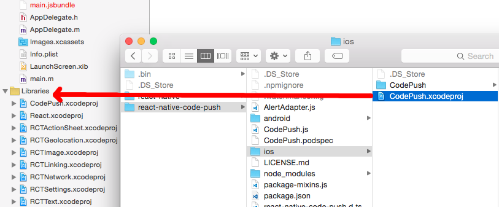

3. Select the project node in Xcode and select the "Build Phases" tab of your project configuration.

4. Drag `libCodePush.a` from `Libraries/CodePush.xcodeproj/Products` into the "Link Binary With Libraries" section of your project's "Build Phases" configuration.

    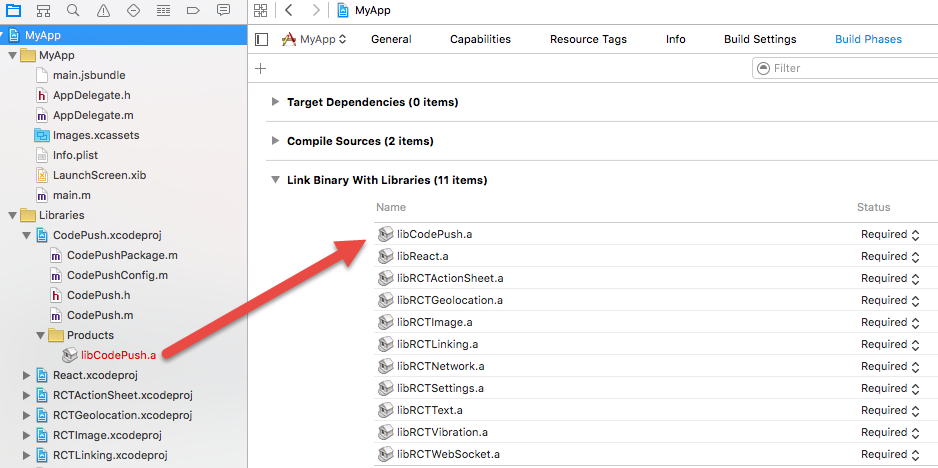

5. Click the plus sign underneath the "Link Binary With Libraries" list and select the `libz.tbd` library underneath the `iOS 9.1` node.

    

   > [!NOTE]
   > Alternatively, if you prefer, you can add the `-lz` flag to the `Other Linker Flags` field in the `Linking` section of the `Build Settings`.*

### Plugin Configuration (iOS)

> [!NOTE]
> If you used RNPM or `react-native link` to automatically link the plugin, these steps have already been done for you so you may skip this section.*

Once your Xcode project has been set up to build/link the CodePush plugin, you need to configure your app to consult CodePush for the location of your JS bundle, since it is responsible for synchronizing it with updates that are released to the CodePush server. To do this, perform the following steps:

1. Open up the **AppDelegate.m** file, and add an import statement for the CodePush headers:

    ```objective-c
    #import <CodePush/CodePush.h>
    ```

For React Native 0.59 and above:

2. Find the following line of code, which sets the source URL for bridge for production releases:

    ```objective-c
    return [[NSBundle mainBundle] URLForResource:@"main" withExtension:@"jsbundle"];
    ```

3. Replace it with this line:

    ```objective-c
    return [CodePush bundleURL];
    ```

For React Native 0.58 and below:

2. Find the following line of code, which loads your JS Bundle from the app binary for production releases:

    ```objective-c
    jsCodeLocation = [[RCTBundleURLProvider sharedSettings] jsBundleURLForBundleRoot:@"index" fallbackResource:nil];
    ```

3. Replace it with this line:

    ```objective-c
    jsCodeLocation = [CodePush bundleURL];
    ```

This change configures your app to always load the most recent version of your app's JS bundle. On the first launch, this corresponds to the file that was compiled with the app. However, after an update has been pushed via CodePush, this will return the location of the most recently installed update.

> [!NOTE]
> The `bundleURL` method assumes your app's JS bundle is named `main.jsbundle`. If you have configured your app to use a different file name, simply call the `bundleURLForResource:` method (which assumes you're using the `.jsbundle` extension) or `bundleURLForResource:withExtension:` method instead, in order to overwrite that default behavior*

Typically, you're only going to want to use CodePush to resolve your JS bundle location within release builds, and therefore, we recommend using the `DEBUG` pre-processor macro to dynamically switch between using the packager server and CodePush, depending on whether you are debugging or not. This will make it much simpler to ensure you get the right behavior you want in production, while still being able to use the Chrome Dev Tools, live reload, etc. at debug-time.

For React Native 0.59 and above:

```objective-c
- (NSURL *)sourceURLForBridge:(RCTBridge *)bridge
{
  #if DEBUG
    return [[RCTBundleURLProvider sharedSettings] jsBundleURLForBundleRoot:@"index" fallbackResource:nil];
  #else
    return [CodePush bundleURL];
  #endif
}
```

For React Native 0.58 and below:

```objective-c
NSURL *jsCodeLocation;

#ifdef DEBUG
    jsCodeLocation = [[RCTBundleURLProvider sharedSettings] jsBundleURLForBundleRoot:@"index" fallbackResource:nil];
#else
    jsCodeLocation = [CodePush bundleURL];
#endif
```

To let the CodePush runtime know which deployment it should query for updates against, open the project's **Info.plist** file and add a new entry named `CodePushDeploymentKey`, whose value is the key of the deployment you want to configure this app against (like the key for the `Staging` deployment for the `FooBar` app). You can retrieve this value by running `appcenter codepush deployment list -a <ownerName>/<appName> --displayKeys` in the CodePush CLI  and copying the value of the `Deployment Key` column which corresponds to the deployment you want to use (see below). Note that using the deployment's name (like `Staging`) will not work. That "friendly name" is intended only for authenticated management usage from the CLI, and not for public consumption within your app.

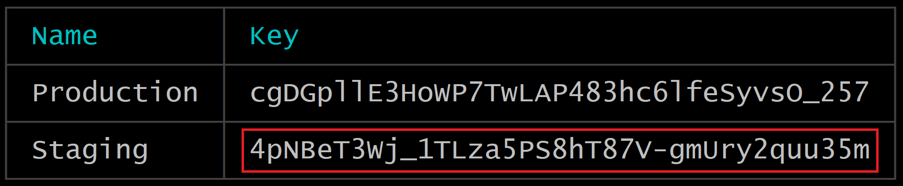

In order to effectively make use of the `Staging` and `Production` deployments that were created along with your CodePush app, refer to the [multi-deployment testing](#multi-deployment-testing) docs below before actually moving your app's usage of CodePush into production.

### HTTP exception domains configuration (iOS)

CodePush plugin makes HTTPS requests to the following domains:

- codepush.appcenter.ms
- codepush.blob.core.windows.net
- codepushupdates.azureedge.net

If you want to change the default HTTP security configuration for any of these domains, you have to define the [`NSAppTransportSecurity` (ATS)][ats] configuration inside the project's **Info.plist** file:

```xml
<plist version="1.0">
  <dict>
    <!-- ...other configs... -->

    <key>NSAppTransportSecurity</key>
    <dict>
      <key>NSExceptionDomains</key>
      <dict>
        <key>codepush.appcenter.ms</key>
        <dict><!-- read the ATS Apple Docs for available options --></dict>
      </dict>
    </dict>

    <!-- ...other configs... -->
  </dict>
</plist>
```

Before doing anything, please [read the docs][ats] first.

[ats]: https://developer.apple.com/library/content/documentation/General/Reference/InfoPlistKeyReference/Articles/CocoaKeys.html#//apple_ref/doc/uid/TP40009251-SW33

## Android Setup

In order to integrate CodePush into your Android project, perform the following steps:

### Plugin Installation (Android)

In order to accommodate as many developer preferences as possible, the CodePush plugin supports Android installation via two mechanisms:

1. [**RNPM**](#plugin-installation-android---rnpm) - [React Native Package Manager (RNPM)](https://github.com/rnpm/rnpm) is an awesome tool that provides the simplest installation experience possible for React Native plugins. If you're already using it, or you want to use it, then we recommend this approach.

2. [**"Manual"**](#plugin-installation-android---manual) - If you don't want to depend on any additional tools or are fine with a few extra installation steps (it's a one-time thing), then go with this approach.

> [!NOTE]
> Due to a code change from the React Native repository, if your installed React Native version ranges from 0.29 to 0.32, we recommend following the manual steps to set up correctly.

#### Plugin Installation (Android - RNPM)

1.  As of v0.60 of React Native, automatic linking is supported but you still have to apply codepush specific build configuration.
    In your `android/app/build.gradle` file, add the `codepush.gradle` file as an additional build task definition underneath `react.gradle`:

    ```gradle
    ...
    apply from: "../../node_modules/react-native/react.gradle"
    apply from: "../../node_modules/react-native-code-push/android/codepush.gradle"
    ...
    ```

    As of v0.27 of React Native, `rnpm link` has already been merged into the React Native CLI. Simply run:

    ```shell
    react-native link react-native-code-push
    ```

    If your app uses a version of React Native that is lower than v0.27, run the following:

    ```shell
    rnpm link react-native-code-push
    ```

   > [!NOTE]
   > If you don't already have RNPM installed, you can do so by simply running `npm i -g rnpm` and then executing the above command.*

2. If you're using RNPM >=1.6.0, you will be prompted for the deployment key you'd like to use. If you don't already have it, you can retrieve this value by running `appcenter codepush deployment list -a <ownerName>/<appName> --displayKeys`, or you can choose to ignore it (by simply hitting `<ENTER>`) and add it in later. To get started, we would recommend just using your `Staging` deployment key, so that you can test out the CodePush end-to-end.

And that's it for installation using RNPM! Continue below to the [Plugin Configuration](#plugin-configuration-android) section to complete the setup.

#### Plugin Installation (Android - Manual)

1. In your `android/settings.gradle` file, make the following additions:

    ```gradle
    include ':app', ':react-native-code-push'
    project(':react-native-code-push').projectDir = new File(rootProject.projectDir, '../node_modules/react-native-code-push/android/app')
    ```

2. In your `android/app/build.gradle` file, add the `:react-native-code-push` project as a compile-time dependency:

    ```gradle
    ...
    dependencies {
        ...
        compile project(':react-native-code-push')
    }
    ```

3. In your `android/app/build.gradle` file, add the `codepush.gradle` file as an additional build task definition underneath `react.gradle`:

    ```gradle
    ...
    apply from: "../../node_modules/react-native/react.gradle"
    apply from: "../../node_modules/react-native-code-push/android/codepush.gradle"
    ...
    ```

### Plugin Configuration (Android)

> [!NOTE]
> If you used RNPM or `react-native link` to automatically link the plugin, these steps have already been done for you so you may skip this section.*

After installing the plugin and syncing your Android Studio project with Gradle, you need to configure your app to consult CodePush for the location of your JS bundle, since it will "take control" of managing the current and all future versions. To do this:

**For React Native >= v0.60**

If you are integrating CodePush into React Native application please do the following steps:

Update the `MainApplication.java` file to use CodePush via the following changes:

```java
...
// 1. Import the plugin class.
import com.microsoft.codepush.react.CodePush;

public class MainApplication extends Application implements ReactApplication {

    private final ReactNativeHost mReactNativeHost = new ReactNativeHost(this) {
        ...
        // 2. Override the getJSBundleFile method in order to let
        // the CodePush runtime determine where to get the JS
        // bundle location from on each app start
        @Override
        protected String getJSBundleFile() {
            return CodePush.getJSBundleFile();
        }
    };
}
```

Update `strings.xml` file with the deployment key

```
<string name="reactNativeCodePush_androidDeploymentKey" moduleConfig="true" translatable="false">deployment-key-here</string>

```

**For React Native >= v0.29**

If you are integrating CodePush into React Native application please do the following steps:

Update the `MainApplication.java` file to use CodePush via the following changes:

```java
...
// 1. Import the plugin class.
import com.microsoft.codepush.react.CodePush;

public class MainApplication extends Application implements ReactApplication {

    private final ReactNativeHost mReactNativeHost = new ReactNativeHost(this) {
        ...
        // 2. Override the getJSBundleFile method in order to let
        // the CodePush runtime determine where to get the JS
        // bundle location from on each app start
        @Override
        protected String getJSBundleFile() {
            return CodePush.getJSBundleFile();
        }

        @Override
        protected List<ReactPackage> getPackages() {
            // 3. Instantiate an instance of the CodePush runtime and add it to the list of
            // existing packages, specifying the right deployment key. If you don't already
            // have it, you can run "appcenter codepush deployment list -a <ownerName>/<appName> --displayKeys" to retrieve your key.
            return Arrays.<ReactPackage>asList(
                new MainReactPackage(),
                new CodePush("deployment-key-here", MainApplication.this, BuildConfig.DEBUG)
            );
        }
    };
}
```

If you are integrating React Native into existing native application please do the following steps:

Update `MyReactActivity.java` (it could be named differently in your app) file to use CodePush via the following changes:

```java
...
// 1. Import the plugin class.
import com.microsoft.codepush.react.CodePush;

public class MyReactActivity extends Activity {
    private ReactRootView mReactRootView;
    private ReactInstanceManager mReactInstanceManager;

    @Override
    protected void onCreate(Bundle savedInstanceState) {
        ...
        mReactInstanceManager = ReactInstanceManager.builder()
                // ...
                // Add CodePush package
                .addPackage(new CodePush("deployment-key-here", getApplicationContext(), BuildConfig.DEBUG))
                // Get the JS Bundle File via CodePush
                .setJSBundleFile(CodePush.getJSBundleFile())
                // ...

                .build();
        mReactRootView.startReactApplication(mReactInstanceManager, "MyReactNativeApp", null);

        setContentView(mReactRootView);
    }

    ...
}
```

**For React Native v0.19 - v0.28**

Update the **MainActivity.java** file to use CodePush via the following changes:

```java
...
// 1. Import the plugin class (if you used RNPM to install the plugin, this
// should already be done for you automatically so you can skip this step).
import com.microsoft.codepush.react.CodePush;

public class MainActivity extends ReactActivity {
    // 2. Override the getJSBundleFile method in order to let
    // the CodePush runtime determine where to get the JS
    // bundle location from on each app start
    @Override
    protected String getJSBundleFile() {
        return CodePush.getJSBundleFile();
    }

    @Override
    protected List<ReactPackage> getPackages() {
        // 3. Instantiate an instance of the CodePush runtime and add it to the list of
        // existing packages, specifying the right deployment key. If you don't already
        // have it, you can run "appcenter codepush deployment list -a <ownerName>/<appName> --displayKeys" to retrieve your key.
        return Arrays.<ReactPackage>asList(
            new MainReactPackage(),
            new CodePush("deployment-key-here", this, BuildConfig.DEBUG)
        );
    }

    ...
}
```

#### Background React Instances

*This section is only necessary if you're *explicitly* launching a React Native instance without an `Activity` (for example, from within a native push notification receiver). For these situations, CodePush must be told how to find your React Native instance.*

In order to update/restart your React Native instance, CodePush must be configured with a `ReactInstanceHolder` before attempting to restart an instance in the background. This is done in your `Application` implementation.

**For React Native >= v0.29**

Update the `MainApplication.java` file to use CodePush via the following changes:

```java
...
// 1. Declare your ReactNativeHost to extend ReactInstanceHolder. ReactInstanceHolder is a subset of ReactNativeHost, so no additional implementation is needed.
import com.microsoft.codepush.react.ReactInstanceHolder;

public class MyReactNativeHost extends ReactNativeHost implements ReactInstanceHolder {
  // ... usual overrides
}

// 2. Provide your ReactNativeHost to CodePush.

public class MainApplication extends Application implements ReactApplication {

   private final MyReactNativeHost mReactNativeHost = new MyReactNativeHost(this);

   @Override
   public void onCreate() {
     CodePush.setReactInstanceHolder(mReactNativeHost);
     super.onCreate();
  }
}
```

**For React Native v0.19 - v0.28**

Before v0.29, React Native did not provide a `ReactNativeHost` abstraction. If you're launching a background instance, you'll likely have built your own, which should now implement `ReactInstanceHolder`. Once that's done:

```java
// 1. Provide your ReactInstanceHolder to CodePush.

public class MainApplication extends Application {

   @Override
   public void onCreate() {
     // ... initialize your instance holder
     CodePush.setReactInstanceHolder(myInstanceHolder);
     super.onCreate();
  }
}
```

In order to effectively make use of the `Staging` and `Production` deployments that we recommmend you created along with your CodePush app, refer to the [multi-deployment testing](#multi-deployment-testing) docs below before actually moving your app's usage of CodePush into production.

## Windows Setup

Once you've acquired the CodePush plugin, you need to integrate it into the Visual Studio project of your React Native app and configure it correctly. To do this, take the following steps:

### Plugin Installation (Windows)

1. Open the Visual Studio solution located at `windows\<AppName>\<AppName>.sln` within your app

2. Right-click the solution node in the `Solution Explorer` window and select the `Add -> Existing Project...` menu item

   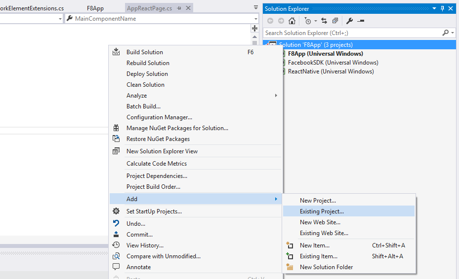

3. Browse to the `node_modules\react-native-code-push\windows` directory, select the  file, and click `OK`

4. Back in the `Solution Explorer`, right-click the project node that is named after your app, and select the `Add -> Reference...` menu item

   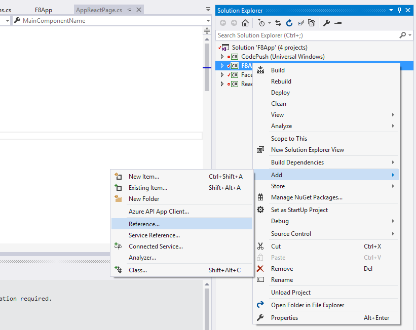

5. Select the `Projects` tab on the left hand side, check the `CodePush` item and then click `OK`

   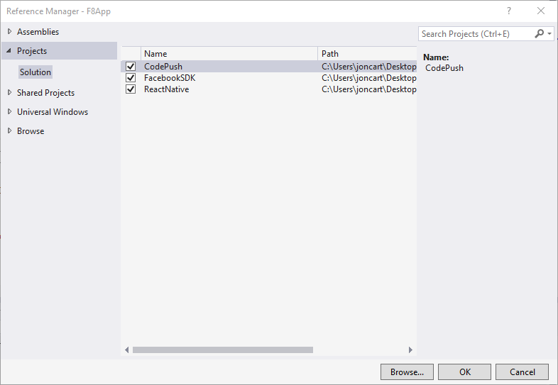

### Plugin Configuration (Windows)

After installing the plugin, you need to configure your app to consult CodePush for the location of your JS bundle, since it will "take control" of managing the current and all future versions. To do this, update the `AppReactPage.cs` file to use CodePush via the following changes:

```c#
...
// 1. Import the CodePush namespace
using CodePush.ReactNative;
...
class AppReactPage : ReactPage
{
    // 2. Declare a private instance variable for the CodePushModule instance.
    private CodePushReactPackage codePushReactPackage;

    // 3. Update the JavaScriptBundleFile property to initalize the CodePush runtime,
    // specifying the right deployment key, then use it to return the bundle URL from
    // CodePush instead of statically from the binary. If you don't already have your
    // deployment key, you can run "appcenter codepush deployment list -a <ownerName>/<appName> --displayKeys" to retrieve it.
    public override string JavaScriptBundleFile
    {
        get
        {
            codePushReactPackage = new CodePushReactPackage("deployment-key-here", this);
            return codePushReactPackage.GetJavaScriptBundleFile();
        }
    }

    // 4. Add the codePushReactPackage instance to the list of existing packages.
    public override List<IReactPackage> Packages
    {
        get
        {
            return new List<IReactPackage>
            {
                new MainReactPackage(),
                ...
                codePushReactPackage
            };
        }
    }
    ...
}
```

## Plugin Usage

With the CodePush plugin downloaded and linked, and your app asking CodePush where to get the right JS bundle from, the only thing left is to add the necessary code to your app to control the following policies:

1. When (and how often) to check for an update? (for example app start, in response to clicking a button in a settings page, periodically at some fixed interval)

2. When an update is available, how to present it to the end user?

The simplest way to do this is to "CodePush-ify" your app's root component. To do so, you can choose one of the following two options:

- **Option 1: Wrap your root component with the `codePush` higher-order component:**

    ```javascript
    import codePush from "react-native-code-push";

    class MyApp extends Component {
    }

    MyApp = codePush(MyApp);
    ```

- **Option 2: Use the [ES7 decorator](https://github.com/wycats/javascript-decorators) syntax:**

  > [!NOTE]
  > Decorators are not yet supported in Babel 6.x pending proposal update.* You may need to enable it by installing and using [babel-preset-react-native-stage-0](https://github.com/skevy/babel-preset-react-native-stage-0#babel-preset-react-native-stage-0).

    ```javascript
    import codePush from "react-native-code-push";

    @codePush
    class MyApp extends Component {
    }
    ```

By default, CodePush will check for updates on every app start. If an update is available, it will be silently downloaded, and installed the next time the app is restarted (either explicitly by the end user or by the OS), which ensures the least invasive experience for your end users. If an available update is mandatory, then it will be installed immediately, ensuring that the end user gets it as soon as possible.

If you would like your app to discover updates more quickly, you can also choose to sync up with the CodePush server every time the app resumes from the background.

```javascript
let codePushOptions = { checkFrequency: codePush.CheckFrequency.ON_APP_RESUME };

class MyApp extends Component {
}

MyApp = codePush(codePushOptions)(MyApp);
```

Alternatively, if you want fine-grained control over when the check happens (like a button press or timer interval), you can call [`CodePush.sync()`](#api-reference) at any time with your desired `SyncOptions`, and optionally turn off CodePush's automatic checking by specifying a manual `checkFrequency`:

```javascript
let codePushOptions = { checkFrequency: codePush.CheckFrequency.MANUAL };

class MyApp extends Component {
    onButtonPress() {
        codePush.sync({
            updateDialog: true,
            installMode: codePush.InstallMode.IMMEDIATE
        });
    }

    render() {
        <View>
            <TouchableOpacity onPress={this.onButtonPress}>
                <Text>Check for updates</Text>
            </TouchableOpacity>
        </View>
    }
}

MyApp = codePush(codePushOptions)(MyApp);
```

If you would like to display an update confirmation dialog (an "active install"), configure when an available update is installed (like force an immediate restart) or customize the update experience in any other way, refer to the [`codePush()`](#api-reference) API reference for information on how to tweak this default behavior.

> [!NOTE]
> If you are using [Redux](https://redux.js.org) and [Redux Saga](https://redux-saga.js.org/), you can alternatively use the [react-native-code-push-saga](https://github.com/lostintangent/react-native-code-push-saga) module, which allows you to customize when `sync` is called in a perhaps simpler/more idiomatic way.

## Store Guideline Compliance

While Google Play and internally distributed apps (for example Enterprise, Fabric, HockeyApp) have no limitations over how to publish updates using CodePush, the iOS App Store and its corresponding guidelines have more precise rules you should be aware of before integrating the solution within your application.

Paragraph **3.3.2**, since back in 2015's [Apple Developer Program License Agreement](https://developer.apple.com/programs/ios/information/iOS_Program_Information_4_3_15.pdf) fully allowed performing over-the-air updates of JavaScript and assets -  and in its latest version (20170605) [downloadable here](https://developer.apple.com/terms/) this ruling is even broader:

> Interpreted code may be downloaded to an Application but only so long as such code: (a) does not change the primary purpose of the Application by providing features or functionality that are inconsistent with the intended and advertised purpose of the Application as submitted to the App Store, (b) does not create a store or storefront for other code or applications, and (c) does not bypass signing, sandbox, or other security features of the OS.

CodePush allows you to follow these rules in full compliance so long as the update you push does not significantly deviate your product from its original App Store approved intent.

To further remain in compliance with Apple's guidelines we suggest that App Store-distributed apps don't enable the `updateDialog` option when calling `sync`, since in the [App Store Review Guidelines](https://developer.apple.com/app-store/review/guidelines/) it is written that:

> Apps must not force users to rate the app, review the app, download other apps, or other similar actions in order to access functionality, content, or use of the app.

This is not necessarily the case for `updateDialog`, since it won't force the user to download the new version, but at least you should be aware of that ruling if you decide to show it.

## Releasing Updates

Once your app has been configured and distributed to your users, and you've made some JS and/or asset changes, it's time to instantly release them! The simplest (and recommended) way to do this is to use the `release-react` command in the CodePush CLI, which will handle bundling your JavaScript and asset files and releasing the update to the CodePush server.

> [!NOTE]
> Before you can start releasing updates, please log into App Center by running the `appcenter login` command.

In it's most basic form, this command only requires one parameter: your owner name + "/" + app name.

```shell
appcenter codepush release-react -a <ownerName>/<appName>

appcenter codepush release-react -a <ownerName>/MyApp-iOS
appcenter codepush release-react -a <ownerName>/MyApp-Android
```

> [!TIP]
> By using the App Center CLI `set-current` function you no longer have to use the -a flag to specify which app a command is directed at.*

The `release-react` command enables such a simple workflow because it provides many sensible defaults (like generating a release bundle, assuming your app's entry file on iOS is either `index.ios.js` or `index.js`). However, all of these defaults can be customized to allow incremental flexibility as necessary, which makes it a good fit for most scenarios.

```shell
# Release a mandatory update with a changelog
appcenter codepush release-react -a <ownerName>/MyApp-iOS  -m --description "Modified the header color"

# Release an update for an app that uses a non-standard entry file name, and also capture
# the sourcemap file generated by react-native bundle
appcenter codepush release-react -a <ownerName>/MyApp-iOS --entry-file MyApp.js --sourcemap-output ../maps/MyApp.map

# Release a dev Android build to just 1/4 of your end users
appcenter codepush release-react -a <ownerName>/MyApp-Android  --rollout 25% --development true

# Release an update that targets users running any 1.1.* binary, as opposed to
# limiting the update to exact version name in the build.gradle file
appcenter codepush release-react -a <ownerName>/MyApp-Android  --target-binary-version "~1.1.0"
```

The CodePush client supports differential updates, so even though you are releasing your JS bundle and assets on every update, your end users will only actually download the files they need. The service handles this automatically so that you can focus on creating awesome apps and we can worry about optimizing end user downloads.

For more details about how the `release-react` command works, as well as the various parameters it exposes, refer to the [CLI docs](./cli.md#releasing-updates-react-native). Additionally, if you would prefer to handle running the `react-native bundle` command yourself, and therefore, want an even more flexible solution than `release-react`, refer to the [`release` command](./cli.md#releasing-updates-general) for more details.

If you run into any issues, or have any questions/comments/feedback, you can ping us within the [#code-push](https://discord.gg/0ZcbPKXt5bWxFdFu) channel on Reactiflux, [e-mail us](mailto:codepushfeed@microsoft.com) and/or check out the [troubleshooting](#debugging--troubleshooting) details below. See also [help and feedback](../../help.md).

## Multi-Deployment Testing

In our [getting started](#getting-started) docs, we illustrated how to configure the CodePush plugin using a specific deployment key. However, in order to effectively test your releases, it is critical that you leverage the `Staging` and `Production` deployments that we recommend making when you first create your CodePush app (or any custom deployments you may have created). This way, you never release an update to your end users that you haven't been able to validate yourself.

> [!NOTE]
> Our client-side rollback feature can help unblock users after installing a release that resulted in a crash, and server-side rollbacks (i.e. `appcenter codepush rollback`) allow you to prevent additional users from installing a bad release once it's been identified. However, it's obviously better if you can prevent an erroneous update from being broadly released in the first place.

Taking advantage of the `Staging` and `Production` deployments allows you to achieve a workflow like the following (feel free to customize!):

1. Release a CodePush update to your `Staging` deployment using the `appcenter codepush release-react` command (or `appcenter codepush release` if you need more control)

2. Run your staging/beta build of your app, sync the update from the server, and verify it works as expected

3. Promote the tested release from `Staging` to `Production` using the `appcenter codepush promote` command

4. Run your production/release build of your app, sync the update from the server and verify it works as expected

   > [!TIP]
   > If you want to take a more cautious approach, you can even choose to perform a "staged rollout" as part of #3, which allows you to mitigate additional potential risk with the update (like did your testing in #2 touch all possible devices/conditions?) by only making the production update available to a percentage of your users (for example `code-push promote -a <ownerName>/<appName> -s Staging -d Production -r 20%`). Then, after waiting for a reasonable amount of time to see if any crash reports or customer feedback comes in, you can expand it to your entire audience by running `appcenter codepush patch -a <ownerName>/<appName> Production -r 100%`.

You'll notice that the above steps refer to a "staging build" and "production build" of your app. If your build process already generates distinct binaries per "environment", then you don't need to read any further, since swapping out CodePush deployment keys is just like handling environment-specific config for any other service your app uses (like Facebook). However, if you're looking for examples on how to setup your build process to accommodate this, then refer to the following sections, depending on the platform(s) your app is targeting.

### Android

The [Android Gradle plugin](https://google.github.io/android-gradle-dsl/current/index.html) allows you to define custom config settings for each "build type" (like debug, release), which in turn are generated as properties on the `BuildConfig` class that you can reference from your Java code. This mechanism allows you to easily configure your debug builds to use your CodePush staging deployment key and your release builds to use your CodePush production deployment key.

To set this up, perform the following steps:

1. Open the project's app level **build.gradle** file (for example `android/app/build.gradle` in standard React Native projects)

2. Find the `android { buildTypes {} }` section and define `buildConfigField` entries for both your `debug` and `release` build types, which reference your `Staging` and `Production` deployment keys respectively. If you prefer, you can define the key literals in your `gradle.properties` file, and then reference them here. Either way will work, and it's just a matter of personal preference.

    ```groovy
    android {
        ...
        buildTypes {
            debug {
                ...
                // Note: CodePush updates should not be tested in Debug mode as they are overriden by the RN packager. However, because CodePush checks for updates in all modes, we must supply a key.
                buildConfigField "String", "CODEPUSH_KEY", '""'
                ...
            }

            releaseStaging {
                ...
                buildConfigField "String", "CODEPUSH_KEY", '"<INSERT_STAGING_KEY>"'

                // Note: It is a good idea to provide matchingFallbacks for the new buildType you create to prevent build issues
                // Add the following line if not already there
                matchingFallbacks = ['release']
                ...
            }

            release {
                ...
                buildConfigField "String", "CODEPUSH_KEY", '"<INSERT_PRODUCTION_KEY>"'
                ...
            }
        }
        ...
    }
    ```

   > [!TIP]
   > As a reminder, you can retrieve these keys by running `appcenter codepush deployment list -a <ownerName>/<appName> --displayKeys` from your terminal.

   > [!NOTE]
   > The naming convention for `releaseStaging` is significant due to [this line](https://github.com/facebook/react-native/blob/e083f9a139b3f8c5552528f8f8018529ef3193b9/react.gradle#L79).

3. Pass the deployment key to the `CodePush` constructor via the build config you defined, as opposed to a string literal.

**For React Native >= v0.29**

Open up your `MainApplication.java` file and make the following changes:

 ```java
@Override
protected List<ReactPackage> getPackages() {
     return Arrays.<ReactPackage>asList(
         ...
         new CodePush(BuildConfig.CODEPUSH_KEY, MainApplication.this, BuildConfig.DEBUG), // Add/change this line.
         ...
     );
}
 ```

**For React Native v0.19 - v0.28**

Open up your **MainActivity.java** file and make the following changes:

 ```java
 @Override
 protected List<ReactPackage> getPackages() {
     return Arrays.<ReactPackage>asList(
         ...
         new CodePush(BuildConfig.CODEPUSH_KEY, this, BuildConfig.DEBUG), // Add/change this line.
         ...
     );
 }
 ```

> [!NOTE]
> If you gave your build setting a different name in your Gradle file, simply make sure to reflect that in your Java code.

And that's it! Now when you run or build your app, your debug builds will automatically be configured to sync with your `Staging` deployment, and your release builds will be configured to sync with your `Production` deployment.

> [!NOTE]
> By default, the `react-native run-android` command builds and deploys the debug version of your app, so if you want to test out a release/production build, simply run `react-native run-android --variant release. Refer to the [React Native docs](https://facebook.github.io/react-native/docs/signed-apk-android.html#conten) for details about how to configure and create release builds for your Android apps.

If you want to be able to install both debug and release builds simultaneously on the same device (highly recommended!), then you need to ensure that your debug build has a unique identity and icon from your release build. Otherwise, neither the OS nor you will be able to differentiate between the two. You can achieve this by performing the following steps:

1. In your **build.gradle** file, specify the [`applicationIdSuffix`](https://google.github.io/android-gradle-dsl/current/com.android.build.gradle.internal.dsl.BuildType.html#com.android.build.gradle.internal.dsl.BuildType:applicationIdSuffix) field for your debug build type, which gives your debug build a unique identity for the OS (like `com.foo` vs. `com.foo.debug`).

    ```groovy
    buildTypes {
        debug {
            applicationIdSuffix ".debug"
        }
    }
    ```

2. Create the `app/src/debug/res` directory structure in your app, which allows overriding resources (like strings, icons, layouts) for your debug builds

3. Create a `values` directory underneath the debug res directory created in #2, and copy the existing `strings.xml` file from the `app/src/main/res/values` directory

4. Open up the new debug `strings.xml` file and change the `<string name="app_name">` element's value to something else (like `foo-debug`). This ensures that your debug build now has a distinct display name, so that you can differentiate it from your release build.

5. Optionally, create "mirrored" directories in the `app/src/debug/res` directory for all of your app's icons that you want to change for your debug build. This part isn't technically critical, but it can make it easier to quickly spot your debug builds on a device if its icon is noticeable different.

And that's it! Refer to [resource merging](https://developer.android.com/studio/write/add-resources.html) for more information on how resource merging works in Android.

### iOS

Xcode allows you to define custom build settings for each "configuration" (like debug, release), which can then be referenced as the value of keys within the **Info.plist** file (like the `CodePushDeploymentKey` setting). This mechanism allows you to easily configure your builds to produce binaries, which are configured to synchronize with different CodePush deployments.

To set this up, perform the following steps:

1. Open up your Xcode project and select your project in the **Project navigator** window

2. Ensure the project node is selected, as opposed to one of your targets

3. Select the **Info** tab

4. Click the **+** button within the **Configurations** section and select **Duplicate "Release" Configuration**

   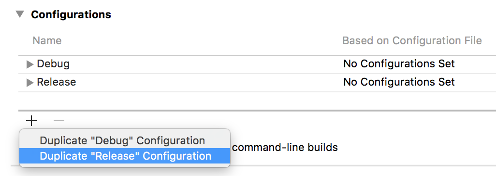

5. Name the new configuration **Staging** (or whatever you prefer)

6. Select the **Build Settings** tab

7. Go to **Build Location > Per-configuration Build Products Path > Staging** and change **Staging** value from `$(BUILD_DIR)/$(CONFIGURATION)$(EFFECTIVE_PLATFORM_NAME)` to `$(BUILD_DIR)/Release$(EFFECTIVE_PLATFORM_NAME)`

   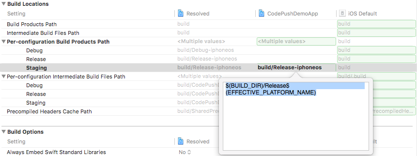

   > [!NOTE]
   > Due to https://github.com/facebook/react-native/issues/11813, we have to do this step to make it possible to use other configurations than Debug or Release on RN 0.40.0 or higher.

8. Click the **+** button on the toolbar and select **Add User-Defined Setting**

   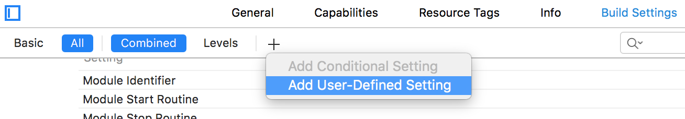

9. Name this new setting something like `CODEPUSH_KEY`, expand it, and specify your **Staging** deployment key for the **Staging** config and your **Production** deployment key for the **Release** config.

    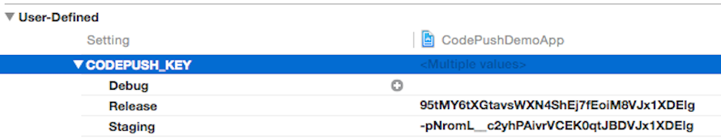

    *NOTE: As a reminder, you can retrieve these keys by running `appcenter codepush deployment list -a <ownerName>/<appName> --displayKeys` from your terminal.*

10. Open the project's **Info.plist** file and change the value of your `CodePushDeploymentKey` entry to `$(CODEPUSH_KEY)`

    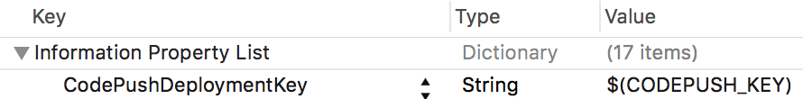

And that's it! Now when you run or build your app, your staging builds will automatically be configured to sync with your **Staging** deployment, and your release builds will be configured to sync with your **Production** deployment.

> [!NOTE]
> If you encounter the error message `ld: library not found for ...`, please consult [this issue](https://github.com/Microsoft/react-native-code-push/issues/426) for a possible solution.

Additionally, if you want to give them separate names and/or icons, you can modify the `Product Bundle Identifier`, `Product Name`, and `Asset Catalog App Icon Set Name` build settings, which will allow your staging builds to be distinguishable from release builds when installed on the same device.

## Dynamic Deployment Assignment

The above section illustrated how you can leverage multiple CodePush deployments in order to effectively test your updates before broadly releasing them to your end users. However, since that workflow statically embeds the deployment assignment into the actual binary, a staging or production build will only ever sync updates from that deployment. In many cases, this is sufficient, since you only want your team, customers, stakeholders, etc. to sync with your pre-production releases, and therefore, only they need a build that knows how to sync with staging. However, if you want to be able to perform A/B tests, or provide early access of your app to certain users, it can prove very useful to be able to dynamically place specific users (or audiences) into specific deployments at runtime.

In order to achieve this kind of workflow, all you need to do is specify the deployment key you want the current user to syncronize with when calling the `codePush` method. When specified, this key will override the "default" one that was provided in your app's **Info.plist** (iOS) or **MainActivity.java** (Android) files. This allows you to produce a build for staging or production, that is also capable of being dynamically "redirected" as needed.

```javascript
// Imagine that "userProfile" is a prop that this component received
// which includes the deployment key that the current user should use.
codePush.sync({ deploymentKey: userProfile.CODEPUSH_KEY });
```

With that change in place, now it's just a matter of choosing how your app determines the right deployment key for the current user. In practice, there are typically two solutions for this:

1. Expose a user-visible mechanism for changing deployments at any time. For example, your settings page could have a toggle for enabling "beta" access. This model works well if you're not concerned with the privacy of your pre-production updates, and you have power users that may want to opt-in to earlier (and potentially buggy) updates at their own will (kind of like Chrome channels). However, this solution puts the decision in the hands of your users, which doesn't help you perform A/B tests transparently.

2. Annotate the server-side profile of your users with an additional piece of metadata that indicates the deployment they should sync with. By default, your app could just use the binary-embedded key, but after a user has authenticated, your server can choose to "redirect" them to a different deployment, which allows you to incrementally place certain users or groups in different deployments as needed. You could even choose to store the server-response in local storage so that it becomes the new default. How you store the key alongside your user's profiles is entirely up to your authentication solution (for example Auth0, Firebase, custom DB + REST API), but is generally pretty trivial to do.

   > [!NOTE]
   > If needed, you could also implement a hybrid solution that allowed your end-users to toggle between different deployments, while also allowing your server to override that decision. This way, you have a hierarchy of "deployment resolution" that ensures your app has the ability to update itself out-of-the-box, your end users can feel rewarded by getting early access to bits, but you also have the ability to run A/B tests on your users as needed.

Since we recommend using the `Staging` deployment for pre-release testing of your updates (as explained in the previous section), it doesn't necessarily make sense to use it for performing A/B tests on your users, as opposed to allowing early-access (as explained in option #1 above). Therefore, we recommend making full use of custom app deployments, so that you can segment your users however makes sense for your needs. For example, you could create long-term or even one-off deployments, release a variant of your app to it, and then place certain users into it in order to see how they engage.

```javascript
// #1) Create your new deployment to hold releases of a specific app variant
appcenter codepush deployment add -a <ownerName>/<appName> test-variant-one

// #2) Target any new releases at that custom deployment
appcenter codepush release-react -a <ownerName>/<appName> -d test-variant-one
```
> [!NOTE]
> The total user count that is reported in your deployment's "Install Metrics" will take into account users that have "switched" from one deployment to another. For example, if your **Production** deployment currently reports having 1 total user, but you dynamically switch that user to **Staging**, then the **Production** deployment would report 0 total users, while **Staging** would report 1 (the user that just switched). This behavior allows you to accurately track your release adoption, even in the event of using a runtime-based deployment redirection solution.

---

## API Reference

The CodePush plugin is made up of two components:

1. A JavaScript module, which can be imported/required, and allows the app to interact with the service during runtime (for example check for updates, inspect the metadata about the currently running app update).

2. A native API (Objective-C and Java) which allows the React Native app host to bootstrap itself with the right JS bundle location.

The following sections describe the shape and behavior of these APIs in detail:

### JavaScript API Reference

When you require `react-native-code-push`, the module object provides the following top-level methods in addition to the root-level [component decorator](#codepush):

- [allowRestart](#codepushallowrestart): Re-allows programmatic restarts to occur as a result of an update being installed, and optionally, immediately restarts the app if a pending update had attempted to restart the app while restarts were disallowed. This is an advanced API and is only necessary if your app explicitly disallowed restarts via the `disallowRestart` method.

- [checkForUpdate](#codepushcheckforupdate): Asks the CodePush service whether the configured app deployment has an update available.

- [disallowRestart](#codepushdisallowrestart): Temporarily disallows any programmatic restarts to occur as a result of a CodePush update being installed. This is an advanced API, and is useful when a component within your app (for example an onboarding process) needs to ensure that no end-user interruptions can occur during its lifetime.

- [getCurrentPackage](#codepushgetcurrentpackage): Retrieves the metadata about the currently installed update (like description, installation time, size). *NOTE: As of `v1.10.3-beta` of the CodePush module, this method is deprecated in favor of [`getUpdateMetadata`](#codepushgetupdatemetadata)*.

- [getUpdateMetadata](#codepushgetupdatemetadata): Retrieves the metadata for an installed update (like description, mandatory).

- [notifyAppReady](#codepushnotifyappready): Notifies the CodePush runtime that an installed update is considered successful. If you are manually checking for and installing updates (i.e. not using the [sync](#codepushsync) method to handle it all for you), then this method **MUST** be called; otherwise CodePush will treat the update as failed and rollback to the previous version when the app next restarts.

- [restartApp](#codepushrestartapp): Immediately restarts the app. If there is an update pending, it will be immediately displayed to the end user. Otherwise, calling this method simply has the same behavior as the end user killing and restarting the process.

- [sync](#codepushsync): Allows checking for an update, downloading it and installing it, all with a single call. Unless you need custom UI and/or behavior, we recommend most developers to use this method when integrating CodePush into their apps

#### codePush

```javascript
// Wrapper function
codePush(rootComponent: React.Component): React.Component;
codePush(options: CodePushOptions)(rootComponent: React.Component): React.Component;
```

```javascript
// Decorator; Requires ES7 support
@codePush
@codePush(options: CodePushOptions)
```

Used to wrap a React component inside a "higher order" React component that knows how to synchronize your app's JavaScript bundle and image assets when it is mounted. Internally, the higher-order component calls [`sync`](#codepushsync) inside its `componentDidMount` lifecycle handle, which in turns performs an update check, downloads the update if it exists and installs the update for you.

This decorator provides support for letting you customize its behavior to easily enable apps with different requirements. Below are some examples of ways you can use it (you can pick one or even use a combination):

1. **Silent sync on app start** *(the simplest, default behavior)*. Your app will automatically download available updates, and apply them the next time the app restarts (like the OS or end user killed it, or the device was restarted). This way, the entire update experience is "silent" to the end user, since they don't see any update prompt and/or "synthetic" app restarts.

    ```javascript
    // Fully silent update which keeps the app in
    // sync with the server, without ever
    // interrupting the end user
    class MyApp extends Component {}
    MyApp = codePush(MyApp);
    ```

2. **Silent sync every time the app resumes**. Same as 1, except we check for updates, or apply an update if one exists every time the app returns to the foreground after being "backgrounded".

    ```javascript
    // Sync for updates every time the app resumes.
    class MyApp extends Component {}
    MyApp = codePush({ checkFrequency: codePush.CheckFrequency.ON_APP_RESUME, installMode: codePush.InstallMode.ON_NEXT_RESUME })(MyApp);
    ```

3. **Interactive**. When an update is available, prompt the end user for permission before downloading it, and then immediately apply the update. If an update was released using the `mandatory` flag, the end user would still be notified about the update, but they wouldn't have the choice to ignore it.

    ```javascript
    // Active update, which lets the end user know
    // about each update, and displays it to them
    // immediately after downloading it
    class MyApp extends Component {}
    MyApp = codePush({ updateDialog: true, installMode: codePush.InstallMode.IMMEDIATE })(MyApp);
    ```

4. **Log/display progress**. While the app is syncing with the server for updates, make use of the `codePushStatusDidChange` and/or `codePushDownloadDidProgress` event hooks to log down the different stages of this process, or even display a progress bar to the user.

    ```javascript
    // Make use of the event hooks to keep track of
    // the different stages of the sync process.
    class MyApp extends Component {
        codePushStatusDidChange(status) {
            switch(status) {
                case codePush.SyncStatus.CHECKING_FOR_UPDATE:
                    console.log("Checking for updates.");
                    break;
                case codePush.SyncStatus.DOWNLOADING_PACKAGE:
                    console.log("Downloading package.");
                    break;
                case codePush.SyncStatus.INSTALLING_UPDATE:
                    console.log("Installing update.");
                    break;
                case codePush.SyncStatus.UP_TO_DATE:
                    console.log("Up-to-date.");
                    break;
                case codePush.SyncStatus.UPDATE_INSTALLED:
                    console.log("Update installed.");
                    break;
            }
        }

        codePushDownloadDidProgress(progress) {
            console.log(progress.receivedBytes + " of " + progress.totalBytes + " received.");
        }
    }
    MyApp = codePush(MyApp);
    ```

##### CodePushOptions

The `codePush` decorator accepts an "options" object that allows you to customize numerous aspects of the default behavior mentioned above:

- **checkFrequency** *(codePush.CheckFrequency)* - Specifies when you would like to check for updates. Defaults to `codePush.CheckFrequency.ON_APP_START`. Refer to the [`CheckFrequency`](#checkfrequency) enum reference for a description of the available options and what they do.

- **deploymentKey** *(String)* - Specifies the deployment key you want to query for an update against. By default, this value is derived from the **Info.plist** file (iOS) and **MainActivity.java** file (Android), but this option allows you to override it from the script-side if you need to dynamically use a different deployment.

- **installMode** *(codePush.InstallMode)* - Specifies when you would like to install optional updates (i.e. those that aren't marked as mandatory). Defaults to `codePush.InstallMode.ON_NEXT_RESTART`. Refer to the [`InstallMode`](#installmode) enum reference for a description of the available options and what they do.

- **mandatoryInstallMode** *(codePush.InstallMode)* - Specifies when you would like to install updates which are marked as mandatory. Defaults to `codePush.InstallMode.IMMEDIATE`. Refer to the [`InstallMode`](#installmode) enum reference for a description of the available options and what they do.

- **minimumBackgroundDuration** *(Number)* - Specifies the minimum number of seconds that the app needs to have been in the background before restarting the app. This property only applies to updates which are installed using `InstallMode.ON_NEXT_RESUME` or `InstallMode.ON_NEXT_SUSPEND`, and can be useful for getting your update in front of end users sooner, without being too obtrusive. Defaults to `0`, which has the effect of applying the update immediately after a resume or unless the app suspension is long enough to not matter, regardless how long it was in the background.

- **updateDialog** *(UpdateDialogOptions)* - An "options" object used to determine whether a confirmation dialog should be displayed to the end user when an update is available, and if so, what strings to use. Defaults to `null`, which has the effect of disabling the dialog completely. Setting this to any truthy value will enable the dialog with the default strings, and passing an object to this parameter allows enabling the dialog as well as overriding one or more of the default strings. Before enabling this option within an App Store-distributed app, please refer to [this note](https://github.com/Microsoft/react-native-code-push#user-content-apple-note).

    The following list represents the available options and their defaults:

  - **appendReleaseDescription** *(Boolean)* - Indicates whether you would like to append the description of an available release to the notification message which is displayed to the end user. Defaults to `false`.

  - **descriptionPrefix** *(String)* - Indicates the string you would like to prefix the release description with, if any, when displaying the update notification to the end user. Defaults to `" Description: "`

  - **mandatoryContinueButtonLabel** *(String)* - The text to use for the button the end user must press in order to install a mandatory update. Defaults to `"Continue"`.

  - **mandatoryUpdateMessage** *(String)* - The text used as the body of an update notification, when the update is specified as mandatory. Defaults to `"An update is available that must be installed."`.

  - **optionalIgnoreButtonLabel** *(String)* - The text to use for the button the end user can press in order to ignore an optional update that is available. Defaults to `"Ignore"`.

  - **optionalInstallButtonLabel** *(String)* - The text to use for the button the end user can press in order to install an optional update. Defaults to `"Install"`.

  - **optionalUpdateMessage** *(String)* - The text used as the body of an update notification, when the update is optional. Defaults to `"An update is available. Would you like to install it?"`.

  - **title** *(String)* - The text used as the header of an update notification that is displayed to the end user. Defaults to `"Update available"`.

##### codePushStatusDidChange (event hook)

Called when the sync process moves from one stage to another in the overall update process. The event hook is called with a status code which represents the current state, and can be any of the [`SyncStatus`](#syncstatus) values.

##### codePushDownloadDidProgress (event hook)

Called periodically when an available update is being downloaded from the CodePush server. The method is called with a `DownloadProgress` object, which contains the following two properties:

- **totalBytes** *(Number)* - The total number of bytes expected to be received for this update (i.e. the size of the set of files which changed from the previous release).

- **receivedBytes** *(Number)* - The number of bytes downloaded thus far, which can be used to track download progress.

#### codePush.allowRestart

```javascript
codePush.allowRestart(): void;
```

Re-allows programmatic restarts to occur, that would have otherwise been rejected due to a previous call to `disallowRestart`. If `disallowRestart` was never called in the first place, then calling this method will simply result in a no-op.

If a CodePush update is currently pending, which attempted to restart the app (for example it used `InstallMode.IMMEDIATE`), but was blocked due to `disallowRestart` having been called, then calling `allowRestart` will result in an immediate restart. This allows the update to be applied as soon as possible, without interrupting the end user during critical workflows (for example an onboarding process).

For example, calling `allowRestart` would trigger an immediate restart if either of the three scenarios mentioned in the [`disallowRestart` docs](#codepushdisallowrestart) occurred after `disallowRestart` was called. However, calling `allowRestart` wouldn't trigger a restart if the following were true:

1. No CodePush updates were installed since the last time `disallowRestart` was called, and therefore, there isn't any need to restart anyways.

2. There is currently a pending CodePush update, but it was installed via `InstallMode.ON_NEXT_RESTART`, and therefore, doesn't require a programmatic restart.

3. There is currently a pending CodePush update, but it was installed via `InstallMode.ON_NEXT_RESUME` and the app hasn't been put into the background yet, and therefore, there isn't a need to programmatically restart yet.

4. No calls to `restartApp` were made since the last time `disallowRestart` was called.

This behavior ensures that no restarts will be triggered as a result of calling `allowRestart` unless one was explicitly requested during the disallowed period. In this way, `allowRestart` is somewhat similar to calling `restartApp(true)`, except the former will only trigger a restart if the currently pending update wanted to restart, whereas the later would restart as long as an update is pending.

See [disallowRestart](#codepushdisallowrestart) for an example of how this method can be used.

#### codePush.checkForUpdate

```javascript
codePush.checkForUpdate(deploymentKey: String = null, handleBinaryVersionMismatchCallback: (update: RemotePackage) => void): Promise<RemotePackage>;
```

Queries the CodePush service to see whether the configured app deployment has an update available. By default, it will use the deployment key that is configured in your **Info.plist** file (iOS), or **MainActivity.java** file (Android), but you can override that by specifying a value via the optional `deploymentKey` parameter. This can be useful when you want to dynamically "redirect" a user to a specific deployment, such as allowing "early access" via an easter egg or a user setting switch.

Second optional parameter `handleBinaryVersionMismatchCallback` is an optional callback function that can be used to notify user if there are any binary update.
For example consider a use-case where currently installed binary version is 1.0.1 with label(codepush label) v1. Later native code was changed in the dev cycle and binary version was updated to 1.0.2. When code-push update check is triggered we ignore updates having binary version mismatch (because the update is not targeting to the binary version of currently installed app). In this case installed app (1.0.1) will ignore the update targeting version 1.0.2. You can use `handleBinaryVersionMismatchCallback` to provide a hook to handle such situations.

> [!IMPORTANT]
> Be cautious to use Alerts within this callback if you are developing iOS application, due to [App Store](https://developer.apple.com/app-store/review/guidelines/) review process: Apps must not force users to rate the app, review the app, download other apps, or other similar actions in order to access functionality, content, or use of the app.

This method returns a `Promise` which resolves to one of two possible values:

1. `null` if there is no update available. This can occur in the following scenarios:

   1. The configured deployment doesn't contain any releases, and therefore, nothing to update.
   2. The latest release within the configured deployment is targeting a different binary version than what you're currently running (either older or newer).
   3. The currently running app already has the latest release from the configured deployment, and therefore, doesn't need it again.
   4. The latest release within the configured deployment is currently marked as disabled, and therefore, isn't allowed to be downloaded.
   5. The latest release within the configured deployment is in an "active rollout" state, and the requesting device doesn't fall within the percentage of users who are eligible for it.

2. A [`RemotePackage`](#remotepackage) instance which represents an available update that can be inspected and/or subsequently downloaded.

Example Usage:

```javascript
codePush.checkForUpdate()
.then((update) => {
    if (!update) {
        console.log("The app is up to date!");
    } else {
        console.log("An update is available! Should we download it?");
    }
});
```

#### codePush.disallowRestart

```javascript
codePush.disallowRestart(): void;
```

Temporarily disallows programmatic restarts to occur as a result of either of following scenarios:

1. A CodePush update is installed using `InstallMode.IMMEDIATE`
2. A CodePush update is installed using `InstallMode.ON_NEXT_RESUME` and the app is resumed from the background (optionally being throttled by the `minimumBackgroundDuration` property)
3. The `restartApp` method was called

   > [!NOTE]
   > Steps 1 and 2 effectively work by calling `restartApp` for you, so you can think of `disallowRestart` as blocking any call to `restartApp`, regardless if your app calls it directly or indirectly.

After calling this method, any calls to `sync` would still be allowed to check for an update, download it and install it, but an attempt to restart the app would be queued until `allowRestart` is called. This way, the restart request is captured and can be "flushed" whenever you want to allow it to occur.

This is an advanced API, and is primarily useful when individual components within your app (like an onboarding process) need to ensure that no end-user interruptions can occur during their lifetime, while continuing to allow the app to keep syncing with the CodePush server at its own pace and using whatever install modes are appropriate. This has the benefit of allowing the app to discover and download available updates as soon as possible, while also preventing any disruptions during key end-user experiences.

As an alternative, you could also choose to simply use `InstallMode.ON_NEXT_RESTART` whenever calling `sync` (which will never attempt to programmatically restart the app), and then explicitly calling `restartApp` at points in your app that you know it is "safe" to do so. `disallowRestart` provides an alternative approach to this when the code that synchronizes with the CodePush server is separate from the code/components that want to enforce a no-restart policy.

Example Usage:

```javascript
class OnboardingProcess extends Component {
    ...

    componentWillMount() {
        // Ensure that any CodePush updates which are
        // synchronized in the background can't trigger
        // a restart while this component is mounted.
        codePush.disallowRestart();
    }

    componentWillUnmount() {
        // Reallow restarts, and optionally trigger
        // a restart if one was currently pending.
        codePush.allowRestart();
    }

    ...
}
```

#### codePush.getCurrentPackage

> [!NOTE]
> This method is considered deprecated as of `v1.10.3-beta` of the CodePush module. If you're running this version (or newer), we would recommend using the [`codePush.getUpdateMetadata`](#codepushgetupdatemetadata) instead, since it has more predictable behavior.

```javascript
codePush.getCurrentPackage(): Promise<LocalPackage>;
```

Retrieves the metadata about the currently installed "package" (like description, installation time). This can be useful for scenarios such as displaying a "what's new?" dialog after an update has been applied or checking whether there is a pending update that is waiting to be applied via a resume or restart.

This method returns a `Promise` which resolves to one of two possible values:

1. `null` if the app is currently running the JS bundle from the binary and not a CodePush update. This occurs in the following scenarios:

   1. The end-user installed the app binary and has yet to install a CodePush update
   2. The end-user installed an update of the binary (for example from the store), which cleared away the old CodePush updates, and gave precedence back to the JS binary in the binary.

2. A [`LocalPackage`](#localpackage) instance which represents the metadata for the currently running CodePush update.

Example Usage:

```javascript
codePush.getCurrentPackage()
.then((update) => {
    // If the current app "session" represents the first time
    // this update has run, and it had a description provided
    // with it upon release, let's show it to the end user
    if (update.isFirstRun && update.description) {
        // Display a "what's new?" modal
    }
});
```

#### codePush.getUpdateMetadata

```javascript
codePush.getUpdateMetadata(updateState: UpdateState = UpdateState.RUNNING): Promise<LocalPackage>;
```

Retrieves the metadata for an installed update (like description, mandatory) whose state matches the specified `updateState` parameter. This can be useful for scenarios such as displaying a "what's new?" dialog after an update has been applied or checking whether there is a pending update that is waiting to be applied via a resume or restart. For more details about the possible update states, and what they represent, refer to the [UpdateState reference](#updatestate).

This method returns a `Promise` which resolves to one of two possible values:

1. `null` if an update with the specified state doesn't currently exist. This occurs in the following scenarios:

   1. The end-user hasn't installed any CodePush updates yet, and therefore, no metadata is available for any updates, regardless what you specify as the `updateState` parameter.

   2. The end-user installed an update of the binary (for example from the store), which cleared away the old CodePush updates, and gave precedence back to the JS binary in the binary. Therefore, it would exhibit the same behavior as #1

   3. The `updateState` parameter is set to `UpdateState.RUNNING`, but the app isn't currently running a CodePush update. There may be a pending update, but the app hasn't been restarted yet in order to make it active.

   4. The `updateState` parameter is set to `UpdateState.PENDING`, but the app doesn't have any currently pending updates.

2. A [`LocalPackage`](#localpackage) instance which represents the metadata for the currently requested CodePush update (either the running or pending).

Example Usage:

```javascript
// Check if there is currently a CodePush update running, and if
// so, register it with the HockeyApp SDK (https://github.com/slowpath/react-native-hockeyapp)
// so that crash reports will correctly display the JS bundle version the user was running.
codePush.getUpdateMetadata().then((update) => {
    if (update) {
        hockeyApp.addMetadata({ CodePushRelease: update.label });
    }
});

// Check to see if there is still an update pending.
codePush.getUpdateMetadata(UpdateState.PENDING).then((update) => {
    if (update) {
        // There's a pending update, do we want to force a restart?
    }
});
```

#### codePush.notifyAppReady

```javascript
codePush.notifyAppReady(): Promise<void>;
```

Notifies the CodePush runtime that a freshly installed update should be considered successful, and therefore, an automatic client-side rollback isn't necessary. It is mandatory to call this function somewhere in the code of the updated bundle. Otherwise, when the app next restarts, the CodePush runtime will assume that the installed update has failed and roll back to the previous version. This behavior exists to help ensure that your end users aren't blocked by a broken update.

If you are using the `sync` function, and doing your update check on app start, then you don't need to manually call `notifyAppReady` since `sync` will call it for you. This behavior exists due to the assumption that the point at which `sync` is called in your app represents a good approximation of a successful startup.

> [!NOTE]
> This method is also aliased as `notifyApplicationReady` (for backwards compatibility).*

#### codePush.restartApp

```javascript
codePush.restartApp(onlyIfUpdateIsPending: Boolean = false): void;
```

Immediately restarts the app. If a truthy value is provided to the `onlyIfUpdateIsPending` parameter, then the app will only restart if there is actually a pending update waiting to be applied.

This method is for advanced scenarios, and is primarily useful when the following conditions are true:

1. Your app is specifying an install mode value of `ON_NEXT_RESTART` or `ON_NEXT_RESUME` when calling the `sync` or `LocalPackage.install` methods. This has the effect of not applying your update until the app has been restarted (by either the end user or OS) or resumed, and therefore, the update won't be immediately displayed to the end user.

2. You have an app-specific user event (like the end user navigated back to the app's home route) that allows you to apply the update in an unobtrusive way, and potentially gets the update in front of the end user sooner then waiting until the next restart or resume.

#### codePush.sync

```javascript
codePush.sync(options: Object, syncStatusChangeCallback: function(syncStatus: Number), downloadProgressCallback: function(progress: DownloadProgress), handleBinaryVersionMismatchCallback: function(update: RemotePackage)): Promise<Number>;
```

Synchronizes your app's JavaScript bundle and image assets with the latest release to the configured deployment. Unlike the [checkForUpdate](#codepushcheckforupdate) method, which simply checks for the presence of an update, and let's you control what to do next, `sync` handles the update check, download and installation experience for you.

This method provides support for two different (but customizable) "modes" to easily enable apps with different requirements:

1. **Silent mode** *(the default behavior)*, which automatically downloads available updates, and applies them the next time the app restarts (for example the OS or end user killed it, or the device was restarted). This way, the entire update experience is "silent" to the end user, since they don't see any update prompt and/or "synthetic" app restarts.

2. **Active mode**, which when an update is available, prompts the end user for permission before downloading it, and then immediately applies the update. If an update was released using the `mandatory` flag, the end user would still be notified about the update, but they wouldn't have the choice to ignore it.

Example Usage:

```javascript
// Fully silent update which keeps the app in
// sync with the server, without ever
// interrupting the end user
codePush.sync();

// Active update, which lets the end user know
// about each update, and displays it to them
// immediately after downloading it
codePush.sync({ updateDialog: true, installMode: codePush.InstallMode.IMMEDIATE });
```

> [!TIP]
> If you want to decide whether you check and/or download an available update based on the end user's device battery level, network conditions, etc. then simply wrap the call to `sync` in a condition that ensures you only call it when desired.*

##### SyncOptions

While the `sync` method tries to make it easy to perform silent and active updates with little configuration, it accepts an "options" object that allows you to customize numerous aspects of the default behavior mentioned above. The options available are identical to the [CodePushOptions](#codepushoptions), with the exception of the `checkFrequency` option:

- **deploymentKey** *(String)* - Refer to [`CodePushOptions`](#codepushoptions).

- **installMode** *(codePush.InstallMode)* - Refer to [`CodePushOptions`](#codepushoptions).

- **mandatoryInstallMode** *(codePush.InstallMode)* - Refer to [`CodePushOptions`](#codepushoptions).

- **minimumBackgroundDuration** *(Number)* - Refer to [`CodePushOptions`](#codepushoptions).

- **updateDialog** *(UpdateDialogOptions)* - Refer to [`CodePushOptions`](#codepushoptions).

Example Usage:

```javascript
// Use a different deployment key for this
// specific call, instead of the one configured
// in the Info.plist file
codePush.sync({ deploymentKey: "KEY" });

// Download the update silently, but install it on
// the next resume, as long as at least 5 minutes
// has passed since the app was put into the background.
codePush.sync({ installMode: codePush.InstallMode.ON_NEXT_RESUME, minimumBackgroundDuration: 60 * 5 });

// Download the update silently, and install optional updates
// on the next restart, but install mandatory updates on the next resume.
codePush.sync({ mandatoryInstallMode: codePush.InstallMode.ON_NEXT_RESUME });

// Changing the title displayed in the
// confirmation dialog of an "active" update
codePush.sync({ updateDialog: { title: "An update is available!" } });

// Displaying an update prompt which includes the
// description associated with the CodePush release
codePush.sync({
   updateDialog: {
    appendReleaseDescription: true,
    descriptionPrefix: "\n\nChange log:\n"
   },
   installMode: codePush.InstallMode.IMMEDIATE
});
```

In addition to the options, the `sync` method also accepts several optional function parameters which allow you to subscribe to the lifecycle of the `sync` "pipeline" in order to display additional UI as needed (like a "checking for update modal or a download progress modal):

- **syncStatusChangedCallback** *((syncStatus: Number) => void)* - Called when the sync process moves from one stage to another in the overall update process. The method is called with a status code which represents the current state, and can be any of the [`SyncStatus`](#syncstatus) values.

- **downloadProgressCallback** *((progress: DownloadProgress) => void)* - Called periodically when an available update is being downloaded from the CodePush server. The method is called with a `DownloadProgress` object, which contains the following two properties:

  - **totalBytes** *(Number)* - The total number of bytes expected to be received for this update (i.e. the size of the set of files which changed from the previous release).

  - **receivedBytes** *(Number)* - The number of bytes downloaded thus far, which can be used to track download progress.

- **handleBinaryVersionMismatchCallback** *((update: RemotePackage) => void)* -
  Called when there are any binary update available. The method is called with a [`RemotePackage`](#remotepackage) object. Refer to [codePush.checkForUpdate](#codepushcheckforupdate) section for more details.

Example Usage:

```javascript
// Prompt the user when an update is available
// and then display a "downloading" modal
codePush.sync({ updateDialog: true },
  (status) => {
      switch (status) {
          case codePush.SyncStatus.DOWNLOADING_PACKAGE:
              // Show "downloading" modal
              break;
          case codePush.SyncStatus.INSTALLING_UPDATE:
              // Hide "downloading" modal
              break;
      }
  },
  ({ receivedBytes, totalBytes, }) => {
    /* Update download modal progress */
  }
);
```

This method returns a `Promise` which is resolved to a `SyncStatus` code that indicates why the `sync` call succeeded. This code can be one of the following `SyncStatus` values:

- **codePush.SyncStatus.UP_TO_DATE** *(4)* - The app is up-to-date with the CodePush server.

- **codePush.SyncStatus.UPDATE_IGNORED** *(5)* - The app had an optional update which the end user chose to ignore. (This is only applicable when the `updateDialog` is used)

- **codePush.SyncStatus.UPDATE_INSTALLED** *(6)* - The update has been installed and will be run either immediately after the `syncStatusChangedCallback` function returns or the next time the app resumes/restarts, depending on the `InstallMode` specified in `SyncOptions`.

- **codePush.SyncStatus.SYNC_IN_PROGRESS** *(7)* - There is an ongoing `sync` operation running which prevents the current call from being executed.

The `sync` method can be called anywhere you'd like to check for an update. That could be in the `componentWillMount` lifecycle event of your root component, the onPress handler of a `<TouchableHighlight>` component, in the callback of a periodic timer, or whatever else makes sense for your needs. Just like the `checkForUpdate` method, it will perform the network request to check for an update in the background, so it won't impact your UI thread and/or JavaScript thread's responsiveness.

#### Package objects

The `checkForUpdate` and `getUpdateMetadata` methods return `Promise` objects, that when resolved, provide acces to "package" objects. The package represents your code update as well as any extra metadata (like description, mandatory?). The CodePush API has the distinction between the following types of packages:

- [LocalPackage](#localpackage): Represents a downloaded update that is either already running, or has been installed and is pending an app restart.

- [RemotePackage](#remotepackage): Represents an available update on the CodePush server that hasn't been downloaded yet.

##### LocalPackage

Contains details about an update that has been downloaded locally or already installed. You can get a reference to an instance of this object either by calling the module-level `getUpdateMetadata` method, or as the value of the promise returned by the `RemotePackage.download` method.

###### Properties

- **appVersion**: The app binary version that this update is dependent on. This is the value that was specified via the `appStoreVersion` parameter when calling the CLI's `release` command. *(String)*
- **deploymentKey**: The deployment key that was used to originally download this update. *(String)*
- **description**: The description of the update. This is the same value that you specified in the CLI when you released the update. *(String)*
- **failedInstall**: Indicates whether this update has been previously installed but was rolled back. The `sync` method will automatically ignore updates which have previously failed, so you only need to worry about this property if using `checkForUpdate`. *(Boolean)*
- **isFirstRun**: Indicates whether this is the first time the update has been run after being installed. This is useful for determining whether you would like to show a "What's New?" UI to the end user after installing an update. *(Boolean)*
- **isMandatory**: Indicates whether the update is considered mandatory.  This is the value that was specified in the CLI when the update was released. *(Boolean)*
- **isPending**: Indicates whether this update is in a "pending" state. When `true`, that means the update has been downloaded and installed, but the app restart needed to apply it hasn't occurred yet, and therefore, it's changes aren't currently visible to the end-user. *(Boolean)*
- **label**: The internal label automatically given to the update by the CodePush server, such as `v5`. This value uniquely identifies the update within it's deployment. *(String)*
- **packageHash**: The SHA hash value of the update. *(String)*
- **packageSize**: The size of the code contained within the update, in bytes. *(Number)*

###### Methods

- **install(installMode: codePush.InstallMode = codePush.InstallMode.ON_NEXT_RESTART, minimumBackgroundDuration = 0): Promise&lt;void&gt;**: Installs the update by saving it to the location on disk where the runtime expects to find the latest version of the app. The `installMode` parameter controls when the changes are actually presented to the end user. The default value is to wait until the next app restart to display the changes, but you can refer to the [`InstallMode`](#installmode) enum reference for a description of the available options and what they do. If the `installMode` parameter is set to `InstallMode.ON_NEXT_RESUME`, then the `minimumBackgroundDuration` parameter allows you to control how long the app must have been in the background before forcing the install after it is resumed.

##### RemotePackage

Contains details about an update that is available for download from the CodePush server. You get a reference to an instance of this object by calling the `checkForUpdate` method when an update is available. If you are using the `sync` API, you don't need to worry about the `RemotePackage`, since it will handle the download and installation process automatically for you.

###### Properties

The `RemotePackage` inherits all of the same properties as the `LocalPackage`, but includes one additional one:

- **downloadUrl**: The URL at which the package is available for download. This property is only needed for advanced usage, since the `download` method will automatically handle the acquisition of updates for you. *(String)*

###### Methods

- **download(downloadProgressCallback?: Function): Promise&lt;LocalPackage&gt;**: Downloads the available update from the CodePush service. If a `downloadProgressCallback` is specified, it will be called periodically with a `DownloadProgress` object (`{ totalBytes: Number, receivedBytes: Number }`) that reports the progress of the download until it completes. Returns a Promise that resolves with the `LocalPackage`.

#### Enums

The CodePush API includes the following enums which can be used to customize the update experience:

##### InstallMode

This enum specifies when you would like an installed update to actually be applied, and can be passed to either the `sync` or `LocalPackage.install` methods. It includes the following values:

- **codePush.InstallMode.IMMEDIATE** *(0)* - Indicates that you want to install the update and restart the app immediately. This value is appropriate for debugging scenarios as well as when displaying an update prompt to the user, since they would expect to see the changes immediately after accepting the installation. Additionally, this mode can be used to enforce mandatory updates, since it removes the potentially undesired latency between the update installation and the next time the end user restarts or resumes the app.

- **codePush.InstallMode.ON_NEXT_RESTART** *(1)* - Indicates that you want to install the update, but not forcibly restart the app. When the app is "naturally" restarted (due the OS or end user killing it), the update will be seamlessly picked up. This value is appropriate when performing silent updates, since it would likely be disruptive to the end user if the app suddenly restarted out of nowhere, since they wouldn't have realized an update was even downloaded. This is the default mode used for both the `sync` and `LocalPackage.install` methods.

- **codePush.InstallMode.ON_NEXT_RESUME** *(2)* - Indicates that you want to install the update, but don't want to restart the app until the next time the end user resumes it from the background. This way, you don't disrupt their current session, but you can get the update in front of them sooner then having to wait for the next natural restart. This value is appropriate for silent installs that can be applied on resume in a non-invasive way.

- **codePush.InstallMode.ON_NEXT_SUSPEND** *(3)* - Indicates that you want to install the update *while* it is in the background, but only after it has been in the background for `minimumBackgroundDuration` seconds (0 by default), so that user context isn't lost unless the app suspension is long enough to not matter.

##### CheckFrequency

This enum specifies when you would like your app to sync with the server for updates, and can be passed to the `codePushify` decorator. It includes the following values:

- **codePush.CheckFrequency.ON_APP_START** *(0)* - Indicates that you want to check for updates whenever the app's process is started.

- **codePush.CheckFrequency.ON_APP_RESUME** *(1)* - Indicates that you want to check for updates whenever the app is brought back to the foreground after being "backgrounded" (user pressed the home button, app launches a separate payment process, etc).

- **codePush.CheckFrequency.MANUAL** *(2)* - Disable automatic checking for updates, but only check when [`codePush.sync()`](#codepushsync) is called in app code.

##### SyncStatus

This enum is provided to the `syncStatusChangedCallback` function that can be passed to the `sync` method, in order to hook into the overall update process. It includes the following values:

- **codePush.SyncStatus.CHECKING_FOR_UPDATE** *(0)* - The CodePush server is being queried for an update.
- **codePush.SyncStatus.AWAITING_USER_ACTION** *(1)* - An update is available, and a confirmation dialog was shown to the end user. (This is only applicable when the `updateDialog` is used)
- **codePush.SyncStatus.DOWNLOADING_PACKAGE** *(2)* - An available update is being downloaded from the CodePush server.
- **codePush.SyncStatus.INSTALLING_UPDATE** *(3)* - An available update was downloaded and is about to be installed.
- **codePush.SyncStatus.UP_TO_DATE** *(4)* - The app is fully up-to-date with the configured deployment.
- **codePush.SyncStatus.UPDATE_IGNORED** *(5)* - The app has an optional update, which the end user chose to ignore. (This is only applicable when the `updateDialog` is used)
- **codePush.SyncStatus.UPDATE_INSTALLED** *(6)* - An available update has been installed and will be run either immediately after the `syncStatusChangedCallback` function returns or the next time the app resumes/restarts, depending on the `InstallMode` specified in `SyncOptions`.
- **codePush.SyncStatus.SYNC_IN_PROGRESS** *(7)* - There is an ongoing `sync` operation running which prevents the current call from being executed.
- **codePush.SyncStatus.UNKNOWN_ERROR** *(-1)* - The sync operation encountered an unknown error.

##### UpdateState

This enum specifies the state that an update is currently in, and can be specified when calling the `getUpdateMetadata` method. It includes the following values:

- **codePush.UpdateState.RUNNING** *(0)* - Indicates that an update represents the version of the app that is currently running. This can be useful for identifying attributes about the app, for scenarios such as displaying the release description in a "what's new?" dialog or reporting the latest version to an analytics and/or crash reporting service.

- **codePush.UpdateState.PENDING** *(1)* - Indicates than an update has been installed, but the app hasn't been restarted yet in order to apply it. This can be useful for determining whether there is a pending update, which you may want to force a programmatic restart (via `restartApp`) in order to apply.

- **codePush.UpdateState.LATEST** *(2)* - Indicates than an update represents the latest available release, and can be either currently running or pending.

### Objective-C API Reference (iOS)

The Objective-C API is made available by importing the `CodePush.h` header into your **AppDelegate.m** file, and consists of a single public class named `CodePush`.

#### CodePush

Contains static methods for retreiving the `NSURL` that represents the most recent JavaScript bundle file, and can be passed to the `RCTRootView`'s `initWithBundleURL` method when bootstrapping your app in the **AppDelegate.m** file.

The `CodePush` class' methods can be thought of as composite resolvers which always load the appropriate bundle, in order to accommodate the following scenarios:

1. When an end-user installs your app from the store (like `1.0.0`), they will get the JS bundle that is contained within the binary. This is the behavior you would get without using CodePush, but we make sure it doesn't break :)

2. As soon as you begin releasing CodePush updates, your end-users will get the JS bundle that represents the latest release for the configured deployment. This is the behavior that allows you to iterate beyond what you shipped to the store.

3. As soon as you release an update to the app store (like `1.1.0`), and your end-users update it, they will once again get the JS bundle that is contained within the binary. This behavior ensures that CodePush updates that targeted a previous binary version aren't used (since we don't know it they would work), and your end-users always have a working version of your app.

4. Repeat #2 and #3 as the CodePush releases and app store releases continue on into infinity (and beyond?)

Because of this behavior, you can safely deploy updates to both the app store(s) and CodePush as necesary, and rest assured that your end-users will always get the most recent version.

##### Methods

- **(NSURL \*)bundleURL** - Returns the most recent JS bundle `NSURL` as described above. This method assumes that the name of the JS bundle contained within your app binary is `main.jsbundle`.

- **(NSURL \*)bundleURLForResource:(NSString \*)resourceName** - Equivalent to the `bundleURL` method, but also allows customizing the name of the JS bundle that is looked for within the app binary. This is useful if you aren't naming this file `main` (which is the default convention). This method assumes that the JS bundle's extension is `*.jsbundle`.

- **(NSURL \*)bundleURLForResource:(NSString \*)resourceName withExtension:(NSString \*)resourceExtension**: Equivalent to the `bundleURLForResource:` method, but also allows customizing the extension used by the JS bundle that is looked for within the app binary. This is useful if you aren't naming this file `*.jsbundle` (which is the default convention).

- **(void)overrideAppVersion:(NSString \*)appVersionOverride** - Sets the version of the application's binary interface, which would otherwise default to the App Store version specified as the `CFBundleShortVersionString` in the **Info.plist**. This should be called a single time, before the bundle URL is loaded.

- **(void)setDeploymentKey:(NSString \*)deploymentKey** - Sets the deployment key that the app should use when querying for updates. This is a dynamic alternative to setting the deployment key in your **Info.plist** and/or specifying a deployment key in JS when calling `checkForUpdate` or `sync`.

### Java API Reference (Android)

The Java API is made available by importing the `com.microsoft.codepush.react.CodePush` class into your **MainActivity.java** file, and consists of a single public class named `CodePush`.

#### CodePush

Constructs the CodePush client runtime and represents the `ReactPackage` instance that you add to you app's list of packages.

##### Constructors

- **CodePush(String deploymentKey, Activity mainActivity)** - Creates a new instance of the CodePush runtime, that will be used to query the service for updates via the provided deployment key. The `mainActivity` parameter should always be set to `this` when configuring your React packages list inside the `MainActivity` class. This constructor puts the CodePush runtime into "release mode", so if you want to enable debugging behavior, use the following constructor instead.

- **CodePush(String deploymentKey, Activity mainActivity, bool isDebugMode)** - Equivalent to the previous constructor, but allows you to specify whether you want the CodePush runtime to be in debug mode or not. When using this constructor, the `isDebugMode` parameter should always be set to `BuildConfig.DEBUG` in order to stay synchronized with your build type. When putting CodePush into debug mode, the following behaviors are enabled:

  1. Old CodePush updates aren't deleted from storage whenever a new binary is deployed to the emulator/device. This behavior enables you to deploy new binaries, without bumping the version during development, and without continuously getting the same update every time your app calls `sync`.

  2. The local cache that the React Native runtime maintains in debug mode is deleted whenever a CodePush update is installed. This ensures that when the app is restarted after an update is applied, you will see the expected changes. As soon as [this PR](https://github.com/facebook/react-native/pull/4738) is merged, we won't need to do this anymore.

##### Static Methods

- **getBundleUrl()** - Returns the path to the most recent version of your app's JS bundle file, assuming that the resource name is `index.android.bundle`. If your app is using a different bundle name, then use the overloaded version of this method which allows specifying it. This method has the same resolution behavior as the Objective-C equivalent described above.

- **getBundleUrl(String bundleName)** - Returns the path to the most recent version of your app's JS bundle file, using the specified resource name (like `index.android.bundle`). This method has the same resolution behavior as the Objective-C equivalent described above.

- **overrideAppVersion(String appVersionOverride)** - Sets the version of the application's binary interface, which would otherwise default to the Play Store version specified as the `versionName` in the **build.gradle**. This should be called a single time, before the CodePush instance is constructed.

## Example Apps / Starters

The React Native community has graciously created some awesome open source apps that can serve as examples for developers that are getting started. The following is a list of OSS React Native apps that are also using CodePush, and can therefore be used to see how others are using the service:

- [F8 App](https://github.com/fbsamples/f8app) - The official conference app for [F8 2016](https://www.fbf8.com/).
- [Feline for Product Hunt](https://github.com/arjunkomath/Feline-for-Product-Hunt) - An Android client for Product Hunt.
- [GeoEncoding](https://github.com/LynxITDigital/GeoEncoding) - An app by [Lynx IT Digital](https://digital.lynxit.com.au) which demonstrates how to use numerous React Native components and modules.
- [Math Facts](https://github.com/Khan/math-facts) - An app by Khan Academy to help memorize math facts more easily.

Additionally, if you're looking to get started with React Native + CodePush, and are looking for an awesome starter kit, you should check out the following:

- [Native Starter Pro](https://strapmobile.com/native-starter-pro/)
- [Pepperoni](http://getpepperoni.com/)

  > [!NOTE]
  > If you've developed a React Native app using CodePush, that is open-source, please let us know. We would love to add it to this list!*

## Debugging / Troubleshooting

The `sync` method includes a lot of diagnostic logging out-of-the-box, so if you're encountering an issue when using it, the best thing to try first is examining the output logs of your app. This will tell you whether the app is configured correctly (like can the plugin find your deployment key?), if the app is able to reach the server, if an available update is being discovered, if the update is being successfully downloaded/installed, etc. We want to continue improving the logging to be as intuitive/comprehensive as possible, so please [let us know](mailto:codepushfeed@microsoft.com) if you find it to be confusing or missing anything.

Additionally, you can also use any of the platform-specific tools to view the CodePush logs. Simply start up the Chrome DevTools Console, the Xcode Console (iOS), the [macOS Console](https://en.wikipedia.org/wiki/Console_%28OS_X%29#.7E.2FLibrary.2FLogs) (iOS) and/or ADB logcat (Android), and look for messages which are prefixed with `[CodePush]`.

Note that by default, React Native logs are disabled on iOS in release builds, so if you want to view them in a release build, you need to make the following changes to your **AppDelegate.m** file:

1. Add an `#import <React/RCTLog.h>` statement. For RN < v0.40 use: `#import "RCTLog.h"`

2. Add the following statement to the top of your `application:didFinishLaunchingWithOptions` method:

    ```objective-c
    RCTSetLogThreshold(RCTLogLevelInfo);
    ```

Now you'll be able to see CodePush logs in release mode, on both iOS or Android. If examining the logs don't provide an indication of the issue, please refer to the following common issues for additional resolution ideas:

| Issue / Symptom | Possible Solution |
|-----------------|-------------------|
| Compilation Error | Double-check that your version of React Native is [compatible](#supported-react-native-platforms) with the CodePush version you are using. |
| Network timeout / hang when calling `sync` or `checkForUpdate` in the iOS Simulator | Try resetting the simulator by selecting the `Simulator -> Reset Content and Settings..` menu item, and then re-running your app. |
| Server responds with a `404` when calling `sync` or `checkForUpdate` | Double-check that the deployment key you added to your **Info.plist** (iOS), **build.gradle** (Android) or that you're passing to `sync`/`checkForUpdate`, is in fact correct. You can run `appcenter codepush deployment list <ownerName>/<appName> --displayKeys` to view the correct keys for your app deployments. |
| Update not being discovered | Double-check that the version of your running app (like `1.0.0`) matches the version you specified when releasing the update to CodePush. Additionally, make sure that you are releasing to the same deployment that your app is configured to sync with. |
| Update not being displayed after restart | If you're not calling `sync` on app start (like within `componentDidMount` of your root component), then you need to explicitly call `notifyApplicationReady` on app start, otherwise, the plugin will think your update failed and roll it back. |
| I've released an update for iOS but my Android app also shows an update and it breaks it | Be sure you have different deployment keys for each platform in order to receive updates correctly |
| Images dissappear after installing CodePush update | If your app is using the React Native assets system to load images (i.e. the `require(./foo.png)` syntax), then you **MUST** release your assets along with your JS bundle to CodePush. |
| No JS bundle is being found when running your app against the iOS simulator | By default, React Native doesn't generate your JS bundle when running against the simulator. Therefore, if you're using `[CodePush bundleURL]`, and targetting the iOS simulator, you may be getting a `nil` result. This issue will be fixed in RN 0.22.0, but only for release builds. You can unblock this scenario right now by making [this change](https://github.com/facebook/react-native/commit/9ae3714f4bebdd2bcab4d7fdbf23acebdc5ed2ba) locally.

## Continuous Integration / Delivery

In addition to being able to use the CodePush CLI to "manually" release updates, we believe that it's important to create a repeatable and sustainable solution for contiously delivering updates to your app. That way, it's simple enough for you and/or your team to create and maintain the rhythm of performing agile deployments. In order to assist with seting up a CodePush-based CD pipeline, refer to the following integrations with various CI servers:

- [Azure DevOps](https://marketplace.visualstudio.com/items?itemName=ms-vsclient.code-push) - *NOTE: Azure DevOps (formerly known as VSTS) also has extensions for publishing to [HockeyApp](https://marketplace.visualstudio.com/items?itemName=ms.hockeyapp) and the [Google Play](https://github.com/Microsoft/google-play-vsts-extension) store, so it provides a pretty great mobile CD solution in general.*
- [Travis CI](https://github.com/mondora/code-push-travis-cli)

Additionally, if you'd like more details of what a complete mobile CI/CD workflow  can look like, which includes CodePush, check out this [excellent article](https://zeemee.engineering/zeemee-engineering-and-the-quest-for-the-holy-mobile-dev-grail-1310be4953d1#.zfwaxtbco) by the [ZeeMee engineering team](https://zeemee.engineering).

## TypeScript Consumption

This module ships its `*.d.ts` file as part of its NPM package, which allows you to simply `import` it, and receive intellisense in supporting editors (like Visual Studio Code), as well as compile-time type checking if you're using TypeScript. For the most part, this behavior should just work out of the box, however, if you've specified `es6` as the value for either the `target` or `module` [compiler option](https://www.typescriptlang.org/docs/handbook/compiler-options.html) in your [`tsconfig.json`](https://www.typescriptlang.org/docs/handbook/tsconfig-json.html) file, then just make sure that you also set the `moduleResolution` option to `node`. This ensures that the TypeScript compiler will look within the `node_modules` for the type definitions of imported modules. Otherwise, you'll get an error like the following when trying to import the `react-native-code-push` module: `error TS2307: Cannot find module 'react-native-code-push'`.
