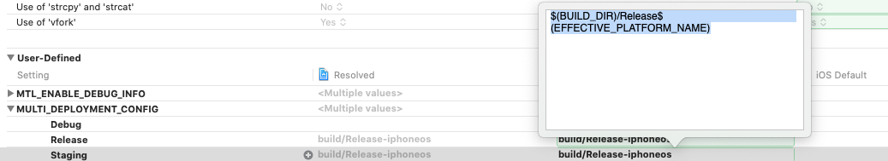
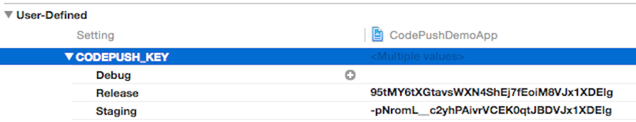
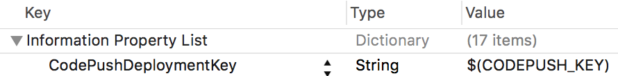

# Deployment

## Multi-Deployment Testing

In our [getting started](rn-get-started.md) docs, we illustrated how to configure the CodePush plugin using a specific deployment key. However, in order to effectively test your releases, it is critical that you leverage the `Staging` and `Production` deployments that we recommend making when you first create your CodePush app (or any custom deployments you may have created). This way, you never release an update to your end users that you haven't been able to validate yourself.

> [!NOTE]
> Our client-side rollback feature can help unblock users after installing a release that resulted in a crash, and server-side rollbacks (i.e. `appcenter codepush rollback`) allow you to prevent additional users from installing a bad release once it's been identified. However, it's obviously better if you can prevent an erroneous update from being broadly released in the first place.

Taking advantage of the `Staging` and `Production` deployments allows you to achieve a workflow like the following (feel free to customize!):

1. Release a CodePush update to your `Staging` deployment using the `appcenter codepush release-react` command (or `appcenter codepush release` if you need more control)

2. Run your staging/beta build of your app, sync the update from the server, and verify it works as expected

3. Promote the tested release from `Staging` to `Production` using the `appcenter codepush promote` command

4. Run your production/release build of your app, sync the update from the server and verify it works as expected

   > [!TIP]
   > If you want to take a more cautious approach, you can even choose to perform a "staged rollout" as part of #3, which allows you to mitigate additional potential risk with the update (like did your testing in #2 touch all possible devices/conditions?) by only making the production update available to a percentage of your users (for example `code-push promote -a <ownerName>/<appName> -s Staging -d Production -r 20%`). Then, after waiting for a reasonable amount of time to see if any crash reports or customer feedback comes in, you can expand it to your entire audience by running `appcenter codepush patch -a <ownerName>/<appName> Production -r 100%`.

You will notice that the above steps refer to a "staging build" and "production build" of your app. If your build process already generates distinct binaries per "environment", then you don't need to read any further, since swapping out CodePush deployment keys is just like handling environment-specific config for any other service your app uses (like Facebook). However, if you are looking for examples on how to setup your build process to accommodate this, then refer to the following sections, depending on the platform(s) your app is targeting.

### Android

The [Android Gradle plugin](https://google.github.io/android-gradle-dsl/current/index.html) allows you to define custom config settings for each "build type" (like debug, release). This mechanism allows you to easily configure your debug builds to use your CodePush staging deployment key and your release builds to use your CodePush production deployment key.

> [!NOTE] 
> As a reminder, you can retrieve these keys by running `code-push deployment ls <APP_NAME> -k` from your terminal.*

To set this up, perform the following steps:

**For React Native >= v0.60**

1. Open the project's app level `build.gradle` file (for example `android/app/build.gradle` in standard React Native projects)

2. Find the `android { buildTypes {} }` section and define `resValue` entries for both your `debug` and `release` build types, which reference your `Staging` and `Production` deployment keys respectively.

    ```groovy
    android {
        ...
        buildTypes {
            debug {
                ...
                // Note: CodePush updates should not be tested in Debug mode as they are overriden by the RN packager. However, because CodePush checks for updates in all modes, we must supply a key.
                resValue "string", "CodePushDeploymentKey", '""'
                ...
            }
            releaseStaging {
                ...
                resValue "string", "CodePushDeploymentKey", '"<INSERT_STAGING_KEY>"'
                // Note: It is a good idea to provide matchingFallbacks for the new buildType you create to prevent build issues
                // Add the following line if not already there
                matchingFallbacks = ['release']
                ...
            }
            release {
                ...
                resValue "string", "CodePushDeploymentKey", '"<INSERT_PRODUCTION_KEY>"'
                ...
            }
        }
        ...
    }
    ```

> [!NOTE]
> Remember to remove the key from `strings.xml` if you are configuring the deployment key in the build process*

> [!NOTE]
> The naming convention for `releaseStaging` is significant due to [this line](https://github.com/facebook/react-native/blob/e083f9a139b3f8c5552528f8f8018529ef3193b9/react.gradle#L79).*


**For React Native v0.29 - v0.59**

1. Open up your `MainApplication.java` file and make the following changes:

    ```java
    @Override
    protected List<ReactPackage> getPackages() {
         return Arrays.<ReactPackage>asList(
             ...
             new CodePush(BuildConfig.CODEPUSH_KEY, MainApplication.this, BuildConfig.DEBUG), // Add/change this line.
             ...
         );
    }
    ```

2. Open your app's `build.gradle` file (for example `android/app/build.gradle` in standard React Native projects)

3. Find the `android { buildTypes {} }` section and define `buildConfigField` entries for both your `debug` and `release` build types, which reference your `Staging` and `Production` deployment keys respectively. If you prefer, you can define the key literals in your `gradle.properties` file, and then reference them here. Either way will work, and it's just a matter of personal preference.

    ```groovy
    android {
        ...
        buildTypes {
            debug {
                ...
                // Note: CodePush updates should not be tested in Debug mode as they are overridden by the RN packager. However, because CodePush checks for updates in all modes, we must supply a key.
                buildConfigField "String", "CODEPUSH_KEY", '""'
                ...
            }

            releaseStaging {
                ...
                buildConfigField "String", "CODEPUSH_KEY", '"<INSERT_STAGING_KEY>"'

                // Note: It is a good idea to provide matchingFallbacks for the new buildType you create to prevent build issues
                // Add the following line if not already there
                matchingFallbacks = ['release']
                ...
            }

            release {
                ...
                buildConfigField "String", "CODEPUSH_KEY", '"<INSERT_PRODUCTION_KEY>"'
                ...
            }
        }
        ...
    }
    ```

   > [!TIP]
   > As a reminder, you can retrieve these keys by running `appcenter codepush deployment list -a <ownerName>/<appName> --displayKeys` from your terminal.

   > [!NOTE]
   > The naming convention for `releaseStaging` is significant due to [this line](https://github.com/facebook/react-native/blob/e083f9a139b3f8c5552528f8f8018529ef3193b9/react.gradle#L79).

3. Pass the deployment key to the `CodePush` constructor via the build config you defined, as opposed to a string literal.

**For React Native v0.19 - v0.28**

Open up your **MainActivity.java** file and make the following changes:

 ```java
 @Override
 protected List<ReactPackage> getPackages() {
     return Arrays.<ReactPackage>asList(
         ...
         new CodePush(BuildConfig.CODEPUSH_KEY, this, BuildConfig.DEBUG), // Add/change this line.
         ...
     );
 }
 ```

> [!NOTE]
> If you gave your build setting a different name in your Gradle file, simply make sure to reflect that in your Java code.

And that's it! Now when you run or build your app, your debug builds will automatically be configured to sync with your `Staging` deployment, and your release builds will be configured to sync with your `Production` deployment.

> [!NOTE]
> By default, the `react-native run-android` command builds and deploys the debug version of your app, so if you want to test out a release/production build, simply run `react-native run-android --variant release. Refer to the [React Native docs](https://facebook.github.io/react-native/docs/signed-apk-android.html#conten) for details about how to configure and create release builds for your Android apps.

If you want to be able to install both debug and release builds simultaneously on the same device (highly recommended!), then you need to ensure that your debug build has a unique identity and icon from your release build. Otherwise, neither the OS or you will be able to differentiate between the two. You can achieve this by performing the following steps:

1. In your **build.gradle** file, specify the [`applicationIdSuffix`](https://google.github.io/android-gradle-dsl/current/com.android.build.gradle.internal.dsl.BuildType.html#com.android.build.gradle.internal.dsl.BuildType:applicationIdSuffix) field for your debug build type, which gives your debug build a unique identity for the OS (like `com.foo` vs. `com.foo.debug`).

    ```groovy
    buildTypes {
        debug {
            applicationIdSuffix ".debug"
        }
    }
    ```

2. Create the `app/src/debug/res` directory structure in your app, which allows overriding resources (like strings, icons, layouts) for your debug builds

3. Create a `values` directory underneath the debug res directory created in #2, and copy the existing `strings.xml` file from the `app/src/main/res/values` directory

4. Open up the new debug `strings.xml` file and change the `<string name="app_name">` element's value to something else (like `foo-debug`). This ensures that your debug build now has a distinct display name, so that you can differentiate it from your release build.

5. Optionally, create "mirrored" directories in the `app/src/debug/res` directory for all of your app's icons that you want to change for your debug build. This part isn't technically critical, but it can make it easier to quickly spot your debug builds on a device if its icon is noticeable different.

And that's it! Refer to [resource merging](https://developer.android.com/studio/write/add-resources.html) for more information on how resource merging works in Android.

### iOS

Xcode allows you to define custom build settings for each "configuration" (like debug, release), which can then be referenced as the value of keys within the **Info.plist** file (like the `CodePushDeploymentKey` setting). This mechanism allows you to easily configure your builds to produce binaries, which are configured to synchronize with different CodePush deployments.

To set this up, perform the following steps:

1. Open up your Xcode project and select your project in the **Project navigator** window

2. Ensure the project node is selected, as opposed to one of your targets

3. Select the **Info** tab

4. Click the **+** button within the **Configurations** section and select **Duplicate "Release" Configuration**

   

5. Name the new configuration **Staging** (or whatever you prefer)

6. Select the **Build Settings** tab

7. Click the **+** button on the toolbar and select **Add User-Defined Setting**

    

    Name this new setting something like **Multi_Deployment_Config**. Go to the setting and add value `$(BUILD_DIR)/$(CONFIGURATION)$(EFFECTIVE_PLATFORM_NAME)` for **Release**. After that add value `$(BUILD_DIR)/Release$(EFFECTIVE_PLATFORM_NAME)` for **Staging**.

    

    > [!NOTE]
    > For Xcode 10 and lower version: Go to **Build Location > Per-configuration Build Products Path > Staging** and change **Staging** value from `$(BUILD_DIR)/$(CONFIGURATION)$(EFFECTIVE_PLATFORM_NAME)` to `$(BUILD_DIR)/Release$(EFFECTIVE_PLATFORM_NAME)`

    

    > [!NOTE]
    > Due to https://github.com/facebook/react-native/issues/11813, we have to do this step to make it possible to use other configurations than Debug or Release on RN 0.40.0 or higher.

8. Click the **+** button again on the toolbar and select **Add User-Defined Setting**

    Name this new setting something like `CODEPUSH_KEY`, expand it, and specify your **Staging** deployment key for the **Staging** config and your **Production** deployment key for the **Release** config.

    

    > [!NOTE]
    > As a reminder, you can retrieve these keys by running `appcenter codepush deployment list -a <ownerName>/<appName> --displayKeys` from your terminal.

9. Open the project's **Info.plist** file and change the value of your `CodePushDeploymentKey` entry to `$(CODEPUSH_KEY)`

    

And that's it! Now when you run or build your app, your staging builds will automatically be configured to sync with your **Staging** deployment, and your release builds will be configured to sync with your **Production** deployment.

> [!NOTE]
> If you encounter the error message `ld: library not found for ...`, please consult [this issue](https://github.com/Microsoft/react-native-code-push/issues/426) for a possible solution.

Additionally, if you want to give them separate names and/or icons, you can modify the `Product Bundle Identifier`, `Product Name`, and `Asset Catalog App Icon Set Name` build settings, which will allow your staging builds to be distinguishable from release builds when installed on the same device.

## Dynamic Deployment Assignment

The above section illustrated how you can leverage multiple CodePush deployments in order to effectively test your updates before broadly releasing them to your end users. However, since that workflow statically embeds the deployment assignment into the actual binary, a staging or production build will only ever sync updates from that deployment. In many cases, this is sufficient, since you only want your team, customers, stakeholders, etc. to sync with your pre-production releases, and therefore, only they need a build that knows how to sync with staging. However, if you want to be able to perform A/B tests, or provide early access of your app to certain users, it can prove very useful to be able to dynamically place specific users (or audiences) into specific deployments at runtime.

In order to achieve this workflow, all you need to do is specify the deployment key you want the current user to synchronize with when calling the `codePush` method. When specified, this key will override the "default" one that was provided in your app's **Info.plist** (iOS) or **MainActivity.java** (Android) files. This allows you to produce a build for staging or production, that is also capable of being dynamically "redirected" as needed.

```javascript
// Imagine that "userProfile" is a prop that this component received
// which includes the deployment key that the current user should use.
codePush.sync({ deploymentKey: userProfile.CODEPUSH_KEY });
```

With that change in place, now it's just a matter of choosing how your app determines the right deployment key for the current user. In practice, there are typically two solutions for this:

1. Expose a user-visible mechanism for changing deployments at any time. For example, your settings page could have a toggle for enabling "beta" access. This model works well if you are not concerned with the privacy of your pre-production updates, and you have power users that may want to opt-in to earlier (and potentially buggy) updates at their own will (like Chrome channels). However, this solution puts the decision in the hands of your users, which doesn't help you perform A/B tests transparently.

2. Annotate the server-side profile of your users with an additional piece of metadata that indicates the deployment they should sync with. By default, your app could just use the binary-embedded key, but after a user has authenticated, your server can choose to "redirect" them to a different deployment, which allows you to incrementally place certain users or groups in different deployments as needed. You could even choose to store the server-response in local storage so that it becomes the new default. How you store the key alongside your user's profiles is entirely up to your authentication solution (for example Auth0, Firebase, custom DB + REST API), but is generally pretty trivial to do.

   > [!NOTE]
   > If needed, you could also implement a hybrid solution that allowed your end-users to toggle between different deployments, while also allowing your server to override that decision. This way, you have a hierarchy of "deployment resolution" that ensures your app has the ability to update itself out-of-the-box, your end users can feel rewarded by getting early access to bits, but you also have the ability to run A/B tests on your users as needed.

Since we recommend using the `Staging` deployment for pre-release testing of your updates (as explained in the previous section), it doesn't necessarily make sense to use it for performing A/B tests on your users, as opposed to allowing early-access (as explained in option #1 above). Therefore, we recommend making full use of custom app deployments, so that you can segment your users however makes sense for your needs. For example, you could create long-term or even one-off deployments, release a variant of your app to it, and then place certain users into it in order to see how they engage.

```javascript
// #1) Create your new deployment to hold releases of a specific app variant
appcenter codepush deployment add -a <ownerName>/<appName> test-variant-one

// #2) Target any new releases at that custom deployment
appcenter codepush release-react -a <ownerName>/<appName> -d test-variant-one
```
> [!NOTE]
> The total user count that is reported in your deployment's "Install Metrics" will take into account users that have "switched" from one deployment to another. For example, if your **Production** deployment currently reports having 1 total user, but you dynamically switch that user to **Staging**, then the **Production** deployment would report 0 total users, while **Staging** would report 1 (the user that just switched). This behavior allows you to accurately track your release adoption, even in the event of using a runtime-based deployment redirection solution.
