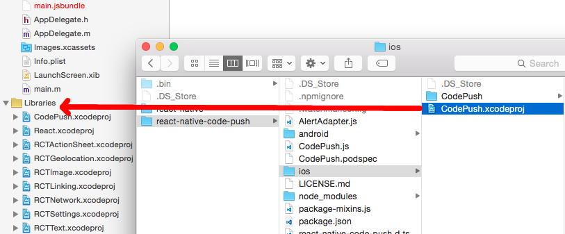
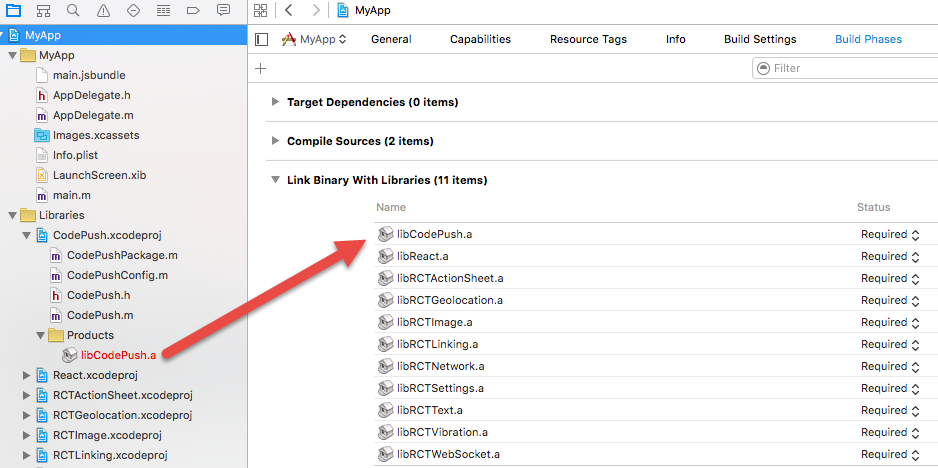
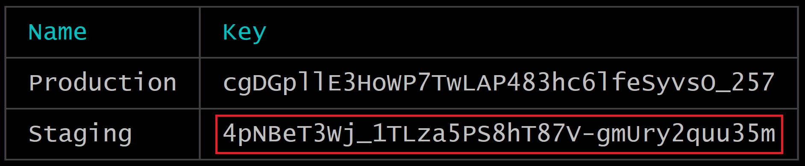
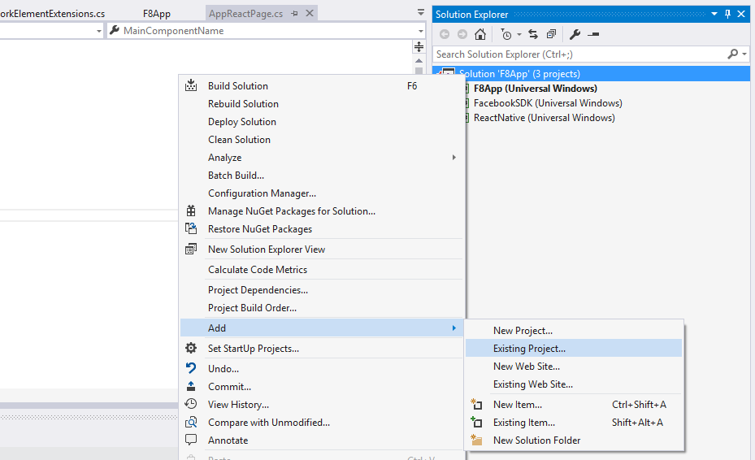
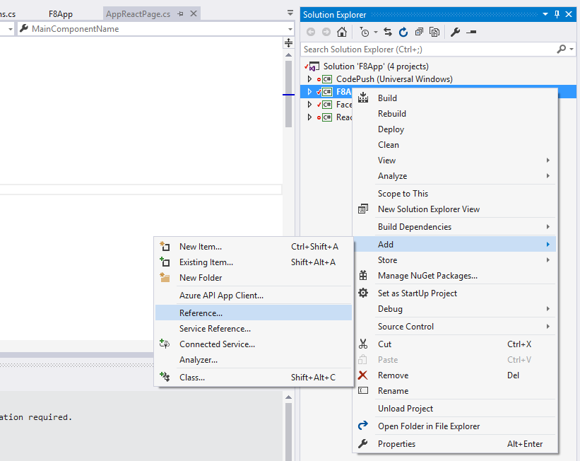
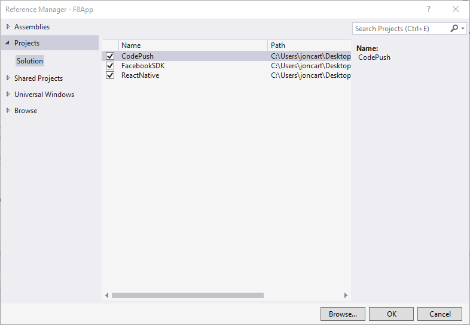

# Get Started with the React Native Client SDK

Once you've followed the general purpose ["getting started"](~/distribution/codepush/index.md) instructions for setting up your CodePush account, you can start integrating CodePush in your React Native app by running the following command from within your app's root directory:

```shell
npm install --save react-native-code-push
```

As with all other React Native plugins, the integration experience is different for iOS and Android, so follow the setup steps depending on the platform(s) you target for your app. Note, if you're targeting both platforms it's recommended to create separate CodePush applications for each platform.

If you want to see how other projects have integrated with CodePush, see the [example apps](rn-overview.md#example-apps--starters), which are provided by the community. Additionally, if you would like to familiarize yourself with CodePush + React Native, see the getting started videos produced by [Bilal Budhani](https://www.youtube.com/watch?v=uN0FRWk-YW8&feature=youtu.be) and [Deepak Sisodiya](https://www.youtube.com/watch?v=f6I9y7V-Ibk).

> [!IMPORTANT]
> This guide assumes you have used the `react-native init` command to initialize your React Native project. As of March 2017, the command `create-react-native-app` can also be used to initialize a React Native project. If using this command, run `npm run eject` in your project's home directory to get a project very similar to what `react-native init` would've created.*

## iOS Setup
Once you have the CodePush plugin, you must integrate it into the Xcode project of your React Native app and configure it correctly.

### Plugin Installation and Configuration for React Native 0.60 version and above (iOS)
1. Run `cd ios && pod install && cd ..` to install all the necessary CocoaPods dependencies.
2. Open up the `AppDelegate.m` file, and add an import statement for the CodePush headers:
   ```objective-c
   #import <CodePush/CodePush.h>
   ```

3. Find the following line of code, which sets the source URL for bridge for production releases:
   ```objective-c
   return [[NSBundle mainBundle] URLForResource:@"main" withExtension:@"jsbundle"];
   ```

4. Replace it with this line:
   ```objective-c
   return [CodePush bundleURL];
   ```
   This change configures your app to always load the most recent version of your app's JS bundle. On the first launch, this will correspond to the file that was compiled with the app. However, after an update has been pushed via CodePush, this will return the location of the most recently installed update.

   > [!NOTE]
   > The `bundleURL` method assumes your app's JS bundle is named `main.jsbundle`. If you have configured your app to use a different file name, simply call the `bundleURLForResource:` method (which assumes you're using the `.jsbundle` extension) or `bundleURLForResource:withExtension:` method instead, in order to overwrite that default behavior*


   Typically, you're only going to want to use CodePush to resolve your JS bundle location within release builds, and therefore, we recommend using the `DEBUG` pre-processor macro to dynamically switch between using the packager server and CodePush, depending on whether you are debugging or not. This will make it much simpler to ensure you get the right behavior you want in production, while still being able to use the Chrome Dev Tools, live reload, etc. at debug-time.

   Your `sourceURLForBridge` method should look like this:

   ```objective-c
   - (NSURL *)sourceURLForBridge:(RCTBridge *)bridge
   {
     #if DEBUG
       return [[RCTBundleURLProvider sharedSettings] jsBundleURLForBundleRoot:@"index" fallbackResource:nil];
     #else
       return [CodePush bundleURL];
     #endif
   }
   ```

5. Add the Deployment key to `Info.plist`:
   To let the CodePush runtime know which deployment it should query for updates against, open your app's `Info.plist` file and add a new entry named `CodePushDeploymentKey`, whose value is the key of the deployment you want to configure this app against (like the key for the `Staging` deployment for the `FooBar` app). You can retrieve this value by going to the app's Distribute UI on your AppCenter dashboard or running `appcenter codepush deployment list --app <ownerName>/<appName> -k` with the CodePush CLI (the `-k` flag is necessary since keys aren't displayed by default) and copying the value of the `Deployment Key` column that corresponds to the deployment you want to use (see below). Note that using the deployment's name (like Staging) won't work. That "friendly name" is intended only for authenticated management usage from the CLI, and not for public consumption within your app.

   

   In order to effectively make use of the `Staging` and `Production` deployments that were created along with your CodePush app, refer to the [multi-deployment testing](rn-deployment.md#multi-deployment-testing) docs below before actually moving your app's usage of CodePush into production.

   > [!NOTE]
   > If you need to dynamically use a different deployment, you can also override your deployment key in JS code using [Code-Push options](rn-api-ref.md#codepushoptions)*

### Plugin Installation for React Native lower than 0.60 (iOS)
In order to accommodate as many developer preferences as possible, the CodePush plugin supports iOS installation via three mechanisms:
1. [RNPM](#plugin-installation-ios---rnpm) - [React Native Package Manager](https://github.com/rnpm/rnpm) (RNPM) is an awesome tool that provides the simplest installation experience possible for React Native plugins. If you are already using it, or you want to use it, then we recommend this approach.

2. [**CocoaPods**](#plugin-installation-ios---cocoapods) - If you're building a native iOS app that's embedding React Native into it, or you simply prefer using [CocoaPods](https://cocoapods.org), then we recommend using the Podspec file that we ship as part of our plugin.

3. [**"Manual"**](#plugin-installation-ios---manual) - If you don't want to depend on any additional tools or are fine with a few extra installation steps (it's a one-time thing), then go with this approach.

#### Plugin Installation (iOS - RNPM)
1. As of v0.27 of React Native, `rnpm link` has already been merged into the React Native CLI. Run:

    ```shell
    react-native link react-native-code-push
    ```

    If your app uses a version of React Native lower than v0.27, execute the following command:

   ```shell
    rnpm link react-native-code-push
    ```

   > [!NOTE]
   > If you don't already have RNPM installed, you can do so by running `npm i -g rnpm` and then executing the above command. If you already have RNPM installed, make sure you have v1.9.0+ in order to benefit from this one step install.*

2. You will be prompted for the deployment key you would like to use. If you don't already have it, you can retrieve this value by running `appcenter codepush deployment list -a <ownerName>/<appName> --displayKeys`, or you can choose to ignore it (by simply hitting `<ENTER>`) and add it in later. To get started, we'd recommend just using your `Staging` deployment key, so that you can test out the CodePush end-to-end.

#### Plugin Installation (iOS - CocoaPods)
1. Add the React Native and CodePush plugin dependencies to your `Podfile`, pointing at the path where NPM has installed modules

    ```Ruby
    # React Native requirements
    pod 'React', :path => '../node_modules/react-native', :subspecs => [
       'Core',
       'CxxBridge', # Include this for RN >= 0.47
       'DevSupport', # Include this to enable In-App Devmenu if RN >= 0.43
       'RCTText',
       'RCTNetwork',
       'RCTWebSocket', # Needed for debugging
       'RCTAnimation', # Needed for FlatList and animations running on native UI thread
       # Add any other subspecs you want to use in your project
    ]
    # Explicitly include Yoga if you are using RN >= 0.42.0
    pod 'yoga', :path => '../node_modules/react-native/ReactCommon/yoga'
    pod 'DoubleConversion', :podspec => '../node_modules/react-native/third-party-podspecs/DoubleConversion.podspec'
    pod 'glog', :podspec => '../node_modules/react-native/third-party-podspecs/glog.podspec'
    pod 'Folly', :podspec => '../node_modules/react-native/third-party-podspecs/Folly.podspec'

    # CodePush plugin dependency
    pod 'CodePush', :path => '../node_modules/react-native-code-push'
    ```

   > [!NOTE]
   > File paths for dependencies must be relative to your app's `Podfile` location.

   > [!NOTE]
   > The project's `JWT` library must be version 3.0.x or higher

2. Run `pod install`

> [!NOTE]
> The CodePush `.podspec` depends on the `React` pod, and so in order to ensure that it can correctly use the version of React Native that your app is built with, make sure to define the `React` dependency in your app's `Podfile` as explained in the [React Native integration documentation](https://facebook.github.io/react-native/docs/integration-with-existing-apps.html#podfile).

#### Plugin Installation (iOS - Manual)
1. Open your app's Xcode project

2. Find the `CodePush.xcodeproj` file within the `node_modules/react-native-code-push/ios` directory (or `node_modules/react-native-code-push` for <=`1.7.3-beta` installations) and drag it into the `Libraries` node in Xcode

    

3. Select the project node in Xcode and select the "Build Phases" tab of your project configuration.

4. Drag `libCodePush.a` from `Libraries/CodePush.xcodeproj/Products` into the "Link Binary With Libraries" section of your project's "Build Phases" configuration.

    

5. Click the plus sign underneath the "Link Binary With Libraries" list and select the `libz.tbd` library underneath the `iOS 9.1` node.

    

   > [!NOTE]
   > Alternatively, if you prefer, you can add the `-lz` flag to the `Other Linker Flags` field in the `Linking` section of the `Build Settings`.*

### Plugin Configuration for React Native lower than 0.60 (iOS)

> [!NOTE]
> If you used RNPM or `react-native link` to automatically link the plugin, these steps have already been done for you so you may skip this section.*

Once your Xcode project has been set up to build/link the CodePush plugin, you need to configure your app to consult CodePush for the location of your JS bundle, since it's responsible for synchronizing it with updates that are released to the CodePush server. To do this, perform the following steps:

1. Open up the **AppDelegate.m** file, and add an import statement for the CodePush headers:

    ```objective-c
    #import <CodePush/CodePush.h>
    ```

For React Native 0.59 - 0.59.10:

2. Find the following line of code, which sets the source URL for bridge for production releases:

    ```objective-c
    return [[NSBundle mainBundle] URLForResource:@"main" withExtension:@"jsbundle"];
    ```

3. Replace it with this line:

    ```objective-c
    return [CodePush bundleURL];
    ```

For React Native 0.58 and below:

2. Find the following line of code, which loads your JS Bundle from the app binary for production releases:

    ```objective-c
    jsCodeLocation = [[RCTBundleURLProvider sharedSettings] jsBundleURLForBundleRoot:@"index" fallbackResource:nil];
    ```

3. Replace it with this line:

    ```objective-c
    jsCodeLocation = [CodePush bundleURL];
    ```

This change configures your app to always load the most recent version of your app's JS bundle. On the first launch, this corresponds to the file that was compiled with the app. However, after an update has been pushed via CodePush, this will return the location of the most recently installed update.

> [!NOTE]
> The `bundleURL` method assumes your app's JS bundle is named `main.jsbundle`. If you have configured your app to use a different file name, simply call the `bundleURLForResource:` method (which assumes you're using the `.jsbundle` extension) or `bundleURLForResource:withExtension:` method instead, in order to overwrite that default behavior*

Typically, you are only going to want to use CodePush to resolve your JS bundle location within release builds, and therefore, we recommend using the `DEBUG` pre-processor macro to dynamically switch between using the packager server and CodePush, depending on whether you are debugging or not. This will make it much simpler to ensure you get the right behavior you want in production, while still being able to use the Chrome Dev Tools, live reload, etc. at debug-time.

For React Native 0.59 - 0.59.10:

```objective-c
- (NSURL *)sourceURLForBridge:(RCTBridge *)bridge
{
  #if DEBUG
    return [[RCTBundleURLProvider sharedSettings] jsBundleURLForBundleRoot:@"index" fallbackResource:nil];
  #else
    return [CodePush bundleURL];
  #endif
}
```

For React Native 0.58 and below:

```objective-c
NSURL *jsCodeLocation;

#ifdef DEBUG
    jsCodeLocation = [[RCTBundleURLProvider sharedSettings] jsBundleURLForBundleRoot:@"index" fallbackResource:nil];
#else
    jsCodeLocation = [CodePush bundleURL];
#endif
```

To let the CodePush runtime know which deployment it should query for updates against, open the project's **Info.plist** file and add a new entry named `CodePushDeploymentKey`, whose value is the key of the deployment you want to configure this app against (like the key for the `Staging` deployment for the `FooBar` app). You can retrieve this value by running `appcenter codepush deployment list -a <ownerName>/<appName> --displayKeys` in the CodePush CLI  and copying the value of the `Deployment Key` column that corresponds to the deployment you want to use (see below). Note that using the deployment's name (like `Staging`) won't work. That "friendly name" is intended only for authenticated management usage from the CLI, and not for public consumption within your app.



In order to effectively make use of the `Staging` and `Production` deployments that were created along with your CodePush app, refer to the [multi-deployment testing](rn-deployment.md#multi-deployment-testing) docs below before actually moving your app's usage of CodePush into production.

### HTTP exception domains configuration (iOS)

CodePush plugin makes HTTPS requests to the following domains:

- codepush.appcenter.ms
- codepush.blob.core.windows.net
- codepushupdates.azureedge.net

If you want to change the default HTTP security configuration for any of these domains, you have to define the [`NSAppTransportSecurity` (ATS)][ats] configuration inside the project's **Info.plist** file:

```xml
<plist version="1.0">
  <dict>
    <!-- ...other configs... -->

    <key>NSAppTransportSecurity</key>
    <dict>
      <key>NSExceptionDomains</key>
      <dict>
        <key>codepush.appcenter.ms</key>
        <dict><!-- read the ATS Apple Docs for available options --></dict>
      </dict>
    </dict>

    <!-- ...other configs... -->
  </dict>
</plist>
```

Before doing anything, see the [Apple docs][ats] first.

[ats]: https://developer.apple.com/library/content/documentation/General/Reference/InfoPlistKeyReference/Articles/CocoaKeys.html#//apple_ref/doc/uid/TP40009251-SW33

### Code Signing setup (iOS)

You can self-sign bundles during release and verify their signatures before installation of update. For more info about Code Signing, see the [relevant code-push documentation section](cli.md#code-signing).

In order to configure a Public Key for bundle verification, you need to add a record in `Info.plist` with the name `CodePushPublicKey` and string value of public key content. Example:

```xml
<plist version="1.0">
  <dict>
    <!-- ...other configs... -->

    <key>CodePushPublicKey</key>
        <string>-----BEGIN PUBLIC KEY-----
MFwwDQYJKoZIhvcNAQEBBQADSwAwSAJBANkWYydPuyOumR/sn2agNBVDnzyRpM16NAUpYPGxNgjSEp0etkDNgzzdzyvyl+OsAGBYF3jCxYOXozum+uV5hQECAwEAAQ==
-----END PUBLIC KEY-----</string>

    <!-- ...other configs... -->
  </dict>
</plist>
```

## Android Setup

In order to integrate CodePush into your Android project, perform the following steps:

### Plugin Installation (Android)

### Plugin Installation and Configuration for React Native 0.60 version and above (Android)

1. In your `android/settings.gradle` file, make the following additions:

    ```gradle
    include ':app', ':react-native-code-push'
    project(':react-native-code-push').projectDir = new File(rootProject.projectDir, '../node_modules/react-native-code-push/android/app')
    ```

2. In your `android/app/build.gradle` file, add the `codepush.gradle` file as an additional build task definition underneath `react.gradle`:

    ```gradle
    ...
    apply from: "../../node_modules/react-native/react.gradle"
    apply from: "../../node_modules/react-native-code-push/android/codepush.gradle"
    ...
    ```
2. Update the `MainApplication.java` file to use CodePush via the following changes:

    ```java
    ...
    // 1. Import the plugin class.
    import com.microsoft.codepush.react.CodePush;
    public class MainApplication extends Application implements ReactApplication {
        private final ReactNativeHost mReactNativeHost = new ReactNativeHost(this) {
            ...
            // 2. Override the getJSBundleFile method in order to let
            // the CodePush runtime determine where to get the JS
            // bundle location from on each app start
            @Override
            protected String getJSBundleFile() {
                return CodePush.getJSBundleFile();
            }
        };
    }
    ```

3. Add the Deployment key to `strings.xml`:

   To let the CodePush runtime know which deployment it should query for updates, open your app's `strings.xml` file and add a new string named `CodePushDeploymentKey`, whose value is the key of the deployment you want to configure this app against (like the key for the `Staging` deployment for the `FooBar` app). You can retrieve this value by running `appcenter codepush deployment list <ownerName>/<appName> -k` in the App Center CLI (the `-k` flag is necessary since keys aren't displayed by default) and copying the value of the `Key` column that corresponds to the deployment you want to use (see below). Note that using the deployment's name (like Staging) won't work. The "friendly name" is intended only for authenticated management usage from the CLI, and not for public consumption within your app.

   

   In order to effectively make use of the `Staging` and `Production` deployments that were created along with your CodePush app, refer to the [multi-deployment testing](rn-deployment.md#multi-deployment-testing) docs below before actually moving your app's usage of CodePush into production.

   Your `strings.xml` file should look like this:

   ```xml
    <resources>
        <string name="app_name">AppName</string>
        <string moduleConfig="true" name="CodePushDeploymentKey">DeploymentKey</string>
    </resources>
    ```

    > [!NOTE]
    > If you need to dynamically use a different deployment, you can also override your deployment key in JS code using [Code-Push options](rn-api-ref.md#codepushoptions)*

### Plugin Installation for React Native lower than 0.60 (Android)

In order to accommodate as many developer preferences as possible, the CodePush plugin supports Android installation via two mechanisms:

1. [**RNPM**](#plugin-installation-android---rnpm) - [React Native Package Manager (RNPM)](https://github.com/rnpm/rnpm) is an awesome tool that provides the simplest installation experience possible for React Native plugins. If you are already using it, or you want to use it, then we recommend this approach.

2. [**"Manual"**](#plugin-installation-android---manual) - If you don't want to depend on any additional tools or are fine with a few extra installation steps (it's a one-time thing), then go with this approach.

> [!NOTE]
> Due to a code change from the React Native repository, if your installed React Native version ranges from 0.29 to 0.32, we recommend following the manual steps to set up correctly.

#### Plugin Installation (Android - RNPM)

1. As of v0.27 of React Native, `rnpm link` has already been merged into the React Native CLI. Run:

    ```shell
    react-native link react-native-code-push
    ```

    If your app uses a version of React Native lower than v0.27, run the next command:

    ```shell
    rnpm link react-native-code-push
    ```

   > [!NOTE]
   > If you don't already have RNPM installed, you can do so by running `npm i -g rnpm` and then executing the above command.*

2. If you are using RNPM >=1.6.0, you will be prompted for the deployment key you would like to use. If you don't already have it, you can retrieve this value by running `appcenter codepush deployment list -a <ownerName>/<appName> --displayKeys`, or you can choose to ignore it (by hitting `<ENTER>`) and add it in later. To get started, we'd recommend just using your `Staging` deployment key, so that you can test out the CodePush end-to-end.

And that's it for installation using RNPM! Continue below to the [Plugin Configuration](#plugin-configuration-for-react-native-lower-than-060-android) section to complete the setup.

#### Plugin Installation (Android - Manual)

1. In your `android/settings.gradle` file, make the following additions:

    ```gradle
    include ':app', ':react-native-code-push'
    project(':react-native-code-push').projectDir = new File(rootProject.projectDir, '../node_modules/react-native-code-push/android/app')
    ```

2. In your `android/app/build.gradle` file, add the `:react-native-code-push` project as a compile-time dependency:

    ```gradle
    ...
    dependencies {
        ...
        compile project(':react-native-code-push')
    }
    ```

3. In your `android/app/build.gradle` file, add the `codepush.gradle` file as an additional build task definition underneath `react.gradle`:

    ```gradle
    ...
    apply from: "../../node_modules/react-native/react.gradle"
    apply from: "../../node_modules/react-native-code-push/android/codepush.gradle"
    ...
    ```

### Plugin Configuration for React Native lower than 0.60 (Android)

> [!NOTE]
> If you used RNPM or `react-native link` to automatically link the plugin, these steps have already been done for you so you may skip this section.*

After installing the plugin and syncing your Android Studio project with Gradle, you need to configure your app to consult CodePush for the location of your JS bundle, since it will "take control" of managing the current and all future versions. To do this:

**For React Native >= v0.29**

If you are integrating CodePush into React Native application, do the following steps:

Update the `MainApplication.java` file to use CodePush via the following changes:

```java
...
// 1. Import the plugin class.
import com.microsoft.codepush.react.CodePush;

public class MainApplication extends Application implements ReactApplication {

    private final ReactNativeHost mReactNativeHost = new ReactNativeHost(this) {
        ...
        // 2. Override the getJSBundleFile method in order to let
        // the CodePush runtime determine where to get the JS
        // bundle location from on each app start
        @Override
        protected String getJSBundleFile() {
            return CodePush.getJSBundleFile();
        }

        @Override
        protected List<ReactPackage> getPackages() {
            // 3. Instantiate an instance of the CodePush runtime and add it to the list of
            // existing packages, specifying the right deployment key. If you don't already
            // have it, you can run "appcenter codepush deployment list -a <ownerName>/<appName> --displayKeys" to retrieve your key.
            return Arrays.<ReactPackage>asList(
                new MainReactPackage(),
                new CodePush("deployment-key-here", MainApplication.this, BuildConfig.DEBUG)
            );
        }
    };
}
```

If you are integrating React Native into existing native application, do the following steps:

Update `MyReactActivity.java` (it could be named differently in your app) file to use CodePush via the following changes:

```java
...
// 1. Import the plugin class.
import com.microsoft.codepush.react.CodePush;

public class MyReactActivity extends Activity {
    private ReactRootView mReactRootView;
    private ReactInstanceManager mReactInstanceManager;

    @Override
    protected void onCreate(Bundle savedInstanceState) {
        ...
        mReactInstanceManager = ReactInstanceManager.builder()
                // ...
                // Add CodePush package
                .addPackage(new CodePush("deployment-key-here", getApplicationContext(), BuildConfig.DEBUG))
                // Get the JS Bundle File via CodePush
                .setJSBundleFile(CodePush.getJSBundleFile())
                // ...

                .build();
        mReactRootView.startReactApplication(mReactInstanceManager, "MyReactNativeApp", null);

        setContentView(mReactRootView);
    }

    ...
}
```

**For React Native v0.19 - v0.28**

Update the **MainActivity.java** file to use CodePush via the following changes:

```java
...
// 1. Import the plugin class (if you used RNPM to install the plugin, this
// should already be done for you automatically so you can skip this step).
import com.microsoft.codepush.react.CodePush;

public class MainActivity extends ReactActivity {
    // 2. Override the getJSBundleFile method in order to let
    // the CodePush runtime determine where to get the JS
    // bundle location from on each app start
    @Override
    protected String getJSBundleFile() {
        return CodePush.getJSBundleFile();
    }

    @Override
    protected List<ReactPackage> getPackages() {
        // 3. Instantiate an instance of the CodePush runtime and add it to the list of
        // existing packages, specifying the right deployment key. If you don't already
        // have it, you can run "appcenter codepush deployment list -a <ownerName>/<appName> --displayKeys" to retrieve your key.
        return Arrays.<ReactPackage>asList(
            new MainReactPackage(),
            new CodePush("deployment-key-here", this, BuildConfig.DEBUG)
        );
    }

    ...
}
```

#### Background React Instances

*This section is only necessary if you are *explicitly* launching a React Native instance without an `Activity` (for example, from within a native push notification receiver). For these situations, CodePush must be told how to find your React Native instance.*

In order to update/restart your React Native instance, CodePush must be configured with a `ReactInstanceHolder` before attempting to restart an instance in the background. This is done in your `Application` implementation.

**For React Native >= v0.29**

Update the `MainApplication.java` file to use CodePush via the following changes:

```java
...
// 1. Declare your ReactNativeHost to extend ReactInstanceHolder. ReactInstanceHolder is a subset of ReactNativeHost, so no additional implementation is needed.
import com.microsoft.codepush.react.ReactInstanceHolder;

public class MyReactNativeHost extends ReactNativeHost implements ReactInstanceHolder {
  // ... usual overrides
}

// 2. Provide your ReactNativeHost to CodePush.

public class MainApplication extends Application implements ReactApplication {

   private final MyReactNativeHost mReactNativeHost = new MyReactNativeHost(this);

   @Override
   public void onCreate() {
     CodePush.setReactInstanceHolder(mReactNativeHost);
     super.onCreate();
  }
}
```

**For React Native v0.19 - v0.28**

Before v0.29, React Native didn't provide a `ReactNativeHost` abstraction. If you are launching a background instance, you will likely have built your own, which should now implement `ReactInstanceHolder`. Once that's done:

```java
// 1. Provide your ReactInstanceHolder to CodePush.

public class MainApplication extends Application {

   @Override
   public void onCreate() {
     // ... initialize your instance holder
     CodePush.setReactInstanceHolder(myInstanceHolder);
     super.onCreate();
  }
}
```

In order to effectively make use of the `Staging` and `Production` deployments that we recommend you created along with your CodePush app, refer to the [multi-deployment testing](rn-deployment.md#multi-deployment-testing) docs below before actually moving your app's usage of CodePush into production.

### Code Signing setup (Android)

Starting with CLI version **2.1.0** you can self-sign bundles during release and verify its signature before installation of update. For more info about Code Signing, see the [relevant code-push documentation section](cli.md#code-signing). In order to use Public Key for Code Signing, you need to do following steps:

   Add a `CodePushPublicKey` string item to `/path_to_your_app/android/app/src/main/res/values/strings.xml`. It may look like this:

 ```xml
 <resources>
    <string name="app_name">my_app</string>
    <string name="CodePushPublicKey">-----BEGIN PUBLIC KEY-----
MIIBIjANBgkqhkiG9w0BAQEFAAOCAQ8AMIIBCgKCAQEAtPSR9lkGzZ4FR0lxF+ZA
P6jJ8+Xi5L601BPN4QESoRVSrJM08roOCVrs4qoYqYJy3Of2cQWvNBEh8ti3FhHu
tiuLFpNdfzM4DjAw0Ti5hOTfTixqVBXTJPYpSjDh7K6tUvp9MV0l5q/Ps3se1vud
M1/X6g54lIX/QoEXTdMgR+SKXvlUIC13T7GkDHT6Z4RlwxkWkOmf2tGguRcEBL6j
ww7w/3g0kWILz7nNPtXyDhIB9WLH7MKSJWdVCZm+cAqabUfpCFo7sHiyHLnUxcVY
OTw3sz9ceaci7z2r8SZdsfjyjiDJrq69eWtvKVUpredy9HtyALtNuLjDITahdh8A
zwIDAQAB
-----END PUBLIC KEY-----</string>
</resources>
 ```

#### For React Native <= v0.60 you should configure the `CodePush` instance to use this parameter using one of the following approaches

##### Using constructor

```java
new CodePush(
    "deployment-key",
    getApplicationContext(),
    BuildConfig.DEBUG,
    R.string.CodePushPublicKey)
```

##### Using builder

 ```java
new CodePushBuilder("deployment-key-here",getApplicationContext())
    .setIsDebugMode(BuildConfig.DEBUG)
    .setPublicKeyResourceDescriptor(R.string.CodePushPublicKey)
    .build()
```


## Windows Setup

Once you have acquired the CodePush plugin, you need to integrate it into the Visual Studio project of your React Native app and configure it correctly. To do this, take the following steps:

### Plugin Installation (Windows)

1. Open the Visual Studio solution located at `windows\<AppName>\<AppName>.sln` within your app

2. Right-click the solution node in the `Solution Explorer` window and select the `Add -> Existing Project...` menu item

   

3. Browse to the `node_modules\react-native-code-push\windows` directory, select the  file, and click `OK`

4. Back in the `Solution Explorer`, right-click the project node that's named after your app, and select the `Add -> Reference...` menu item

   

5. Select the `Projects` tab on the left-hand side, check the `CodePush` item, and then click `OK`

   

### Plugin Configuration (Windows)

After installing the plugin, you need to configure your app to consult CodePush for the location of your JS bundle, since it will "take control" of managing the current and all future versions. To do this, update the `AppReactPage.cs` file to use CodePush via the following changes:

```c#
...
// 1. Import the CodePush namespace
using CodePush.ReactNative;
...
class AppReactPage : ReactPage
{
    // 2. Declare a private instance variable for the CodePushModule instance.
    private CodePushReactPackage codePushReactPackage;

    // 3. Update the JavaScriptBundleFile property to initialize the CodePush runtime,
    // specifying the right deployment key, then use it to return the bundle URL from
    // CodePush instead of statically from the binary. If you don't already have your
    // deployment key, you can run "appcenter codepush deployment list -a <ownerName>/<appName> --displayKeys" to retrieve it.
    public override string JavaScriptBundleFile
    {
        get
        {
            codePushReactPackage = new CodePushReactPackage("deployment-key-here", this);
            return codePushReactPackage.GetJavaScriptBundleFile();
        }
    }

    // 4. Add the codePushReactPackage instance to the list of existing packages.
    public override List<IReactPackage> Packages
    {
        get
        {
            return new List<IReactPackage>
            {
                new MainReactPackage(),
                ...
                codePushReactPackage
            };
        }
    }
    ...
}
```
