# Tutorials

## Update experience configuration

CodePush provides Cordova and React Native developers with multiple options to configure the end users update experience.

This tutorial covers three potential "update modes" or deployment strategies for CodePush updates: Silent, Active and Custom. Leveraging these options allow developers to control when (and how often) to check for updates as well as how to present any update notifications to end users.

> [!NOTE]
> This tutorial does not cover how to enable CodePush on an app. If you need help setting up CodePush, visit the [Cordova](./cordova.md#getting-started) or [React Native](./react-native.md#getting-started) "Getting Started" sections.

### 1.  Silent mode

Silent mode updates are the simplest way to update an app and the least invasive experience for the end users.

```javascript
codePush.sync();
```

If an update is available, it will be silently downloaded, and installed the next time the app is restarted (either explicitly by the end user or by the OS). However, developers can modify the install behavior if they so choose, by leveraging the `installMode` parameter:

* **IMMEDIATE**: The update will be applied to the running application immediately. The application will be reloaded with the new content immediately.
* **ON_NEXT_RESTART**: The update is downloaded but not installed immediately. The new content will be available the next time the application is started.
* **ON_NEXT_RESUME**: The update is downloaded but not installed immediately. The new content will be available the next time the application is resumed or restarted, whichever event happens first.

For example, to download and install an update immediately, developers can use the `installMode` parameter as follows:

```javascript
codePush.sync({installMode: InstallMode.IMMEDIATE});
```

#### Recommendation

Depending on the complexity of the app, pushing an update immediately might be a jarring experience for end users (e.g. changing the UI or losing the current state can be frustrating and confusing).  Because of this, we recommend updates are installed only after a certain period of app inactivity has been reached. To achieve this experience, developers can use the InstallMode.ON_NEXT_RESUME and minimumBackgroundDuration parameters as follows:

```javascript
// Download the update silently, but install on next
// app resume and after 10 minutes of app inactivity
// We recommend doing this call on app start (e.g. `componentDidMount` event on React Native or `deviceready` on Cordova)
codePush.sync({ installMode: InstallMode.ON_NEXT_RESUME, minimumBackgroundDuration: 60 * 10 });
```

> [!NOTE]
> If `codePush.sync()` is not called on app start (e.g. `componentDidMount` event on React Native or `deviceready` on Cordova), developers will need to notify the update was successfully installed by calling the `codePush.notifyApplicationReady()` method. Otherwise the CodePush runtime will assume the installed update has failed and roll back to the previous version.
 
> [!NOTE]
> For Cordova, the first parameter that `codePush.sync()` expects is a `syncStatusCallback`, so to do the same thing, you should insert `null` as the first parameter to the call, i.e:

```javascript
codePush.sync(null, { installMode: InstallMode.ON_NEXT_RESUME, minimumBackgroundDuration: 60 * 10 });
```

### 2.  Active mode

In contrast to the silent mode updates, active mode updates prompt end users about available updates and thus require user interaction.

The difference is introduced by the usage of the `updateDialog` parameter.

```javascript
    codePush.sync({ updateDialog: true });
```

If an update is available, the app automatically launches a native prompt asking end users for permission to download and install the update. Once the user accepts, the update is silently downloaded and immediately applied, and installed the next time the app is restarted (either explicitly by the end user or by the OS).

#### Update dialog customization

To customize the update dialog, developers can create an updateDialogOption object and pass it to the `codePush.sync()` call as follows:

```javascript

    var updateDialogOptions = {
        updateTitle: "You have an update",
        optionalUpdateMessage: "Update available. Install?",
        optionalIgnoreButtonLabel: "Nop",
        optionalInstallButtonLabel: "Yep",
    };

    codePush.sync({ updateDialog: updateDialogOptions});
```

Visit the  [Cordova](./cordova.md#api-reference) or [React Native](./react-native.md#api-reference) API Reference pages for a full description of all the avaiable UpdateDialogOptions options.

> [!IMPORTANT]
> While Apple’s developer agreement fully allows performing over-the-air updates of JavaScript and assets (which is what enables CodePush!), it is against their policy for an app to display an update prompt. Because of this, we recommend that App Store-distributed apps don’t enable the updateDialog option when calling sync, whereas Google Play and internally distributed apps (e.g. Enterprise, Fabric, HockeyApp) can choose to enable/customize it.

### 3.  Custom mode

Custom mode provides the flexibility to customize any stage of the update experience such as providing a custom "checking for updates" or "downloading" notification.

#### Update cycle notifications

The `codePush.sync()` method allows the use of a call back to hook into the overall update process and thus provide a custom experience on each stage of the update process as follows.

```javascript
var onSyncStatusChange = function(SyncStatus) {
    switch (SyncStatus) {
        case SyncStatus.CHECKING_FOR_UPDATE:
            // Show "Checking for update" notification
            break;
        case SyncStatus.AWAITING_USER_ACTION:
            // Show "Checking for update" notification
            break;
        case SyncStatus.DOWNLOADING_PACKAGE:
            // Show "downloading" notification
            break;
        case SyncStatus.INSTALLING_UPDATE:
            // Show "installing" notification
            break;
    }
}

// Prompt the user when an update is available and display a "downloading" modal
codePush.sync({ updateDialog: true }, onSyncStatusChange);
```

Visit the  [Cordova](./cordova.md#syncstatus) or [React Native](./react-native.md#syncstatus) SyncStatus enum for a full description of all the available enum values.

#### Adding a "downloading" progress indicator

To provide an enhanced experience, developers can choose to provide a download progress indicator. The `codePush.sync()` method provides a different call back to make this possible.

```javascript

var onError = function (error) {
    console.log("An error occurred. " + error);
};

var onDownloadProgress = function (downloadProgress) {
    if (downloadProgress) {
        console.log("Downloading " + downloadProgress.receivedBytes + " of " + downloadProgress
    }
};

codePush.sync({ updateDialog: true }, onSyncStatusChange, onDownloadProgress, onError);
```

## Automate your deployments with Azure DevOps

Continuous Integration (CI) and Continuous Deployment (CD) are key practices of DevOps. It requires the team to have a mindset to merge all working copies of developers’ code with a shared repository, producing a new build upon code commit. In turn this provides them with the opportunity to leverage the CI output, deploy it to one or more environments, and ultimately serve the end users via app updates.

This tutorial covers how to leverage Azure DevOps (formerly known as Visual Studio Team Services (VSTS)) and CodePush in order to create a CD environment to automate app updates from an existing CI environment. Even though a "proper" CI build not only compiles the code, but ideally runs code analysis, unit (and sometimes even integration) tests and even could package the code, those CI details won’t be discussed but instead go over the basics of CI integration as well as details of how to setup the CD environment.

### Overview

Azure DevOps is a collection of services that let teams share code, track work, and ship software—for any language.

From a high-level it provides developers with:

- Unlimited free private code repositories
- Ability to track bugs, work items, feedback, and more
- Agile planning tools
- Continuous integration builds
- Enterprise-grade services scale to any team size
- Free for up to five users

In addition, Azure DevOps allows developers to extend the service by creating Azure DevOps extensions that can help with tasks covering the full CI and CD spectrum.

The CodePush service provides a Azure DevOps extension with a set of deployment tasks that allows the automation of releases and the promotion of app updates directly from your CI environment.

Leveraging the workflow discussed below can greatly reduce the effort needed to keep your dev/alpha/beta deployments up-to-date, since you can simply push changes to the configured source control branches, and let your automated build take care of the rest. No need to manually release, promote or rollout from the App Center CLI!

### Prerequisites

The following is required to complete this module:

- Azure DevOps Account ([Sign up for a free Azure DevOps account(https://www.visualstudio.com/products/free-developer-offers-vs))
- App Center Account (Follow these [steps](~/distribution/codepush/index.md) to get set up)
- React Native "CodePush ready" [sample app](https://github.com/rub8n/VSTSCDSample) (Use your own app or download the "bare bones" sample app to speed things up)

  > [!NOTE]
  > For simplicity purposes, the steps covered below are done using the Android platform of the React Native sample project above. However, most of the steps also apply for both React Native iOS and Cordova projects.

### 1. Create your Application

Start by creating your app and setting it up to work with the CodePush service:

```shell
appcenter apps create -d VSTSCDSample-Android -o android -p react-native
```

Then use the following commands to create both `Staging` and `Production` deployments:

```shell
appcenter codepush deployment add -a <ownerName>/VSTSCDSample-Android Staging
appcenter codepush deployment add -a <ownerName>/VSTSCDSample-Android Production
```

To view the deployment keys use:

```shell
appcenter codepush deployment list -a <ownerName>/VSTSCDSample-Android
```

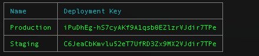

Save the `Staging` deployment key as it will be used to set up your project.

### 2. Add a CodePush deployment key

Download the [React Native sample project](#) and open the strings.xml file located under the sample app's `android > app > src > main > res > values`.

Navigate to line #2 and add the previously recorded `Staging` deployment key:

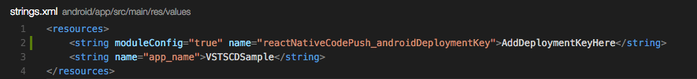

### 3. Push the source code to a Azure DevOps team project

Create a new project in Azure DevOps by clicking on `New`:

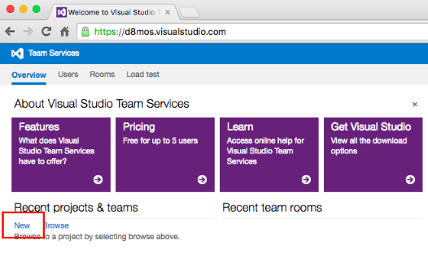

Give it a name and ensure `Git` is selected for `Version control`:

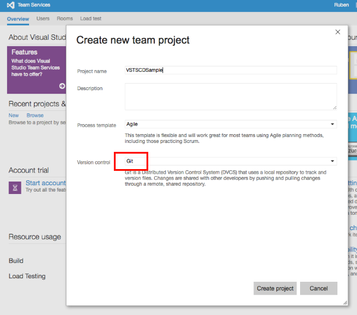

Once the project is created, copy the remote string as you will use it to update the local repository's remote URL to point to your new Azure DevOps project:

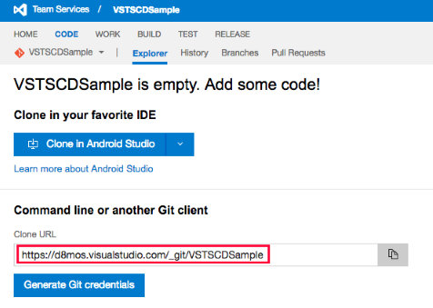

Update the repository's remote URL using the following [command](https://help.github.com/articles/changing-a-remote-s-url):

```shell
 git remote set-url origin replaceWithVSTSRepositoryURL
```

Once the new remote URL is set, push the repository to Azure DevOps via [Git push](https://help.github.com/articles/pushing-to-a-remote/)

```shell
 git push -u origin --all
```

A few seconds later, the source will be added to your Azure DevOps repository:

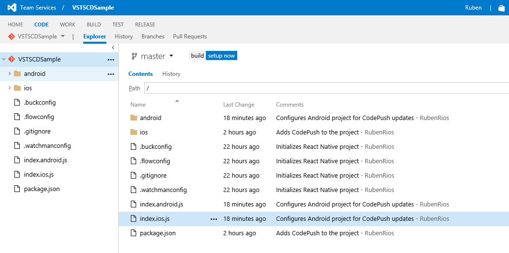

### 4. Configure the CI environment

#### Install Azure DevOps extension

To build the project you will need to install an extension from the Azure DevOps Marketplace.

For React Native projects do the following:

1. In the upper right corner, click the Basket icon and select Browse Marketplace.

    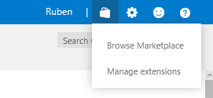

2. Enter the term `react` in the search box and press enter. Open and install the `React Native` Azure DevOps extension made by the `Visual Studio Client Tools` team:

    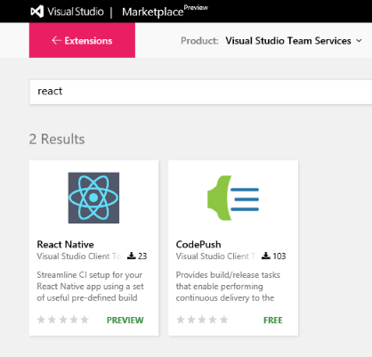

#### Create a new build definition

1. In the top menu bar, click BUILD to open the build hub. In the menu on the left, click the green + button to create a new build definition.

    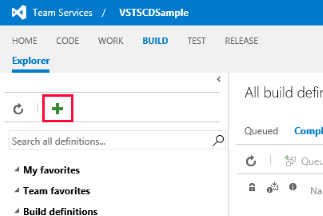

2. Select `Empty` from the list of build templates and click `Next`.

    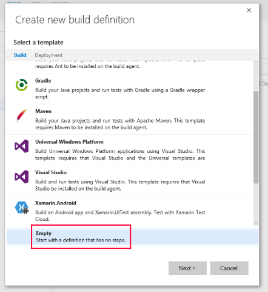

3. Make sure that the repo settings are correct (it should be the master branch on the VSTSCDSample repo). Check the `Continuous integration` checkbox and ensure that the Default agent queue is set to Hosted and click `Create`.

    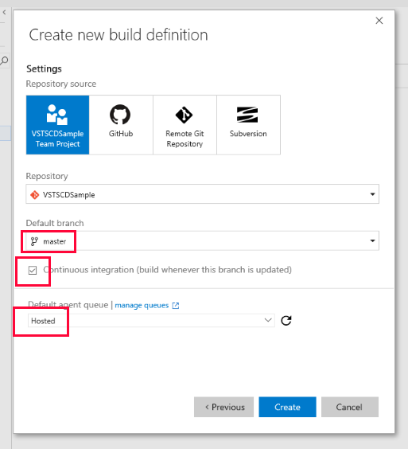

> [!NOTE]
> The `Continuous Integration` trigger tells Azure DevOps to kick-off an instance of this build each time code is pushed to the `master` branch.

#### Configure the build task

As part of the CI build configuration process, you'll add a series of steps that will build the project and publish an artifact (the Android bundle), which the CD environment will use to update the app.

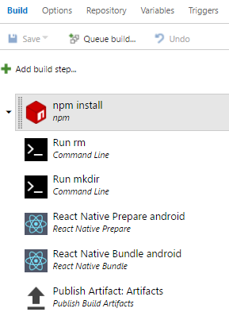

Create the described build definition by following these steps:

1. Install npm dependencies by clicking on `Add build step...` and adding `npm` from the `Package` category. Select it and specify the following settings:
   - Use `install` as the `Command`

2. Add a new build step to remove any previously created "artifacts" folder by adding `Command Line` from the `utility` category. Select it and specify the following settings:
   - Use `rm` as the `Tool`
   - Use `-rf artifacts` as the `Arguments`

3. Add a new build step to make a new "artifacts" folder by adding a `Command Line` from the `utility` category. Select it and specify the following settings:
   - Use `mkdir` as the `Tool`
   - Use `artifacts` as the `Arguments`

4. Add a new build step to add `React Native Prepare` from the `Build` category. Select it and specify the following settings:
   - Select `Android` as the `Platform`
   - Use `android/app/build.gradle` as the `react.gradle Path`

5. Add a new build step to add `React Native Bundle` from the `Build` category. Select it and specify the following settings:
   - Select `Android` as the `Platform`
   - Use `index.android.js` as the `Entry File`
   - Use `./artifacts/index.android.bundle` as the `Bundle Output`
   - Use `./artifacts` as the `Asset Destination Path`

6. Add a new build step to publish the created artifacts (in this context the Android bundle created by running `React Native Bundle`) by adding `Publish Build Artifacts` from the `utility` category. Select it and specify the following settings:
   - Use `./artifacts` as the `Path to Publish`
   - Use `Artifacts` as the `Artifact Name`
   - Use `Server` as the `Artifact Type`

7. Save and name the build definition by pressing the `Save` toolbar button.

You can manually queue a new build to test the build process by pressing the `Queue build...` toolbar button.

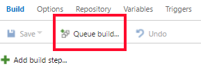

Pressing `OK` on the "Queue build" dialog starts the build process:

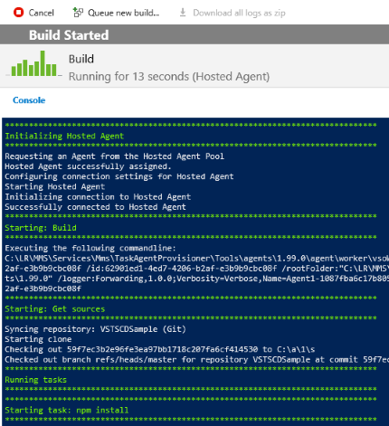

> [!NOTE]
> The previously set `Continuous Integration` trigger ensures new builds are automatically queued every time code is pushed to the `master` branch.

### 5. Configure the CD environment

As a best practice, we recommend creating three release environments: "Staging", "Rollout" and "Production". This configuration allows you to continuously deploy to "Staging", rollout to a small percentage of production users and finally release to all production users when confidence is high.

#### Install Azure DevOps extension

To leverage the CodePush service as the release vehicle, you will need to install another extension from the Azure DevOps Marketplace.

1. In the upper right corner, click the Basket icon and select Browse Marketplace.


2. Enter the term `codepush` in the search box and press enter. Open and install the `React Native` Azure DevOps extension made by the `Visual Studio Client Tools` team:

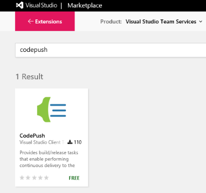

#### Create a new release definition

1. In the top menu bar, click RELEASE to open the release hub. In the menu on the left, click the green + button to create a new release definition.

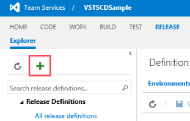

2. Select `Empty` from the list of release templates and click `Next`.

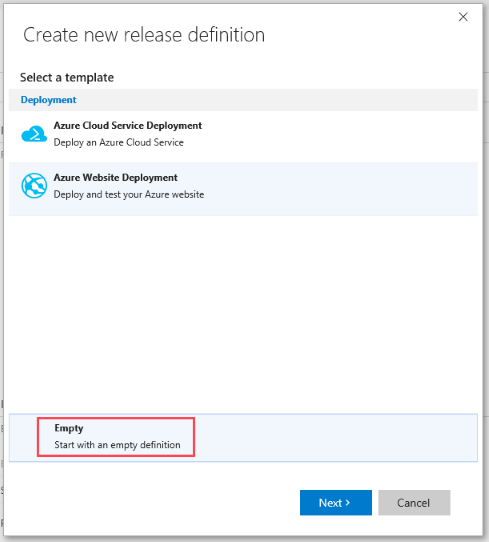

3. Make sure that the project settings are correct (the source should point towards the previously created build definition). Check the `Continuous deployment` checkbox and ensure that the agent queue is set to `Hosted` and click `Create`.

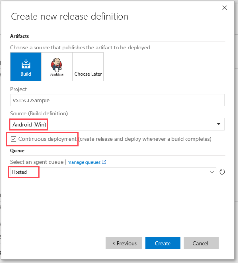

> [!NOTE]
> The `Continuous deployment` trigger tells Azure DevOps to kick-off a release each time a successful build completes. This behavior can be modified to release automatically or after a release is formally approved.

#### Configure the deployment task

For the actual CD tasks, you'll create a staging environment that will release updates via CodePush after every successful build. Followed by two production environments that will initially target a small fixed amount of production users and eventually all production users.

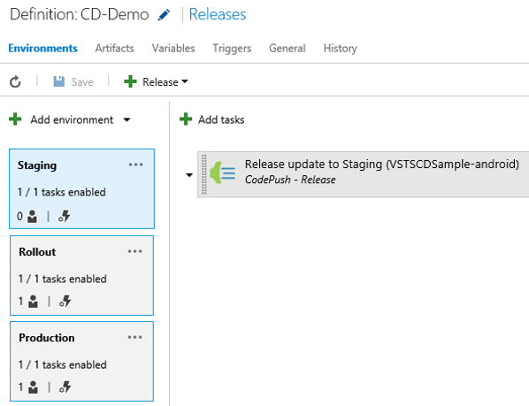

Create the described release definition by following these steps:

1. Rename the default environment to `Staging` by clicking on the "Environment 1" label, typing the new name and pressing enter.

2. Use the `CodePush CLI` to create an access key for Azure DevOps by typing `appcenter codepush tokens create -d "VSTS integration"`. Save the key for the next step.

3. Back to Azure DevOps, configure the `Staging` environment to release CodePush updates to users in the "staging ring" by clicking on `Add tasks` and selecting `CodePush - Release` from the `Deploy` category. Select it and specify the following settings:

   - Use `Access Key` as the `Authentication Method`
   - Use the key created in the previous step as the `Access Key`
   - Use `VSTSCDSample-android` (or the app name used when registering the app with CodePush if different) as the `App Name`
   - Use `Staging` as the `Deployment`
   - Use the browse button to set `Update Contents Path` to point towards the "Artifacts" folder created during the build process.

4. Add a second environment and name it `Rollout` by clicking on `Add environment` then on "Create new environment". Select `Empty`, press `Next` and specify the following settings:

   - Set `Specific users` under `Pre-deployment approval` to control what users decide to approve deployments to the `Rollout` environment.
   - Select the `trigger` to ensure this step kicks off automatically after the `Staging` release completes.

5. Configure the environment to target only a fixed number of production users, by clicking on "Add tasks" and selecting `CodePush - Promote` from the `Deploy` category. Select it and specify the following settings:

   - Use `Access Key` as the `Authentication Method`
   - Use the key created in the previous step as the `Access Key`
   - Use `VSTSCDSample-android` (or the app name used when registering the app with CodePush if different) as the `App Name`
   - Use `Staging` as the `Source Deployment`
   - Use `Production` as the `Destination Deployment`
   - Use `20%` for `Rollout` in order to deploy to only 20% of your production users

6. Save and name the release definition by pressing the Save toolbar button.

7. Add a third environment and name it `Production` by clicking on `Add environment` then on "Create new environment". Select `Empty`, press `Next` and specify the following settings:

   - Set `Specific users` under `Pre-deployment approval` to control what users decide to approve deployments to the `Rollout` environment.
   - Select the `trigger` to ensure this step kicks off automatically after the `Rollout` release completes.

8. Configure the environment to target all remaining production users, by clicking on "Add tasks" and selecting `CodePush - Patch` from the `Deploy` category. Select it and specify the following settings:
   - Use `Access Key` as the `Authentication Method`
   - Use the key created in the previous step as the `Access Key`
   - Use `VSTSCDSample-android` (or the app name used when registering the app with CodePush if different) as the `App Name`
   - Use `Production` as the `Deployment`
   - Use `Latest` as the `Release Label`
   - Use `100%` for `Rollout` in order to deploy to all remaining production users

9. Save and name the release definition by pressing the Save toolbar button.

#### Testing your Staging deployments

If you had both `Staging` and `Production` users, you could test the full release environment as configured. Since that's not the case for this tutorial, you can focus on testing the `Staging` environment.

To test the automated workflow, you'll need deploy a "release" version of the test app and push a change to the master branch in order to kick off a build and eventually a release.

You can create a "release" version of the app by generating a signed APK and installing the release build created with it. Instructions can be found on the [React Native docs](https://facebook.github.io/react-native/docs/signed-apk-android.html#content).

Deploy the app per the instructions linked above, do a small code change and commit the change to master.

Azure DevOps allows you to edit the source code on the CODE hub:

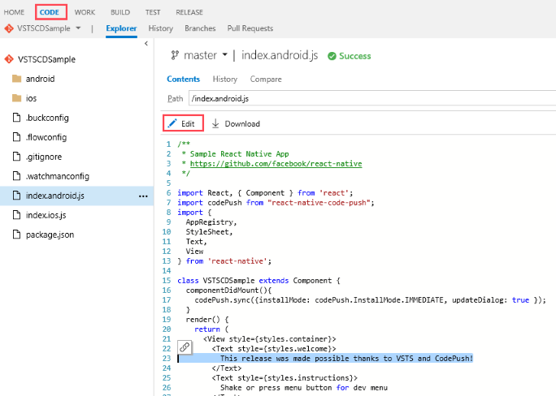

### Summary

This tutorial shows how Azure DevOps and CodePush make your developer experience better. From a high level, Azure DevOps provides teams with great tools and allows them to fully automate the build and release process while CodePush provides the flexibility to deploy automated updates from Staging to Production.
