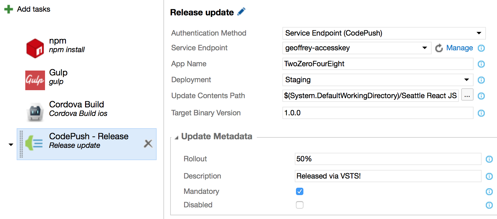
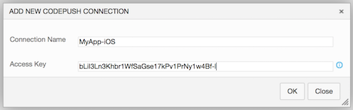

# Azure DevOps Extension

The Azure DevOps (formerly known as Visual Studio Team Services (VSTS)) CodePush extension can reduce the effort needed to keep your dev/alpha/beta/etc. deployments up-to-date, since you can push changes to the configured source control branches, and let your automated build take care of the rest. No need to manually release, promote or rollout from the App Center CLI!

These tasks can be used with either Azure DevOps or TFS 2015 Update 2 and are intended to work with any Cordova or React Native project. Additionally, the tasks can be paired nicely with the [Cordova Command task](https://marketplace.visualstudio.com/items/ms-vsclient.cordova-extension) and/or the [React Native Bundle task](https://marketplace.visualstudio.com/items?itemName=ms-vsclient.react-native-extension), which allow you to easily "prepare" the platform-specific assets that can be subsequently released to CodePush.

## Quick Start

Follow these steps to automate the release and promotion of app updates via CodePush:

1. Using the [App Center CLI](./cli.md), generate a new access token whose description indicates it will be used for Azure DevOps CI builds (e.g. `appcenter tokens create -d "VSTS-CI"`)

   > [!NOTE]
   > You can use the API key that is displayed in the App Center portal, and don't have to generate an additional token via the App Center CLI.

2. Install the **CodePush** extension from the [Azure DevOps Marketplace](https://marketplace.visualstudio.com/items/ms-vsclient.code-push)

3. Go to your Visual Studio Team Services or TFS project, click on the **Build** tab, and create a new build definition (the "+" icon) that is hooked up to your project's appropriate source repository.

   > [!NOTE]
   > If you already have a build definition setup for your app, you can feel free to re-use that. CodePush doesn't require a distinct build/release definition in order to work.

4. Click **Add build step...** and select one of the following tasks from the **Deploy** category, depending on your app type and/or requirements:

   1. **CodePush - Release (Cordova)** - Select this item if you're releasing updates for a Cordova app. See the [reference docs](./cli.md#releasing-updates-cordova) for details about how it works.

   2. **CodePush - Release** - Select this item if you're not releasing updates for a Cordova app or you want additional flexibility beyond what the platform-specific tasks provide you. See the [reference docs](./cli.md#releasing-updates-general) for details about how it works.

5. Configure the release task with the access token created or retrieved in step #1, specifying your app name (e.g. **MyApp-iOS**), deployment name, and all other required parameters. See the reference docs below in order to find details on each option. 

6. Click the **Queue Build** button or push a change to your repository in order to run the newly defined build pipeline

7. Run your CodePush-ified app to see the change that was automatically deployed!

Moving forward, you can choose to take advantage of the **CodePush - Promote** task for automating the release of updates to one deployment (e.g. **Staging**) and then automating the promotion of it to another deployment (e.g. **Production**) as appropriate. This task pairs well with the Azure DevOps Release Management capabilities, where you can define multiple environments (each with their own deployment pipeline), as well as manual approvers, which allows you to automate updates, without sacrificing any of the controls you want in terms of validation.

## Globally Configuring Your Credentials

In addition to specifying your access token directly within each build task instance (as illustrated in the getting started section), you can also configure your CodePush credentials globally and refer to them within each build or release definition as needed. This can simplify the use of CodePush across a team, and increase security, since every build and release definition doesn't have to manually configure the account credentials. To do this, perform the following steps:

1. Generate or retrieve your access token as described above

   > [!NOTE]
   > If you want to retrieve a previously generated access token, you can run the `appcenter token list` command and look for the token with the description you specified when initially creating it.*

2. Go into your Visual Studio Team Services or TFS project and click on the gear icon in the upper right corner

3. Click on the **Services** tab

4. Click on **New Service Endpoint** and select **CodePush**

   > [!NOTE]
   > If you're using CodePush as part of an integration with HockeyApp, you can also select the **HockeyApp** service endpoint type instead.*

5. Give the new endpoint a name (e.g. "MyApp-iOS") and enter the access token you generated in step #1

    

6. Select this endpoint via the name you chose in #5 whenever you add a CodePush task to a build or release definition.

7. Release app updates!

## Task Reference

In addition to the custom service endpoint, this extension also contributes the following build and release tasks:

* [**CodePush - Release**](#codepush---release) - Allows automating the release of general-purpose content to the CodePush server. This task provides the most flexibility, but should only be used if the platform-specific tasks (e.g. Cordova) aren't appropriate for your needs.

* [**CodePush - Release (Cordova)**](#codepush---release-cordova) - Allows automating the generation and release of Cordova app updates. Represents a simplified, Cordova-specific version of general-purposes release task, and is recommended for all Cordova scenarios.

* [**CodePush - Patch**](#codepush---patch) - Allows automating the modification of a previously released update. This option can be useful for scenarios such as increasing the rollout of a release that was originally "flighted" (e.g. to `25%` of users)  or enabling a release that was disabled by default.

* [**CodePush - Promote**](#codepush---promote) - Allows automating the promotion of a previously released update from one deployment to another (e.g. **Staging** -> **Production**).

### CodePush - Release

Allows you to release a CodePush update to the App Center server. This task behaves equivalently to the [`appcenter codepush release`](./cli.md#releasing-updates-general) command in the App Center CLI, and includes the following options:

1. **Authentication Method** - Specifies how you would like to authenticate with the App Center server. The available options are:

   1. **Access Token** - Allows you to directly specify an access token to the task. This value can either have been generated by the App Center CLI, or provided to you by the App Center portal after you autoprovisioned your account and app.

   2. **Service Endpoint (CodePush)** - Allows you to reference a globally configured CodePush service endpoint.

   3. **Service Endpoint (HockeyApp)** - Allows you to reference a globally configured HockeyApp service endpoint.

2. **App Owner/App Name** *(String, Required)* - Name of the app owner and app you want to release the update for (e.g. `<ownerName>/MyApp-iOS`).

3. **Deployment** *(String, Required)* - Name of the deployment you want to release the update to. Defaults to **Staging**.

4. **Update Contents Path** *(File path, Required)* - Path to the file or directory that contains the update you want to release. For Cordova, it should be the platform-specific **www** folder (e.g **platforms/ios/www**) and for React Native it should point to either your generated JS bundle file (e.g. **ios/main.jsbundle**) or a directory containing your JS bundle and assets, depending on if you're using the React Native assets system. View the [CLI docs](./cli.md#update-contents-parameter) for more details.

5. **Target Binary Version** *(String, Required)* - **Semver** expression that specifies the binary app version(s) this release is targeting (e.g. 1.1.0, ~1.2.3). View the [CLI docs](./cli.md#target-binary-version-parameter) for more details.

##### Update Metadata

In addition to the basic properties, the follow options provide more advanced control over the release and how it will be distributed to your end users:

1. **Rollout** *(String)* - Percentage of users this release should be immediately available to. Defaults to _100%_.

2. **Description** *(String)* - Description of the changes made to the app in this release. When this task is used within an Azure DevOps release definition, this field can be set to the `$(Release.ReleaseDescription)` variable in order to inherit the description that was given to the release.

3. **Mandatory** *(Boolean)* - Specifies whether this release should be considered mandatory. Defaults to `false`.

4. **Disabled** *(Boolean)* - Specifies whether this release should be immediately downloadable. Defaults to `false`.

### CodePush - Release (Cordova)

Allows you to release Cordova app CodePush updates to the App Center server. It provides a simplified experience over the general-purpose release task by automatically generating the release contents for you (via `cordova prepare`), and inferring your app's version in order to appropriately target the update. This task behaves equivalently to the [`appcenter codepush release-cordova`](./cli.md#releasing-updates-cordova) command in the App Center CLI, and includes the following options:

1. **Authentication Method** - Specifies how you would like to authenticate with the App Center server. The available options are:

   1. **Access Token** - Allows you to directly specify an access token to the task. This value can either have been generated by the App Center CLI, or provided to you by the App Center portal after you autoprovisioned your account and app.

   2. **Service Endpoint (CodePush)** - Allows you to reference a globally configured CodePush service endpoint.

   3. **Service Endpoint (HockeyApp)** - Allows you to reference a globally configured HockeyApp service endpoint.

2. **App Owner/App Name** *(String, Required)* - Name of the app you want to release the update for (e.g. `<ownerName>/MyApp-iOS`).

3. **Deployment** *(String, Required)* - Name of the deployment you want to release the update to. Defaults to **Staging**.

4. **Build** *(Boolean*) - Specifies whether you want the tasks to run `cordova build` instead of `cordova prepare`. This option can be useful if your app has Cordova build tasks that you want to be triggered. Defaults to `false`.

#### Update Metadata

In addition to the basic properties, the follow options provide more advanced control over the release and how it will be distributed to your end users:

1. **Rollout** *(String)* - Percentage of users this release should be immediately available to. Defaults to _100%_.

2. **Description** *(String)* - Description of the changes made to the app in this release. When this task is used within an Azure DevOps release definition, this field can be set to the `$(Release.ReleaseDescription)` variable in order to inherit the description that was given to the release.

3. **Target Binary Version** *(String, Required)* - **Semver** expression that specifies the binary app version(s) this release is targeting (e.g. 1.1.0, ~1.2.3). View the [CLI docs](./cli.md#target-binary-version-parameter) for more details. Selecting `Auto-Detect` will automatically read the app's version from the **config.xml** file.

4. **Mandatory** *(Boolean)* - Specifies whether this release should be considered mandatory. Defaults to `false`.

5. **Disabled** *(Boolean)* - Specifies whether this release should be immediately downloadable. Defaults to `false`.

### CodePush - Patch

Allows you to update the metadata for a previously released update. This task behaves equivalently to the [`appcenter codepush patch`](./cli.md#patching-update-metadata) command in the App Center CLI, and includes the following options:

1. **Authentication Method** - Specifies how you would like to authenticate with the CodePush server. The available options are:

   1. **Access Token** - Allows you to directly specify an access token to the task. This value can either have been generated by the CodePush CLI, or provided to you by the App Center portal after you autoprovisioned your account and app.

   2. **Service Endpoint (CodePush)** - Allows you to reference a globally configured CodePush service endpoint.

   3. **Service Endpoint (HockeyApp)** - Allows you to reference a globally configured HockeyApp service endpoint.

2. **App Owner/App Name** *(String, Required)* - Name of the app that includes the release you want to update (e.g. `<ownerName>/MyApp-iOS`).

3. **Deployment** *(String, Required)* - Name of the deployment that includes the release you want to update. Defaults to **Staging**.

4. **Release Label** *(String, Required)* - Label of the release you want to update the metadata for (e.g. `v23`). Selecting **Latest** will update the latest release within the specified deployment. Defaults to **Latest**.

#### Update Metadata

By default, no release attributes are modified by the patch operation, so in order to update any metadata, you need to change the default value for one or more of the following options in this group.

1. **Rollout** *(String)* - Percentage of users this release should be immediately available to. Selecting **Inherit** will leave these attributes unmodified. Defaults to **Inherit**.

2. **Description** *(String)* - Description of the changes made to the app in this release. Selecting **Inherit** will leave these attributes unmodified. When this task is used within an Azure DevOps release definition, this field can be set to the `$(Release.ReleaseDescription)` variable in order to inherit the description that was given to the release. Defaults to **Inherit**.

3. **Target Binary Version** *(String, Required)* - **Semver** expression that specifies the binary app version(s) this release is targeting (e.g. 1.1.0, ~1.2.3). View the [CLI docs](./cli.md#target-binary-version-parameter) for more details. Selecting **Inherit** will leave these attributes unmodified. Defaults to **Inherit**.

4. **Mandatory** *(Boolean)* - Specifies whether this release should be considered mandatory. Selecting **Inherit** will leave these attributes unmodified. Defaults to **Inherit**.

5. **Disabled** *(Boolean)* - Specifies whether this release should be immediately downloadable. Selecting **Inherit** will leave these attributes unmodified. Defaults to **Inherit**.

### CodePush - Promote

Allows you to promote a previously released update from one deployment to another (e.g. **Staging** -> **Production**), and enables the use of [Azure DevOps Release Management](https://docs.microsoft.com/vsts/build-release/concepts/definitions/release/what-is-release-management) for easily handling multiple app environments from your CI environment. This task behaves equivalently to the [`appcenter codepush promote`](./cli.md#promoting-updates) command in the management CLI, and includes the following options:

1. **Authentication Method** - Specifies how you would like to authenticate with the CodePush server. The available options are:

   1. **Access Token** - Allows you to directly specify an access token to the task. This value can either have been generated by the CodePush CLI, or provided to you by the App Center portal after you autoprovisioned your account and app.

   2. **Service Endpoint (CodePush)** - Allows you to reference a globally configured CodePush service endpoint.

   3. **Service Endpoint (HockeyApp)** - Allows you to reference a globally configured HockeyApp service endpoint.

2. **App Owner/App Name** *(String, Required)* - Name of the app that has the deployments you are targeting for promotion (e.g. `<ownerName>/MyApp-iOS`).

3. **Source Deployment** *(String)* - Name of the deployment you want to promote the latest release from. Defaults to **Staging**.

4. **Destination Deployment** *(String)* - Name of the deployment you want to promote the release to. Defaults to **Production**.

#### Update Metadata

By default, when a release is promoted from one deployment to another, the newly created release will "inherit" not just the update contents, but also the metadata (e.g. `description`). This ensures that what is being promoted is the exact same thing that you tested in the source deployment. However, if you want to override one or more properties in the newly created release within the target deployment (e.g. because you use `mandatory` differently between environments), you can use the following fields:

1. **Rollout** *(String)* - Percentage of users this release should be immediately available to. Defaults to `100%`

2. **Description** *(String)* - Description of the changes made to the app in this release. Selecting **Inherit** will use the description from the release being promoted. When this task is used within an Azure DevOps release definition, this field can be set to the `$(Release.ReleaseDescription)` variable in order to inherit the description that was given to the release. Defaults to **Inherit**.

3. **Target Binary Version** *(String)* - **Semver** expression that specifies the binary app version(s) this release is targeting (e.g. 1.1.0, ~1.2.3). Selecting **Inherit** will use the target binary version attribute from the release being promoted. Defaults to **Inherit**. View the [CLI docs](./cli.md#target-binary-version-parameter) for more details.

4. **Mandatory** *(Boolean)* - Specifies whether this release should be considered mandatory. Selecting **Inherit** will use the mandatory attribute from the release being promoted. Defaults to **Inherit**.

5. **Disabled** *(Boolean)* - Specifies whether this release should be immediately downloadable. Selecting **Inherit** will use the disabled attribute from the release being promoted. Defaults to **Inherit**.
