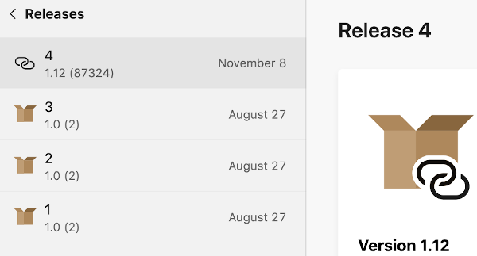

# Distributing releases with externally hosted builds

You can create a release for your app in App Center without uploading the build or binary file. You instead provide the link to the place where you're hosting the file. App Center won't download the file. Some functionality will be missing, but mostly everything behaves the same way.

On this page you can read how to create releases with externally hosted builds, and what the requirements and limitations are.

## Creating a release with an externally hosted build

You start creating a release to a tester or group of testers the same way as any release. Then find the option for creating a release where the build binary is hosted externally:

1. Open your app in the App Center website and then go to **Distribute** > **Releases** and choose **New release**.
2. Choose **Specify build URL** to go to the wizard for creating a release without uploading a binary to App Center.
3. Enter the required information
   1. The HTTPS URL pointing to the binary you're hosting.
   2. The build number of your release.
   3. For some operating systems: the version of your release.
4. Choose **Next** to enter the rest of the release information. From here on, the flow is the same as for regular releases.
5. On the **Notes** tab, optionally enter the release notes for your testers. Choose **Next**.
6. On the **Destinations** tab, select the tester(s)/group(s) to distribute the release to. Choose **Next**.
7. On the **Review** tab, verify the details of the release. Optionally select not to notify users of the release.
8. Finally choose **Distribute** to distribute the release. It will appear to the testers you gave access and they'll be notified depending on your settings.

## Using the API to create a release with an externally hosted build

You can create a release with a binary hosted outside of App Center using the Application Programming Interface (API). The first step is to create the release, along with the right URL and version numbers. After that, you can optionally update the release with more details and distribute it to testers.

If you're not familiar with the App Center API or APIs in general, start by reading the [App Center API introduction](../api-docs/index.md). There you can learn how to authenticate against the API, and how to find your owner name and app name. You need these values below.

### Creating the external release

To create a release, send a `POST` request to the `/v0.1/apps/{owner_name}/{app_name}/releases` endpoint. This endpoint takes a body with the following parameters:

- `external_download_url` (required): The HTTPS URL pointing to the binary you're hosting.
- `build_version` (required): The version of your release.
- `build_number`: The build number of your release.

The `{owner_name}` parameter in the URL is the name of the organization or user account that owns the app, and `{app_name}` is the name of the app. See the [App Center API introduction](../api-docs/index.md#find-your-app-center-app-name-and-owner-name) to learn how to find these values for your app.

As an example, let's create a new release for the app `Calculator` owned in App Center by the `MyCorp` organization. The build file is hosted at `https://mycorp.example.com/calculator/builds/42`. The version is `1.12` and the build number is `87324`.

Send a `POST` request to `https://api.appcenter.ms/v0.1/apps/MyCorp/Calculator/releases` with the following JSON `body`:

``` json
{
    "build_version": "1.12",
    "build_number": "87324",
    "external_download_url": "https://mycorp.example.com/calculator/builds/42"
}
```

Set your API token in the `X-API-Token` header and set the `Content-Type` header to `application/json`. An example response will be (some values omitted):

``` json
{
    "app_name": "Calculator",
    "is_external_build": true,
    "id": 4,
    "version": "87324",
    "short_version": "1.12",
    "download_url": "https://mycorp.example.com/calculator/builds/42",
    "install_url": "https://mycorp.example.com/calculator/builds/42",
    "destinations": []
}
```

The URL you provided is the download URL, and `is_external_build` shows this is the right type of release. The install URL can be different depending on the operating system of the app. The `destinations` list is empty, meaning no testers have access to the release yet. Let's distribute the release next.

### Distributing the release

After creating the release, you distribute it by calling the [distribute to a group POST endpoint](https://openapi.appcenter.ms/#/distribute/releases_addDistributionGroup) `/v0.1/apps/{owner_name}/{app_name}/releases/{release_id}/groups`. Or you can use the similar endpoint for distributing to testers. Keep in mind you can not distribute a release with an externally hosted build to stores. See [Requirements and limitations](#requirements-and-limitations).

Use the `id` value returned when you created the release for the `{release_id}` parameter in the URL. Find the `id` of the group you want to distribute to by calling the [distribution groups GET endpoint](https://openapi.appcenter.ms/#/account/distributionGroups_list). Here we are distributing the release to the group `86aa9283-4e04-4872-a003-208c267d9388` and notifying testers of the release:

``` json
{
  "id": "86aa9283-4e04-4872-a003-208c267d9388",
  "notify_testers": true
}
```

## Requirements and limitations

Externally hosted releases have the following requirements and limitations:

- If you created your app in App Center (i.e. you didn't move from HockeyApp), your first release must be a normal one. After that, you can create both normal and externally hosted build releases.
- You must host the binary behind a secure HTTPS URL. App Center doesn't accept URLs starting with `http://`, but only ones starting with `https://`.
- You can only distribute releases with externally hosted builds to testers and groups. Stores like Google Play and the App Store require that you send them the binary.
- In-app updates don't work.
- App Center can't show the MD5 hash, file size, or provisioning profile of the binary.
- App Center can't re-sign your binary or automatically manage devices for iOS applications.

## Identifying releases with externally hosted builds

Releases with externally hosted builds show up in App Center with a chain symbol in the icon. When you query the API for release details, the ones showing `is_external_build` as `true` are the releases with builds hosted outside of App Center.



*In this figure, release 4 is an external release, while the other three are hosted by App Center.*
