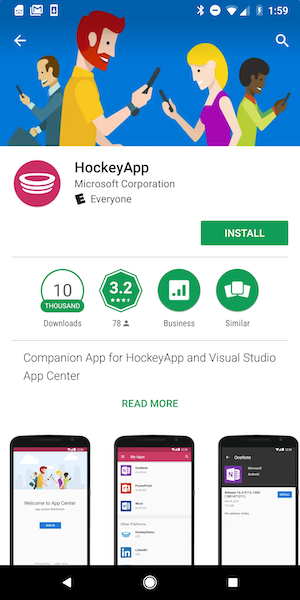

# Testing Android Apps

After getting invited to test an Android Application in App Center you will receive an email notifying you of your pending invitation. The following sections outline the steps you need to take to get started testing this app.

## Device configuration

> [!Warning]
> Changing security settings put your phone at risk of malicious software. Only install apps from developers you trust. [Read about Google Play Protect which helps you protect your data](https://support.google.com/nexus/answer/2812853?hl=en&ref_topic=3416293).

### Android 8.x and higher

* Swipe up or down from the center of the display on a Home screen, to access the apps screen.
* Select **Settings and Apps** or **Settings** depending on the device brand.
* Search for special access in the search bar.
* Tap **Special access**.
* Tap **Install unknown apps**.
* Select your browser, then tap the **Allow from this source** switch to turn on or off.

### Android 7.x and lower

* From the device Home screen, navigate to **Settings**.
* Tap **Lock screen and security** or **Security** depending on the device brand.
* Tap the **Unknown sources** switch to turn it on.
* Review the prompt and tap **OK**.

## Installing an app via Install Portal

Installing an app on your Android device is done primarily from the App Center install portal or our native app, which is explained in the next section. Installing your apps can be done in two different ways depending on the developer's preference:

1. You will receive an email from App Center that directs you to the release in the App Center. You can also elect to go directly to the [App Center Install Portal](https://install.appcenter.ms) at any point to see apps you've been added to and their releases.

2. The developer sends you an installation link. By using this link, you will be navigated directly to the app in the install portal where you can view and download a release. 

Once you have navigated to the install portal, you will see a list of all available apps you have been added to as a tester.

When you click on an app, App Center displays additional information about the app. Click the blue **Install** button to install the app.

Clicking this button initiates the application install, which will result in the app being placed onto your home screen.

Lastly, if you have a QR code reader handy, you can navigate to our [App Center Developer Portal](https://appcenter.ms/apps)  and select the application you're testing there. App Center will display a QR code that navigates you directly to the app's download page.

## Using the App Center Android App

To get started using our native app, simply download it from the [Google Play Store](https://play.google.com/store/apps/details?id=com.microsoft.hockeyapp.testerapp&hl=en_US) or by searching for **"HockeyApp"**

This app allows you to manage all of your apps and their releases within the app, rather than navigating to our install portal.

After logging in, you will be presented with list of all the apps you've been invited to test. By selecting any of the apps you can review the release history and download the selected app by clicking the **blue install button**. Clicking this will initiate the installation process on your phone.

> [!TIP]
> Located on the top-right of the screen, you can use the search bar to quickly find your desired app.

## Troubleshooting

Here are some common issues along with their solutions we've seen in the installation process:

**While installing the app, I get an "Install Blocked" due to an unknown sources error:**

In order for the app to be available for use, you must allow for apps to be installed from sources outside the Google Play Store. From your home screen or menu, tap on **Settings>Security**. Under the **Device Administration** heading, check the box next to **Unknown Sources**. 

**While installing the app, I get a "There was an Problem Parsing the Package" error:**

This error is caused by one of the following reasons:

* The application may not have downloaded successfully
* Application might not be compatible for your hardware or OS version
* Security settings not set accordingly
* Corrupted APK file
* Name of the package is changed after signing

To troubleshoot, try reinstalling the app. If that doesn't work, contact the app developer to help resolve the issue.
