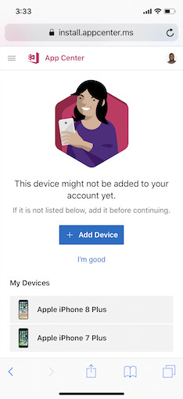
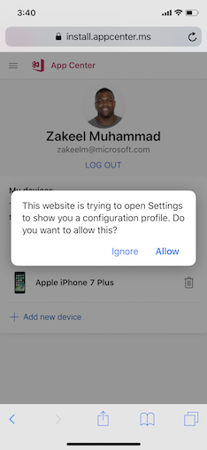
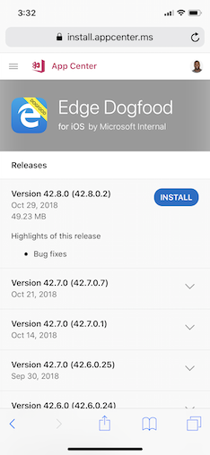

# Testing iOS Apps

After getting invited to test an iOS Application in App Center you will receive an email notifying you of your pending invitation. The following sections outline the steps you need to take to get started testing this app.

## Adding your Device

Adding your device to link to your App Center account is a necessary step in the iOS installation process if you've received an email from App Center to create an account and test an app. The device registration process allows apps to be installed onto your device. Without it, you won't be able to install the app you're supposed to be testing.

If you don't already have a device added to your account, when a new release is available to you, you will be able to add a new device via the link given to you in the release email or directly from the App Center install portal.

Adding your device consists of the following steps:

1. Navigate to the App Center install portal device menu on the device you're attempting to add. This can be done through either of the following methods:

    * Click the add device button located in the email you received when a release was distributed.
    * Click the profile icon in the upper-left corner of the App Center portal.

    

2. Click the **Add new device** button within the App Center install portal. App Center will display a dialog asking to show you a configuration profile.

    

3. Select the **Allow** button to view this profile. This profile is a necessary part of adding your device.

    

4. Click the **install button** in the upper-right corner of this screen to install this profile.
5. Once the profile installs, App center will direct you to the install portal. The device you're using will now be in the "My Devices" table.

> [!NOTE]
> If the developer has made the app available publicly for testing and you receive a direct installation link, then adding your device isn't necessary.

## Installing an app

Installing an app on your iOS device is done primarily from the App Center install portal, which is explained in the next section. Installing your apps can be done in two different ways depending on the developer's preference:

1. You will receive an email from App Center that directs you to the release in the App Center. You can also elect to go directly to the [App Center Install Portal](https://install.appcenter.ms) at any point to see apps you've been added to and their releases.

2. The developer sends you an installation link. By using this link, you will be navigated directly to the app in the install portal where you can view and download a release.

Once you have navigated to the install portal, you will see a list of all available apps you have been added to as a tester.

When you click on an app, App Center displays additional information about the app. Click the **blue install button** to install the app.

Clicking this button initiates the application install, which will result in the app being placed onto your home screen.

Lastly, if you have a QR code reader handy, you can navigate to our [App Center Developer Portal](https://appcenter.ms/apps)  and select the application you're testing there. App Center will display a QR code that navigates you directly to the app's download page.

## Troubleshooting

Here are some common issues along with their solutions we've seen in the installation process:

**I get the message “Untrusted Enterprise Developer”**:

In order for the app to be available for use, you will need to trust the developer's certificate. From your phone’s home screen, tap Settings > General > Profiles or Profiles & Device Management. Under the Enterprise App heading, you see will see a profile for the developer. Tap the name of the developer profile and then confirm you trust them. You should now be able to launch the app.

**While installing the app, I get an “Unable to Download App” error, and the app is not installed.**:

This error could be caused by many reasons, and you should contact the app developer to help resolve the issue. If you are the app developer, this error could be caused by one of the following reasons:

* UDID is not included in the provisioning profile
* The build was incorrectly signed or has broken entitlements
* Device or iOS version is incompatible with the build
* Device storage is full
* Actual download error
* App is over 50 MB and downloaded over a cellular connection

**When I press the “Install” button, the installation alert never shows up and the app never installs on my device.**:

If you have previously installed the app from the App Store, and it carries the same version of the app that is being installed, there will be no alert to confirm the installation. As a workaround, please try uninstalling the existing version of the app, and then tap the Install button again.
