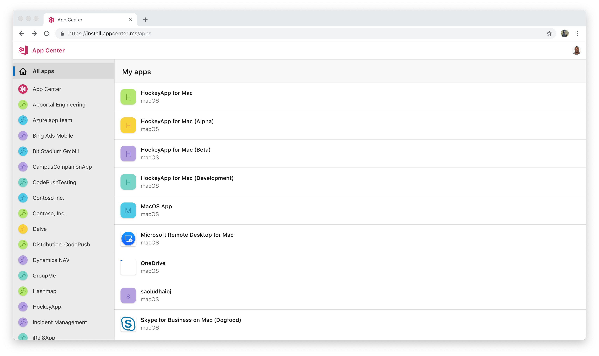
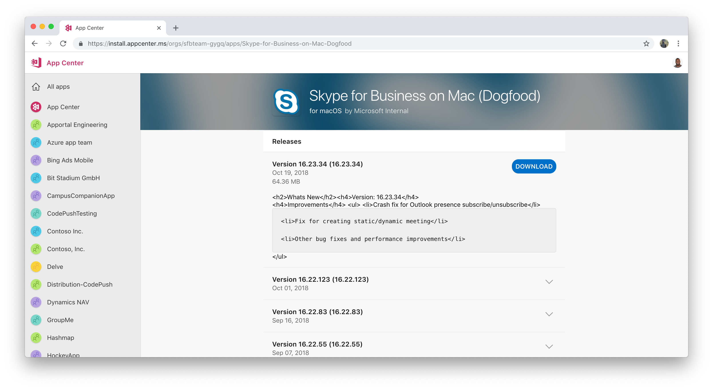

# Testing macOS Apps

After getting invited to test a macOS application in App Center you will receive an email notifying you of your pending invitation. The following sections outline the steps you need to take to get started testing this app.

## Installing an app

Installing an app on your macOS device is done primarily from the App Center install portal or our native app, which is explained in the next section. Installing your apps can be done in two different ways depending on the developer's preference:

1. You will receive an email from App Center that directs you to the release in the App Center. You can also elect to go directly to the [App Center Install Portal](https://install.appcenter.ms) at any point to see apps you've been added to and their releases.

2. The developer sends you an installation link. By using this link, you will be navigated directly to the app in the install portal where you can view and download a release.

Once you have navigated to the install portal, you will see a list of all available apps you have been added to as a tester.

 By clicking the app you can see additional information regarding the release history and install it by clicking the **blue download button**. Clicking this button will initiate the application download directly in the browser.

Once the download is finished, you can install the app by going to your downloads folder and double-clicking the downloaded file.