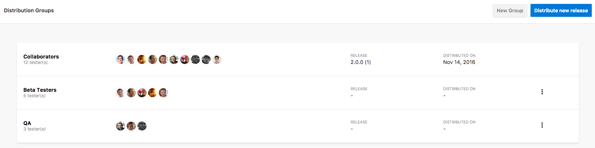

# Release a Build

In order to distribute a release via App Center, you must first upload your application binary package to App Center. App Center supports package uploads for iOS, Android, UWP and macOS.

## Generating an application binary package

### iOS

You will need to use the following steps to generate an IPA package for your application. For full details of this process please see the official [Apple documentation][apple-ipa].

1. [Register UDIDs][apple-devices] for all hardware devices in your provisioning profile.
2. Archive your application. In Xcode go to **Product > Archive**
3. Export the archive using the proper provisioning profile. Make sure to remember where the IPA file was placed on disk.

### Android

For Android you will need to produce a properly signed apk file. For full details of this process please see the official [Google documentation][google-apk].

1. Ensure you have [updated the manifest][android-manifest] and have a properly [configured Gradle build][gradle-config].
2. Build the APK. From Android Studio select the build variant and then execute command **Build > Build APK**.

> [!NOTE]
> Android studio places built APKs in *project-name*/*module-name*/build/outputs/apk/

## Uploading the package

To upload a package to App Center, use the navigation bar on the left to navigate to Distirbution. Then click "Distribute new release" button. Drag and drop or click to open a file dialog to upload your package. Next you have the option to include release notes. Both plain text and markdown formats are supported. Click next and select a Distribution Group. This release will only be available to the users that have been added to that specific Distribution Group. Click next and review the release, then click distribute to release. On clicking the distribute button the release will be made available via App Center and an email notification of the new version will be sent to all users of this application. Congrats, you have successful distributed a release via App Center.

### Uploading using the App Center Command Line Interface

As an alternative to uploading from the App Center site, you can also upload your release using the `appcenter distribute release` command in the [App Center CLI][appcenter-cli]. 

### Uploading using the APIs

One other alternative for uploading releases is using the public App Center APIs.

1. Pre-req: [Obtain an API token][api-token-docs]. An API Token is used for authentication for all App Center API calls.
2. Identify the `{owner_name}` and `{app_name}` for the app that you wish to upload to. These will be used in the URL for the API calls. For an app owned by a user, the URL in App Center might look like: https://appcenter.ms/users/JoshuaWeber/apps/APIExample. Here, the `{owner_name}` is `JoshuaWeber` and the `{app_name}` is `ApiExample`. For an app owned by an org, the URL might be <https://appcenter.ms/orgs/Microsoft/apps/APIExample> and the `{owner_name}` would be `Microsoft`.
3. Upload a new release. This is done using 3 sequential API calls. 
    
    a. Create an upload resource and get an `upload_url` (good for 24 hours) — [POST /v0.1/apps/{owner_name}/{app_name}/release_uploads][POST_releaseUpload]
    
    ` curl -X POST --header 'Content-Type: application/json' --header 'Accept: application/json' --header 'X-API-Token: xxxxxxxxxxxxxxxxxxxxxxxxxxxxxxxxxxxxxxxx' 'https://api.appcenter.ms/v0.1/apps/JoshuaWeber/APIExample/release_uploads' `
    
    b. Copy the `upload_url` (will be a rink.hockeyapp.net URL) from the response in the previous step, and also save the `upload_id` for the step after this one. Upload to `upload_url` using a POST request. Use `multipart/form-data` as the Content-Type, where the `key` is `ipa` (key is always ipa even when uploading Android APKs) and the `value` is `@/path/to/your/build.ipa`.
    
    ` curl -F "ipa=@Versions_1_1_0_12.ipa" https://rink.hockeyapp.net/api/sonoma/apps/cacf9867-87f7-4649-a400-632a775dde2d/app_versions/upload\?upload_id\=c18df340-069f-0135-3290-22000b559634 `
    
    c. After the upload has finished, update upload resource's status to committed and get a `release_url`, save that for the next step — [PATCH /v0.1/apps/{owner_name}/{app_name}/release_uploads/{upload_id}][PATCH_updateReleaseUpload]
    
    ` curl -X PATCH --header 'Content-Type: application/json' --header 'Accept: application/json' --header 'X-API-Token: xxxxxxxxxxxxxxxxxxxxxxxxxxxxxxxxxxxxxxxx' -d '{ "status": "committed"  }' 'https://api.appcenter.ms/v0.1/apps/JoshuaWeber/APITesting/release_uploads/c18df340-069f-0135-3290-22000b559634' `

4. Distribute the uploaded release to a distribution group — [PATCH /v0.1/apps/{owner_name}/{app_name}/releases/{release_id}][PATCH_updateRelease]
    
    ` curl -X PATCH --header 'Content-Type: application/json' --header 'Accept: application/json' --header 'X-API-Token: xxxxxxxxxxxxxxxxxxxxxxxxxxxxxxxxxxxxxxxx' -d '{ "destination_name": "QA Testers", "release_notes": "Example new release via the APIs" }' 'https://api.appcenter.ms/v0.1/apps/JoshuaWeber/APITesting/releases/2' `

## Re-Release a build

To release a build to another distribution group, navigate to the release details page either through the Releases tab on the distribution group page, or from the Releases page in the left sidebar menu. Click on the "Distribute" button in the upper right-hand corner of the screen to initiate the re-release process. Once the modal has opened, select the distribution group you would like to release the build to. After selecting the group and reviewing the release details, click the "Distribute" button to send the release to testers.  

[apple-ipa]: https://developer.apple.com/library/content/documentation/IDEs/Conceptual/AppDistributionGuide/TestingYouriOSApp/TestingYouriOSApp.html#//apple_ref/doc/uid/TP40012582-CH8-SW1
[apple-devices]: ./auto-provisioning.md
[google-apk]: https://developer.android.com/studio/publish/preparing.html
[gradle-config]: https://developer.android.com/studio/build/build-variants.html
[android-manifest]: https://developer.android.com/guide/topics/manifest/manifest-intro.html
[api-token-docs]: ~/api-docs/index.md
[appcenter-cli]: https://github.com/Microsoft/appcenter-cli
[POST_releaseUpload]: http://openapi.appcenter.ms/#/distribute/releaseUploads_create
[PATCH_updateReleaseUpload]: http://openapi.appcenter.ms/#/distribute/releaseUploads_complete
[PATCH_updateRelease]: http://openapi.appcenter.ms/#/distribute/releases_update