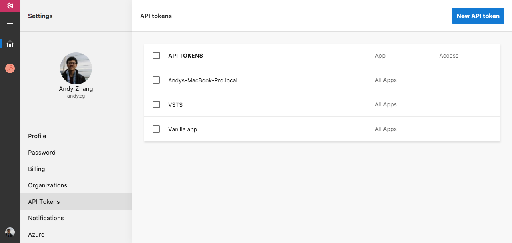
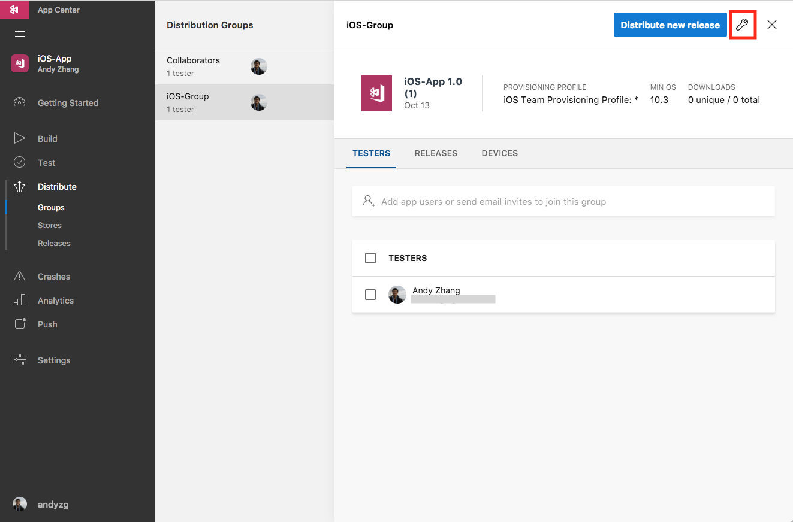
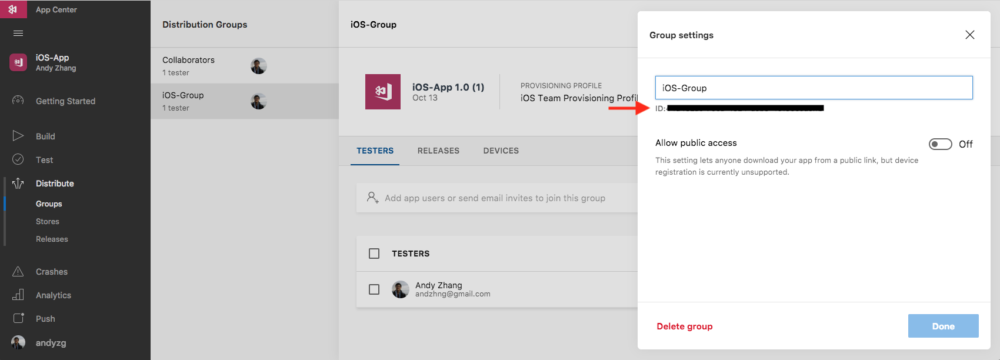
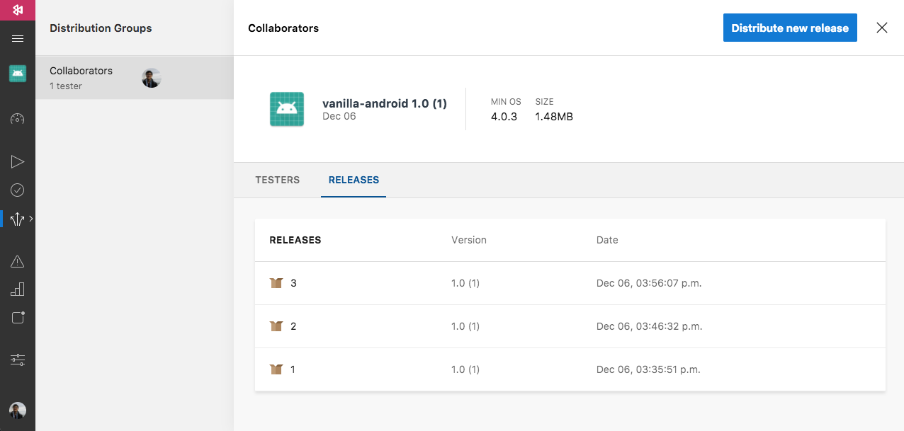

---
# required metadata

title: Deploy VSTS Builds with App Center
description: Deploy VSTS builds with App Center
keywords: deploy, vsts, visual studio team services, build
author: andyzg
ms.author: t-anzha

ms.date: 12/06/2017
ms.topic: article
ms.service: vs-appcenter

ms.assetid: 476938ee-f086-4145-889f-02f2e90f78ff
---

# Deploy VSTS Builds with App Center

With the Deploy with App Center Task on Visual Studio Team Services, you can deploy your apps from VSTS
to App Center. By deploying to App Center, you will be able to distribute your
builds to your users.

## Creating a signed build

Before you can deploy your app to Visual Studio App Center, make sure that your existing VSTS build definition produces a signed build. Only signed builds can be deployed and installed to devices.

## Setting up distribution with App Center

Once you're done with the signing task, add the build task <strong>App Center
Distribute</strong>. This task uploads your signed build to App Center so that you can
distribute it to your beta testers.

To fill in the App Center Distribute task, you'll need an API key from App
Center. Go to [App Center](https://appcenter.ms) and go to your Account Settings.

Create a new API token, and copy it. Make sure that the API token has full
access so that VSTS can create new releases for distribution. Go back to the 
App Center Distribute task in your VSTS build definition, and create a 
new **App Center Connection**. Paste the API key you copied from App Center, 
and name your connection.

After you've created the connection between VSTS and App Center, VSTS needs to
know which app you want to distribute the signed build to. Grab the app slug
from App Center. You can find this by going to your project on App Center, and
extracting it based on `https://appcenter.ms/users/{username}/apps/{app_identifier}`.
For example, the app slug for `https://appcenter.ms/users/andyzg/apps/vanilla-android` is `andyzg/vanilla-android`.

Next, define the binary file path of where your apps are going to get built.

Lastly, add some release notes for your distribution.

By default, your app will distibuted to the Collaborators group.
Optionally, you can specify a distribution group by providing the App Center
Distribution Group ID. This can be found by first selecting a distribution group, and
then viewing the distribution group settings.

You'll be able to find the distribution group ID below the distribution group
name.

### Distributing the signed builds to App Center

Once you finished configuring the App Center Distribute task, you can Save and Queue
your build. If it's successful, your signed build will be uploaded to the
releases of the defined distribution group.

Now that your signed build is in App Center, you're all set! You and your users
can download the signed build directly from App Center, or further re-distribute the release to another group.

[vsts-deploy-api]: images/vsts-deploy-api.png
[vsts-deploy-app-center-api]: images/vsts-deploy-app-center-api.png
[vsts-deploy-app-center-slug]: images/vsts-deploy-app-center-slug.png
[vsts-deploy-app-center-binary]: images/vsts-deploy-app-center-binary.png
[vsts-deploy-app-center-notes]: images/vsts-deploy-app-center-notes.png
[vsts-deploy-group-id]: images/vsts-deploy-group-id.png
[vsts-deploy-app-center-group]: images/vsts-deploy-app-center-group.png
[vsts-deploy-app-center-releases]: images/vsts-deploy-app-center-releases.png
