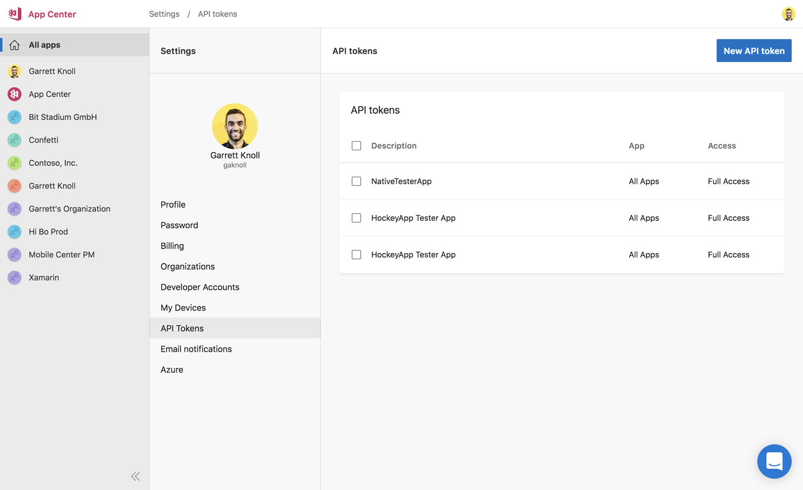
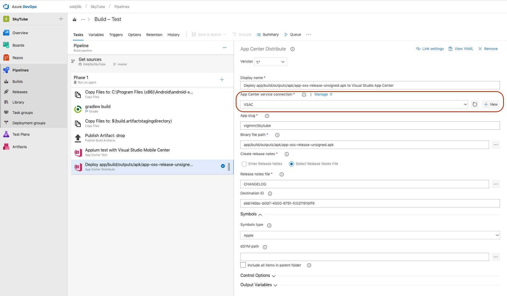
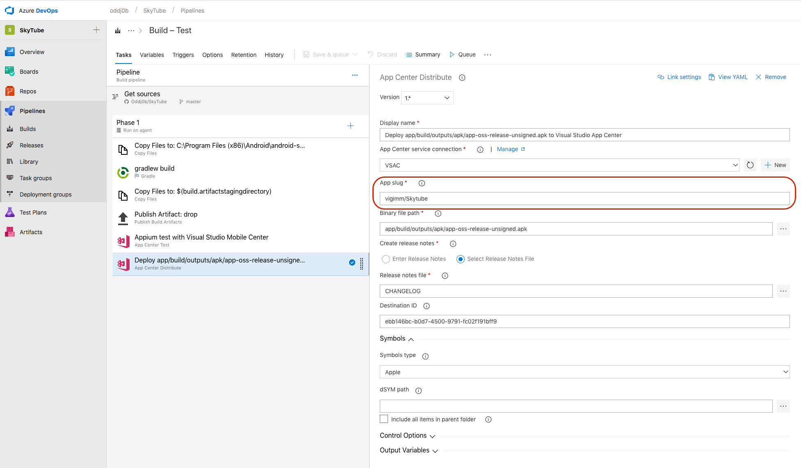
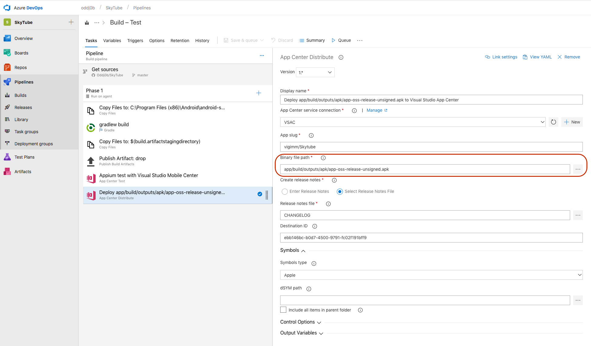
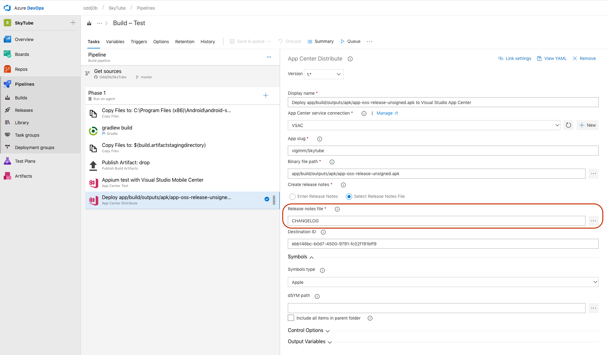
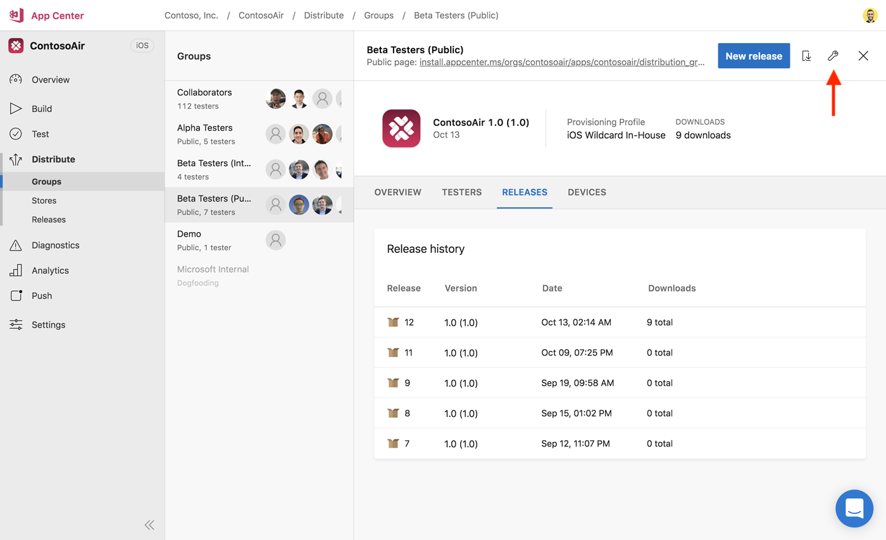
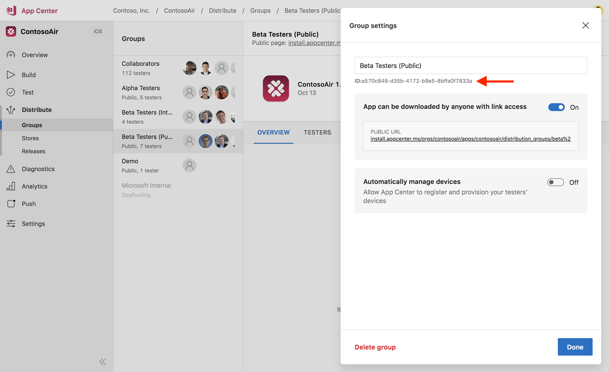
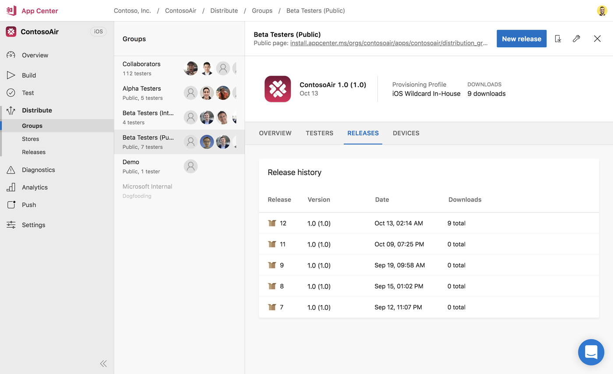

---
# required metadata

title: Deploy Azure DevOps Builds with App Center
description: Deploy Azure DevOps builds with App Center
keywords: deploy, vsts, visual studio team services, build
author: oddj0b
ms.author: vigimm
ms.date: 09/12/2018
ms.topic: article
ms.service: vs-appcenter

ms.assetid: 476938ee-f086-4145-889f-02f2e90f78ff
---

# Deploy Azure DevOps Builds with App Center

With the **Deploy with App Center** Task in Visual Studio Team Services, you can deploy your apps from Azure DevOps (formerly known as VSTS) to App Center. By deploying to App Center, you will be able to distribute your builds to your users.

## Creating a signed build

Before deploying your app to App Center, ensure your existing Azure DevOps build definition produces a signed build; only signed builds can be deployed and installed to devices.

## Setting up distribution with App Center

Once you're done with the signing task, add the build task **App Center Distribute**. This task uploads your signed build to App Center so that you can distribute it to your beta testers.

When configuring the App Center Distribute task, you'll need your App Center API key. To obtain this key, open a browser, and navigate to the [App Center dashboard](https://appcenter.ms), then open your Account Settings.



Create a new API token, making sure the API token has full access (so that Azure DevOps can create new releases for distribution), then copy the key. Switch back to Azure DevOps and the App Center Distribute task and create a new **App Center Connection**. Paste the API key you copied from App Center, and give the connection a name.



After you've created the connection between Azure DevOps and App Center, Azure DevOps needs to know which app you want to distribute the signed build to. Grab the app slug from App Center; you can find this by going to your project on App Center, and extracting it based on `https://appcenter.ms/users/{username}/apps/{app_identifier}`. For example, the app slug for `https://appcenter.ms/users/andyzg/apps/vanilla-android` is `andyzg/vanilla-android`.



Next, define the binary file path of where your apps built.



Finally, add release notes to your distribution.



App Center deploys to your Collaborators group by default. Optionally, you can specify a distribution group ID or a store connection ID. The distribution group ID can be found by first selecting a distribution group, and then viewing the distribution group settings.



You'll find the distribution group ID below the distribution group name.



Obtain the Store connection ID using an API call; learn [how to use the App Center API](../api-docs/index.md) elsewhere in the documentation.

Call the API using the following link: https://openapi.appcenter.ms/#/distribute/stores_list for querying for the Store IDs using . Below is an example of the results returned from the API call. You will be using the value of the key ID for specifying a store as target.

```json
[
{"id":"ebb146bc-b0d7-4500-9791-fc02f191bff9",
"name":"Alpha team",
"type":"apple",
"track":"testflight-external",
"created_by":"5114c905-76db-49e5-8a47-58c34b33a38b",
"service_connection_id":"2a85ad1e-b44e-d6fd-a85f-8daee62b54ed"},
{"id":"10ba5942-1388-4b2a-869a-9de40d5c0cff",
"name":"Production",
"type":"apple",
"track":"production",
"created_by":"5114c905-76db-49e5-8a47-58c34b33a38b",
"service_connection_id":"2a85ad1e-b44e-d6fd-a85f-8daee62b54ed"},
{"id":"894dd821-9f16-44a3-b2a7-d513d226babb",
"name":"iTunes Connect users",
"type":"apple",
"track":"testflight-internal",
"created_by":"5114c905-76db-49e5-8a47-58c34b33a38b",
"service_connection_id":"2a85ad1e-b44e-d6fd-a85f-8daee62b54ed"}
]
```

### Distributing the signed builds to App Center

Once you finished configuring the App Center Distribute task, you can Save and Queue your build. If it's successful, your signed build will be uploaded to the releases of the defined distribution group.



Now that your signed build is in App Center, you're all set! You and your users can download the signed build directly from App Center, or further re-distribute the release to another group.

[vsts-deploy-api]: images/vsts-deploy-api.png
[vsts-deploy-app-center-api]: images/vsts-deploy-app-center-api.png
[vsts-deploy-app-center-slug]: images/vsts-deploy-app-center-slug.png
[vsts-deploy-app-center-binary]: images/vsts-deploy-app-center-binary.png
[vsts-deploy-app-center-notes]: images/vsts-deploy-app-center-notes.png
[vsts-deploy-group-id]: images/vsts-deploy-group-id.png
[vsts-deploy-app-center-group]: images/vsts-deploy-app-center-group.png
[vsts-deploy-app-center-releases]: images/vsts-deploy-app-center-releases.png
