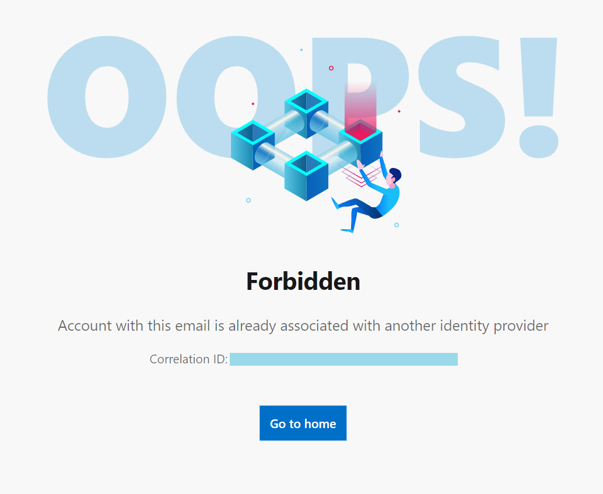

# Accounts in App Center
App Center supports several identity options for creating accounts. Customers can choose GitHub, Microsoft, Facebook, and Google based auth providers when signing up. This allows for more flexibility, but can be confusing for customers using a work email. This guide details some things to keep in mind in that case.

### Azure Active Directory backed work email addresses
Some work email addresses are backed by [Microsoft Azure Active Directory](https://azure.microsoft.com/services/active-directory/) (AAD). New customers with these types of email accounts don't need to sign-up for App Center accounts using the traditional sign-up. Instead they can immediately use the main sign-in button:

Check with your system administrator to see if your work email is backed by AAD.

### Personal and Standard work email addresses
Customers who use personal and work email addresses that aren't backed by AAD should sign up using the button indicated in the image below.

Customers who want to use a custom email address with their account can do so by clicking the button indicated in the image below, and creating a Microsoft Account (MSA) with the custom email address.

### Additional considerations
> [!WARNING]
> All apps that are owned by an App Center are automatically deleted when the owner's account is deleted. If the owner's account needs to be deleted (because, for instance, they've left your organization), make sure that ownership of the app is transferred to someone else before deleting the account.

Customers who create apps and organizations in App Center should pay special attention to ownership; especially when creating these entities for an external organization or company. Ownership transfers are executed at App Center's discretion to protect the privacy of our customers. For this reason, enterprise customers are encouraged to use AAD and to set up admin accounts created specifically for administering their app and orgs; for example: <i>admin@contoso.com</i> or <i>awesomeapp_admin@contoso.com.</i>

## Troubleshooting

### Account is already associated with another identity provider

Example of the error message:

#### What does this error mean?

This error indicates that the email address you are using is already registered in App Center, and the expected authentication method does not match to what you are using.

Starting from June 2021, App Center binds each account only with a single identity provider. The association is created in the system during account registration and cannot be changed.

Suppose you used GitHub as the identity provider during your account registration. After your first successful login attempt, the system secures GitHub as the only valid authentication method for the email address. Even if the same email address is used in other identity providers such as Facebook or Google, the system will reject any login attempt using other identity provider with the error message above.

#### How can I solve the issue?

To avoid such errors, you need to use the original identity provider you used during registration. Also, make sure you cleared browser cache before login attempt.

> [!WARNING]
> App Center used to provide an option to create an account using an email address and password without tying it to the identity provider. We no longer support this signup method, however, the existing users can continue using our service with this authentication. For example, if you used Gmail address when signing up for App Center, make sure to log in with your email address and password. Your attempt to use Google as an identity provider won't work as this association is not made in the system.

#### Can I change the associated identity provider?

Unfortunately, we do not support changing associated identity provider. The only option here is to close original account and re-create it again.

> [!WARNING]
> In case you close your account all the related data and activity would be lost!

#### Contact support

If you still have problems with log in, open a support ticket in the App Center portal. We would be more than happy to assist with your issue.
