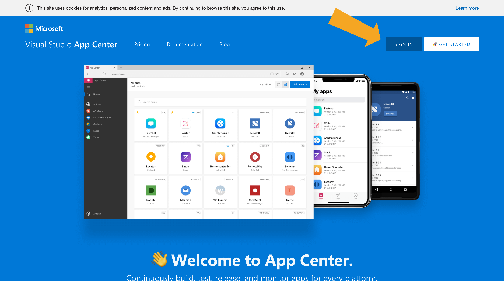
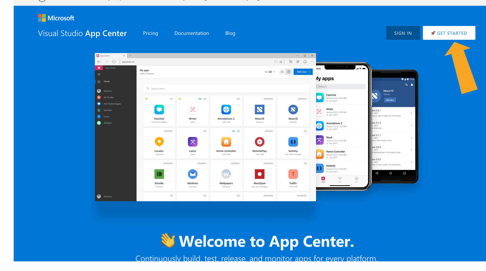
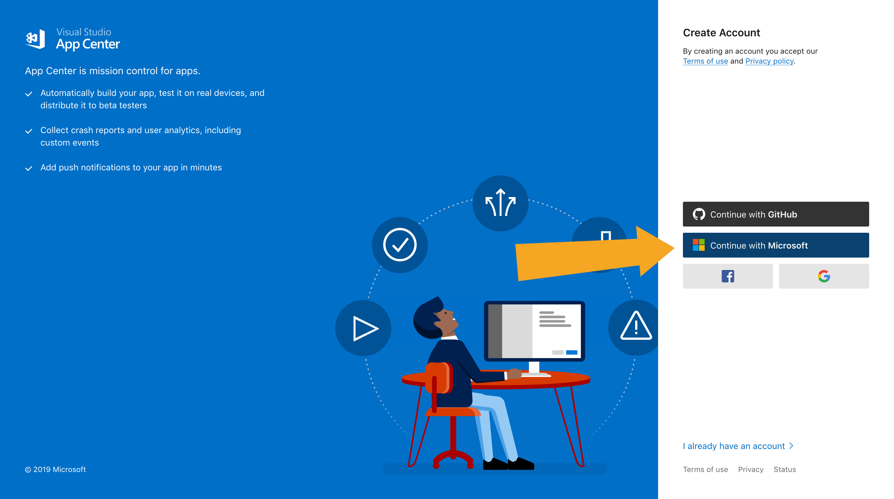

# Accounts in App Center

App Center supports several identity options for creating accounts. Customers can choose GitHub, Microsoft, Facebook, and Google based auth providers when signing up. This flexibility appeals to customers, but can be a be slightly confusing for customers using a work email and there are a couple of things that should be kept in mind when doing so.

### Azure Active Directory backed work email addresses
Some work email addresses are backed by [Microsoft Azure Active Directory](https://azure.microsoft.com/services/active-directory/) (AAD). New customers with these types of email account do _not_ need to sign up for App Center accounts using the traditional sign up but should instead simply sign in using the button indicated in the image below.

Check with your system administrator to see if your work email is backed by AAD.

### Personal and Standard work email addresses
Customers who use personal and work email addresses that are not backed by AAD should sign up using the button indicated in the image below.

Customers who want to use a custom email address with their account can do so by clicking the button indicated in the image below and creating a Microsoft Account (MSA) with that email address.

### Additional considerations

> [!WARNING]
> All apps that are owned by an App Center are automatically deleted when the owner's account is deleted. If the owner's account needs to be deleted (because, for instance, they've left your organization), make sure that ownership of the app is transferred to someone else before deleting the account. 

Customers who create apps and organizations in App Center should pay special attention to ownership; especially when creating these entities on behalf of an external organization or company. Ownership transfers are executed at App Center's discretion in order to protect the privacy of our customers. For this reason, enterprise customers are encouraged to use AAD and to set up admin accounts created specifically for administering their app and orgs; for example: <i>admin@contoso.com</i> or <i>awesomeapp_admin@contoso.com.</i> 
