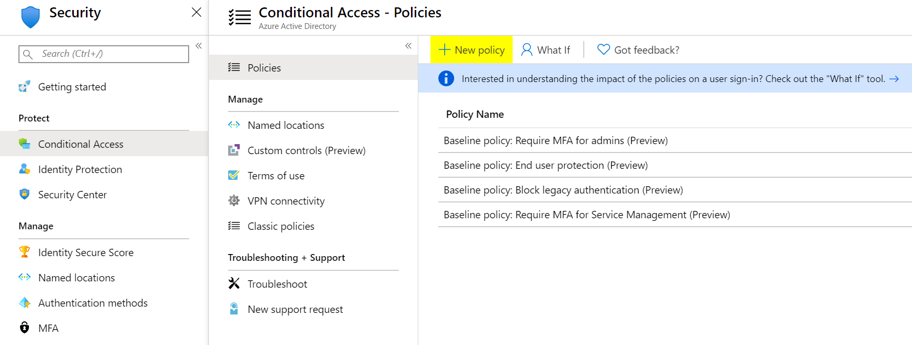
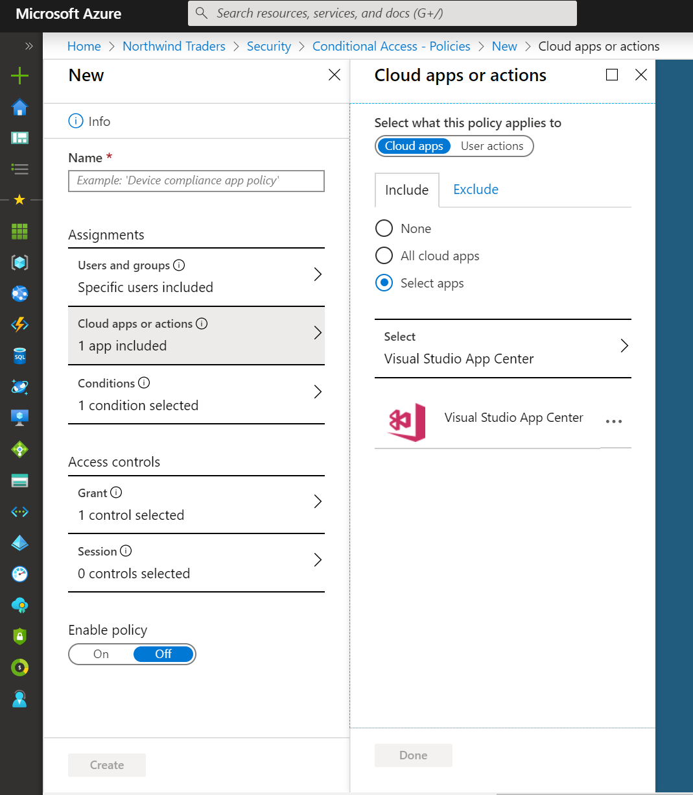

# Configuring Azure Active Directory Conditional Access

Visual Studio App Center supports [Azure Active Directory Conditional Access](https://docs.microsoft.com/en-us/azure/active-directory/conditional-access/overview). Azure Active Directory Conditional Access is an advanced feature of Azure AD that allows you to specify detailed policies that control who can access your resources. Using Conditional Access, you can protect your applications by limiting users' access based on things like groups, device type, location, and role.

> [!IMPORTANT]
> Azure Active Directory Conditional Access is available in the Premium tier of Azure AD. For more information about Azure AD Premium, see [Azure Active Directory pricing](https://azure.microsoft.com/en-us/pricing/details/active-directory/).

## Connecting your organization to Azure Active Directory

If your App Center organization is not already connected to an Azure Active Directory tenant, you'll have to connect it first. See [Connecting to Azure Active Directory](./connecting-to-azure-active-directory.md) for how to do that.

## Setting up Conditional Access

> [!NOTE]
> This is an abbreviated guide to setting up Conditional Access. Full documentation is available at https://docs.microsoft.com/en-us/azure/active-directory/conditional-access/overview.

In the [Azure portal](https://portal.azure.com), open your Active Directory tenant, then open the **Security** settings, and click on **Conditional Access**.

In Conditional Access settings, click **New policy** to create a policy.

In New policy settings, click on **Cloud apps or actions** and select Visual Studio App Center as the target of the policy. Then [select the other conditions](https://docs.microsoft.com/en-us/azure/active-directory/conditional-access/best-practices) that you'd like to apply, enable the policy, and click **Create** to save it.

> [!TIP]
> You can troubleshoot your conditional access policies with the [What If tool](https://docs.microsoft.com/en-us/azure/active-directory/conditional-access/troubleshoot-conditional-access-what-if) in the Azure Portal.
