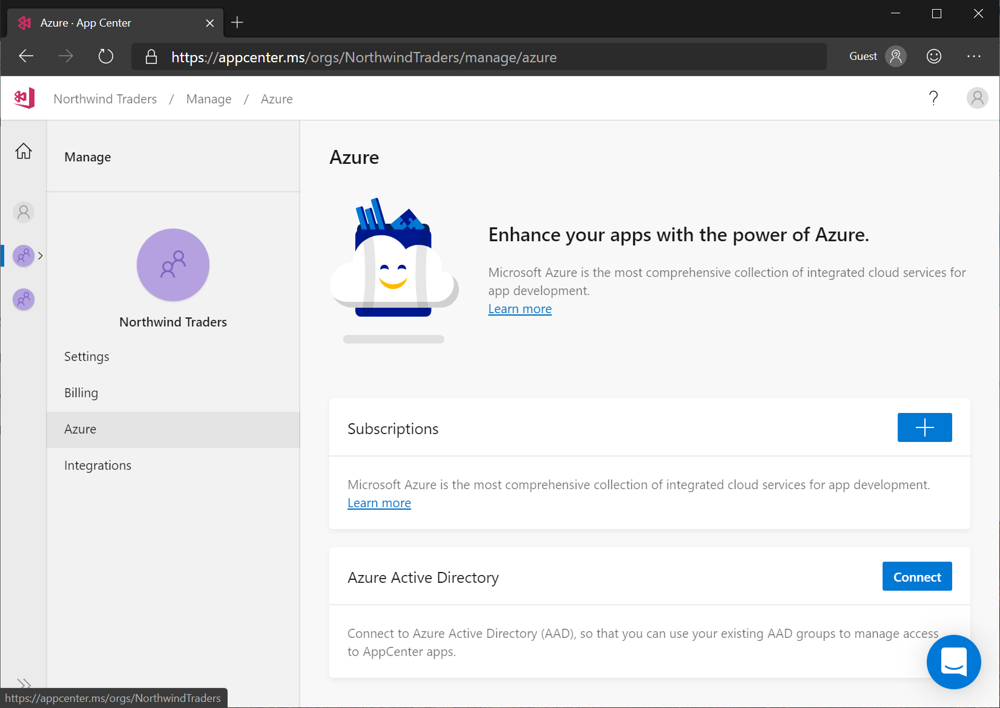

# Connecting App Center Organizations to Azure Active Directory

## Connect your Azure Active Directory tenant to App Center
To connect your App Center organization to Azure Active Directory, click on your organization, click **Manage**, and then click **Azure**. On the Azure page, click **Connect** and sign in to Azure Active Directory if you're not already signed in.



A list of your Azure Active Directory tenants will be shown. Select the one you want, and click **Connect**.


## Azure Active Directory service principal

When you connect your App Center account to Azure Active Directory, a service principal is created in your AAD tenant that allows App Center to read your users and security groups. The service principal is created with minimal permissions.

### Inspecting the App Center service principal

You can inspect the service principal using [Microsoft Graph Explorer](https://developer.microsoft.com/en-us/graph/graph-explorer), by submitting a GET request against https://graph.microsoft.com/beta/servicePrincipals. (You'll need `Directory.Read.All` permission to see service principals.)


You can also retrieve the service principal using [Get-AzADServicePrincipal](https://docs.microsoft.com/powershell/module/az.resources/get-azadserviceprincipal?view=azps-2.8.0).

```PowerShell
Get-AzADServicePrincipal -DisplayName 'App Center'
```

### Example service principal

Here is a service principal created to connect App Center to a sample Azure AD tenant.

* The `displayName` attribute is "App Center"
* The `appID` attribute is "6201c56d-46d7-4152-bdb6-e0c77193784b", which is the GUID of App Center in Azure Active Directory
* The `publisherName` is "Microsoft Services"


```json
{
      "id": "3bd7a1a6-a74a-f5ed-9721-51ecxxxxxxxx",
      "deletedDateTime": null,
      "accountEnabled": true,
      "appDisplayName": "App Center",
      "appId": "6201c56d-46d7-4152-bdb6-e0c77193784b",
      "applicationTemplateId": null,
      "appOwnerOrganizationId": "f3cdef31-a31e-c3c9-443a-5f57xxxxxxxx",
      "appRoleAssignmentRequired": false,
      "displayName": "App Center",
      "errorUrl": null,
      "homepage": null,
      "info": {
        "termsOfServiceUrl": null,
        "supportUrl": null,
        "privacyStatementUrl": null,
        "marketingUrl": null,
        "logoUrl": null
      },
      "loginUrl": null,
      "logoutUrl": null,
      "notificationEmailAddresses": [],
      "publishedPermissionScopes": [],
      "preferredSingleSignOnMode": null,
      "preferredTokenSigningKeyEndDateTime": null,
      "preferredTokenSigningKeyThumbprint": null,
      "publisherName": "Microsoft Services",
      "replyUrls": [],
      "samlMetadataUrl": null,
      "samlSingleSignOnSettings": null,
      "servicePrincipalNames": [
        "6201c56d-46d7-4152-bdb6-e0c77193784b",
        "https://applicationinsights.azure.com"
      ],
      "signInAudience": "AzureADMultipleOrgs",
      "tags": [],
      "addIns": [],
      "api": {
        "resourceSpecificApplicationPermissions": []
      },
      "appRoles": [],
      "keyCredentials": [],
      "passwordCredentials": []
}
```

## Deleting your App Center account
When you delete your App Center account, the service principal remains in your Azure Active Directory tenant. To remove it, you can run [Remove-AzADServicePrincipal](https://docs.microsoft.com/powershell/module/az.resources/remove-azadserviceprincipal?view=azps-2.8.0).

```PowerShell
Remove-AzADServicePrincipal -ServicePrincipalName 'App Center'
```
