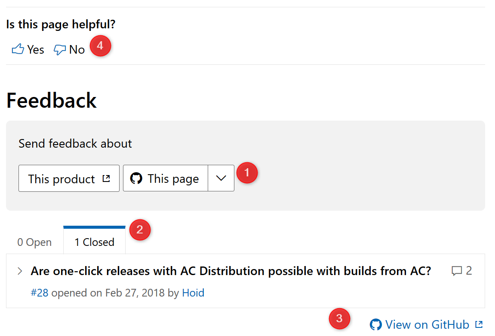

# Help and feedback

The docs you'll find here should explain everything you need to know about Visual Studio App Center, sometimes the docs are not as clear as they should be, or you're trying to do something that isn't (yet) covered in the docs.

There's a dedicated support team ready to answer your product questions; look in the next section for instructions on how to connect with them.

App Center, and its product documentation, are both a work in progress, we're making regular updates to both. If you have a suggestion for how to make the product better or how to make the documentation better, we want to hear from you. Look in the **Providing feedback** section of this document for information on how to give us your feedback.

## Accessing App Center Free Support

Get support for App Center directly from within the App Center portal (not here in the docs). Any time you need help, just click the blue chat button in the lower-right corner of any App Center page and the dedicated App Center support team will respond. Use the **New Conversation** button shown in the following figure to start a conversation with our support team. You'll even find the App Center Program Management team hopping in to join the conversation as needed.

Use the **Search for answers...** input field to search help and troubleshooting documents that haven't made it into the formal docs yet.

For additional information, or to browse a list of articles available through support, see the [App Center Help Center](https://intercom.help/appcenter).

## Microsoft Premier Support

Customers with a Microsoft Premier Support account can file a support request in the [Microsoft Premier Support Request Portal](https://support.microsoft.com/en-us/premier).  If you are new to Microsoft Premier Support, you can learn about it in the [Microsoft Premier Support Center](https://www.microsoft.com/en-us/enterprise/services/support).

## Providing feedback

You can provide feedback on the documentation and the product in different ways, publicly and privately.

### Feedback on the documentation

The comments feature of our documentation is intended to enable customers to suggest changes to the docs or ask clarifying questions about the docs. Every documentation page (except the [App Center docs landing page](https://docs.microsoft.com/en-us/appcenter/)) has a number of feedback features, which you can see highlighted in the following figure:

The **Feedback** section has two buttons, see item 1. Use the **This product** button to learn how to connect with the App Center Support team (as described in the previous section). Use the **This page** button to suggest changes in a public feedback message right there on the page. The example has one such public feedback message, which is closed, as you can see at number 2. You can add comments to feedback messages. The feedback message in the example has two comments. To leave feedback or comment on existing feedback, you have to sign in with your GitHub account. You can also view the feedback directly on GitHub by following the **View on GitHub** link at item 3. If there are too many feedback messages to display on the page, you can still see them all on GitHub by following this link. The **View on GitHub** link is not available on some pages, such as this one.

Pages also have a prompt asking you if the current page is helpful, see item 4. This will be in different locations of your screen depending on the screen size. Your vote here helps us understand how we're doing.

> [!Note]
> Leaving a feedback message is the preferred method to provide feedback; the feedback you provide here goes directly to the App Center product team and will get you the quickest response. Voting whether the page is helpful simply records your vote (and comments), but doesn't provide a way for us to respond to you.

### Feedback on the product

We're constantly adding features and more capabilities to App Center. Do you not see your feature or are you curious about what new features are coming soon? We invite you to help shape the future of App Center by [sharing your feedback on our monthly public roadmap](https://github.com/Microsoft/appcenter/wiki/Iteration-Plans), or by [submitting and upvoting feature requests](https://github.com/Microsoft/appcenter/issues?q=is%3Aissue+is%3Aopen+sort%3Areactions-%2B1-desc).

If you experience an issue, the best way to get help is to use the support features mentioned above.

## Contributing to the docs

The App Center docs are an open source project [hosted on GitHub](https://github.com/MicrosoftDocs/appcenter-docs).

> [!Note]
> When you choose the option to provide content feedback described in the previous section, you're really just creating a Github issue in the App Center docs repository.

If you have some suggestions on how to make the docs better, and you have the time, you can make the changes yourself:

1. Fork the repository
2. Make the necessary changes to the documentation files (you'll do all your work in the repo's `docs` folder)
3. Submit a pull request (PR)
4. We'll review your changes and get back to you

For more information on contributing to the App Center docs, read the [Microsoft Docs contributor guide overview](https://docs.microsoft.com/en-us/contribute/).
