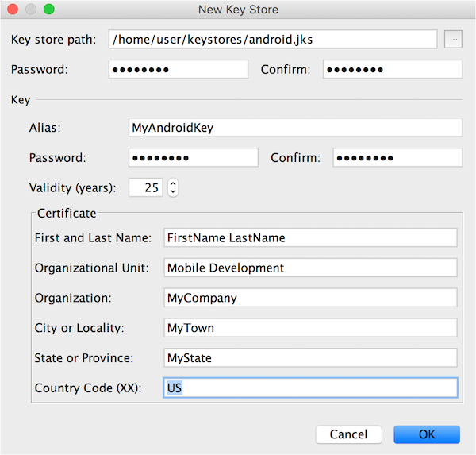

---
# required metadata

title: Getting Started
description: Getting started prerequisites to onboard an Android application in App Center
keywords: app center
author: sshibu
ms.author: t-shshib
ms.topic: article
ms.service: vs-appcenter
ms.date: 05/20/2019
ms.assetid: 077e17b4-f9ca-42d3-828f-91300b775d94
---


# Getting Started by Creating App and Codesigning

In this tutorial, you will learn to set up a sample Android app with App Center.

### Prerequisite Steps

- Create [GitHub account](https://github.com/join).
- [Download Android Studio](https://developer.android.com/studio/index.html) and [install it on your local machine](https://developer.android.com/studio/install.html).

## Sign in to GitHub and fork the repository

1. Sign in to your [GitHub account](https://github.com/join).
2. Access the [sample app's GitHub repository](https://github.com/microsoft/appcenter/tree/master/sample-apps/android/getting-started).
3. Click **Fork** at the top-right hand corner of the page.

## Sign in to App Center

1. Open the [App Center portal](https://appcenter.ms).
2. Click **Connect with GitHub** and sign in, or use another provider.

## Create a new app in App Center

1. Click **Add new app**.

2. Name the app **Sample Android App**.

3. Choose **Android** and **Java** respectively.

4. Click **Add new app**.  

## Replace the App Secret

In order for the sample app to send information to App Center, the app secret must be changed to match the one provided for your specific App Center project.

1. Navigate to **Settings** in App Center.

2. Copy the **App Secret** at the top of the page.

3. Go into the **sampleapp_android** repository and navigate into **MainActivity.java**

4. In the project's **MainActivity.java**, locate the following. *Note: You can also find the code snippet with your specific app secret on the Getting Started page in the App Center portal.*

```java
@Override
protected void onCreate(Bundle savedInstanceState) {
        AppCenter.start(getApplication(), "<APP SECRET HERE>",
                Analytics.class, Crashes.class);
```

5. Replace  `<APP SECRET HERE>` with your unique app secret.
6. **Add, commit, and push changes to your forked repository.** This action can be done from the terminal, or a tool of your choice.

## Sign the Android Package Kit (APK)

*Code signing is optional, but recommended.*

In order to run tests, distribute the app to users, and send push notifications, the APK must be digitally signed with a certificate. After creating an App ID for the sample app, follow the steps below to manually sign the APK. To learn what a digital certificate is, or for signing options other than the one outlined below, refer to the [Android Developer Documentation](https://developer.android.com/studio/publish/app-signing.html#sign-auto).

1. Open Android Studio and click **Open an existing Android Studio project**.

2. Navigate to the forked sample app repository location on your machine and upload it to Android Studio.

3. Go to **Build Variants** in the leftmost panel and click it.

4. Make sure that the build variant is set to release.

5. Go to **Build > Generate Signed APK** from the menu bar.

6. Leave **Module: app** and click Next.

7. In **Key store path**, click **Create new...** and create the keystore as per the following image from the [Android Developer Documentation](https://developer.android.com/studio/publish/app-signing.html#sign-auto):

    

8. Click **OK**. The **Key store password**, **Key alias** and **Key password** should automatically fill in with the information from your new keystore. Click **Next**.

9. Select a destination for the signed APK, make sure **Build Type** is set to **release**, and select both signature versions **V1** and **V2**. Click **Finish**.

10. Gradle should automatically begin to build. After everything syncs up, you should find your signed APK in the specified destination folder.

11. **Add, commit, and push changes to your forked repository.**


  ## Optional: Run app in Android Studio and read descriptions
  The crashes and analytics services must be linked to the app in order for the associated buttons to send trackable data to App Center. Go to the [crash quickstart](crashes.md) and [analytics quickstart](analytics.md) for further details.
