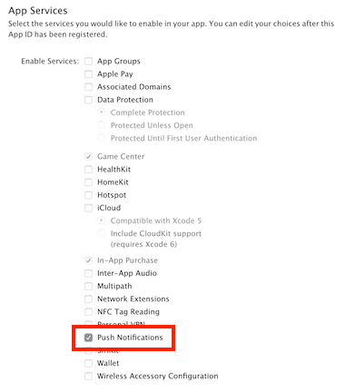

# Getting Started - Sample Swift App and Tutorials

In this tutorial, you'll learn how to set up a sample Swift app with App Center for iOS. Both Objective-C and Swift are supported.

## Prerequisites

* [GitHub account](https://github.com/join)
* [Xcode](https://itunes.apple.com/us/app/xcode/id497799835?mt=12#)

## Sign in to GitHub and fork the repository

1. sign in to your [GitHub account](https://github.com/join).

2. Access the [sample app's GitHub repository](https://github.com/microsoft/appcenter/tree/master/sample-apps/ios/getting-started).

3. Click **Fork** at the top-right hand corner of the page, and clone the repository.

## Integrate CocoaPods

1. Open a terminal and go to the sample app's directory.

2. Run the command below to install CocoaPods:

   ```bash
   sudo gem install cocoapods
   ```

3. The included Podfile lists the dependencies in the source code. To install them, run the command below:

   ```bash
   pod install
   ```

4. Open the **.xcworkspace** and press **Run**. The app should build without error.


## Sign in to App Center

1. Open the [App Center portal](https://appcenter.ms).

2. Click **Connect with GitHub** and sign in, or use another provider.

## Create a new app in App Center

1. Click **Add new app**.

2. Name the app **Sample iOS App**.

3. Choose **iOS** and **Objective-C / Swift**.

4. Click **Add new app** at the bottom.  

## Replace the App Secret

In order for the sample app to send information to App Center, the app secret must be changed in Xcode.

1. Navigate to the **Settings** page in App Center.

2. Copy the **App Secret** at the top.

3. Open the **.xcworkspace** from the sample app folder.

4. In **AppDelegate.swift**, edit the `didFinishLaunchingWithOptions` delegate method and paste your App Secret at the placeholder.

5. **Add, commit, and push changes to your forked repository.** It can be done from the terminal, or a tool of your choice.

## Code sign the project

*Code signing is optional, but recommended.*

Code signing assures users that the app is from a trustworthy developer, and has not been altered by someone else. In App Center, it's needed to distribute the app to users and send push notifications. Learn more from the [Apple Developer Documentation](https://developer.apple.com/library/content/documentation/IDEs/Conceptual/AppDistributionGuide/MaintainingProfiles/MaintainingProfiles.html).

When creating a new App ID for this sample app, be sure to check the **Push Notifications** service under the **App Services** section.

  

1. Open **.xcworkspace** from the sample app's folder.

2. Go to **General** within the **.xcworkspace** file.

3. Under **Identity**, edit the **Bundle Identifier** to match the app ID.

4. Import and select the provisioning profile under **Signing (Debug)** and **Signing (Release)**.

5. **Add, commit, and push changes to your forked repository.** It can be done from the terminal, or a tool of your choice.

You're all set up to try out an App Center service. Not sure what to do next? Most people build their app next; check out the **[Build Tutorial](build.md)** for a short walkthrough.
