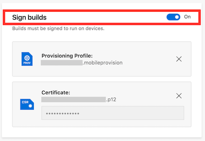

---
# required metadata

title: Build | Sample App Tutorials
description: Tutorial to build sample macOS app in App Center.
keywords: app center
author: clpolet
ms.author: clpolet
ms.date: 11/15/2017
ms.topic: article
ms.service: vs-appcenter
ms.assetid: 42f54f33-d032-4d1b-a81a-72978c146bfe
ms.tgt_pltfrm: macos
dev_langs:  
 - swift
---

# Build - Sample Swift App and Tutorials
In this tutorial, you will learn to build a sample Swift app in App Center.

First, follow the [getting started tutorial](getting-started.md) to set up the sample app.

### Prerequisites
- [GitHub account](https://github.com/join)
- Optional: Provisioning Profile and Certificate. Go to the [Apple Developer Documentation](https://developer.apple.com/library/content/documentation/IDEs/Conceptual/AppDistributionGuide/MaintainingProfiles/MaintainingProfiles.html) to learn about creating an App ID to codesign the sample app with.

## Set up the repository
1. Go to the **Build** service in [App Center](https://appcenter.ms/apps).

2. Choose **GitHub** as the service to Build with.

3. Sign in to GitHub, and click **Authorize AppCenter**.

4. Choose **sampleapp-macos-swift**.

## Configure the build
1. Choose the **master** branch.

2. Click **Configure build**. The Build configuration panel will show up.

3. If the code is signed, turn **Sign build** on. Upload your Provisioning Profile and Certificate, which can be found in the [Apple Developer Center](https://developer.apple.com/account/). This will let you distribute the app later.

     

   **If your build fails because of a codesigning error:** double check that all your changes have been pushed to the remote repository.

4. Click **Save** at the bottom of the page, and the build will begin.

The build can take a couple minutes, but you can click on it to view real-time output logs. Afterwards, if the build is successful, you can download the build, symbols, or logs by clicking **Download**.

Every time you push code to a configured branch, a build will automatically begin. This helps you continuously deliver apps by making sure the latest changes to your app can build.
