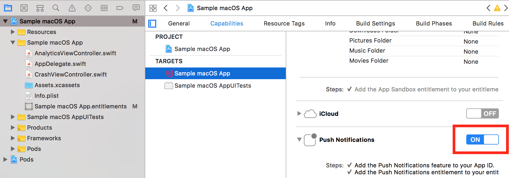

---
# required metadata

title: Push | Sample App Tutorials
description: Tutorial to send a push notification to the sample macOS app.
keywords: app center
authors: clpolet
ms.author: clpolet
ms.date: 11/15/2017
ms.topic: article
ms.service: vs-appcenter
ms.assetid: 430aa509-2695-4d14-a6c3-85129d900d0f
ms.tgt_pltfrm: macos
dev_langs:  
 - swift
---

# Push - Sample Swift App and Tutorials
In this tutorial you will learn how to send push notifications to users through App Center. Code allowing App Center to send notifications is included in the sample Swift app.

First, follow the [getting started tutorial](getting-started.md) to set up the sample Swift app.

### Prerequisites
- Provisioning Profile and Certificate. Go to the [Apple Developer Documentation](https://developer.apple.com/library/content/documentation/IDEs/Conceptual/AppDistributionGuide/MaintainingProfiles/MaintainingProfiles.html) to learn about creating an App ID to codesign the sample app with.

## Enable Push notifications in Xcode
1. Open the **.xcworkspace** from the sample app folder.

2. Under the **Capabilities** tab, turn **Push Notifications** on.  

   

   If you encounter an error, your codesigning may not support Push Notifications. Go to the [Apple Developer portal](https://developer.apple.com/account/mac/identifier/bundle/) and edit the App ID to allow Push Notifications.

## Build and Distribute the app
1. **Add, commit, and push the changes to GitHub.**

2. Follow the [Build tutorial](build.md) and then the [Distribute tutorial](distribute.md) to deploy the app **onto your device**.

## Set up Push in App Center
1. Go to the **Push** service in [App Center](https://appcenter.ms/apps).

2. Click **next** to skip the first page. The code shown here is already included.

## Get your Apple Push Notification service Key
1. Go to your **[Keys](https://developer.apple.com/account/mac/authkey/)** on the Apple Developer website.

2. Create a new APNs Key if you don't have one. Fill in a Key name and check the **APNs** checkbox.

3. Copy the **Key ID** and download the **key file**. Paste it in the box in App Center.

## Get the sample app's Prefix and ID
1. Go to your **[App IDs](https://developer.apple.com/account/mac/identifier/bundle)** on the Apple Developer Website.

2. Click on the sample app's ID.

3. Copy the **Prefix** and paste it in the box in App Center.

4. Copy the **ID** and paste it in the box in App Center.

5. Open the **key file** from your **Key ID**, and copy the authentication token. Paste it in the box.

6. Choose **Sandbox**.

7. Click **Done** at the bottom.

## Set up a Push notification
1. Follow the [Distribute tutorial](distribute.md) to download the app to your device.

2. Navigate to the **Push** service in App Center.

3. Click **Send notification**.

4. Set the **Campaign Name** as "Using Push Notifications". Set the **Message** as "Testing".  

## Send a Push notification
1. Click **Next** at the bottom.

2. Choose **All registered devices**.

3. Click **Next** and **Send notification** at the bottom.

   > [!WARNING]
   > **A push notification will be sent to the device you distributed the app to.**
