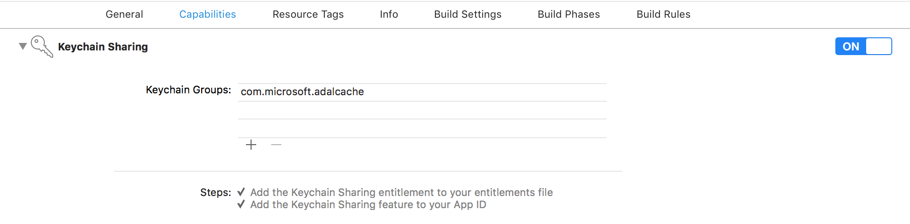
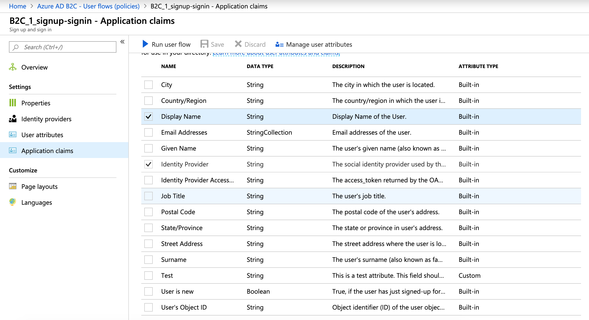
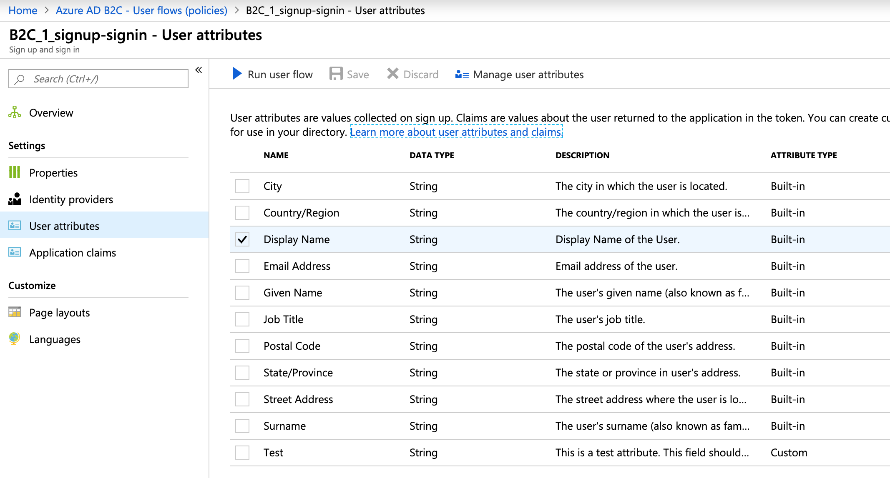

# App Center Auth

> [!div  class="op_single_selector"]
> * [Android](android.md)
> * [iOS](ios.md)
> * [Xamarin](xamarin.md)

## Add the SDK to your app

App Center Auth is a cloud-based identity management service that enables developers to authenticate application users and manage user identities. The service integrates with other parts of App Center, enabling developers to leverage user identity to view user data in other services and even send push notifications to users instead of individual devices. App Center Auth is powered by [Azure Active Directory B2C](https://docs.microsoft.com/azure/active-directory-b2c/).

Please follow the [Getting Started](~/sdk/getting-started/ios.md) section before configuring Auth if you haven't set up the SDK in your app.

### 1. Add the App Center Auth module

The App Center SDK is designed with a modular approach – a developer only needs to integrate the modules of the services that they're interested in.

#### Integration via Cocoapods

When integrating App Center into your app via Cocoapods, add the following dependency to the project's podfile and run `pod install`.

```ruby
pod 'AppCenter/Auth'
```

#### Integration by copying the binaries into your project

To manually integrate the module, follow this [documentation link](~/sdk/auth/ios-manual-integration.md).

### 2. Start App Center Auth

App Center only uses the specific modules invoked in the app. The app must explicitly call each of them when starting the SDK.

Add the Auth class to project's `[MSAppCenter start]` or `MSAppCenter.start` method to start the App Center Auth service.

```objc
[MSAppCenter start:@"{Your App Secret}" withServices:@[[MSAnalytics class], [MSCrashes class], [MSAuth class]]];
```
```swift
MSAppCenter.start("{Your App Secret}", withServices: [MSAnalytics.self, MSCrashes.self, MSAuth.self])
```

Be sure to replace `{Your App Secret}` in the code sample above with [your App Secret](~/dashboard/faq.md):

```objc
[MSAppCenter start:@"65dc3680-7325-4000-a0e7-dbd2276eafd1" withServices:@[[MSAnalytics class], [MSCrashes class], [MSAuth class]]];
```
```swift
MSAppCenter.start("65dc3680-7325-4000-a0e7-dbd2276eafd1", withServices: [MSAnalytics.self, MSCrashes.self, MSAuth.self])
```

Add the following lines to the import statements in the project's App Delegate class:

```objc
@import AppCenter;
@import AppCenterAuth;
```
```swift
import AppCenter
import AppCenterAuth
```

## Modify the project's Info.plist

> [!NOTE]
> If the App Center Distribute SDK has previously been configured, the `URL types` key will already be present. In this case, add a new entry to the `URL types` key by following the instructions from step 3.

1. In the project's **Info.plist** file, add a new key for **URL types** by clicking the **+** button next to **Information Property List** at the top. If Xcode displays the project's **Info.plist** as source code, refer to the tip below.
2. Change the key type to Array.
3. Add a new entry to the array (`Item 0`) and change the type to Dictionary.
4. Under **Item 0**, add a **Document Role** key and change the value to **Editor**.
5. Under **Item 0**, add a **URL Schemes** key and change the type to Array.
6. Under **URL Schemes** key, add a new entry (**Item 0**).
7. Under **URL Schemes** > **Item 0**, change the value to `msal{APP_SECRET}` and replace `{APP_SECRET}` with [your App Secret](~/dashboard/faq.md): `msal65dc3680-7325-4000-a0e7-dbd2276eafd1`.

> [!TIP]
> If you want to verify that you modified the `Info.plist` correctly, right-click on the file and select **Open as...** > **Source code**. It should contain the following entry with [your actual App Secret](~/dashboard/faq.md) instead of `{APP_SECRET}`: `<string>msal65dc3680-7325-4000-a0e7-dbd2276eafd1</string>`.
> ```xml
> <key>CFBundleURLTypes</key>
> <array>
> 	<dict>
> 		<key>CFBundleTypeRole</key>
> 		<string>Editor</string>
> 		<key>CFBundleURLSchemes</key>
> 		<array>
> 			<string>msal{APP_SECRET}</string>
> 		</array>
> 	</dict>
> </array>
> ```

## Add keychain sharing capability

App Center uses the “com.microsoft.adalcache” keychain access group to support single sign on, by enabling different apps to share keychain items (i.e. user secrets and credentials) with each other. We use this access group to securely share a user secret within a family of apps that rely on the same user secret. This way, logging into one of your apps will automatically grant the same user access to all of the family of apps.

You must add a new keychain group to your project Keychain Sharing Capabilities: `com.microsoft.adalcache`.

To do that, click on the app's target settings, then **Capabilities**, then toggle **Keychain Sharing** on, then add the `com.microsoft.adalcache` entry like in the following screenshot:



## Sign users into the app

App Center provides a `signInWithCompletionHandler:` method that triggers the sign in policy defined in your Azure AD B2C tenant.

To present the sign-in UI to the user, call the `signIn` method:

```objc
[MSAuth signInWithCompletionHandler:^(MSUserInformation *_Nullable userInformation, NSError *_Nullable error) {

	if (!error) {
		
		// Sign-in succeeded.
		NSString *accountId = userInformation.accountId;
	}
	else {
		
		// Do something with sign in failure.
	}
}];
```
```swift
MSAuth.signIn { userInformation, error in

	if error == nil {

		// Sign-in succeeded.
		var accountId = userInformation!.accountId;
	}
	else {

		// Do something with sign in failure.
	}
}
```

Please note the following:

* The Auth module must be started at the same time as other modules, in a `MSAppCenter.start` call. If you decide to start the Auth service separately using `MSAppCenter.startService`, the app will not sign in automatically after the restart and the user will have to call `signIn` again.
* The app must initialize the App Center SDK using `MSAppCenter.start` before calling `signIn`.
* The app must be in the foreground before calling `signIn`.
* App Center associates crash reports and handled errors with the signed-in user after sign-in completes successfully.
* If sign-in fails, the crash reports and handled errors are not associated with any user.
* New push notifications targeting the signed-in user are received on the device that the user has signed into.
* Signing in on a device is not retroactive: the user does not receive push notifications that were sent to him prior to signing in on that device, and past error or crash reports are not updated with the new user information.
* The SDK automatically saves the signed-in users' information so they do not have to sign in to your app again.
* If the app calls `signIn` again, the SDK shows the sign-in UI again only if the saved sign-in information has expired or has been revoked by the authentication server.

## Get access token and ID token

When a user signs in to the application, the SDK exposes an ID token and an access token in the returned user information.

The tokens use the [JWT](https://jwt.io/) format.

An ID token represents the user information itself without any permission to call any other services' REST APIs.

The access token contains the same information as the ID token but also contains the scopes of what other services' REST APIs can be called on behalf of the user.

To access the tokens from the sign-in result:

```objc
[MSAuth signInWithCompletionHandler:^(MSUserInformation *_Nullable userInformation, NSError *_Nullable error) {

  if (!error) {

    // Sign-in succeeded if error is nil.
    // userInformation is not nil if error is nil.
    // and both idToken and accessToken are not nil when userInformation is not nil.
    NSString *idToken = userInformation.idToken;
    NSString *accessToken = userInformation.accessToken;

    // Do work with either token.
  }
  else {

    // Do something with sign in failure.
  }
}];
```
```swift
MSAuth.signIn { userInformation, error in

  if error == nil {

    // Sign-in succeeded if error is nil.
    // userInformation is not nil if error is nil.
    // and both idToken and accessToken are not nil when userInformation is not nil.
    var idToken = userInformation!.idToken;
    var accessToken = userInformation!.accessToken;

    // Do work with either token.
	}
  else {

    // Do something with sign in failure.
  }
}
```

### Decoding tokens

You can decode user profile information such as the display name or the email address from the ID token or the access token. The SDK does not have APIs to directly expose user profile information, but this section will demonstrate how to decode the token.

Before decoding the token to get user profile information, the Azure AD B2C tenant must be configured to include the user profile fields in the tokens. By default, there is only metadata included in the token, and no user profile information.

To configure the list of user profile fields in the tokens, visit the tenant configuration on the Azure portal and select the user flow or custom policy that you've selected in the App Center Auth portal. If you are using a user flow, go to **Application claims** and select the user fields that need to be decoded, then click **Save** as illustrated in the following screenshot:



You also need to collect the user profile fields during the sign-up process so that they will be available in the tokens. On the user flow settings, go to **User attributes** and select the user fields, then click **Save** as illustrated in the following screenshot:



If you are using a custom policy instead of a user flow, you can configure the claims as shown in the [XML configuration example](https://docs.microsoft.com/en-us/azure/active-directory-b2c/active-directory-b2c-setup-aad-custom#add-a-claims-provider) in the `OutputClaims` section.

> [!NOTE]
> Adding new user attributes will not update users that signed up before updating the settings.
> For existing users, the new selected fields will thus be missing from the tokens.

Once you have configured the tenant and the application has retrieved the ID token or the access token, you can decode the user profile information. Please see the example code snippets on how to decode the user profile information for **Display name** and **Email Addresses**:

```objc
NSString *idToken = userInformation.idToken;
NSArray *tokenSplit = [idToken componentsSeparatedByString:@"."];
if ([tokenSplit count] > 1) {
  NSString *rawClaims = tokenSplit[1];
  size_t paddedLength = rawClaims.length + (4 - rawClaims.length % 4) % 4;
  rawClaims = [rawClaims stringByPaddingToLength:paddedLength withString:@"=" startingAtIndex:0];
  NSData *claimsData = [[NSData alloc] initWithBase64EncodedString:rawClaims options:NSDataBase64DecodingIgnoreUnknownCharacters];
  if (claimsData) {
    NSError *error;
    NSDictionary *claims = [NSJSONSerialization JSONObjectWithData:claimsData options:0 error:&error];
    if (!error) {

      // Get display name.
      id displayName = claims[@"name"];
      if ([displayName isKindOfClass:[NSString class]]) {

        // Do something with display name.
      }

      // Get email addresses.
      id emails = claims[@"emails"];
      if ([emails isKindOfClass:[NSArray class]] && [emails count] > 0) {
        NSString *firstEmail = emails[0];

        // Do something with the first email address.
      }
    }
  }
}
```
```swift
let idToken = userInformation?.idToken
let tokenSplit = idToken?.components(separatedBy: ".")
if tokenSplit != nil && tokenSplit!.count > 1 {
  var rawClaims = tokenSplit![1]
  let paddedLength = rawClaims.count + (4 - rawClaims.count % 4) % 4
  rawClaims = rawClaims.padding(toLength: paddedLength, withPad: "=", startingAt: 0)
  let claimsData = Data(base64Encoded: rawClaims, options: .ignoreUnknownCharacters)
  do {
    if claimsData != nil {
      let claims = try JSONSerialization.jsonObject(with: claimsData!, options: []) as? [AnyHashable: Any]
      if claims != nil {

        // Get display name.
        let displayName = claims!["name"]
        if displayName is String {
          
          // Do something with display name.
        }

        // Get email addresses.
        let emails = claims!["emails"] as? [Any]
        if emails != nil && emails!.count > 0 {
          let firstEmail = emails![0] as? String

          // Do something with the first email address.
        }
      }
    }
  } catch {
    
    // Handle error.
  }
}
```

## Sign out

To sign out the user and clear all associated authentication tokens, call the `signOut` method:

```objc
[MSAuth signOut];
```
```swift
MSAuth.signOut()
```

## Enable or disable App Center Auth at runtime

As with every other App Center service, the app can disable the Auth service within the app. When disabled, the SDK signs the user out and ignores all other Auth method calls. In particular, `signIn` will not do anything and no UI will be shown while Auth is disabled.

```objc
[MSAuth setEnabled:NO];
```
```swift
MSAuth.setEnabled(false)
```

To re-enable Auth, use the same API but pass `true` as a parameter.

```objc
[MSAuth setEnabled:YES];
```
```swift
MSAuth.setEnabled(true)
```

The enabled/disabled state is stored by the SDK and does not change when the app restarts.

## Check if App Center Auth is enabled

Check to see if App Center Auth is enabled using the following:

```objc
[MSAuth isEnabled];
```
```swift
MSAuth.isEnabled()
```

## Disable automatic forwarding of the app delegate's methods to App Center services

App Center uses swizzling to automatically forward the app delegate's methods to App Center services to improve SDK integration. Method swizzling is a way to change the implementation of methods at runtime. There is a possibility of conflicts with other third party libraries or the app delegate itself. You may want to disable App Center app delegate forwarding for all App Center services by following the steps below:

1. Open the the project's **Info.plist** file.
2. Add `AppCenterAppDelegateForwarderEnabled` key and set the value to `0`. This disables app delegate forwarding for all App Center services.
3. Add the `openURL` callback in the the project's **AppDelegate** file.

```objc
- (BOOL)application:(UIApplication *)application
	            openURL:(NSURL *)url
	  sourceApplication:(NSString *)sourceApplication
	         annotation:(id)annotation {

	// Pass the url to MSAuth.
	return [MSAuth openURL:url];
}
```
```swift
func application(_ application: UIApplication, open url: URL, sourceApplication: String?, annotation: Any) -> Bool {

  // Pass the URL to MSAuth.
  return MSAuth.open(url as URL!)
}
```

> [!NOTE]
> This method is not called starting iOS 12. In order to test your integration with disabled swizzling, you must use a simulator or a device running an iOS version lower than 12.
