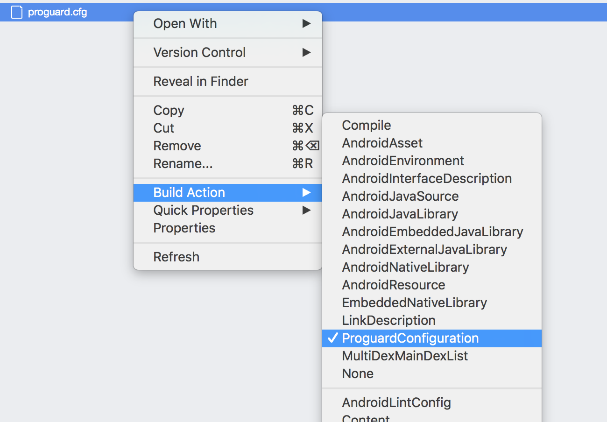

# App Center Auth

> [!div  class="op_single_selector"]
> * [Android](android.md)
> * [iOS](ios.md)
> * [React Native](react-native.md)
> * [Xamarin](xamarin.md)

## Add the SDK to your app

App Center Auth is a cloud-based identity management service that enables developers to authenticate application users and manage user identities. The service integrates with other parts of App Center, enabling developers to leverage user identity to view user data in other services and even send push notifications to users instead of individual devices. App Center Auth is powered by [Azure Active Directory B2C](https://docs.microsoft.com/azure/active-directory-b2c/).

Please follow the [Getting Started](~/sdk/getting-started/xamarin.md) section if you haven't set up the SDK in your app.

### 1. Add the App Center Auth module

The App Center SDK is designed with a modular approach – a developer only needs to integrate the modules of the services that they're interested in.

#### Visual Studio for Mac

* Open Visual Studio for Mac.
* Click **File** > **Open** and choose your solution.
* In the solution navigator, right-click the **Packages** section, and choose **Add NuGet packages...**.
* Search for **App Center**, and install **App Center Auth**.
* Click **Add Packages**.

#### Visual Studio for Windows

* Open Visual Studio for Windows.
* Click **File** > **Open** and choose your solution.
* In the solution navigator, right-click **References** and choose **Manage NuGet Packages**.
* Search for **App Center**, and install **Microsoft.AppCenter.Auth**.

#### Package Manager Console

* Open the console in [Visual Studio](https://visualstudio.microsoft.com/vs/). To do this, choose **Tools** > **NuGet Package Manager** > **Package Manager Console**.
* If you're working in **Visual Studio for Mac**, make sure you have **NuGet Package Management Extensions** installed. For this, choose **Visual Studio** > **Extensions**, search for **NuGet** and install, if necessary.
* Type the following command in the console:

```shell
Install-Package Microsoft.AppCenter.Auth
```

> [!NOTE]
> If you use the App Center SDK in a portable project (such as **Xamarin.Forms**), you must install the packages in each of the projects: the portable, Android, and iOS ones. To do that, you should open each sub-project and follow the corresponding steps described in [Visual Studio for Mac](#visual-studio-for-mac) or [Visual Studio for Windows](#visual-studio-for-windows) sections.

### 2. Start App Center Auth

In order to use App Center, you must opt in to the module(s) that you want to use. By default no modules are started and you will have to explicitly call each of them when starting the SDK.

#### 2.1 Add App Center Auth imports

Add the App Center Auth imports before you get started with using Auth module:

* **Xamarin.iOS** - Open the project's **AppDelegate.cs** and add the following lines below the existing `using` statements
* **Xamarin.Android** - Open the project's **MainActivity.cs** and add the following lines below the existing `using` statements
* **Xamarin.Forms** - Open the project's **App.xaml.cs** and add the following lines below the existing `using` statements

```csharp
using Microsoft.AppCenter;
using Microsoft.AppCenter.Auth;
```

#### 2.2 Add the `Start()` method

To start App Center Auth, add the following code to your `Start()` method:

##### Xamarin.iOS

Open the project's **AppDelegate.cs** and add the `Start()` call inside the `FinishedLaunching()` method:

```csharp
AppCenter.Start("{Your Xamarin iOS App Secret}", typeof(Auth));
```

Be sure to replace `{Your App Secret}` in the code sample above with [your App Secret](~/dashboard/faq.md):
```csharp
AppCenter.Start("65dc3680-7325-4000-a0e7-dbd2276eafd1", typeof(Auth));
```

##### Xamarin.Android

Open the project's **MainActivity.cs** and add the `Start()` call inside the `OnCreate()` method:

```csharp
AppCenter.Start("{Your Xamarin Android App Secret}", typeof(Auth));
```

Be sure to replace `{Your App Secret}` in the code sample above with [your App Secret](~/dashboard/faq.md):
```csharp
AppCenter.Start("7433d0a8-3a21-49e4-8fca-f5eff43458df", typeof(Auth));
```

##### Xamarin.Forms

To create a Xamarin.Forms app targeting both Android and iOS platforms, you must create two apps in the App Center portal - one for each platform. Creating two apps will give you two App secrets - one for Android and another one for iOS. Open the project's **App.xaml.cs** (or your class that inherits from `Xamarin.Forms.Application`) in the shared or portable project and add the `Start()` call inside the `OnStart()` override method.

```csharp
AppCenter.Start("ios={Your Xamarin iOS App Secret};android={Your Xamarin Android App secret}", typeof(Auth));
```

Be sure to replace `{Your App Secret}` in the code sample above with [your App Secret](~/dashboard/faq.md):
```csharp
AppCenter.Start("ios=65dc3680-7325-4000-a0e7-dbd2276eafd1;android=7433d0a8-3a21-49e4-8fca-f5eff43458df", typeof(Auth));
```

### 3. Android additional steps

#### AndroidManifest.xml

To use the sign-in, you must add the following element to the project's **AndroidManifest.xml** file's `application` tag:

```xml
<activity android:name="com.microsoft.identity.client.BrowserTabActivity">
    <intent-filter>
        <action android:name="android.intent.action.VIEW" />

        <category android:name="android.intent.category.DEFAULT" />
        <category android:name="android.intent.category.BROWSABLE" />

        <data
            android:host="auth"
            android:scheme="msal{Your App Secret}" />
    </intent-filter>
</activity>
```

Make sure you replace `{Your App Secret}` in the code sample above with [your App Secret](~/dashboard/faq.md) (and remove the curly braces): `android:scheme="msal7433d0a8-3a21-49e4-8fca-f5eff43458df"`.

#### Proguard

If you're using ProGuard, you must customize the project's configuration for Auth.

##### Create a ProGuard configuration file

> [!NOTE]
> If you don't use ProGuard or if you already have a ProGuard configuration file in your project, you may skip this section.

Add an empty file to your Xamarin.Android project named **proguard.cfg**. Set the build action to "ProguardConfiguration".



##### Add customization to ProGuard configuration file

In your Xamarin.Android project, add the following line to the project's **proguard.cfg** file:

```text
-dontwarn com.nimbusds.jose.**
```

### 4. iOS additional steps

#### Modify the project's **Info.plist**

1. Double-click the project's **Info.plist** file and go to the **Advanced** tab at the bottom.
2. Click **Add URL Type** button and type in your Bundle Identifier in the **Identifier** field.
.
3. For **URL Schemes** field, change the value to `msal{APP_SECRET}` and replace `{APP_SECRET}` with [your actual App Secret](~/dashboard/faq.md): `msal65dc3680-7325-4000-a0e7-dbd2276eafd1`.
4. Open **Role** selector and choose **Editor**.

#### Add keychain sharing capability

> [!NOTE]
> You should enable Keychain sharing capability for your provisioning profile. See [Working with Capabilities in Xamarin.iOS](https://docs.microsoft.com/en-us/xamarin/ios/deploy-test/provisioning/capabilities/?#devcenter) for a detailed guide.

App Center uses the `com.microsoft.adalcache` keychain access group to support single sign-on by enabling different apps to share keychain items (i.e. user secrets and credentials) with each other. We use this access group to securely share a user secret within a family of apps that rely on the same user secret. This way, logging into one of your apps will automatically grant the same user access to all of the family of apps.

You must add a new keychain group to your project Keychain Sharing Capabilities: `com.microsoft.adalcache`.

> [!NOTE]
> Please follow the [Working with entitlements in Xamarin.iOS](https://docs.microsoft.com/xamarin/ios/deploy-test/provisioning/entitlements) if you don't have an `Entitlements.plist` file for a step-by-step guide.

Open the project's `Entitlements.plist` and check **Enable Keychain Access Groups**. Then click **Add new Entry** and type `com.microsoft.adalcache` in the form.


## Sign users into the app

App Center provides a `SignInAsync()` method that triggers the sign in policy defined in your Azure AD B2C tenant.
To present the sign-in UI to the user, call the `SignInAsync` method:

```csharp
using Microsoft.AppCenter.Auth;

async Task SignInAsync()
{
    try
    {
        // Sign-in succeeded.
        UserInformation userInfo = await Auth.SignInAsync();
    }
    catch (Exception e)
    {
        // Do something with sign-in failure.
    }
}
```

Please note the following:

* The Auth module must be started at the same time as other modules, in a `Start( ... )` call. If you decide to start the Auth service separately using `StartService()`, the app will not sign in automatically after the restart and `SignInAsync` must be called again.
* The app must initialize the App Center SDK using `AppCenter.Start` before calling `SignInAsync`.
* The app must be in the foreground before calling `SignInAsync`.
* App Center associates crash reports and handled errors with the signed in user after sign-in completes successfully.
* If sign-in fails, the crash reports and handled errors are not associated with any user.
* New push notifications targeting the signed-in user are received on the device that the user has signed into.
* Signing in on a device is not retroactive: the user does not receive push notifications that were sent to him prior to signing in on that device, and past error or crash reports are not updated with the new user information.
* The SDK automatically saves the signed in users' information so they do not have to sign in to your app again.
* If the app calls `SignInAsync` again, the SDK shows the sign-in UI again only if the saved sign-in information has expired or has been revoked by the authentication server.

## Sign out

To sign out the user and clear all associated authentication tokens, call the `SignOut` method:

```csharp
using Microsoft.AppCenter.Auth;

Auth.SignOut();
```

## Enable or disable App Center Auth at runtime

As with every other App Center service, the app can disable the Auth service within the app. When disabled, the SDK signs the user out and ignores all other Auth method calls. In particular, `SignInAsync` will not do anything and no UI will be shown while Auth is disabled.

```csharp
Auth.SetEnabledAsync(false);
```

To enable App Center Auth again, use the same API but pass `true` as a parameter.

```csharp
Auth.SetEnabledAsync(true);
```

You don't have to await this call to make other API calls (such as `IsEnabledAsync`).

The module state is persisted across app launches.

## Check if App Center Auth is enabled

You can also check whether App Center Auth is enabled or not:

```csharp
bool enabled = await Auth.IsEnabledAsync();
```
