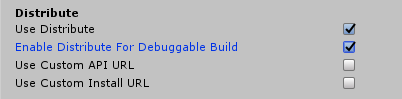

# App Center Distribute – In-app updates

> [!div  class="op_single_selector"]
> * [Android](android.md)
> * [iOS](ios.md)
> * [Unity](unity.md)
> * [Xamarin](xamarin.md)

App Center Distribution enables your users/testers to install new versions of an app once you distribute it via App Center. Once enabled, the SDK presents an update dialog to users to either download or postpone installation of the latest update. Once they choose to update, the SDK will start to update your application.

> [!NOTE]
> There are a few things to consider when using in-app updates:
> 1. If you have released your app in the App Store or Google Play, in-app updates will be disabled and no longer work.
> 2. If you are running automated UI tests, enabled in-app updates will block your automated UI tests as they will try to authenticate against the App Center backend. We recommend disabling in-app updates for your UI tests.

## Add in-app updates to your app

### Add the App Center Distribute module

The App Center SDK is designed with a modular approach – a developer only needs to integrate the modules of the services that they're interested in.

Follow the [Unity getting started](~/sdk/getting-started/unity.md) docs if you haven't set up and started the SDK in your application, yet. Make sure to import the App Center Distribute package. Its name should be in the format AppCenterDistribute-v{version}.unitypackage

## Use private distribution group

By default, Distribute uses the public distribution group. If you want to use a private distribution group, you will need to explicitly set it via `UpdateTrack` property.

```csharp
Distribute.UpdateTrack = UpdateTrack.Private;
```

After this call, a browser window will open up to authenticate the user. All the subsequent update checks will get the latest release on the private track. The update track is persisted in the SDK across app launches.  

If a user is on the **private track**, it means that after the successful authentication, they will get the latest release they have access to from any public distribution groups plus any private distribution groups they are a member of.
If a user is on the **public track**, it means that they will get the latest release only from public distribution groups.

> [!NOTE]
> This property can be set anywhere at runtime and doesn't require the app to be restarted. If it is set after SDK start it would check for an update on the given track. It will only impact the next update flow.

If you want to switch back to public update track, simply set

```csharp
Distribute.UpdateTrack = UpdateTrack.Public;
```

This call will cause in-app updates to only use the public track going forwards.

> [!NOTE]
> Since the private track can include public releases, to allow users on the private track to remain on the private track after getting a public release, the app should rely on the default behaviour and not set `UpdateTrack`. This way, users on the public track stay on the public track due to the default behaviour and users on the private track remain on the private track due to the setting persistence from a previous private release.

You can get the current update track by calling

```csharp
UpdateTrack updateTrack = Distribute.UpdateTrack;
```

## Customize or localize the in-app update dialog

### 1. Customize or localize text

You can provide your own resource strings if you'd want to localize the text displayed in the update dialog. Look at the string files for iOS [in this iOS resource file](https://github.com/Microsoft/AppCenter-SDK-Apple/blob/master/AppCenterDistribute/AppCenterDistribute/Resources/en.lproj/AppCenterDistribute.strings) and for Android [in this Android resource file](https://github.com/Microsoft/AppCenter-SDK-Android/blob/master/sdk/appcenter-distribute/src/main/res/values/appcenter_distribute.xml). Use the same string name/key and specify the localized value to be reflected in the dialog in your own app resource files.

### 2. Customize the update dialog

You can customize the default update dialog's appearance by implementing the `ReleaseAvailable` callback.

>[!WARNING]
>You need to register the callback in the `Awake` method of a `MonoBehaviour` in the first scene your application loads to avoid missing any release callback invocations.

```csharp
// In this example, OnReleaseAvailable is a method name in same class
Distribute.ReleaseAvailable = OnReleaseAvailable;
```

Here is a callback implementation that replaces the SDK dialog with custom logic:

```csharp
bool OnReleaseAvailable(ReleaseDetails releaseDetails)
{
    // Look at releaseDetails public properties to get version information, release notes text or release notes URL
    string versionName = releaseDetails.ShortVersion;
    string versionCodeOrBuildNumber = releaseDetails.Version;
    string releaseNotes = releaseDetails.ReleaseNotes;
    Uri releaseNotesUrl = releaseDetails.ReleaseNotesUrl;

    // (Do something with the values if you want)

    // On mandatory update, user cannot postpone
    if (releaseDetails.MandatoryUpdate)
    {
        // Force user to update (you should probably show some custom UI here)
        Distribute.NotifyUpdateAction(UpdateAction.Update);
    }
    else
    {
        // Allow user to update or postpone (you should probably show some custom UI here)
        // "GetUserUpdateAction()" is not part of the SDK; it just represents a way of getting user response.
        // This blocks the thread while awaiting the user's response! This example should not be used literally
        UpdateAction updateAction = GetUserUpdateAction();
        Distribute.NotifyUpdateAction(updateAction);
    }
    // Return true if you are using your own UI to get user response, false otherwise
    return true;
}
```

Implementation notes for Android:

As shown in the example, you have to call either `Distribute.NotifyUpdateAction(UpdateAction.UPDATE);` or `Distribute.NotifyUpdateAction(UpdateAction.POSTPONE);` if your callback returns `true`.

If you don't call `NotifyUpdateAction`, the callback will repeat on every activity change.

The callback can be called again with the same release if the activity changes before the user action is notified to the SDK.

This behavior is needed to cover the following scenarios:

* Your application is sent to the background (like pressing **HOME**) then resumed in a different activity.
* Your activity is covered by another one without leaving the application (like clicking on some notifications).
* Similar scenarios to the above.

In that case, the activity hosting the dialog might be replaced without user interaction. So the SDK calls the listener again so that you can restore the custom dialog.

## Enable or disable App Center Distribute at runtime

You can enable and disable App Center Distribute at runtime. If you disable it, the SDK won't provide any in-app update functionality but you can still use the Distribute service in the App Center portal.

To disable the Distribute service, use the following code:

```csharp
Distribute.SetEnabledAsync(false);
```

To enable App Center Distribute again, use the same API but pass `true` as a parameter.

```csharp
Distribute.SetEnabledAsync(true);
```

[!INCLUDE [unity see async](../includes/unity-see-async.md)]

You don't need to await this call to make other API calls (such as `IsEnabledAsync`) consistent.

The state is persisted in the device's storage across application launches.

## Check if App Center Distribute is enabled

You can also check if App Center Distribute is enabled:

```csharp
Distribute.IsEnabledAsync();
```

[!INCLUDE [unity see async](../includes/unity-see-async.md)]

## Enable in-app updates for debug builds

By default in-app updates are enabled only for release builds.

To enable in-app updates for debug builds on Android and iOS, check the **Enable Distribute in Debug** checkbox under **Distribute** section on the game object with **AppCenterBehavior** attached.



In Unity, a debuggable build is a build with a **Development build** option checked.

## How in-app updates work

> [!NOTE]
> For in-app updates to work, an app build should be downloaded from the link. It won't work if installed from an IDE or manually.

The in-app updates feature works as follows:

1. This feature only works with **RELEASE** builds (by default) that are distributed using the **App Center Distribute** service. It won't work if the iOS Guided Access feature is turned on.
2. Once you integrate the SDK, build a release version of your app, and upload it to App Center. Users in the distribution group are notified about the new release via email.
3. When each user opens the link in their email, the application will be installed on their device. It's important that they use the email link to install - we don't support side-loading. When an application is downloaded from the link, the SDK saves important information from cookies to check for updates later, otherwise the SDK doesn’t have that key information.
4. If the application updates the track to private, a browser will open to authenticate the user and enable in-app updates. The browser will not open again as long as the authentication information remains valid even when switching back to the public track and back to private again later. If the browser authentication is successful, the user is redirected back to the application automatically. If the track is public (which is the default), the next step happens directly.
5. A new release of the app shows the in-app update dialog asking users to update your application if it has
    * iOS:
        * a higher value of `CFBundleShortVersionString` or
        * an equal value of `CFBundleShortVersionString` but a higher value of `CFBundleVersion`.
    * Android:
        * a higher value of `versionCode` or
        * an equal value of `versionCode` but a higher value of `versionName`.

> [!TIP]
> If you upload the same .apk/.ipa a second time, the dialog will NOT appear as the binaries are identical. On iOS, if you upload a new build with the same version properties, it will show the update dialog. The reason for this is that it is a different binary. On Android, binaries are considered the same if both version properties are the same.

## How do I test in-app updates?

You must upload release builds (that use the Distribute module of the App Center SDK) to the App Center Portal to test in-app updates, increasing version numbers every time.

1. Create your app in the App Center Portal if you haven't done that already.
2. Create a new distribution group and give it a name.
3. Add yourself (or all people who you want to include on your test of the in-app update feature). Use a new or throw-away email address for this step, one not already used with this app. This will ensure that you have an experience that's close to the experience of your real testers.
4. Create a new build of your app that includes **App Center Distribute** and contains the setup logic as described below. If the group is private, don't forget to set the private in-app update track using the [UpdateTrack property](#use-private-distribution-group).
5. Public releases are accessible to authenticated users regardless of their membership, so you can expose a setting in the app on public releases for testers to switch track. This setting can use the abovementioned [UpdateTrack property](#use-private-distribution-group) for implementing a switch control.
6. Click on the **Distribute new release** button in the portal and upload your build of the app.
7. Once the upload has finished, click **Next** and select the **Distribution group** that you previously created as the **Destination** of that app distribution.
8. Review the Distribution and distribute the build to your in-app testing group.
9. People in that group will receive an invite to be testers of the app. Once they need to accept the invite, they can download the app from the App Center Portal from their mobile device. Once they have in-app updates installed, you're ready to test in-app updates.
10. Bump the version of your app (`CFBundleShortVersionString ` or `CFBundleVersion ` for iOS, `versionCode` for Android).
11. Build the release version of your app and upload a new build just like you did in the previous step. Distribute to the **Distribution Group** you created earlier. Members of the Distribution Group will be prompted for a new version the next time the app starts.

> [!TIP]
> Please have a look at the information on how to [utilize App Center Distribute](~/distribution/index.md) for more detailed information about **Distribution Groups** etc.
While it is possible to use App Center Distribute to distribute a new version of your app without adding any code, adding App Center Distribute to your app's code will result in a more seamless experience for your testers and users as they get the in-app update experience.
