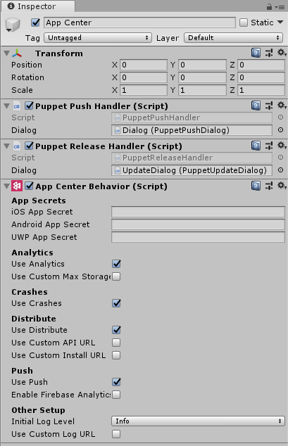

# Get Started with Unity

> [!div  class="op_single_selector"]
> * [Android](android.md)
> * [iOS](ios.md)
> * [iOS Extensions](ios-extensions.md)
> * [React Native](react-native.md)
> * [Xamarin](xamarin.md)
> * [UWP](uwp.md)
> * [WPF/WinForms](wpf-winforms.md)
> * [Unity](unity.md)
> * [macOS](macos.md)
> * [macOS Extensions](macos-extensions.md)
> * [tvOS](tvos.md)
> * [Cordova](cordova.md)

The App Center SDK uses a modular architecture so you can use any or all of the services.

Let's get started and set up the App Center Unity SDK to use App Center Analytics and Crashes. To add App Center Distribute to your app, see the [documentation for App Center Distribute](~/sdk/distribute/unity.md).

## 1. Prerequisites

Before you begin, make sure that your project is set up in Unity 5.6 or later.

The App Center SDK for Unity supports the following platforms:

* iOS (9.0 or later)
* Android (5.0/API 21 or later)
* UWP (Build 10240 or later)

> [!NOTE]
> For versions of Unity with UWP lower than 2017.4, only a .NET scripting backend is supported. IL2CPP as a backend is not supported.

> [!NOTE]
> For versions of Unity with iOS lower than 2017.4, it is required to enable Push notifications capability in XCode manually.

In order to learn how to use coroutines/callbacks instead of `async/await` with `.NET 3.5` backend, refer to the [Asyncronous APIs in the Unity SDK](~/sdk/unity-async.md) section of the documentation.

Also note that the App Center SDK for Unity is only available in C#.

## 2. Create your app in the App Center Portal to acquire the App Secret

If you've already created your app in the App Center portal, you can skip this step.
1. Head over to [appcenter.ms](https://appcenter.ms).
2. Sign up or sign in to App Center.
3. Click the blue button on the top-right corner of the portal that says **Add new** and select **Add new app** from the dropdown menu.
4. Enter a name and an optional description for your app.
5. Select the appropriate OS and platform depending on your project as described above.
6. Click the **Add new app** button in the bottom-right of the page.

Once you have created an app, you can obtain its **App Secret** on the **Settings** page on the App Center Portal. At the top right hand corner of the **Settings** page, click on the **triple vertical dots** and select `Copy app secret` to get your App Secret.

## 3. Add the App Center SDK to your project

### 3a Install the Extension Editor

The App Center SDK is integrated by importing Unity Packages into your project. To do so, first install the [App Center Unity Editor Extensions](https://github.com/Microsoft/AppCenter-SDK-Unity-Extension) plugin. Open the Editor Extensions via the Unity menu: Window > App Center > Editor Extensions and select "Install App Center SDK".

> [!NOTE]
> In the Unity versions 2019.1.2f1 and newer, there could be errors in logs during the installation such as `Coroutine continue failure`. It's a known Unity issue and you should ignore it.

### 3.1b Install Individual Packages

As an alternative, each of the individual Unity packages can be downloaded and imported. They're found on the [App Center Unity SDK GitHub page](https://github.com/Microsoft/AppCenter-SDK-Unity/releases). Download the latest release of the package(s) that you want to use. Its name should be in the format **AppCenter{Analytics/Crashes/Distribute}-v{version}.unitypackage**.

### 3.2b Import the package

Open your Unity project, then double-click the package you downloaded. A pop-up window should appear in your Unity project containing a list of files. Select **Import**, and the SDK will be added to your project. Repeat this step for each package you downloaded and plan to use in your project.

### 3.3 If you use auto-backup to avoid getting incorrect information about devices please follow the next steps:

> [!NOTE]
> Apps that target Android 6.0 (API level 23) or higher have Auto Backup automatically enabled. 

> [!NOTE]
> If you already have a custom file with backup rules please switch to the third step.

  a. Create `appcenter_backup_rule.xml` file in the `Assets/Plugins/Android/res/xml` directory.

  b. Add in `AndroidManifest.xml` the `android:fullBackupContent` attribute to the `<application>` element with indicating on `appcenter_backup_rule.xml` file:

> [!NOTE]
> To use the `AndroidManifest.xml` that you have created outside of Unity, import your `AndroidManifest.xml` file to the following directory: Assets/Plugins/Android/AndroidManifest.xml. This overrides the default Unity-created Manifest.

  ```text
  android:fullBackupContent="@xml/appcenter_backup_rule"
  ```

  c. Add the following backup rules to the **appcenter_backup_rule.xml** file:

  ```xml
  <full-backup-content xmlns:tools="http://schemas.android.com/tools">
      <exclude domain="sharedpref" path="AppCenter.xml"/>
      <exclude domain="database" path="com.microsoft.appcenter.persistence"/>
      <exclude domain="database" path="com.microsoft.appcenter.persistence-journal"/>
      <exclude domain="file" path="error" tools:ignore="FullBackupContent"/>
      <exclude domain="file" path="appcenter" tools:ignore="FullBackupContent"/>
  </full-backup-content>
  ```

## 4. Enable the SDK

### 4.1 Create an empty Game Object

App Center works as a component that you attach to a game object in the scene that your game launches into. Navigate to this scene and add an empty game object. Give it a descriptive name, such as "App Center".

### 4.2 Attach the App Center script

In the **Project** window, navigate to the "AppCenter" folder that was added to your project. Locate the script, named *AppCenterBehavior*, and drag it onto your newly created game object in the **Hierarchy** window.

> [!NOTE]
> You do not need to add App Center to every scene in which you wish to use it. Adding it to the first loaded scene is enough.

### 4.3 Configure App Center settings

Click on this new "App Center" object and add your app secrets to the corresponding fields in the **Inspector** window. Make sure to also check the "Use {service}" boxes for each App Center service you intend to use



> [!NOTE]
> If your project does not support one of the three platforms listed in the settings, simply leave the app secret field as-is; it will have no effect. If your project supports platforms that App Center does not support, the APIs and configuration will have no effect for those platforms.

---
Great, you're all set to visualize Analytics and Diagnostics (Crash and Error) data in the portal that the SDK will automatically collect.

Look at the documentation for [App Center Analytics](~/sdk/analytics/unity.md) and [App Center Crashes](~/sdk/crashes/unity.md) to learn how to use more advanced functionality with both services.

To learn how to get started with in-app updates, read the documentation for [App Center Distribute](~/sdk/distribute/unity.md).

To learn how to get started with Push, read the documentation for [App Center Push for Android](~/sdk/push/unity-android.md), [App Center Push for iOS](~/sdk/push/unity-ios.md), and [App Center Push for Windows](~/sdk/push/unity-windows.md).
