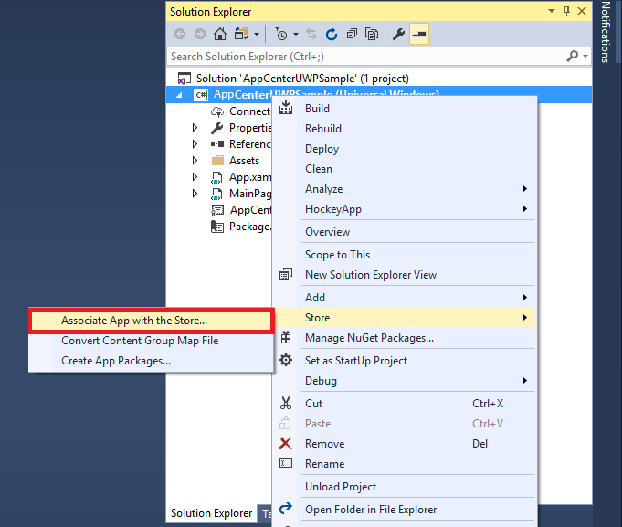
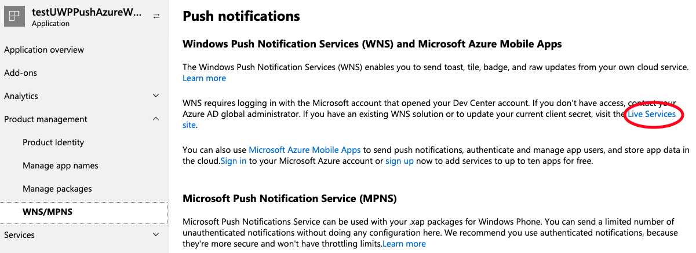
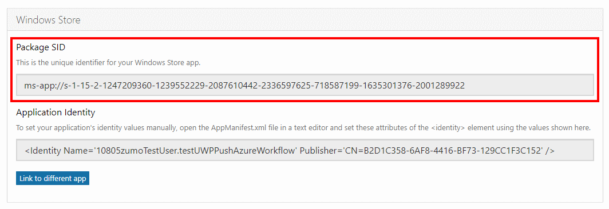
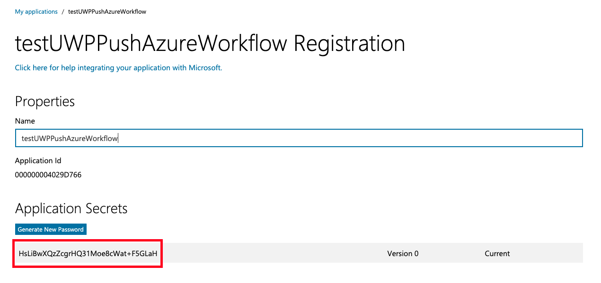

### 1. Windows Store Association in Visual Studio

1. In Visual Studio Solution Explorer, right-click the UWP project, then select **Store -> Associate App with the Store...**

    

2. In the wizard, click **Next**, sign in with your Windows developer account, type a name for your app in **Reserve a new app name**, then click **Reserve**.

3. After completing the app registration, select the new app name, click **Next**, and then click **Associate**. This adds the required Windows Store registration information to the application manifest.

> [!NOTE]
> You must have a Windows Developer account to send push notifications to your UWP app. You can [register a Microsoft developer account](https://developer.microsoft.com/store/register) if you don't already have one.

### 2. Get the Package SID and Application secret from the Partner Center

1. Navigate to the [Microsoft Partner Center](https://partner.microsoft.com/dashboard/windows/overview), sign-in with the same account you used when you reserved the app name. Click the Windows Store app you associated in the previous step.

1. Go to the **WNS/MPNS** section of the **Product Management** page and click on the **Live Services** link. It will display the old **Microsoft Application Registration** portal settings page.

    
    
1. Below at this page in the **Platforms** > **Windows store** section, copy the value of the **Package SID** as you will use it later.

    

1. At the top of this page, copy the value under **Application Secrets** as you will use it later.

    

1. Prepend the copied on the 2nd step **Package SID** with the `ms-app://` value. 
1. Use the **Application secret** and **Package SID** values to configure your App Center Push backend.

### 3. Configure Package SID and Security Key in App Center portal

1. Login to [App Center](https://appcenter.ms).
2. Select the application in the left navigator, then select the Push section.
3. Click **Next** button to get to the configuration page.
4. Enter **Package SID** and **Security key** that you obtained from the [Microsoft Application Registration Portal](https://apps.dev.microsoft.com/#/appList) in the previous step.
5. Click **Apply changes**.