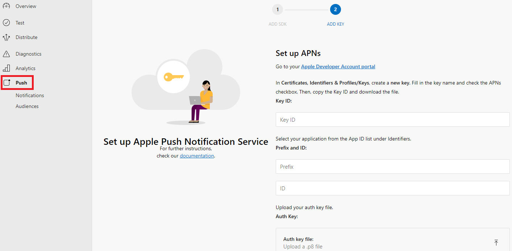
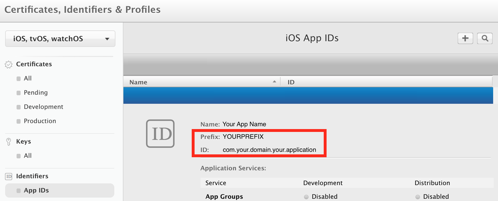
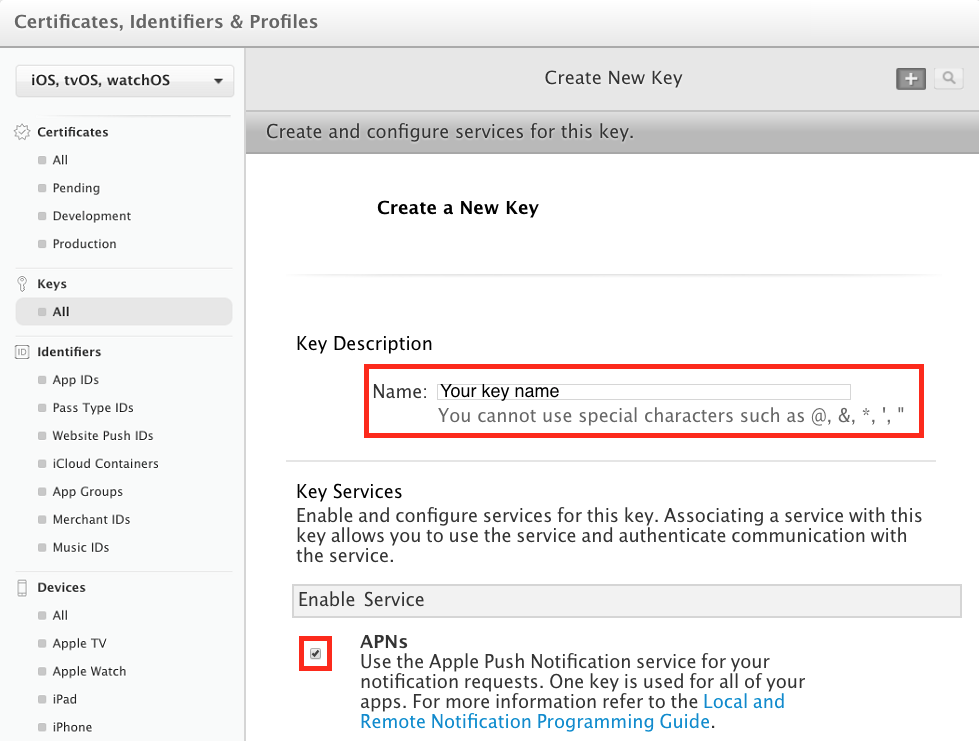
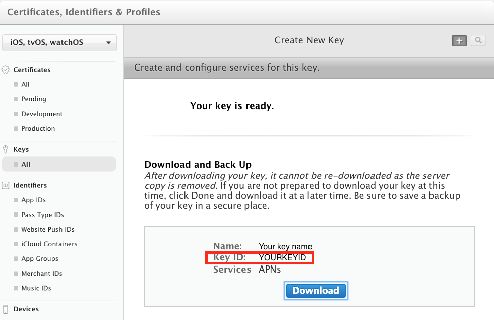
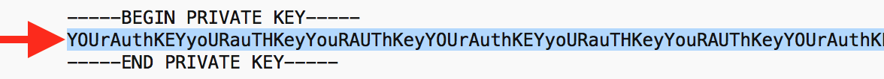

### Set up APNs

Log in to the App Center portal, select your application, click on the **Push** button from the left menu then click **Next** to reveal the push notification settings UI:

* On the bottom of the page, select **Sandbox** for initial development or **Production** for production version of your application.

* Collect the following information:

  1. **Prefix** and **ID**
     * Go to your Apple developer account and select your application from the [App ID list](https://developer.apple.com/account/ios/identifier/bundle) in **Identifiers**.

     * Copy the **Prefix** value from this window and paste it to the App Center push settings.

     * Do the same with the **ID** value.

     

  > [!NOTE]
  > As per guidance from the [Apple Developer documentation](https://developer.apple.com/library/archive/technotes/tn2311/_index.html), all new app developers who joined after 2011 will have the Team ID same as the App Prefix ID. If you have joined before, you will need to get the Team ID instead. 

  2. **Key ID**
     * In your Apple developer account create a [new key](https://developer.apple.com/account/ios/authkey/create) in **Certificates, Identifiers & Profiles**/**Keys**.

     * Make sure to check the APNs checkbox.

     * Fill in the key name

     * Press **Continue** then **Confirm**.

     

     * On the next screen, copy the **Key ID** value and paste it to the App Center push settings.

     * Download the key file.

     

  3. **Push Token**
     * Open your key file with a text editor and copy the authentication token it contains.

     

     * On the App Center push settings, paste this token to the **Push Token** field then click **Done** to complete this configuration.
