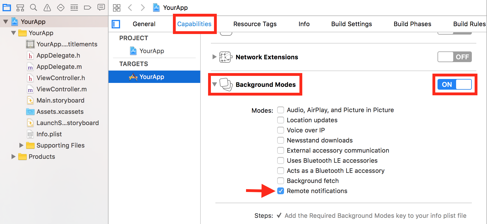

Silent notifications give you a way to wake up your app so that it can refresh its data in the background (see [Apple documentation](https://developer.apple.com/library/content/documentation/NetworkingInternet/Conceptual/RemoteNotificationsPG/CreatingtheNotificationPayload.html#//apple_ref/doc/uid/TP40008194-CH10-SW8)). To enable silent notifications open Xcode's project editor, choose your target and click **Capabilities**. Turn on **Background Modes** and check the **Remote notifications** checkbox.

> [!NOTE]
> If there are no user-visible updates that go along with the background update, you can leave the title and message fields empty to prevent showing any visible notifications.

> [!NOTE]
> Silent notifications are the mechanism behind background app refresh, the user can go in settings (General > Background App Refresh) and disable them. So you can't depend on them always being available.
