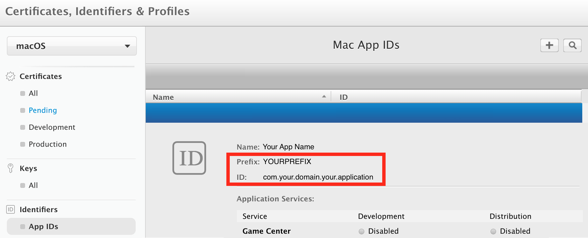
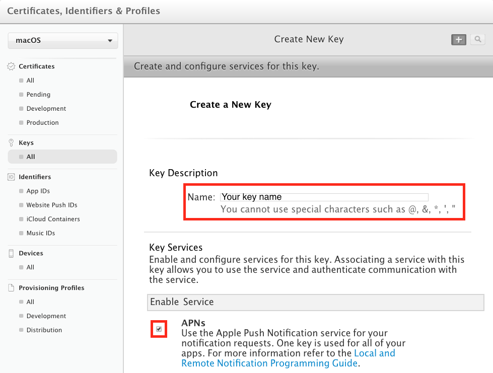
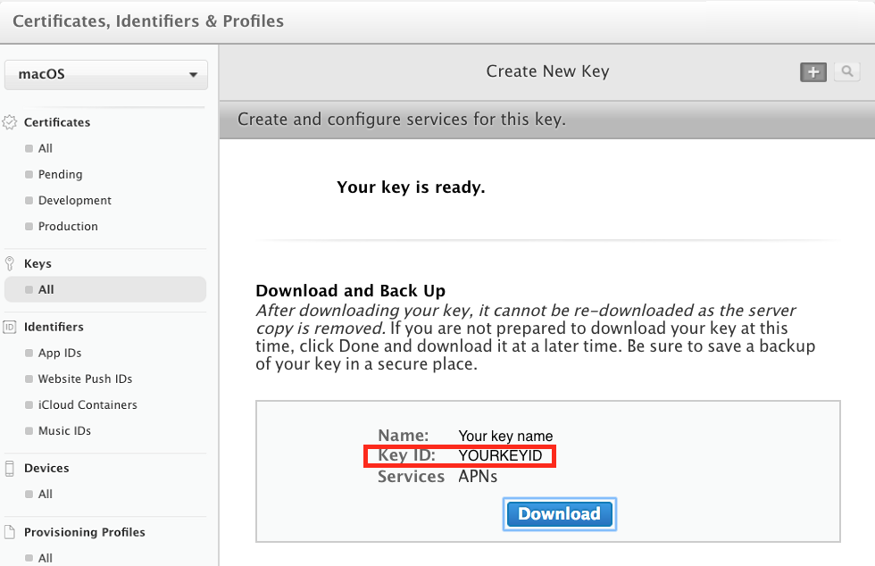
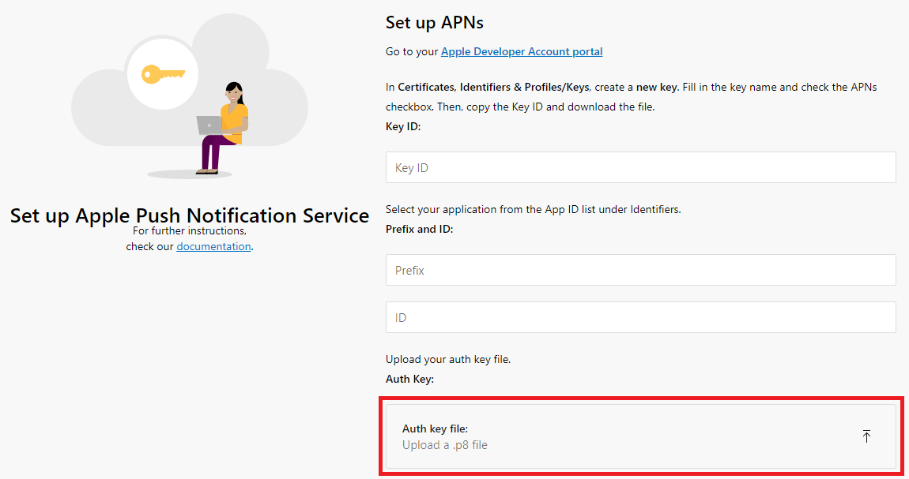

### Set up APNs

Log in to the App Center portal, select your application, click on the **Push** button from the left menu then click **Next** to reveal the push notification settings UI:

* On the bottom of the page, select **Sandbox** for initial development or **Production** for production version of your application.

* Collect the following information:

  1. **Prefix** and **ID**
     * Go to your Apple developer account and select your application from the [App ID list](https://developer.apple.com/account/mac/identifier/bundle) in **Identifiers**.

     * Copy the **Prefix** value from this window and paste it to the App Center push settings.

     * Do the same with the **ID** value.

     

  2. **Key ID**
     * In your Apple developer account create a [new key](https://developer.apple.com/account/mac/authkey/create) in **Certificates, Identifiers & Profiles**/**Keys**.

     * Make sure to check the APNs checkbox.

     * Fill in the key name

     * Press **Continue** then **Confirm**.

     

     * On the next screen, copy the **Key ID** value and paste it to the App Center push settings.

     * Download the key file.

     

  3. **Push Token**
     * On the App Center push settings page, upload your key file using the button labelled "Auth key file:" (you can also drag and drop the file onto it):

     

     * Click Done to complete this configuration.
