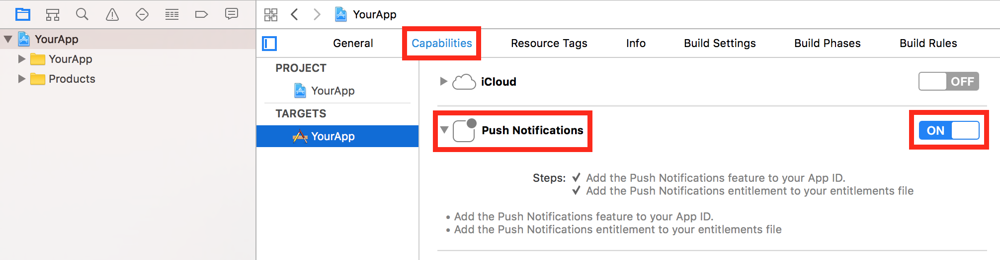

# App Center Push

> [!div  class="op_single_selector"]
> * [Android](android.md)
> * [iOS](ios.md)
> * [UWP](uwp.md)
> * [Xamarin.Android](xamarin-android.md)
> * [Xamarin.iOS](xamarin-ios.md)
> * [Xamarin.Forms](xamarin-forms.md)
> * [React Native Android](react-native-android.md)
> * [React Native iOS](react-native-ios.md)
> * [macOS](macos.md)
> * [Cordova Android](cordova-android.md)
> * [Cordova iOS](cordova-ios.md)

App Center Push enables you to send push notifications to users of your app from the App Center portal.

## Prerequisite - Enable Apple Push Notifications service (APNs) for your app

Configure Apple Push Notifications service (APNs) for your app from your Apple developer account and App Center portal before adding App Center Push to your app.

### Enable push notifications on your application

 In Xcode's project editor, choose your target and click **Capabilities**. In the **Push Notifications** section, click the switch to turn it from OFF to ON.



[!include[](ios-apns-setup.md)]

For more information, refer to the [Apple documentation](http://help.apple.com/xcode/mac/current/#/dev11b059073).

#### [Optional] Enable silent notifications

[!include[](ios-enable-silent-notifications.md)]

## Add App Center Push to your app

### 1. Add the App Center Push module

Please follow the [Get started](~/sdk/getting-started/react-native.md) section if you haven't set up and started the SDK in your application, yet.
The App Center SDK is designed with a modular approach – you only need to integrate the services that you're interested in.

#### Integrate the SDK automatically

The default integration of the SDK uses Cocoapods for iOS.

1. Open a Terminal and navigate to the root of your React Native project, then enter the following to add App Center Push to the app:

   ```
   npm install appcenter-push --save
   ```

2. Link the plugin to the React Native app by using the `react-native link command`.

   ```
   react-native link appcenter-push
   ```

#### Integrate the iOS SDK manually

If you wish to manually integrate the module, follow the manual integration steps at [documentation link](~/sdk/getting-started/react-native.md#32-ios-only-integrate-the-ios-sdk-manually)

### 2.Start App Center Push

#### Register for notifications

App Center Push is started by this call:

  ```objc
  #import <AppCenterReactNativePush/AppCenterReactNativePush.h>

  ...

  [AppCenterReactNativePush register];
  ```

That call is added automatically to **AppDelegate.m** by the automatic instructions above. Otherwise, you need to add it manually.

Note that when the app calls `register` for the first time after being installed, iOS will prompt the user for permission to receive push notifications.

## Intercept push notifications

You can set up a listener to be notified whenever a push notification is received in foreground or a background push notification has been tapped by the user. The listener may also be woken up when a notification is received in background if you have enable [silent notifications](#optional-enable-silent-notifications) and if the payload of the notification contains the [content-available](~/push/index.md#custom-data-in-your-notifications) flag set to true.

> [!NOTE]
> If silent notifications are enabled and you push a notification with `content-available: 1`, then the listener may be triggered twice for the same notification: when the notification is received in background and when it is tapped.

By default, iOS does not generate notifications when the push is received in foreground, you can use the listener to customize the push experience when received in foreground or do a specific action when the application is launched by clicking on the push notification when received in background.

[!include[](react-native-listener.md)]

## Custom data in your notifications

[!include[](custom-data-ios.md)]

## Enable or disable App Center Push at runtime

You can enable and disable App Center Push at runtime. If you disable it, the SDK will stop updating the device token used to push but the existing one will continue working. In other words, disabling the App Center Push in the SDK will **NOT** stop your application from receiving push notifications.

  ```javascript
  import Push from 'appcenter-push';

  ...

  await Push.setEnabled(false);      // Disable push
  await Push.setEnabled(true);       // Re-enable it
  ```

## Check if App Center Push is enabled

You can also check if App Center Push is enabled or not:

  ```javascript
  import Push from 'appcenter-push';

  ...

  const pushEnabled = await Push.isEnabled();
  ```

## Disable automatic forwarding of application delegate's methods to App Center services

App Center uses swizzling to automatically forward your application delegate's methods to App Center services to improve SDK integration. There is a possibility of conflicts with other third party libraries or the application delegate itself. In this case, you might want to disable the App Center application delegate forwarding for all App Center services by following the steps below:

1. Open your **Info.plist file**.
2. Add `AppCenterAppDelegateForwarderEnabled` key and set the value to `0`. This will disable application delegate forwarding for all App Center services.
3. Implement the callbacks to register push notifications

    You will have to add `@import AppCenterPush` and `@import AppCenterReactNativeShared` if they are not already added. Then implement the `application:didRegisterForRemoteNotificationsWithDeviceToken:` callback and the `application:didFailToRegisterForRemoteNotificationsWithError:` callback in your `AppDelegate` to register for Push notifications.

    ```objc
    @import AppCenterPush;
    @import AppCenterReactNativeShared;

    - (void)application:(UIApplication *)application
        didRegisterForRemoteNotificationsWithDeviceToken:(NSData *)deviceToken {

      // Pass the device token to MSPush.
      [MSPush didRegisterForRemoteNotificationsWithDeviceToken:deviceToken];
    }

    - (void)application:(UIApplication *)application
        didFailToRegisterForRemoteNotificationsWithError:(nonnull NSError *)error {

      // Pass the error to MSPush.
      [MSPush didFailToRegisterForRemoteNotificationsWithError:error];
    }
    ```

4. Implement the callback to receive push notifications

    Implement the `application:didReceiveRemoteNotification:fetchCompletionHandler` callback to add the logic for receiving a Push notification.

    ```objc
    - (void)application:(UIApplication *)application
        didReceiveRemoteNotification:(NSDictionary *)userInfo
             fetchCompletionHandler:(void (^)(UIBackgroundFetchResult))completionHandler {
      NSDictionary *dictionary = [[userInfo objectForKey:@"aps"] objectForKey:@"alert"];
      UIAlertController *alert = [UIAlertController alertControllerWithTitle:[dictionary valueForKey:@"title"]
                                                                    message:[dictionary valueForKey:@"body"]
                                                            preferredStyle:UIAlertControllerStyleAlert];
      UIAlertAction *ok = [UIAlertAction actionWithTitle:@"OK"
                                                  style:UIAlertActionStyleDefault
                                                handler:^(UIAlertAction *action) {
        [alert dismissViewControllerAnimated:YES completion:nil];
      }];
      [alert addAction:ok];
      [self.window.rootViewController presentViewController:alert animated:YES completion:nil];
    }
    ```

## Common tasks for push notifications

### Handle a push notification while the app is in foreground

App Center Push allows apps to intercept push notifications and react to them, e.g. to display an alert, as described in the App Center Push documentation above. In some cases, it is helpful to distinguish between push notifications received while the app is in the foreground or background, and handle them differently. The App Center SDK-provided callback is not enough in this case since the application's state will always be reported as `active`.

> [!NOTE]
> To detect if a push notification was received while the app is in foreground, you need to modify your native **AppDelegate** as there is currently no official way in React-Native that supports foreground detection for iOS.

To distinguish between notifications received in the foreground and notifications received while the app was in the background, you must implement one of the callbacks defined in `UNUserNotificationDelegate`. Please see [Apple's documentation](https://developer.apple.com/documentation/usernotifications/unusernotificationcenterdelegate) for more details.

> [!NOTE]
> The solution below requires iOS 10 or later.

1. In your `AppDelegate` and add import in the top of file:

    ```objc
    #import <UserNotifications/UserNotifications.h>
    ```

2. Add the following to the `didFinishLaunching:withOptions:` to register as a `UNUserNotificationCenterDelegate`:

    ```objc
    if (@available(iOS 10.0, *)) {
      UNUserNotificationCenter *center = [UNUserNotificationCenter currentNotificationCenter];
      center.delegate = self;
    }
    ```

3. Implement the following callback to detect a foreground notification:

    ```objc
    // iOS 10 and later, called when a notification is delivered to an app that is in the foreground.
    - (void)userNotificationCenter:(UNUserNotificationCenter *)center
          willPresentNotification:(UNNotification *)notification
            withCompletionHandler:(void (^)(UNNotificationPresentationOptions options)) completionHandler API_AVAILABLE(ios(10.0)) {

        // Do something, e.g. set a BOOL @property to track the foreground state.
        self.didReceiveNotificationInForeground = YES;

        // This callback overrides the system default behavior, so MSPush callback should be proxied manually.
        [MSPush didReceiveRemoteNotification:notification.request.content.userInfo];

        // Complete handling the notification.
        completionHandler(UNNotificationPresentationOptionNone);
    }
    ```

4. (Optional) If you have implemented the `application:didReceiveRemoteNotification:fetchCompletionHandler:` or the App Center Push SDK `push:DidReceivePushNotification:` callback, you may want adjust its behavior to a handle the foreground detection:

    ```objc
    - (void)application:(UIApplication *)application
        didReceiveRemoteNotification:(NSDictionary *)userInfo
              fetchCompletionHandler:(void (^)(UIBackgroundFetchResult)) completionHandler {

        // Do something differently if the push notification was received while in foreground.
        if (self.didReceiveNotificationInForeground) {

            // Handle the push notification that was received while in foreground.
        } else {

            // Handle the push notification that was received while app was in background.
        }

        // Reset the property for next notifications.
        self.didReceiveNotificationInForeground = NO;
    }
    ```

### Detecting when a user has tapped on a push notification

Sometimes it is helpful to determine if user has tapped push notification. To perform this task you must implement one of the callbacks defined in `UNUserNotificationDelegate`. Please see [Apple's documentation](https://developer.apple.com/documentation/usernotifications/unusernotificationcenterdelegate) for more details.

> [!NOTE]
> The solution below requires iOS 10 or later.

1. In your `AppDelegate` and add import in the top of file:

    ```objc
    #import <UserNotifications/UserNotifications.h>
    ```

2. Add the following to the `didFinishLaunching:withOptions:` to register as a `UNUserNotificationCenterDelegate`:

    ```objc
    if (@available(iOS 10.0, *)) {
      UNUserNotificationCenter *center = [UNUserNotificationCenter currentNotificationCenter];
      center.delegate = self;
    }
    ```

3. Implement the following callback to detect various actions performed by users with push notifications:

    ```objc
    // iOS 10 and later, asks the delegate to process the user's response to a delivered notification.
    - (void)userNotificationCenter:(UNUserNotificationCenter *)center
        didReceiveNotificationResponse:(UNNotificationResponse *)response
                withCompletionHandler:(void (^)(void))completionHandler API_AVAILABLE(ios(10.0)) {

      // Perform the task associated with the action.
      if ([[response actionIdentifier] isEqualToString:UNNotificationDefaultActionIdentifier]) {

        // User tapped on notification
      }

      // This callback overrides the system default behavior, so MSPush callback should be proxied manually.
      [MSPush didReceiveRemoteNotification:response.notification.request.content.userInfo];

      // Complete handling the notification.
      completionHandler();
    }
    ```
